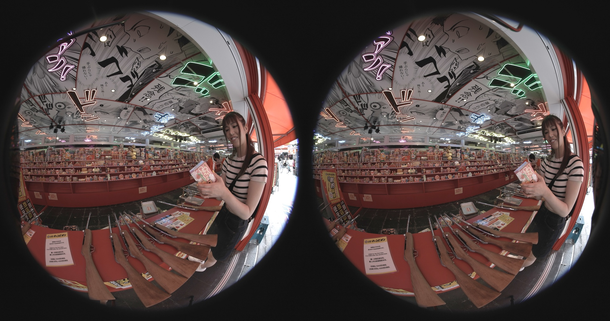
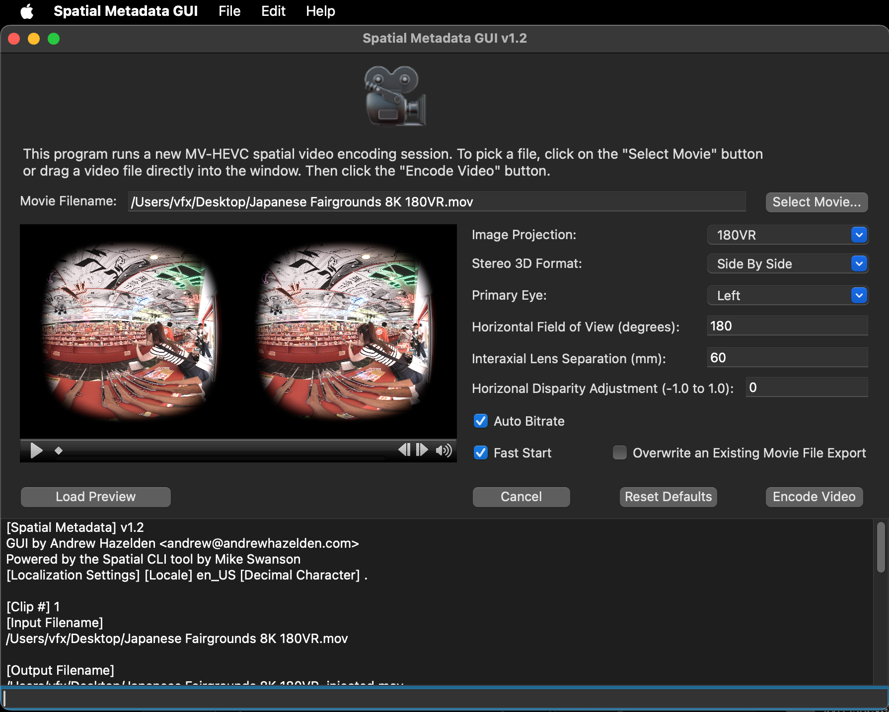
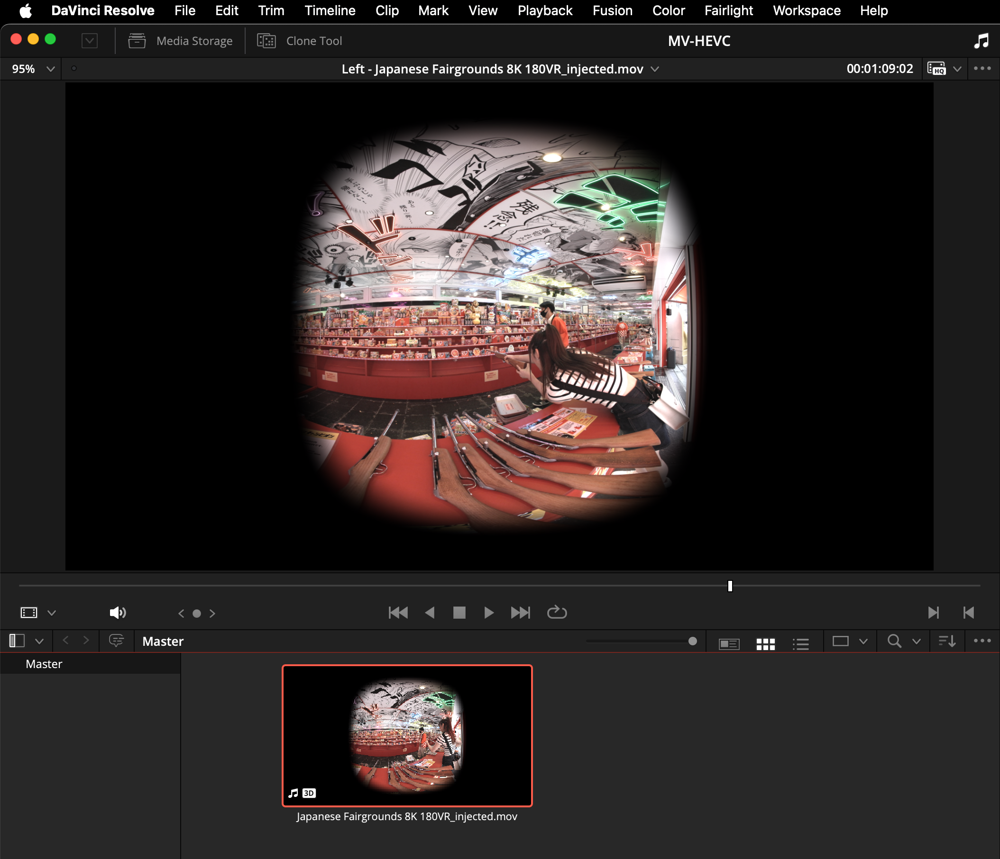
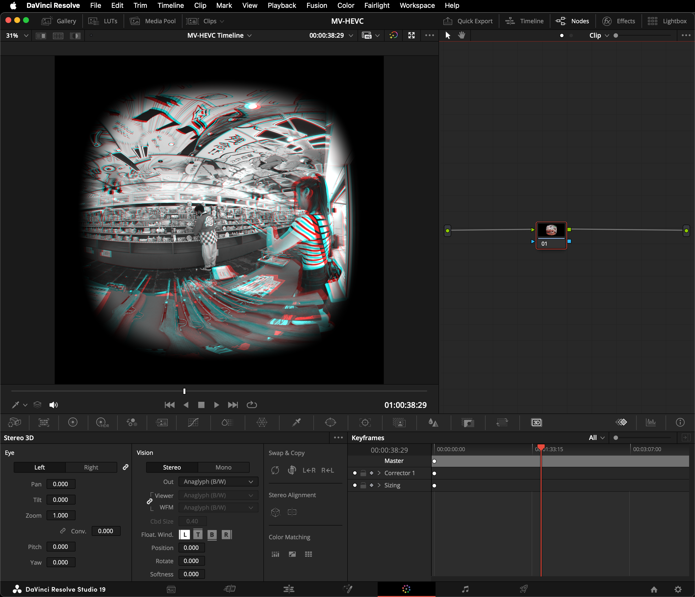
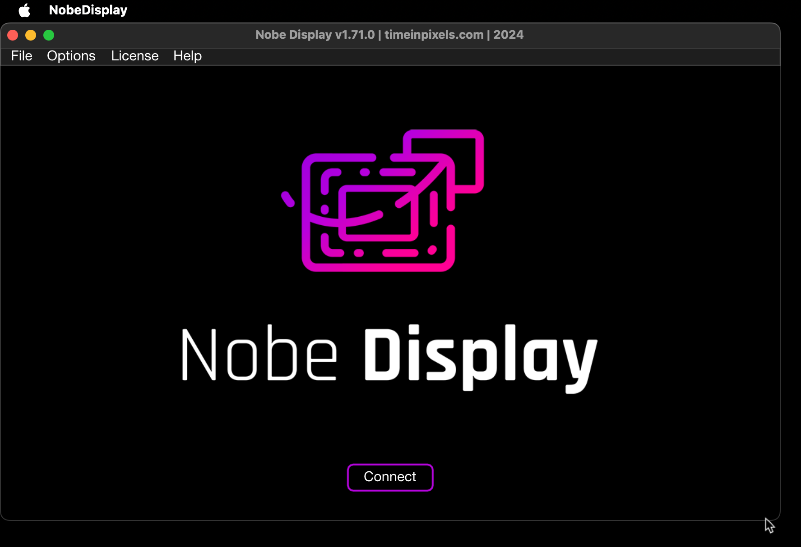
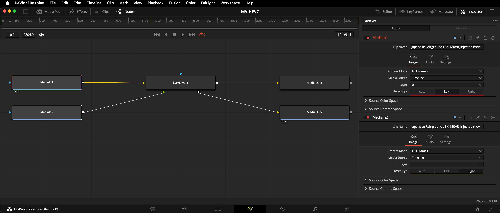
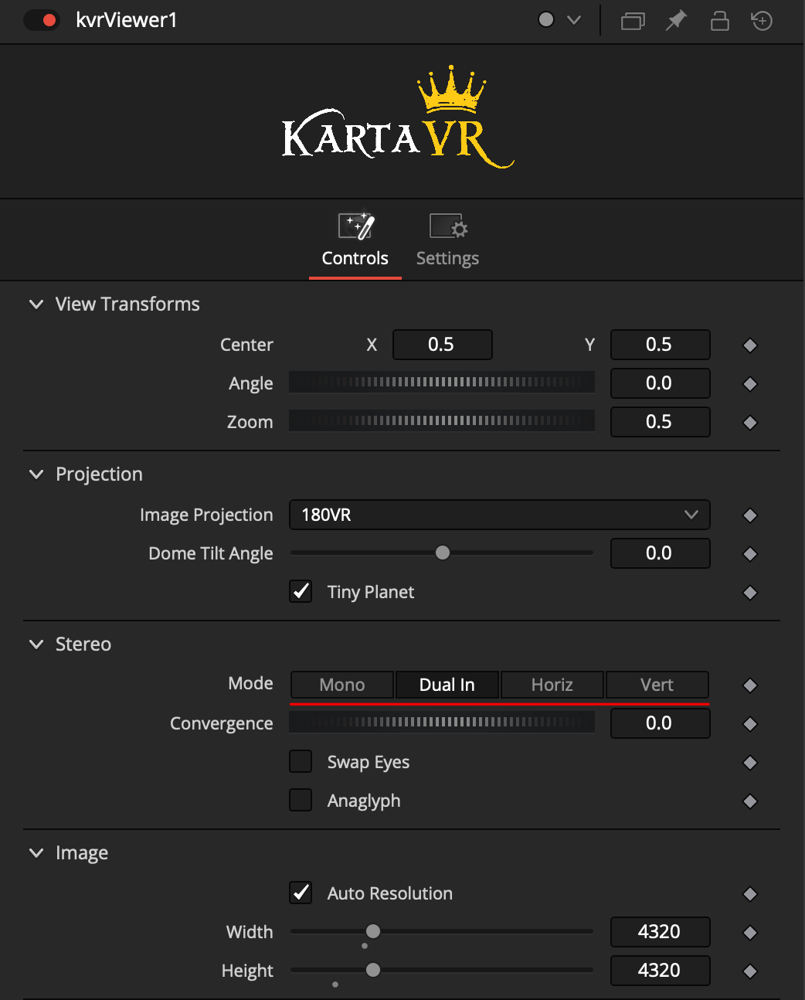
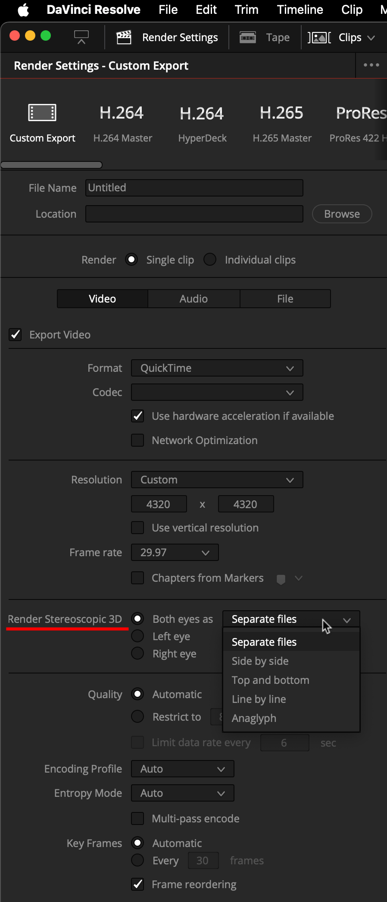

# Mastering 180VR Stereo for AVP HMDs

**Sample imagery by Makoto Hirose**

From what I just saw with [Apple Vision Pro](https://www.apple.com/apple-vision-pro/) centric content mastering, and the newest version of the Apple Compressor video encoding program:

The ideal DaVinci Resolve Studio timeline resolution for SBS 180x180 degree VR video, at a 2:1 aspect ratio, using footage out of a [Canon R5C](https://www.canon.ca/en/product?name=RF5.2mm_F2.8_L_Dual_Fisheye) Camera Body + [Canon RF5.2mm dual fisheye stereo lens](https://www.canon.ca/en/product?name=EOS_R5_C) is likely (more testing needed) 8640x4320 px. Working with SBS 8640x4320 px content would result in the video editor having a final delivery spec of a MV-HEVC video encoded output at a square per-eye rez of 4320x4320 px.

*Note: The default DCI 8K cinema framesize is 8192x4320 px which has a 1.9 aspect ratio. The 8K UltraHD framesize is 7680x4320 px which has a 16:9 aspect ratio.*

Yes, you are doing a smidgen of up-rezzing before running the DaVinci Resolve Edit page based "[kvrSuperSTMap](kvrSuperSTMap)" effects template. This step applies an STMap based image projection transform to the Canon R5C camera's native sensor resolution of 8192x4320 px SBS circular fisheye content. But with an STMap warping template, anti-aliasing is nearest-neighbour anyway so it's not horrible to run this warping step at a bit higher than the native camera resolution.

Once you use the Kartaverse "[Spatial Metadata GUI](https://github.com/Kartaverse/Spatial-Metadata)" video encoder app to turn your ProRes 422 HQ formatted SBS 180VR content into MV-HEVC output, the MV-HEVC video file has two separate frame buffers (right and left eye views) that are each 4320x4320 px.

If you import the 180VR encoded MV-HEVC content back into the DaVinci Resolve media pool the clip has the "3D" metadata tag on it.

If needed, this MV-HEVC media can run through the Media > Edit > Fusion > Color > Deliver page and be re-saved as either "Separate Eyes" or SBS content. 

# Color page

If you have footage with stereo 3D metadata present, you can use the Color page"3D" panel. When the Color page 3D panel is visible you can interact with the "Vision > Stereo > Out > Anaglyph (B/W)" display mode active.

It is possible to display this stereo 3D footage on a stereo 3D aware monitor with a decklink device that supports S3D output. Alternatively, you can explore the Time and Pixels "[Nobe Display NDI](https://timeinpixels.com/nobe-display/)" plugin as another way to pass your media to an HMD for review.

An interesting VR media review approach that works today, is that an Apple Vision Pro HMD is capable of playing back an [NDI video stream](https://ndi.video/tools/) in real-time from a WiFi connection. One tool you can use for this task is the VisionOS store app called "[iXR OSC & NDI](https://apps.apple.com/us/app/ixr-osc-ndi/id6642664920)".

## Fusion page

When working with stereo 3D metadata tagged MV-HEVC media in Davinci Resolve v19.0.1, the Fusion page operations have separate MediaIn/MediaOut nodes for the left/right eyes. The "Stereo Eye" control allows you to define the content as either "Auto", "Left", or "Right".

When working with stereo 3D metadata based footage, the KartaVP fuse nodes should be set to use the "Dual In" Stereo Mode. This "Dual-In" setting maintains the isolated left/right eye views on the fuse node's input and output connections. This makes it possible to do "[kvrViewer](http://localhost:8888/Kartaverse-Docs/docs/#/fuses?id=kvrviewer)" 180VR image projection conversions to reframe the footage to flat spatial video, or other processes.

## Deliver page

The Deliver page "Video" tab has a "Render Stereoscopic 3D" setting that allows you to choose options like individual "Left eye" and "Right eye" output, "Separate files", or "side by side".

You can customize the Resolution setting to match your final frame size output needs.

The Davinci Resolve Deliver Page can be used to render out your 180VR stereo 3D content to an intermediate file format like ProRes 422 HQ. This is a good choice for a format to transcode into an MV-HEVC video file using Apple Compressor or the Spatial Metadata GUI program.

In QuickTime Player on macOS you can check the left and right eye view content using the "View > Spatial Video >" menu:

## More to follow

This workflow guide has initial notes on improved workflows. More details and tutorials will be shared as followup content.
