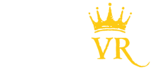

# Welcome to Kartaverse

> [Kartaverse](https://github.com/kartaverse) is an academic research project exploring computational imaging techniques.

> Kartaverse provides a post-production pipeline that is optimized for the immersive media sector. If you can imagine it, Kartaverse can help you create it in XR!

- Made in West Dover, Nova Scotia, Canada 🇨🇦
- The Kartaverse 6 launch is planned for [Dec 24, 2024](https://days.to/christmas-eve/2024/12/24)

## Overview

  
**Version 5.7.6** - Released 2024-11-14 

"Karta" is the Swedish word for map. With KartaVR you can stitch, composite, retouch, and remap any kind of panoramic video: from any projection to any projection. This provides the essential tools for 360VR, panoramic video stitching, depthmap, lightfield, and fulldome image editing workflows.

Kartaverse makes it a breeze to accessibly and affordably create content for use with virtual reality HMDs (head mounted displays) and fulldome theatres by providing ready to go scripts, templates, plugins, and command-line tools that allow you to work efficiently with XR media. The toolset works inside of Blackmagic Design's powerful node based [Fusion Studio](https://www.blackmagicdesign.com/products/fusion) and [DaVinci Resolve Studio](https://www.blackmagicdesign.com/products/davinciresolve/) software. Note: Resolve (free) v19.1 is no longer supported.

-------------------------

All trademarks, logos, and brand names are the property of their respective owners.

Kartaverse/KartaVR is (C) Copyright Andrew Hazelden 2014-2024. All rights reserved. KartaVR was formerly known as the "Domemaster Fusion Macros".

