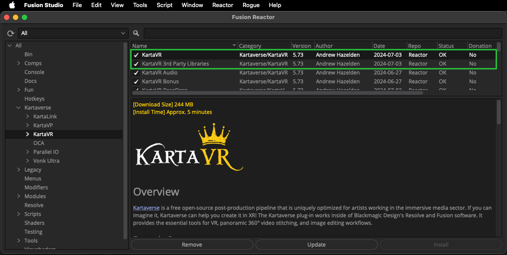
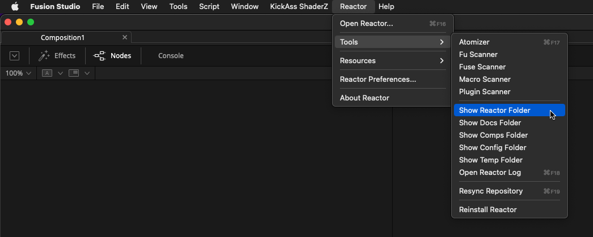

# Kartaverse for DaVinci Resolve/Fusion Studio

-------------------------
**Version 5.7.1** - Released 2024-06-04  
by Andrew Hazelden [andrew@andrewhazelden.com](mailto:andrew@andrewhazelden.com)

## Overview

Kartaverse is a free open-source post-production pipeline that is  optimized for the immersive media sector. If you can imagine it, Kartaverse can help you create it!

"Karta" is the Swedish word for map. With Kartaverse you can stitch, composite, retouch, and remap any kind of panoramic video: from any projection to any projection. This provides the essential tools for 360VR, panoramic video stitching, depthmap, lightfield, and fulldome image editing workflows.

Kartaverse makes it a breeze to accessibly and affordably create content for use with virtual reality HMDs (head mounted displays) and fulldome theatres by providing ready to go scripts, templates, plugins, and command-line tools that allow you to work efficiently with XR media. The toolset works inside of Blackmagic Design's powerful node based [Fusion Studio](https://www.blackmagicdesign.com/products/fusion) and [DaVinci Resolve Studio](https://www.blackmagicdesign.com/products/davinciresolve/) software.

Kartaverse ships with the [Vonk Ultra](https://docs.google.com/document/d/1U9WfdHlE1AZHdU6_ZQCB1I2nSa5I7TyHG2vKMi2I7v8/edit?usp=sharing) data nodes. Vonk can be thought of as node-based modifiers that live in the flow. These node-based operations provide a no-code alternative to using expressions or custom scripts. Data nodes are tools that allow you to interconnect nodes together by supporting more data types for the input and output connections such as numbers, text, spreadsheets, CSV, JSON, XML, YAML, metadata, arrays, matrices, and more.

[Kartaverse PT](https://github.com/Kartaverse/PT-Data-Nodes-Docs) is a new set of data nodes that allow live-link access in Fusion to PTGui Pro .pts project files. This is the start of a new way to work with panoramic data in Fusion.

## Installation

Kartaverse is an open-source (GNU LGPL/GPL v3) toolset. It is distributed through the [WSL Reactor package manager](https://www.steakunderwater.com/wesuckless/viewtopic.php?f=32&t=3067) for Resolve/Fusion. Install the Reactor package manager, and then select the Kartaverse/KartaVR category on the left side of the Reactor GUI. Then select and install the "KartaVR" and "KartaVR 3rd Party Libraries" packages.

Kartaverse/KartaVR can be used on personal and commercial projects at no cost. It can be installed, for free, on an unlimited number of computers and render nodes via the Reactor Package Manager.

Kartaverse works with Fusion Studio v9-19+, Fusion Render Node v9-19+, DaVinci Resolve (Free) v15-19+, and DaVinci Resolve Studio v15-19+. It runs on Windows 10-11, macOS Monterey - Sonoma, and Linux 64-Bit RHEL 7+, CentOS 7+, and Ubuntu 14+ distributions.

## Kartaverse Blog

The [Kartaverse Blog](https://medium.com/@andrewhazelden) is hosted on Medium.

## Kartaverse Technical Support

Technical support for Kartaverse is handled by the official [Kartaverse Google Group](https://groups.google.com/g/kartaverse/). If you've got a question about 360VR and immersive workflows in Resolve and Fusion Standalone, the Kartaverse User Group is the place to get it answered.

## Workflow Guides

A "[Kartaverse Workflows | Immersive Pipeline Integration Guide](https://docs.google.com/document/d/1tewIaHZh8mWI8x5BzlpZBkF8eXhK2b_XhTWiU_93HBA)" learning resource is available. The free guide has over 512 pages of content that covers the primary steps required to get a working content creation pipeline established from scratch for artists working at a freelancer, or small boutique studio scale of operation. Additional, expanded chapters cover broader Resolve/Fusion page usage concepts that will help you take your composting and 360VR content creation skills to the next level.

## YouTube Videos

Hugh Hou has published several Resolve/Fusion centric VR tutorials on his YouTube channel.

### Reframe360Ultra

This video covers the usage of Reframe360Ultra for reframing videos:
[How to ReFrame ANY 360 Video in DaVinci Resolve FREE in Real Time (Insta360, GoPro MAX, Qoocam 8K)](https://www.youtube.com/watch?v=CWw2DaXC7OU)

### WarpStitchUltra

This video shows how to process Canon R5C camera + Canon RF 5.2mm dual fisheye lens media in Resolve:
[Edit Canon R5C & R5 VR180 w/ DaVinci Resolve 18 FREE - 3D 8K 60fps RAW LT Clog3 Workflow](https://www.youtube.com/watch?v=2GW7nb47rB4)

The tutorial covers the usage of "ST Maps" and the WarpStitch node. Included with the project files are Fusion and Resolve example comps, along with a TouchDesigner based real-time warping project file that can be used to do live 180VR video streaming, and supports real-time stitched previews from the Canon R5/R5C camera.

Make sure to [download the supporting project files](https://drive.google.com/file/d/1H-owMeadqekZ42BgmqeaPHr9Ry2cHFP8/view).

## Example Comps

The Reactor Package Manager places the downloaded example comps in the following PathMap location:
`Reactor:/Deploy/Comps/`

In DaVinci Resolve you can access the base Reactor folder using the "Workspaces > Scripts > Comp > Reactor > Tools > Show Reactor Folder" menu item.

In Fusion Studio this location can be accessed using the "Reactor > Tools > Show Reactor Folder" menu item.

When the Reactor folder is opened in an Explorer/Finder window you can then navigate into the "/Deploy/Comps/Kartaverse/" sub-folders.

## Table of Contents

- [Overview](#overview)
- [Scripts](scripts)
- [Fuses](fuses)
- [Legacy Macros](macros-guide)
- [Compositing Examples](examples)
- [What's New](new)
- [Version History](version_history)
- [Open Source Tools](opensource_tools)
- Supplementary Content
	- [Getting Started With Nodes in Fusion](getting-started)
	- [Sample Imagery](sample-imagery)
	- [Gallery](gallery)
	- [Tips & Tricks](tips)
	- [Known Issues](known-issues)
	- [Fusion Hotkeys](hotkeys)
	- [Fusion Bins](install#install)
	- [Fusion Macro LUTs](luts)
	- [Source Compositions](source-comp)
	- [Publish Media to Google Cardboard VR View](google-cardboard-vr-view)

Kartaverse/KartaVR is (C) Copyright Andrew Hazelden 2014-2024. All rights reserved. KartaVR was formerly known as the "Domemaster Fusion Macros".

