# TouchDesigner RealTime Warping

## Overview

The [Derivative TouchDesigner](https://derivative.ca/download) software does a great job of applying a pre-made STmap map warping template image in a way that works live and real-time. With a bit of effoert to learn the workflow, you can use Kartaverse, or [PTGui Pro](https://ptgui.com/) to make the initial STMap template, that you then run inside of TouchDesigner.

This is a great way to warp Canon R5C + RF 5.2mm dual fisheye imagery into a 180VR Side-by-Side layout. It does require you to have a custom STMap template image created beforehand (which the Kartaverse [kvrFisheyeStrereo](kvrFisheyeStereo) node can help create).

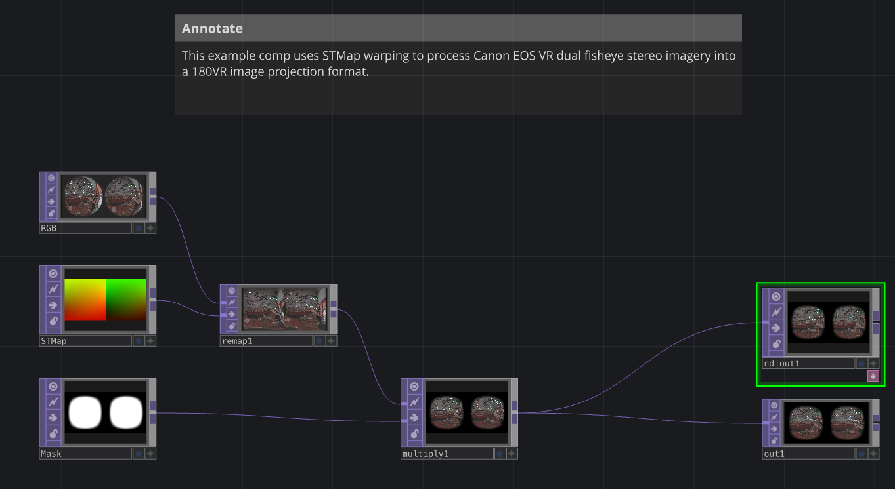

## Download the Example Project

### Canon R5C Real-time 180VR Warping with TouchDesigner + Kartaverse Made STMaps

Here is a TouchDesigner example stitching project file that shows an approach to use Canon R5C dual fisheye content that is converted into 180VR output via an STMap in real-time. A vignetting masking image is applied on top, and the output is delivered via NewTek NDI IP video streaming to a preview monitor.

[Canon_R5C_180VR_TouchDesigner_Project.zip](https://www.icloud.com/iclouddrive/015JOnhBstFpe_MoFxNsJmBhw#Canon%5FR5C%5F180VR%5FTouchDesigner%5FProject)

## TouchDesigner STMap Usage: 

1. Create a new TouchDesigner project. Set the End/Rend frame range to the duration of the video footage you want to export. Customize the FPS parameter to 60 fps.

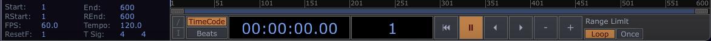

2. Use a "[MovieFileIn](https://docs.derivative.ca/Movie_File_In_TOP)" node to load an STMap template image. This will typically be an EXR formatted 32-bit per channel image. Rename the node so it is called "STMap".

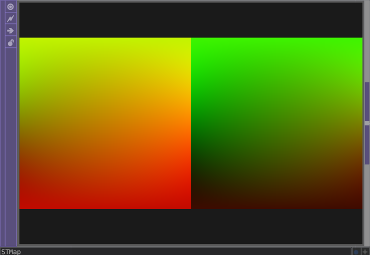

Change the MovieFileIn node's "File" parameter to link to your STMap image file on disk.

3. Use a node to bring in the Canon R5C video footage. You can import a pre-existing movie file from disk using a "[MovieFileIn](https://docs.derivative.ca/Movie_File_In_TOP)" node or you can import a live video feed into TouchDesigner with the help of either an [NDI](https://docs.derivative.ca/NDI) video stream, or a [video capture card](https://docs.derivative.ca/Video_Device_In_TOP). Rename the node so it is called "RGB"

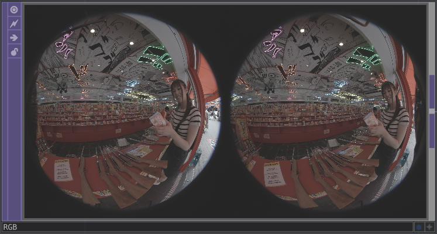

Change the MovieFileIn node's "File" parameter to link to your RGB image file on disk, or to a video file.

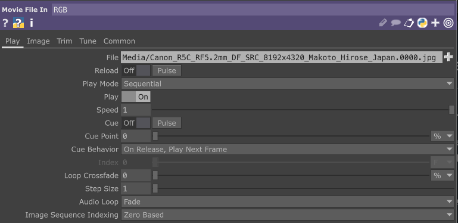

4. Add a "[Remap](https://docs.derivative.ca/Remap_TOP)" node. Connect the Canon R5C footage and the STMap footage to the input connection on the Remap node.

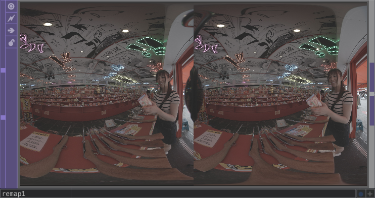

Set the Remap node's "Horizontal Source" parameter to Red, and the "Vertical Source" parameter to Green. You can use the "Flip Direction" controls to invert the axis of the vertical or horizontal STMap image channels if required.

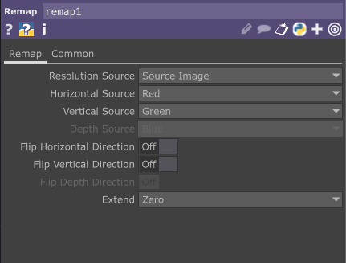

5. Add a vignetting mask image using a  "[MovieFileIn](https://docs.derivative.ca/Movie_File_In_TOP)" node. Load an Kartaverse kvrVignette fuse generated dual fisheye lens mask template image. Rename the node so it is "Mask".

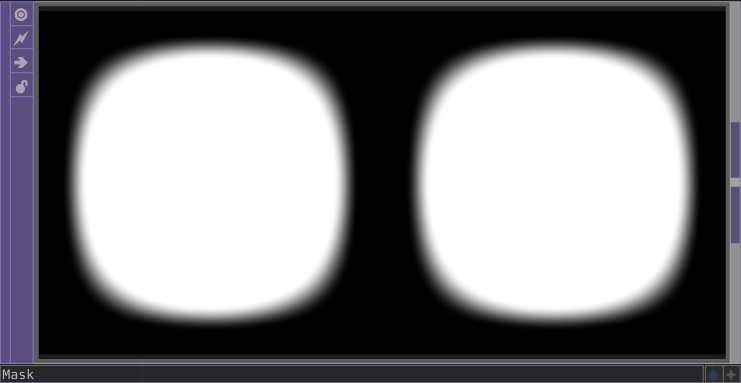

Change the MovieFileIn node's "File" parameter to link to your black & white masking image file on disk.

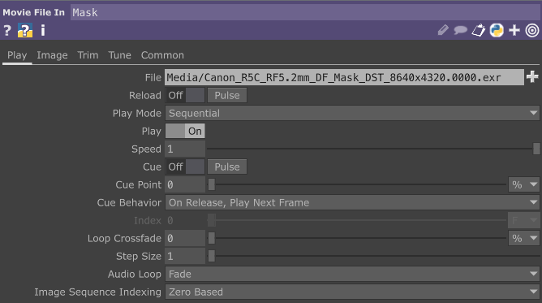

6. Add a "[Multiply](https://docs.derivative.ca/Remap_TOP)" node. Connect the "Remap" node output to the Multiply node. Then connect the "Mask" node output to the Multiply node.

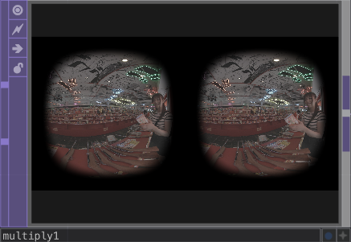

This node will take the black to white color values in the lens mask image and use it to darken the live action 180VR content to hide everything in the shot that is outside the part of the image you care about. This hides the opposite eye's lens element that is visible at the border of the frame.

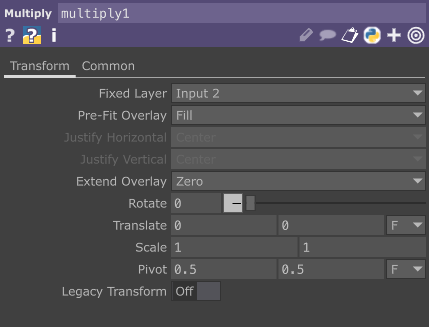

7. A TouchDesigner project typically has an "out" node that passes the media out of the comp session. This is how your visuals can appear on a full screen monitor output that is connected to an HDMI video output port on your graphics card.

8. TouchDesigner allows you to export video to an NDI stream from TouchDesigner using an [NDI Out](https://docs.derivative.ca/NDI_Out_TOP) node. You can send your final processed VR footage to an HMD in realtime using an [OpenVR](https://docs.derivative.ca/OpenVR_TOP) node. If you want You can also send media to an HMDI video output connection, or to a realtime internet video streaming platform with the "[Video Stream Out](https://docs.derivative.ca/Video_Stream_Out_TOP)" node.

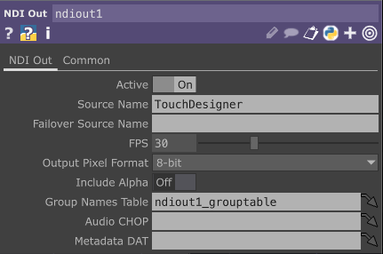

9. If you want to do a quick tech-check on the NDI Output you can use the free "[NDI Tools](https://ndi.video/tools/)" utility called "NDI Virtual Monitor" to preview the network video stream.

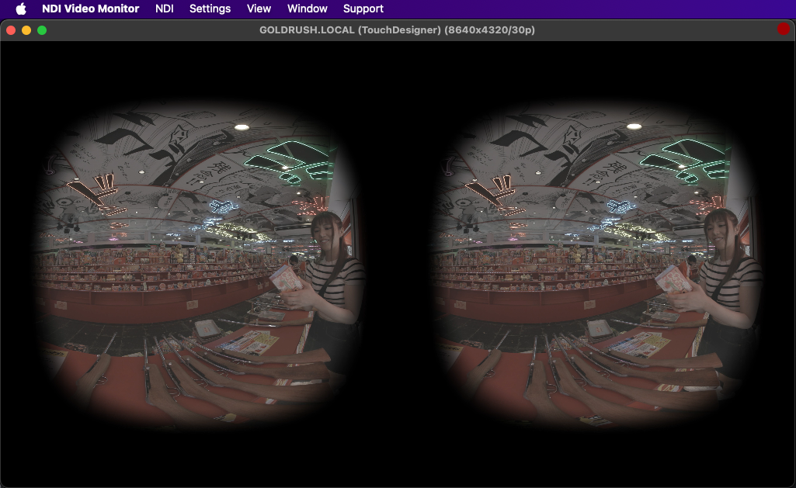

10. You can add a [MovieFileOut](https://docs.derivative.ca/Movie_File_Out_TOP) node and connect it to the Remap node. This is how the finished footage is exported from TouchDesigner. Choose if you want to save out an image sequence or a movie file. Then customize the File attribute to define the filename for rendered footage.

	When you toggle on the "Record" button", the MovieFileOut footage will be written to disk. You can turn on the "Pause" button if you want to pause the export process.

	It is a good idea to turn off the "[x] Realtime" checkbox at the top toolbar area in TouchDesigner if you are offline rendering a Movie file to disk and don't want to have any skipped frames.

	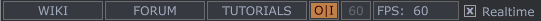

## Extra Learning Resources

**kvrFisheyeStereo**  
Check out the Kartaverse [kvrFisheyeStereo](kvrFisheyeStereo) node that works in Resolve/Fusion. It provides a quick way to generate a 180VR SBS STMap warping template image that is calibrated to your exact camera lens.

**kvrVignette**  
Check out the Kartaverse [kvrVignette](fuses?id=kvrvignette) node that works in Resolve/Fusion. It allows you to create stereo 3D aware circular fisheye lens masking images.

**STMap Guide**  
For more information about ST Maps check out the article: [Google Docs | KartaVR Workflows | Creating ST Maps](https://docs.google.com/document/d/1lQ-wc9ucLJqj-HL7iKMNWA71klV5O1fk2-JicRB6gDY/edit?usp=sharing)

---

**Hugh Hou YouTube Video**  
This a 2 year old Hugh Hou video that shows how to process Canon R5C camera + Canon RF 5.2mm dual fisheye lens media in Resolve:
[Edit Canon R5C & R5 VR180 w/ DaVinci Resolve 18 FREE - 3D 8K 60fps RAW LT Clog3 Workflow](https://www.youtube.com/watch?v=2GW7nb47rB4)

The tutorial covers the usage of "ST Maps" and the WarpStitch node. Included with the project files are Fusion and Resolve example comps, along with a TouchDesigner based real-time warping project file that can be used to do live 180VR video streaming, and supports real-time stitched previews from the Canon R5/R5C camera. Make sure to [download the supporting project files](https://drive.google.com/file/d/1H-owMeadqekZ42BgmqeaPHr9Ry2cHFP8/view).

@yt(2GW7nb47rB4,560px,317px,center)

