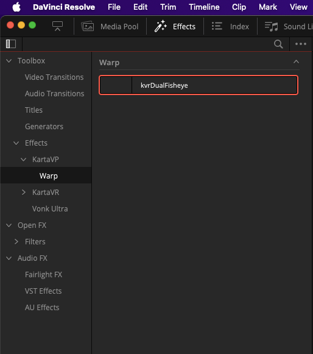
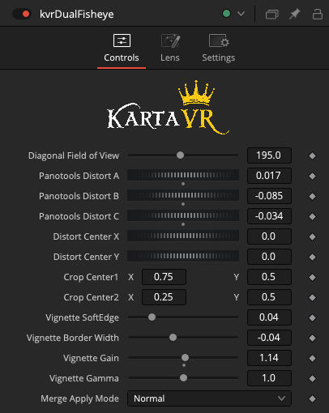
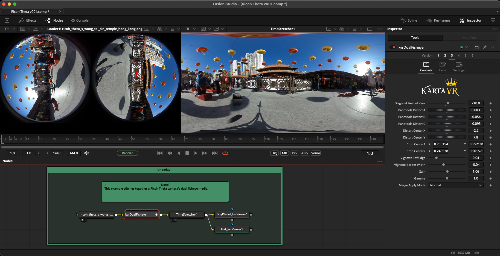
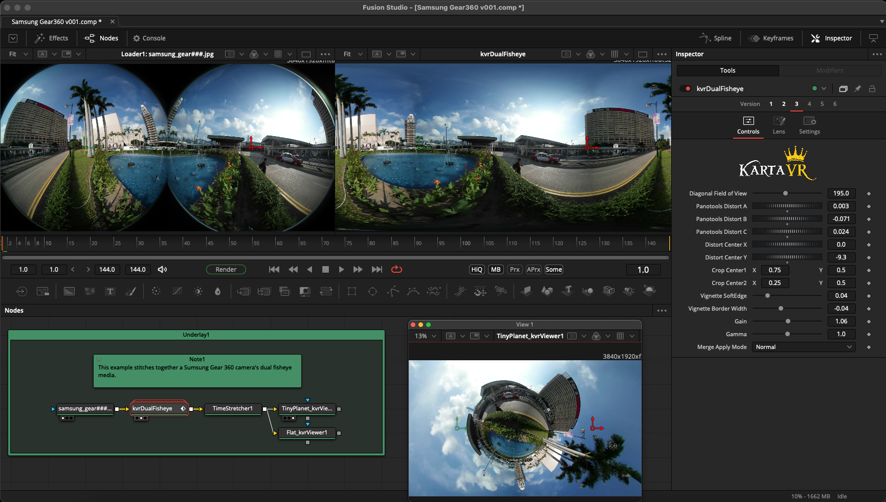
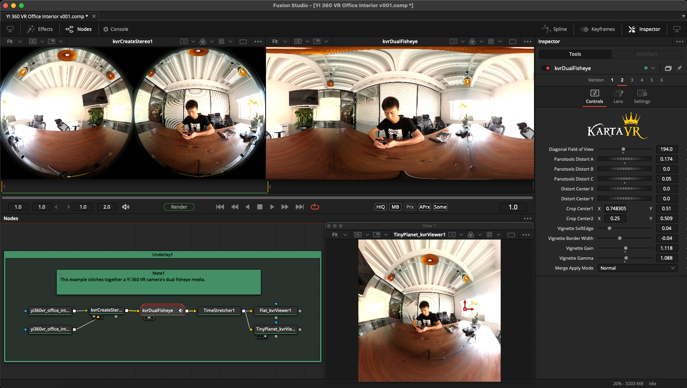
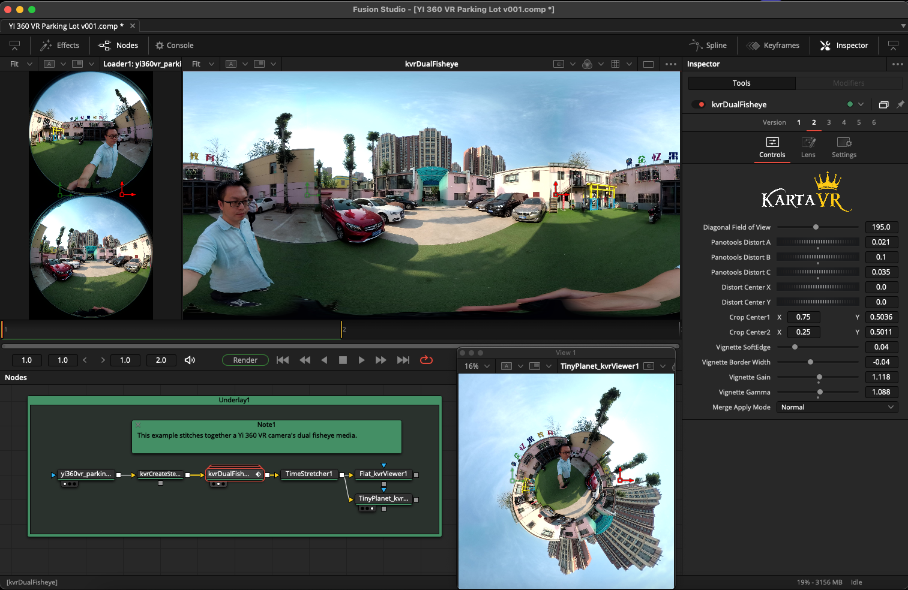
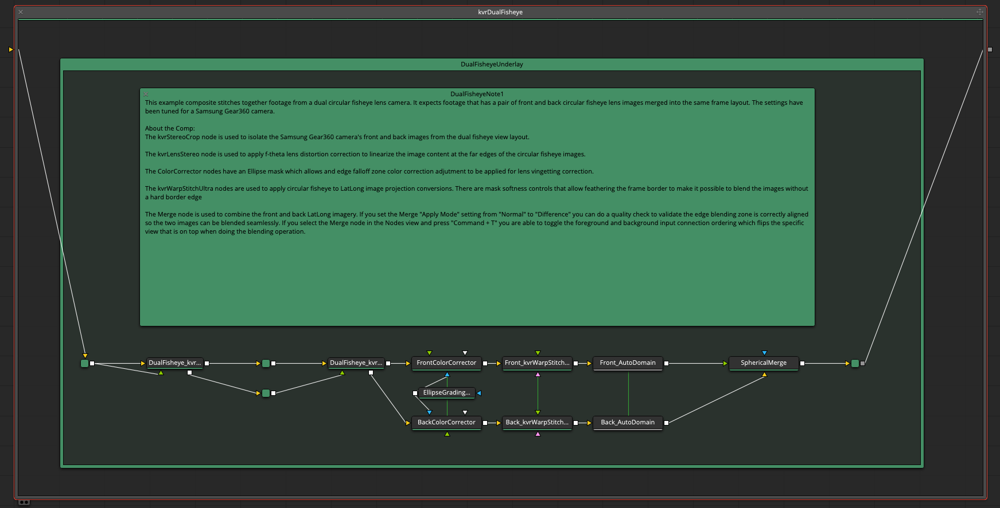

# kvrDualFisheye Stitching Effects Template

## Overview

The "kvrDualFisheye" Effects Template and example composites stitch together footage from a dual circular fisheye lens camera. It expects footage that has a pair of front and back circular fisheye lens images merged into the same frame layout. The settings have been tuned for a Samsung Gear360 camera.

## Open Source Software License

- LGPL 3.0

## Software Required

- Resolve Free or Resolve Studio or Fusion Studio v17-19+
- Reactor Package Manager + Kartaverse
- Kartaverse Fuses Used:
	- kvrCropStereo
	- kvrLensStereo
	- kvrWarpStitchUltra
	- kvrViewer

## Usage

**Step 1.** Install Reactor and add the STMapper fuse package to your Resolve based system. Install the "kvrDualFisheye" macro. Restart Resolve.

**Step 2.** Open a Resolve video editing timeline in the Edit page.

**Step 3.** Display the Effects Library tab, and switch to the "Toolbox > Effects > KartaVP > Warp" section. Drag the "kvrDualFisheye" entry onto a video clip in the timeline.

**Step 4.** Click on the video clip in the timeline and switch to the Inspector's Effects tab. Modify the "Effects > Fusion > kvrDualFisheye" settings if the default value doesn't give you the output you desire.

In the inspector view, if you click the little magic wand icon next to the right of the heading "kvrDualFisheye" you can hop into the Fusion page to customize the macro node. 

Double clicking on the "kvrDualFisheye" node in the Fusion page allows you to expand the group to access the nodes that are stored inside the group object.

**Step 5.** The viewer window in the Edit page should update to show your warped result.

### About the Example Comps

The following example Fusion comp files show how the kvrDualFisheye macro works:

	Reactor:/Deploy/Comps/Kartaverse/WarpStitch/Dual Fisheye/Ricoh Theta v001.comp

---

	Reactor:/Deploy/Comps/Kartaverse/WarpStitch/Dual Fisheye/Samsung Gear360 v001.comp

---

	Reactor:/Deploy/Comps/Kartaverse/WarpStitch/Dual Fisheye/YI 360 VR Office Interior v001.comp

---

	Reactor:/Deploy/Comps/Kartaverse/WarpStitch/Dual Fisheye/YI 360 VR Parking Lot v001.comp

---

#### Internal Macro Logic

This is what the internal node connections look like inside the expanded macro group:

The kvrStereoCrop node is used to isolate the Samsung Gear360 camera's front and back images from the dual fisheye view layout.

The kvrLensStereo node is used to apply f-theta lens distortion correction to linearize the image content at the far edges of the circular fisheye images.

The ColorCorrector nodes have an Ellipse mask which allows and edge falloff zone color correction adjutment to be applied for lens vingetting correction.

The kvrWarpStitchUltra nodes are used to apply circular fisheye to LatLong image projection conversions. There are mask softness controls that allow feathering the frame border to make it possible to blend the images without a hard border edge

The Merge node is used to combine the front and back LatLong imagery. If you set the Merge "Apply Mode" setting from "Normal" to "Difference" you can do a quality check to validate the edge blending zone is correctly aligned so the two images can be blended seamlessly. If you select the Merge node in the Nodes view and press "Command + T" you are able to toggle the foreground and background input connection ordering which flips the specific view that is on top when doing the blending operation.

