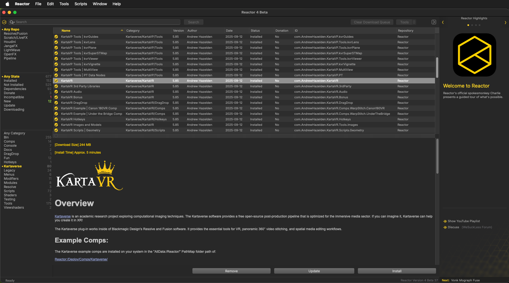
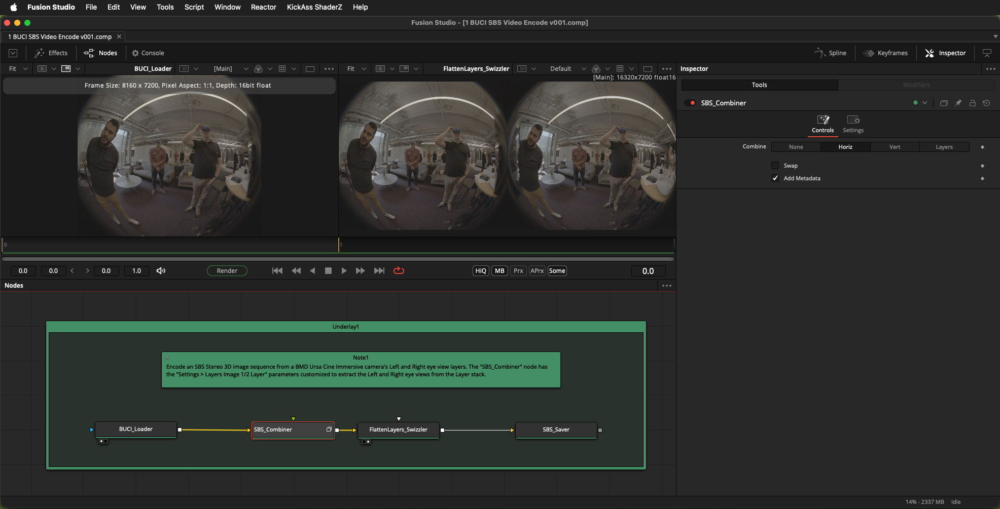
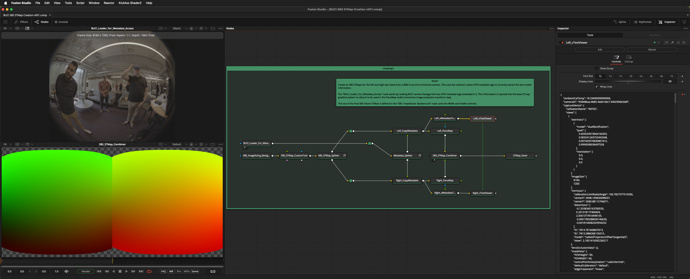
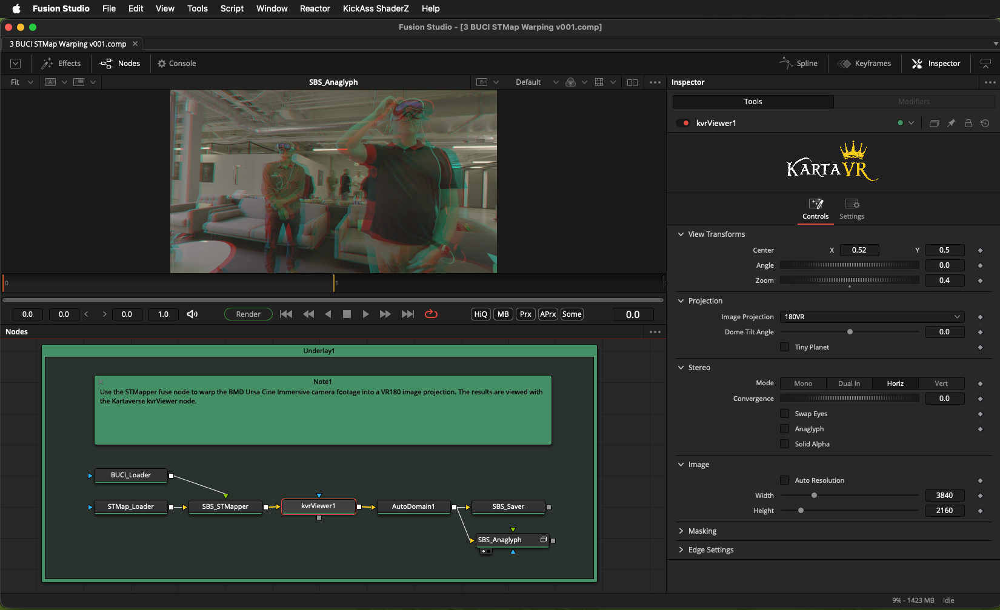
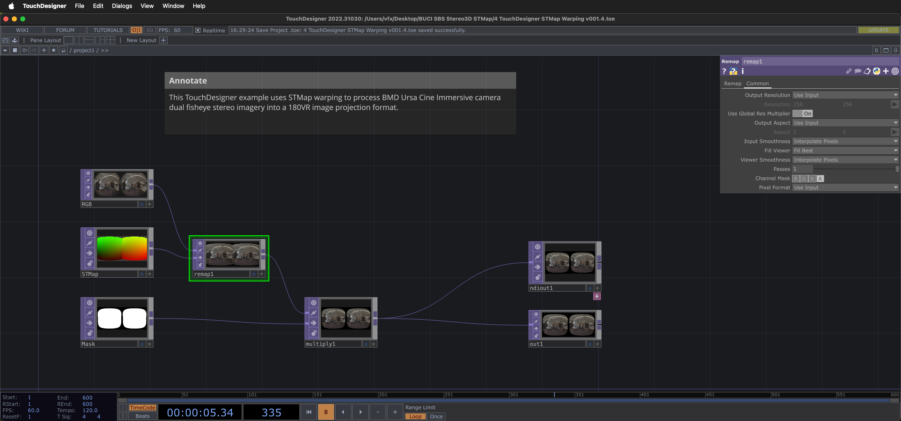

# BUCI SBS Stereo3D STMap

Date Created: 2025-11-09  
Written By: Andrew Hazelden <andrew@andrewhazelden.com>  

This project ships with four STMap image warping workflow example comps that are purpose built for use with the BMD Ursa Cine Immersive Camera. The examples are designed for users who have access to Kartaverse, BMD Resolve Studio/Fusion Studio, and TouchDesigner.

## Installation

You need to install the [Reactor Standalone](https://github.com/Kartaverse/Reactor-Standalone) package manager to use the latest Kartaverse for Resolve/Fusion toolset. This is free open-source software that can be used commercially.

Reactor Standalone GitHub page:

[https://github.com/Kartaverse/Reactor-Standalone](https://github.com/Kartaverse/Reactor-Standalone)

Select the "Kartaverse" category on the left sidebar panel of the Reactor user interface.

Click on the first atom package in the list. Then press the Select All hotkey of "Command + A" (macOS) or "Control + A" (Windows/Linux) to select all of the Kartaverse packages.

Then press the "Install" button to add those tools to your system.

Follow the rest of the setup steps in the Reactor Standalone documentation to get everything set up.

## BUCI SBS Video Encode v001

Encode an SBS Stereo 3D image sequence from a BMD Ursa Cine Immersive camera's Left and Right eye view layers. The "SBS_Combiner" node has the "Settings > Layers Image 1/2 Layer" parameters customized to extract the Left and Right eye views from the Layer stack.

## BUCI SBS STMap Creation v001

Create an SBS STMaps for the left and right eye views from a BMD Ursa Cine Immersive camera. This uses the camera's native ILPD metadata tags to correctly extract the lens model information.

The "BUCI\_Loader\_For\_Metadata\_Access" node works by reading BUCI camera footage that has ILPD metadata tags embeded in it. This information is injected into the base STmap gradient pattern to allow it to be used in the PanoMap node's Immersive image projection transform step.

The size of the final SBS Stereo STMap is defined in the "SBS\_ImageSizing\_Background" node using the Width and Height controls.

## BUCI STMap Warping v001

Use the STMapper fuse node to warp the BMD Ursa Cine Immersive camera footage into a VR180 image projection. The results are viewed with the Kartaverse kvrViewer node.

## TouchDesigner STMap Warping v001

This TouchDesigner example uses STMap warping to process BMD Ursa Cine Immersive camera dual fisheye stereo imagery into a 180VR image projection format.

