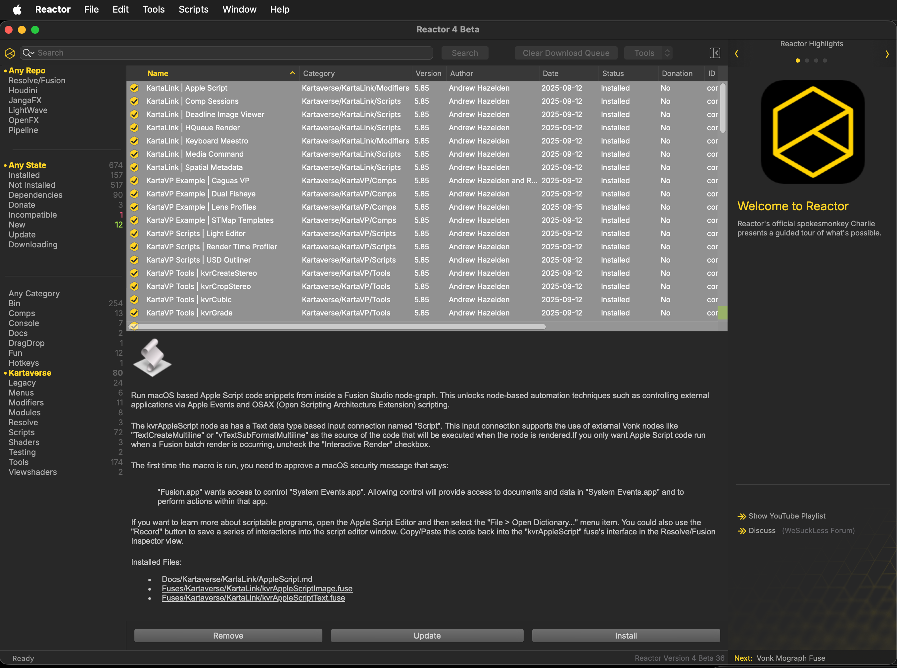

# Kartaverse ILPD Immersive Metadata
By Andrew Hazelden <andrew@andrewhazelden.com>  
2025-11-06 01.42 AM  

## Overview

This Kartaverse example transcodes Canon Dual Fisheye Stereo Lens + BMD Pyxis 12K Camera BRAW footage so it is compatible with the Apple Immersive Video Utility "ILPD" metadata specification.

This process allows other camera models to access the same next-generation "Stitchless" post-production pipeline that was designed by Apple and BMD for the BMD Ursa Cine Immersive cameras.

## kvrILPD Macro 

With the kvrILPD macro you can convert dual fisheye stereo media into the BMD "Stitchless" format using the ILPD lens metadata info. This node converts the media into the stereo 3D compatible "Layer" framebuffer format, then it injects the new ILPD records into your footage on the fly.

If you view the output of the kvrILPD node, you can enable the Fusion viewer window "••• > 360° View > Immersive" option. This allows you to pan around the fisheye scene interactively in the viewer window. Don't forget to turn the Immersive option off in the viewer window when you are done looking at fisheye content.

Sample Node Connections:

`Loader/MediaIn -> kvrILPD -> PanoMap -> Combiner -> kvrViewer`

If a PanoMap is added after the kvrILPD node you can use it to convert the "Immersive" image projection content into LatLong or VR180 content. This is done using the PanoMap nodes "From: Immersive", "To: VR180" controls. Make sure to switch to the "Settings" control page on the node and set the "Layers -> Process Layers: All Layers" option so the Viewer windows Multilayer "Left" and "Right" eye views are processed at the same time.

The Combiner node can be set to "Combine: Horiz" to create SBS (Side by Side) stereo output.

If you wish to reframe this content, a kvrViewer node can be added.  Uncheck the "Image -> Auto Resolution" control. Then enter a "Width: 3840", "Height: 2160" value. Set the "Image Projection: 180VR" value. Set the Stereo controls to "Mode: Horiz". You can optionally enable the "Anaglyph" checkbox to preview the stereo 3D results with 3D Anaglyph glasses on.

## Example Comp Requires

Install Resolve Studio and Fusion Studio v20.2.3 to follow along with this example.

Download the sample Pyxis 12K BRAW media from Siyang Qi's Google Drive folder here:

[https://drive.google.com/drive/folders/15Zf__9A86TndF2AyhJdXEWNa_NOj03Ye](https://drive.google.com/drive/folders/15Zf__9A86TndF2AyhJdXEWNa_NOj03Ye)

Install all of the Kartaverse packages for Resolve/Fusion using the [Reactor Standalone package manager](https://github.com/Kartaverse/Reactor-Standalone).

Download Reactor from GitHub here:   
[https://github.com/Kartaverse/Reactor-Standalone/releases](https://github.com/Kartaverse/Reactor-Standalone/releases)

When Reactor Standalone is running, click on the "Kartaverse" category on the left sidebar in the user interface. Click on the name of one of the packages in the list panel area. 

Then press the "Select All" hotkey (Command + A) on macOS or (Control + A) on Windows/Linux to select all of the Kartaverse packages. Then click the "Install" button at the bottom of the user interface.

After 5 to 10 minutes all of the content should be installed. Follow the Reactor Standalone install guide to set up the connection from Reactor to Resolve/Fusion.

Then open the example comp "Pyxis to ILPD Metadata Static v003.comp" up in either Resolve Studio or Fusion Studio.

If you have downloaded the Pyxis 12K BRAW media from Siyang Qi's Google Drive folder then you could also use the "Pyxis to ILPD Metadata BRAW v003.comp". Relink the BRAW media in the comp so it loads.

