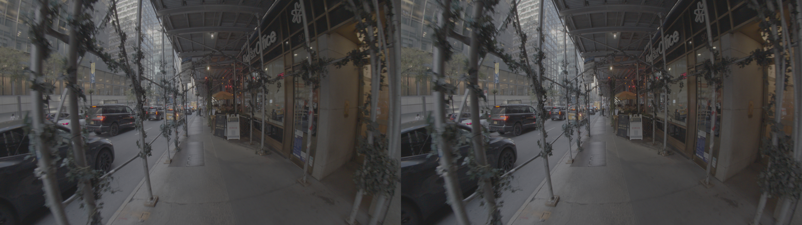

# NewYork PYXIS 12K Camera VR180
By Andrew Hazelden <andrew@andrewhazelden.com>  
2025-10-11

## Overview

This example comp uses Kartaverse to generate a custom STMap warping template for a BMD PYXIS 12K camera body that has a Canon Dual Fisheye Stereo lens mod. The STMap image allows the footage to be processed on the Resolve Studio Edit page.

This example validates the STMap warping template works as expected. The Switch node allows you to toggle quickly between the source footage clips, and the STmap switch goes between VR180 and Spatial Video.

## Media Download Link

To follow along with this project, you can download the camera original PYXIS 12K BRAW media from the following [google drive link](https://drive.google.com/drive/folders/15Zf__9A86TndF2AyhJdXEWNa_NOj03Ye).

## Warping Results

### Spatial Video SBS Output

### VR180 Output

