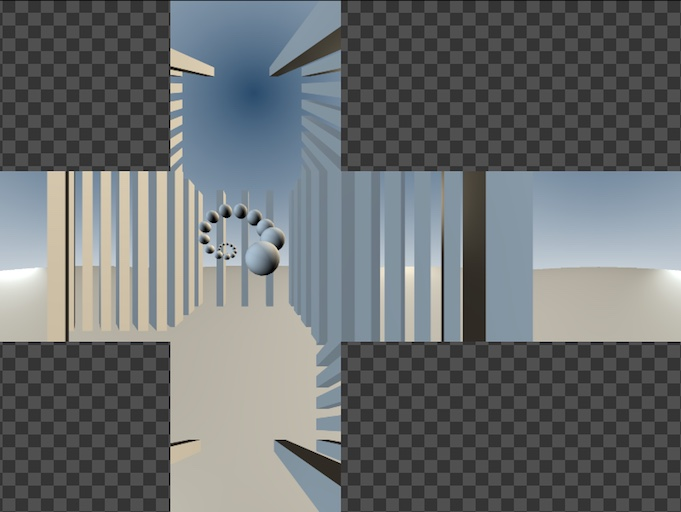
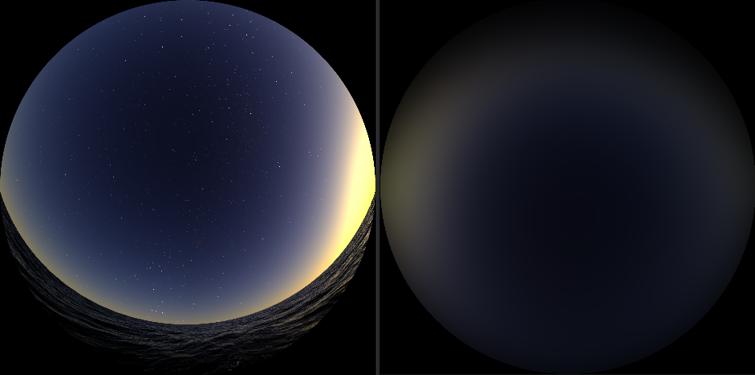

# Fusion Compositing Examples

This page lists the example Fusion .comp files that come built-in with the KartaVR product download.

## Angular to Cube.comp

This example shows how to convert an angular fisheye image into each of the cubic panorama formats.

## Boxworld CubicRenderer3D.comp

This example shows how to render elements from Fusion's 3D animation system to a cubic panorama format output.

## Boxworld CylindricalRenderer3DAdvanced.comp

This example shows how to render elements from Fusion's 3D animation system to a cylindrical 360 x 90 degree format output.

## Boxworld DomemasterRenderer3D.comp

This example shows how to render elements from Fusion's 3D animation system to an angular fisheye based domemaster 180 degree format output.

## Boxworld DomemasterRenderer3DAdvanced.comp

This example shows how to render multi-channel elements from Fusion's 3D animation system to an angular fisheye based domemaster 180 degree format output.

## Boxworld EquirectangularRenderer3D.comp

This example shows how to render elements from Fusion's 3D animation system to an Equirectangular/LatLong/spherical format output.

## Boxworld EquirectangularRenderer3DAdvanced.comp

This example shows how to render out multi-channel elements from Fusion's 3D animation system to an Equirectangular/LatLong/spherical format output.

## Boxworld Oculus Rift Stereo Renderer3D.comp

This example shows how to use an Oculus Rift DK1 or DK2 HMD display as the output device from the Fusion 3D system using the Boxworld example scene.

To use this macro you need to mount the Oculus Rift DK1 or DK2 HMD as a regular monitor on Mac/Windows/Linux. This is done by disabling the "Direct to Rift" option in the Oculus Rift drivers.

In Fusion select the "Windows  > New Image View"  menu item. Then drag this floating image view onto the Oculus Rift display monitor and then resize the image view to be fullscreen.  You can now load the rendered image in Fusion on the new view using the 3 hotkey and the content will show up on the Rift's screen. It helps to turn off the View window's "Show Controls" (Command+K) and "Show Checker Underlay" options.

Clicking on the view and selecting the Fit (Command+F) option will make sure the image fills the HMD screen.

## ColorCorectorMasked.comp

The first example shows a vertical gradient effect that is used to fade off the saturation on the image at a certain point. This vertical gradient effect would typically be used to fix a brightness or contrast effect in the sky or tripod zone, or to apply a graduated neutral density filter type effect.

The second example shows a horizontal gradient effect that is used to fade off the saturation on the image at a certain point. This horizontal gradient effect would typically be used to fix seam issues where the contrast might not line up on the left and right frame edge on a LatLong panorama.

The third example shows a horizontal gradient effect that has three control handles added to the gradient. These controls are used to fade off the saturation on the image at a certain point. This horizontal gradient effect would typically be used to fix a contrast issue with one part of a stitched camera view in a LatLong image.

## Conversions.comp

This example shows several of the most common panoramic conversions you would typically do with the KartaVR toolset.

## Cubic to Domemaster180.comp

This example shows how to convert a set of six cubic 90 degree FOV images into a domemaster 180 degree angular fisheye image.

## CubicFaces2Equirectangular.comp

This example shows how to take a set of six cube map images and merge them into an equirectangular/LatLong/spherical format panorama.

## CubicRenderer3D.comp

This example shows how to render elements from Fusion's 3D animation system to cubic panorama format outputs.

## Cylindrical Conversions.comp

This example shows how to convert equirectangular/spherical/latlong format imagery into a cylindrical projection. There is also an example that takes cubic imagery into a cylindrical projection and then goes back to cubic again.

## CylindricalRenderer3D.comp

This example shows how to render elements from Fusion's 3D animation system to a cylindrical panorama format output.

This example shows one of the extra render channels that the CylindricalRenderer3DAdvanced node can output. In this case the UV pass channel is displayed.

## Defocus Blur Glow Sharpen Unsharpen.comp

This example shows a quick demo of the new filter effects in the KartaVR. The filters wrap around the left/right frame boundaries of a panoramic image. Note: The gradient controls in the macros let you selectively fade out the effect of the filters.

The BlurPanoramicWrap macro is used to create a title graphic with the Text+ character generator applied as an effects mask. The alpha channel on the text is inverted so it results in the background of the image being filled with a soft blurry effect while the text is clear.

The GlowPanoramicWrap macro nicely wraps the effect around the frame border so incandescent glow effects don't get clipped if the object source is on the edge of a rendered image.

The BlurPanoramicWrap macro can use the built-in gradient controls to fade the effect out in parts of the frame to create looks like a foggy/hazy effect.

The BlurPanoramicWrap macro can used to easily blur out the tripod zone.

## DomemasterRenderer3D.comp

This example shows how to render elements from Fusion's 3D animation system to an angular fisheye based domemaster 180 degree format output.

## Equirectangular Tripod Repair.comp

The top example shows tripod rig removal by taking an LatLong/Equirectangular/Spherical image, extracting the bottom "nadir" camera view, applying a paint node to do clone patching, and then finally bringing the cubic view back into the LatLong format and merging it with the original panorama.

The lower example shows tripod rig removal by taking an LatLong/Equirectangular/Spherical image, rotating the view by 90° on the X axis to make it easier to work with the ground and sky pole zones, applying a paint node to do clone patching, and then finally bringing the view back into an upright LatLong format and merging it with the original panorama.

## Equirectangular2Fisheye.comp

The Equirectangular2Fisheye macro converts an equirectangular image into an angular fisheye image projection. This node has an FOV control that can be animated along with XYZ rotation support.

## EquirectangularStereo2FisheyeStereo.comp

The EquirectangularStereo2FisheyeStereo macro converts a pair of left and right equirectangular images into the angular fisheye image projection. This node has an FOV control that can be animated along with XYZ rotation support.

## EquirectangularRenderer3D.comp

This example shows how to render elements from Fusion's 3D animation system to an Equirectangular/LatLong/spherical format output.

## EquirectangularRenderer3DAdvanced.comp

This example shows how to render out multi-channel elements from Fusion's 3D animation system to an Equirectangular/LatLong/spherical format output.

## Facebook Cubemap3x2.comp

The first example shows how to convert a Facebook Cubemap 3x2 format panorama to an equirectangular/LatLong/spherical format image.

The second example shows how to convert a Facebook Cubemap 3x2 format panorama to a Gear VR Mono Cubemap format image.

The third example shows how to convert an equirectangular/LatLong/spherical format panorama to a Facebook Cubemap 3x2 format image.

The fourth example shows how to convert a Gear VR format panorama to a Facebook Cubemap 3x2 format image.

## Facebook Vertical Strip.comp

The first example shows how to convert a set of six cubemap face images into the Facebook Vertical Strip cubemap format.

The second example shows how to convert a Facebook Vertical Strip cubemap into an Equirectangular/LatLong/Spherical image projection.

The third example shows how to convert a Facebook Vertical Strip cubemap into a GearVR/Vray/Octane Render horizontal strip cubic image projection.

## Fulldome Crossbounce Sim.comp

This comp is a demo that simulates the rough effect of fulldome crossbounce lighting. Adjust the screen gain control to adjust the reflectivity of the dome screen. A good starting point is a screen gain value between 0.1 to 0.25

Here is a view of a raw crossbounce lighting simulation that was created with the "Crossbounce Blend" control set to 0:

Here is a view of a raw crossbounce lighting simulation that was created with the "Crossbounce Blend" control set to 0, and the "Crossbounce Saturation" was set to 0 to create a desaturated greyscale / luminance style output:

This is a view of a crossbounce lighting simulation where the simulation data was automatically composited over the original fulldome plate footage. This was created by setting the "Crossbounce Blend" control to 1:

## GearVR Mono to Equirectangular.comp

This example shows how to convert a  GearVR/Octane Render/Vray horizontal strip cube map into an Equirectangular image.

## GearVR Stereo to Equirectangular Stereo.comp

This example shows how to convert a stereo GearVR/Octane Render/Vray horizontal strip cube map into an Equirectangular Stereo Over/Under image.

## LatLong to Cube.comp

This example shows how to convert a LatLong/Equirectangular/Spherical image into each of the cubic panorama formats.

## LatLong to GearVRStereo.comp

This example shows how to convert a pair of LatLong/Equirectangular/Spherical images to the GearVR stereo format. Then the comp shows how to extract that Gear VR stereo image and convert it into a stereoscopic horizontal cross image.

## Logo Over Tripod.comp

This example places a flat logo image over the tripod zone in an Equirectangular/LatLong/Spherical panoramic image.

## MeshUV Conversions.comp

The first example shows how to convert a Pyramid image projection into an LatLong/Equirectangular/Spherical image.

The second example shows how to convert a LatLong/Equirectangular/Spherical image into a Pyramid Mesh UV baked texture map.

The third example shows how to convert a LatLong/Equirectangular/Spherical image into a Facebook Cubemap 3x2 Mesh UV baked texture map.

The fourth example shows how to convert an Angular Fisheye 360 degree image into a Facebook Cubemap 3x2 Mesh UV baked texture map.

The fifth example shows how to convert a set of Cubic Face panoramic images into a Facebook Cubemap 3x2 Mesh UV baked texture map.

## Ricoh Theta S Stitch.comp

This is a KartaVR example that warps and stitches the raw footage from a Ricoh Theta S panoramic camera.

## Roller Coaster Ride CubicRenderer3D

This roller coaster ride example shows how to render elements from Fusion's 3D animation system to a cubic format output.

A roller coaster track model with a camera path based animation is imported from an FBX file. Then a Fusion transform3D node is used with the "Invert Transform" checkbox to prepare the scene for easy rendering with the CubicRenderer3D node.

The example has a side by side pair of CubicRenderer3D cameras that can give you a previz grade stereoscopic 3D rendered result of the scene. The node RightViewTransform3D is used with an expression to apply a stereoscopic camera separation offset type of effect.

The output from the stereo pair of CubicRenderer3D cameras is then routed into a Gear VR cubic image format with the help of the "CubicFaces2GearVRStereo" node.

Note: Fusion doesn't support raytraced lens shaders so it is not possible to render omnidirectional stereo output at this point in time.

## Roller Coaster Ride CylindricalRenderer3D

This roller coaster ride example shows how to render elements from Fusion's 3D animation system to a cylindrical format output.

A roller coaster track model with a camera path based animation is imported from an FBX file. Then a Fusion transform3D node is used with the "Invert Transform" checkbox to prepare the scene for easy rendering with the CylindricalRenderer3D node.

The example has a side by side pair of CylindricalRenderer3D cameras that can give you a previz grade stereoscopic 3D rendered result of the scene. The node RightViewTransform3D is used with an expression to apply a stereoscopic camera separation offset type of effect. Note: Fusion doesn't support raytraced lens shaders so it is not possible to render omnidirectional stereo output at this point in time.

## Roller Coaster Ride DomemasterRenderer3D

This roller coaster ride example shows how to render elements from Fusion's 3D animation system to a domemaster angular fisheye format output.

A roller coaster track model with a camera path based animation is imported from an FBX file. Then a Fusion transform3D node is used with the "Invert Transform" checkbox to prepare the scene for easy rendering with the DomemasterRenderer3D node.

The example has a side by side pair of DomemasterRenderer3D cameras that can give you a previz grade stereoscopic 3D rendered result of the scene. The node RightViewTransform3D is used with an expression to apply a stereoscopic camera separation offset type of effect. Note: Fusion doesn't support raytraced lens shaders so it is not possible to render omnidirectional stereo output at this point in time.

## Roller Coaster Ride EquirectangularRenderer3D

This roller coaster ride example shows how to render elements from Fusion's 3D animation system to an Equirectangular/LatLong/spherical format output.

A roller coaster track model with a camera path based animation is imported from an FBX file. Then a Fusion transform3D node is used with the "Invert Transform" checkbox to prepare the scene for easy rendering with the EquirectangularRenderer3D node.

The example has a side by side pair of EquirectangularRenderer3D cameras that can give you a previz grade stereoscopic 3D rendered result of the scene. The node RightViewTransform3D is used with an expression to apply a stereoscopic camera separation offset type of effect. Note: Fusion doesn't support raytraced lens shaders so it is not possible to render omnidirectional stereo output at this point in time.

## Roller Coaster Ride Oculus Rift Stereo.comp

This roller coaster ride example shows how the "OculusDK1StereoRenderer3D" macro that allows you to use an Oculus Rift DK1 HMD display as the output device from the Fusion 3D system.

A roller coaster track model with a camera path based animation is imported from an FBX file. Then a Fusion transform3D node is used with the "Invert Transform" checkbox to prepare the scene for easy rendering with the OculusDK1StereoRenderer3D and OculusDK2StereoRenderer3D nodes.

To use this macro you need to mount the Oculus Rift DK1 or DK2 HMD as a regular monitor on Mac/Windows/Linux. This is done by disabling the "Direct to Rift" option in the Oculus Rift drivers.

In Fusion select the "Windows > New Image View" menu item. Then drag this floating image view onto the Oculus Rift display monitor and then resize the image view to be fullscreen. You can now load the rendered image in Fusion on the new view using the 3 hotkey and the content will show up on the Rift's screen. It helps to turn off the View window's "Show Controls" (Command+K) and "Show Checker Underlay" options.

Clicking on the view and selecting the Fit (Command+F) option will make sure the image fills the HMD screen.

## Roller Coaster Ride Acer WMR Stereo.comp

This roller coaster ride example shows how the "AcerWMRStereoRenderer3D" macro that allows you to use an Acer Windows Mixed Reality HMD display as the output device from the Fusion 3D system.

A roller coaster track model with a camera path based animation is imported from an FBX file. Then a Fusion transform3D node is used with the "Invert Transform" checkbox to prepare the scene for easy rendering with the AcerWMRStereoRenderer3D nodes.

To use this macro you need to mount the AcerWMR as a regular monitor on Mac/Windows/Linux.

In Fusion select the "Windows  > New Image View"  menu item. Then drag this floating image view onto the AcerWMR display monitor and then resize the image view to be fullscreen.  You can now load the rendered image in Fusion on the new view using the 3 hotkey and the content will show up on the AcerWMR's screen. It helps to turn off the View window's "Show Controls" (Command+K) and "Show Checker Underlay" options.

Clicking on the view and selecting the Fit (Command+F) option will make sure the image fills the HMD screen.

## Rotate Panoramas.comp

This example shows how to use the RotateEquirectangular, RotateGearVRMono, and RotateCubicFaces macros to adjust the XYZ rotation of your panoramic imagery.

## Samsung Gear 360 Stitch.comp

This example stitches the raw footage from a Samsung Gear 360 panoramic camera into an equirectangular/LatLong/spherical format panorama.

## Stereo 3D Roto Conversion.comp

This example shows how a 2D monoscopic panoramic 360&deg; image can be displaced into an omni-directional 3D stereoscopic image using the "DisplaceEquirectangular" macro node with a greyscale depthmap that was created using rotoscoping.

The composite starts with loading a 2D forest panorama image.

A series of BSpline rotoshapes are added to trace the depth of each of the major trees, bushes, and objects in the image. Then each of the rotosplines are give a specific greyscale shaded depth value from 0-1 which represents the depth from the back of the world to the front of the scene.

Finally, the "DisplaceEquirectangular" macro node pushes and pulls the pixels in the scene to turn the 2D panorama into a stereosopic 3D output. The composite has a stereo over/under output, an anaglyph stereoscopic live preview output, a depthmap output that is previewed as an anaglyph stereo image so you can see the results interactively as you are drawing the rotoshapes, and an animated "wiggle" stereo preview to check the depth in the scene.

The wiggle format GIF animation is helpful as it shows the generated "in between" stereoscopic camera views that are possible to create from an original 2D mono panorama.

At the bottom of the comp is an example of the DepthBlurPanoramicWrap node that is applying a defocusing effect that varies based upon the distance from the camera.

## Stereo.comp

This example shows the most common panoramic 360&deg; stereo format conversions that are done with the KartaVR.

## Text+ Imageplane Stereo.comp

This example shows how to create text in Fusion that can be mapped onto a polygon image plane using Fusion's 3D system.

As a bonus a parallel stereo camera rig is created that allows you to render out equirectangular stereo imagery that can be viewed using the stereo side by side merge node, or the stereo anaglyph nodes in the composite.

## Text+ Matrix DomemasterRender3D.comp

This example shows how to create a fulldome version of The Matrix "raining text".

A Text+ node is used to generate a tall hexadecimal text string. Then an offset node animates the text scrolling upwards continuously using an expression driven by the current frame value.

This texture map is applied to a polygon plane that is then duplicated into a grid like layout using two duplicate nodes.

The final scene is then rendered out to a 180° fulldome angular fisheye image prjoection using a DomemasterRenderer3D node. A rays node is used to create light streaks and a subtle color correction effect is applied to adjust the HDR lighting look from the rays.

A background node is used to add a solid black background color to the composite.

## Text+ to Domemaster.comp

This example shows a quick and easy way to create text in Fusion that can be placed anywhere in a domemaster 180 degree image.

A Text+ node is created with a 1:1 aspect ratio. This Text+ node is connected to the "front" input on a CubicFaces2Domemaster180 node. You can use the XYZ Rotation controls on the CubicFaces2Domemaster180 node to place the text element anywhere in the angular fisheye frame.

## Text+ to Equirectangular.comp

This example shows a quick and easy way to create text in Fusion that can be placed anywhere in a 360&deg; panoramic image.

A Text+ node is created with a 1:1 aspect ratio. This Text+ node is connected to the "front" input on a CubicFaces2Equirectangular node. You can use the **XYZ Rotation** controls on the CubicFaces2Equirectangular node to place the text element anywhere in the panorama.

As a bonus the output from the CubicFaces2Equirectangular node is connected to an Offset macro and a Stereo Merge node that allows you to create a simulated stereo depth value for the text.

## UV Pass LatLongStereo to Cubemap3x2Stereo.comp

This example shows how to use a UV pass map to reformat a pair of LatLong/Equirectangular/Spherical stereo images into the cubemap 3x2 stereo image projections.

## UV Pass Texture Projection.comp

This example shows how to perform UV pass based panoramic 360&deg; image transformations.

## UV Pass Video Stitching Template.comp

This is a starting template for UV pass based panoramic 360&deg; video stitching. The final stitched panoramic video is written to disk using the saver node on the bottom right of the composite named "PanoramaSaver".

You can duplicate and modify this structure to support stitching any number of panoramic cameras in your video rig. As you modify this node graph, you can connect each panoramic 360&deg; video camera view together in the composite using the merge nodes on the right named "ViewMerge".

To prepare your footage for use with this video stitching template the KartaVR "Generate UV Pass in PTGui" script should be used to turn your PTGui stitching .pts project file into a set of UV pass based panoramic warping images (ST Maps) that allow you to warp your video into the final panoramic image projection.

The node named "CameraLoader" is used to load in the footage from one of your panoramic video rig cameras. The "UVPassLoader" node is used to load in a matching uv pass warping image for that specific camera view.

The "BSplineMask" node is used along with an "AlphaMaskMerge" node to draw a custom rotoshape to select the part of a camera view you want to keep in the composite.

The "AlphaMaskMerge" node is disabled by default with the Fusion "pass through" mode as it can only be used when you have created an acutal mask shape in the BSplineMask node.

The saver nodes on the right hand side of the composite named "CameraMaskSaver" are used to allow you to export each of the camera view's custom BSpline alpha masks to disk if you want to use them later with an external compositing tool.

The "ColorCorrector" node is used to apply the primary color correction. Then the "ColorCorrectorMasked" node is used with the built-in gradient controls to adjust the masking of the color adjustments that will allow you to fine tune the brightness and color falloff in different regions in the frame like the pole area.

The "ViewerEquirectangular" node is used as a panoramic 360&deg; media viewer tool that simulates the playback of LatLong format media on an flat monitor view.

## Viewer Cubic Faces.comp

This comp shows a process for easily extracting 16:9 rectangular video frames from panoramic cubic map based imagery.

## Viewer Equirectangular.comp

This comp shows a process for easily extracting a 16:9 rectangular video frame from a 360x180 degree LatLong/Equirectangular/Spherical immersive image.

## Viewer Equirectangular Stereo.comp

This comp shows a process for easily extracting stereoscopic 16:9 rectangular video frames from a 360x180 degree LatLong/Equirectangular/Spherical stereo immersive image.

## Viewer Mesh Stereo.comp

This ViewerMeshStereo example takes two LatLong/Equirectangular/Spherical images and does a panoramic defishing operation to turn them into a pair of left and right view images in a regular rectangular image format.

## ViewerMesh.comp

This example shows the result of displaying panoramic 360&deg; imagery with the ViewerMesh macro.

Each row of nodes in this document loads a different panoramic format into the compsite and displays them by using the appropriate custom format OBJ mesh file in the ViewerMesh macro.

## Wireframe Oculus Rift Stereo.comp

This example shows how the  "OculusDK1StereoRenderer3D"  and "OculusDK2StereoRenderer3D" node allows you to use an Oculus Rift HMD display as the output device from the Fusion 3D system. A wireframe version of the boxworld scene is rendered as a stereo image in the Oculus Rift output format.

To use this node you need to mount the Oculus Rift DK1 or DK2 HMD as a regular monitor on Mac/Windows/Linux. This is done by disabling the "Direct to Rift" option in the Oculus Rift drivers.

In Fusion select the "Windows  > New Image View"  menu item. Then drag the floating viewer onto the Oculus Rift display monitor and resize the viewer to be fullscreen.  You can now load the imagery in the viewer using the 3 hotkey and the content will show up on the Rift's screen. It helps to turn off the viewer's "Show Controls" (Command+K) and "Show Checker Underlay" options.

Clicking on the view and selecting the Fit (Command+F) option will make sure the image fills the HMD screen.

## LookingGlassRenderer3D.comp

This comp will render Fusion 3D system based content into a Looking Glass display 4x4 quilted grid format that can be displayed using the native Looking Glass display playback tools. You can expand the "LookingGlassRenderer3D" macro node's group to adjust any setting you want.

This is the node view in its regular compact form:

If you want to tinker with the nodes inside the LookingGlassRenderer3D macro you can expand the group node by clicking on the little "line" icon on the top right side of the collapsed node shape.

When the group is expanded you will see all of the Camera3D and Renderer3D nodes that are packed inside of the macro that are used to render out the grid view.

If you select the SceneMerge3D node inside the macro and view it on the right viewer window you will see the stereo camera rig and the model that is being rendered.

## Looking Glass 4x4 Quilted Anaglyph Stereo 3D Viewer.comp

This comp will decode a static Looking Glass display 4x4 quilted grid based linear array image and preview it on a desktop monitor as anagyph stereo 3D imagery.

The comp uses a pair of TimeStretcher + Crop nodes the clip out each of the quilted grid images into their own separate images. The stereo display works by having the right eye stereo view display one image view later in the linear camera array sequence then the left eye sees.

To view the anaglyph output select the StereoAnaglyphHalfColorMerge node at the bottom left of the flow area. Then press the "1" or "2" keys to target the node's output at either the left or right viewer window in Fusion.

This composite allows you to convert the quilted multi-view image into a 16 frame long anaglyph stereo preview of the scene. When you hit play on the timeline it will automatically track the viewer window in stereo through the linear array footage.

You can change Fusion's timeline playback mode from "looped" playback to A "ping-pong" playback MODE that goes forwards and backwards in Fusion's timeline by clicking on this control in the bottom timeline area in Fusion's UI:

## Looking Glass 4x4 Quilted to Image Sequence.comp

This comp will decode a static Looking Glass display 4x4 quilted grid based linear array image and turn it into an image sequence.

Due to the way the timeStretcher node works inside of the "ImageGridExtractor" macro, you have to start the in-point in the timeline at the total number of quilted views. In this case there are 4x4 quilted views so the timeline starts on frame 16.

## Looking Glass 5x9 Quilted Anaglyph Stereo 3D Viewer.comp

This comp will decode a static Looking Glass display 5x9 quilted grid based linear array image and preview it on a desktop monitor as anagyph stereo 3D imagery.

The comp uses a pair of TimeStretcher + Crop nodes the clip out each of the quilted grid images into their own separate images. The stereo display works by having the right eye stereo view display one image view later in the linear camera array sequence then the left eye sees.

There are 5x9 quilted views so the timeline starts on frame  "Global In -45".

Quilted Image to Side-By-Side Stereo Preview:

Quilted Image to Anaglyph Stereo Preview:

## Looking Glass 5x9 Quilted to Image Sequence.comp

This comp will decode a static Looking Glass display quilted grid based linear array image and turn it into an image sequence.

Due to the way the timeStretcher node works inside of the "ImageGridExtractor" macro, you have to start the in-point in the timeline at Global In (zero minus the total number of quilted views). In this case there are 5x9 quilted views so the timeline starts on frame  "Global In -45".

