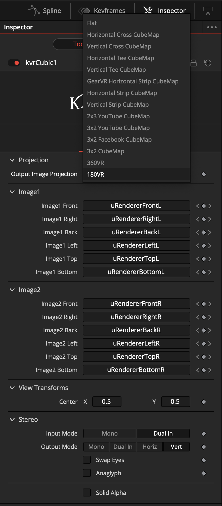
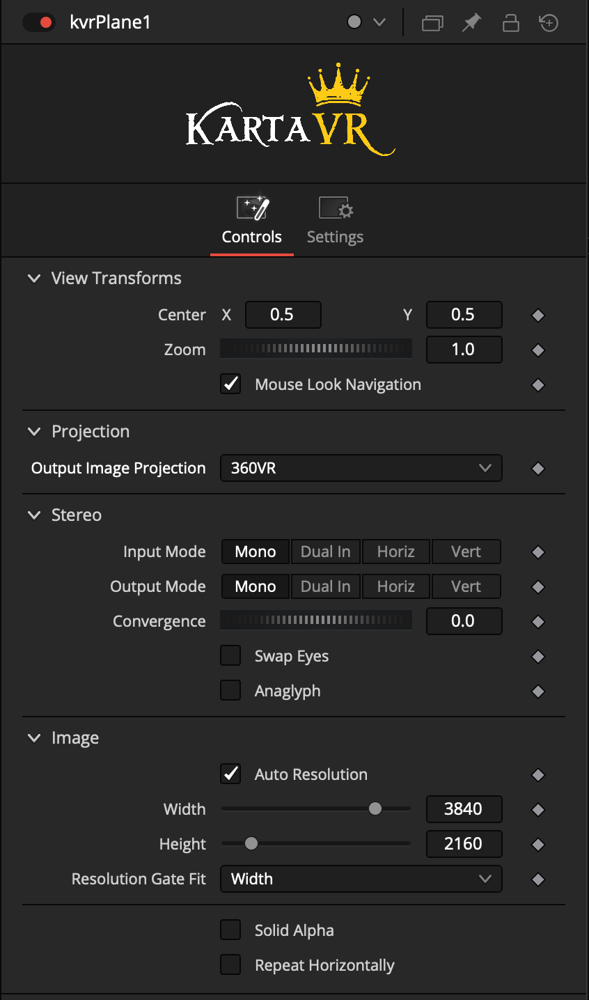
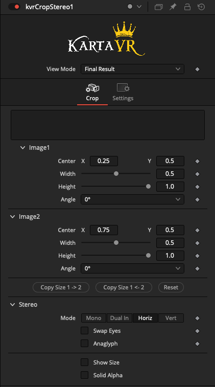
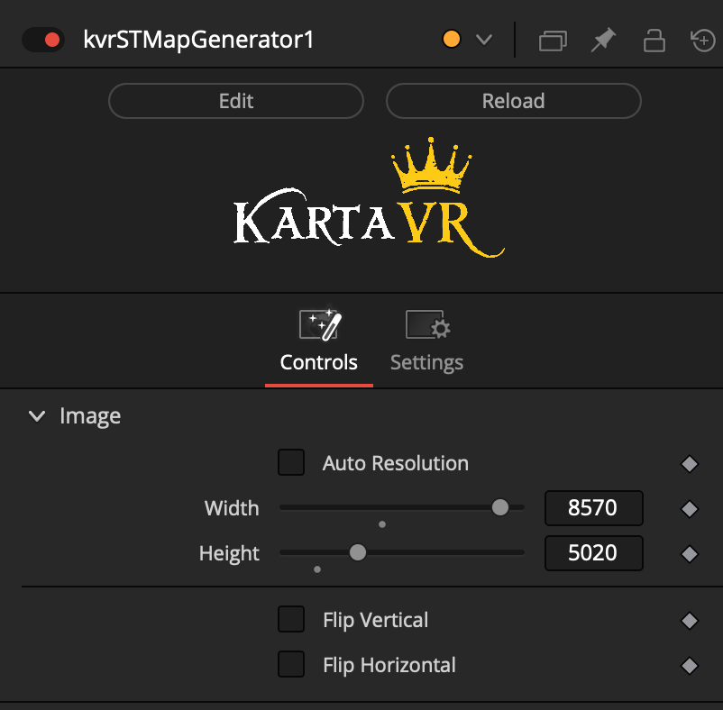
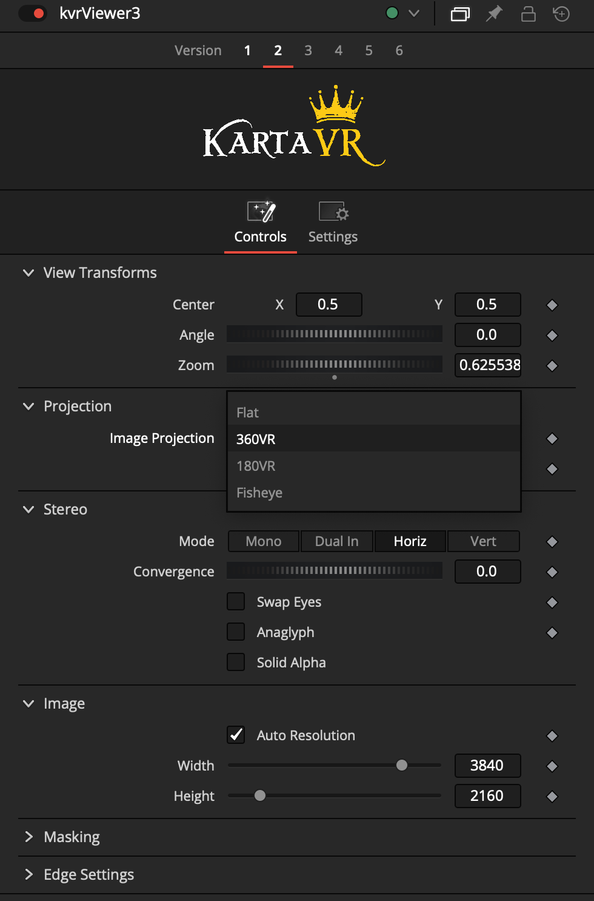

# Kartaverse Fuses

## kvrCreateStereo

The Kartaverse "kvrCreateStereo" fuse allows you to reformat stereo 3D imagery between mono, dual input, horizontal (SBS), and vertical (OU) frame layouts.

The kvrCreateStereo node works in Resolve (Free), Resolve Studio, and Fusion Studio. It is able to act as a direct replacement for the Resolve Studio requiring "Splitter" and "Combiner" stereo 3D nodes.

When converting between stereo 3d layouts, the term "Dual In" is used in the Inspector panel to represent the "Dual Input" connection mode where you have an Image1 and Image2 set of inputs that feed separate left and right eye view media into the kvrCreateStereo node.

It is helpful to get in the habit of adding an Autodomain node directly after a kvrCreateStereo node. This will optimize the Fusion DoD (Domain of Definition) active content frame sizing information which is useful for optimizing rendering efficiency.

## kvrCubic

The "kvrCubic" fuse allows you to combine individual face based 90° FOV cubic imagery into CubeMap, 180VR, and 360VR based frame layouts. It supports monoscopic and stereo 3D output.

Note: At the moment, the 180VR and 360VR options only work on macOS systems with a Metal based GPU. Support for CUDA and OpenCL GPUs is under development now.

## kvrPlane

The Kartaverse "kvrPlane" fuse allows you to place a flat image into a 180VR, or 360VR image projection. It supports monoscopic and stereo 3D output.

This node performs a "plane to sphere" style of conversion.

The node based layout is typically:

    Text+/Loader/MediaIn -> kvrPlane -> AutoDomain -> kvrViewer

There are onscreen control handles in the viewer window which make it quick to position content visually using a "Center" X/Y point control to apply yaw/pitch rotation to the imagery when it is projected into the spherical image projection.

If you are working with non 1:1 aspect ratio source imagery, the "Resolution Gate Fit" control allows you to fit the imagery using either a "Stretch", "Width", or "Height" option. This is great if you want to place a small logo or other custom graphic element and not have to worry about the source image's dimensions and aspect ratio.

Note: At the moment, the 180VR and 360VR options only work on macOS systems with a Metal based GPU. Support for CUDA and OpenCL GPUs is under development now.

## kvrCropStereo

The kvrCropStereo fuse allows you to re-crop stereo 3D footage with individual control over the left and right eye content.

This stereo 3D aware cropping process makes it easy to pre-process production footage before applying image projection conversions.

The fastest way to get the initial positioning updated for the kvrCropStereo crop regions is to choose the stereo 3D setting you want like mono, or stereo 3D horizontal/vertical. Then click the "Reset" button to auto-fit the left/right eye view crop regions to the image canvas dimensions.

If you want to get the initial sizing updated

## kvrLens

Apply lens distortion correction using brown-conrady, syntheyes, and panotools lens models.

Lens distortion correction can be used to correct for optical issues like barrel or pincushion effects:

## kvrLensStereo

Apply lens distortion correction to stereo 3D footage using Brown-Conrady, Syntheyes, and Panotools lens models.

## kvrSTMapGenerator

The "kvrSTMapGenerator" fuse allows you to generate an initial STMap template.

The "Auto Resolution" checkbox will use the connected source footage resolution for the width and height of the STmap gradient pattern. 

If you disable the "Auto Resolution" checkbox, you can manually define a resolution override to allow you to increase the STMap width and height to a different (usually larger) size than the source imagery. This is a useful control to have access to if you are going to apply a post-cropping effect to the STMap, further down in the comp, with a node like kvrCropStereo and want the final STmap frame size to be a certain size.

For more information about STMap warping workflows check out the document:
[Google Docs | KartaVR Workflows | Creating ST Maps](https://docs.google.com/document/d/1lQ-wc9ucLJqj-HL7iKMNWA71klV5O1fk2-JicRB6gDY/edit?usp=sharing)

An STMap gradient image is able to hold pre-computed warping data in an image's red and green channels. You need to save an STMap in a 16-bit or 32-bit per-channel image with lossless compression to avoid artifacts. ZIP or ZIPS (ZIP Scanline) is a good choice for an EXR image codec for storing STMaps.

Bonus DCTLs: Resolve Edit and Color page compatible DCTL files are included in the folder:

        Reactor:/Deploy/Bin/Kartaverse/LUT/

## kvrGrade

The kvrGrade fuse allows you to quickly color correct stereo 3D footage with individual control over the left and right eye content.

## kvrViewer

Preview fisheye, 180VR, 360VR, and flat media in 2D mono, or stereo 3D. The node can be used to reframe VR footage with onscreen controls.

You can also convert stereo 3D circular fisheye content into 360VR and 180VR output. This is great if you want a parametric way to process media from lenses like the Canon RF 5.2mm dual fisheye lens.

The kvrViewer node can display 360VR content where it acts like a panoramic media viewer. The onscreen control handles allow you to quickly navigate around in the scene and zoom in/out.

The kvrViewer node can be used to generate "Tiny Planet" views of a scene.

The kvrViewer node can display dual fisheye SBS content where it generates 180VR (180&deg;x180&deg;) stereo 3D output:

## kvrReframe360Ultra

The kvrReframe360Ultra node allows you to perform an "overcapture" effect that reframes immersive 360VR footage into "flat" media that can be played back on conventional displays. This node is also available as an Edit page Effects Template.

The kvrReframe360Ultra node can be used to generate "Tiny Planet" views of a scene.

## kvrWarpStitchUltra

The kvrWarpStitchUltra node is used to stitch circular fisheye images into a latlong image projection. The node has parametric controls for adjusting the FOV, pan/tilt/roll, frame cropping, integrated masking, and colour correction.

The example composite "Under The Bridge" shows how multi-view 360VR video stitching can be achieved with the help of the kvrWarpStitchUltra node:

# Macro

## kvrDualFisheye

The kvrDualFisheye macro allows you to stitch 360VR content from dual fisheye footage that was captured on front/back lens based cameras.

Internally the macro uses KartaVR fuses to power the stitching process.

### Effects Template Usage

In the Resolve Edit page, the "kvrDualFisheye" macro can then be dragged from the Effects Library "Effects > KartaVP > Warp" category onto a clip in the timeline. Select the clip and then open the Inspector view to adjust the parameters using the "Effects > Fusion > kvrDualFisheye" item.

In the inspector view, if you click the little magic wand icon next to the right of the heading "kvrDualFisheye" you can hop into the Fusion page to customize the macro node. Double clicking on the "kvrDualFisheye" node in the Fusion page allows you to expand the group to access the nodes that are stored inside the group object.

# VR Subtitles

## vTextFromSubtitles

Vonk Ultra includes a node that allows you to read timecode synced closed caption subtitle .srt data. The output is a text datatype that can be connected to the StyledText field on a Text+ node.

The Vonk Ultra example "Demo Subtitle.comp" shows the node graph layout required for loading subtitles into Fusion:

Typical Node Connections:

        vTextFromFile > vTextFromSubtitle > Text+

The vTextFromSubtitles node supports both "flat" and immersive 360VR text caption creation through the use of an image projection conversion node like Kartaverse's "kvrPlane" fuse.

