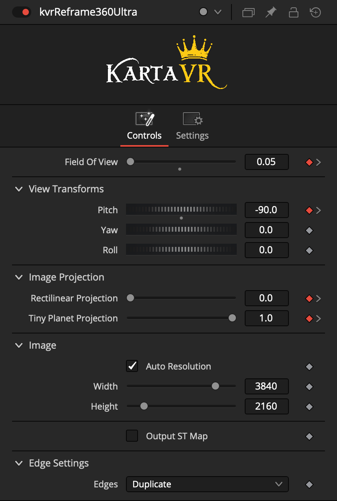

# Kartaverse Fuses

## kvrCropStereo
The kvrCropStereo fuse allows you to re-crop stereo 3D footage with individual control over the left and right eye content.

This makes it easy to pre-process production footage before applying image projection conversions.

## kvrLens
Apply lens distortion correction using brown-conrady, syntheyes, and panotools lens models.

## kvrLensStereo
Apply lens distortion correction to stereo 3D footage using Brown-Conrady, Syntheyes, and Panotools lens models.

## kvrGrade
The kvrGrade fuse allows you to quickly color correct stereo 3D footage with individual control over the left and right eye content.

## kvrViewer
Preview fisheye, 180VR, 360VR, and flat media in 2D mono, or stereo 3D. The node can be used to reframe VR footage with onscreen controls. 

You can also convert stereo 3D circular fisheye content into 360VR and 180VR output. This is great if you want a parametric way to process media from lenses like the Canon RF 5.2mm dual fisheye lens.

## kvrReframe360Ultra
Reframe immersive 360VR footage into "flat" media that can be played back on conventional displays.

## kvrWarpStichUltra

The kvrWarpStitchUltra node is used to stitch circular fisheye images into a latlong image projection. The node has parametric controls for adjusting the FOV, pan/tilt/roll, frame cropping, integrated masking, and colour correction.

# Macro

## kvrDualFisheye

The kvrDualFisheye macro allows you to stitch 360VR content from dual fisheye footage that was captured on front/back lens based cameras.

Internally the macro uses KartaVR fuses to power the stitching process.

### Effects Template Usage

In the Resolve Edit page, the "kvrDualFisheye" macro can then be dragged from the Effects Library "Effects > KartaVP > Warp" category onto a clip in the timeline. Select the clip and then open the Inspector view to adjust the parameters using the "Effects > Fusion > kvrDualFisheye" item.

In the inspector view, if you click the little magic wand icon next to the right of the heading "kvrDualFisheye" you can hop into the Fusion page to customize the macro node. Double clicking on the "kvrDualFisheye" node in the Fusion page allows you to expand the group to access the nodes that are stored inside the group object.

# VR Subtitles

## vTextFromSubtitles

Vonk Ultra includes a node that allows you to read timecode synced closed caption subtitle .srt data. The output is a text datatype that can be connected to the StyledText field on a Text+ node.

Typical Node Connections:
        vTextFromFile > vTextFromSubtitle > Text+

The vTextFromSubtitles node supports both "flat" and immersive 360VR text caption creation through the use of image projection conversion nodes.

