# Getting Started With Nodes in Fusion

If you are getting started with Fusion it can be a bit scary using nodes for the first time.

## Loading Imagery

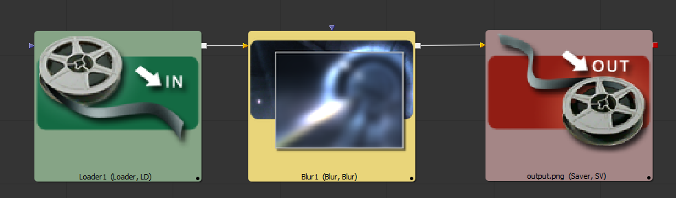

Imagery is imported into Fusion using a `Loader` node.

Imagery is exported from Fusion using `Saver` nodes. If your Fusion timeline is set to have a single frame range (the start frame and end frame values are the same) you will be rendering a still image with your Saver node. If your Fusion timeline has a start frame and end frame range with different values, you will be exporting an image sequence.

When you are rendering imagery with a `Saver` node, frame padding is defined in an image sequence filename by writing in digits like `0000` to to match the number of padded digits you want in the final image:

> C:\media\image_sequence.0000.exr

You can render an image to your operating system's temp folder using a Fusion feature called a "path map" which is a relative path that is used in place of the drive name:

> Temp:\image_sequence.0000.exr

There is a path map option "Comp:\" that can be used to load imagery relative to the location of the current Fusion .comp compositing file. This makes it easy to move .comp projects between systems.

> Comp:\image.0000.exr

## Making Node Connections

Nodes are connected in Fusion by dragging a line from the red "outputs" box shape on one node into the triangle shaped "inputs" on another node.

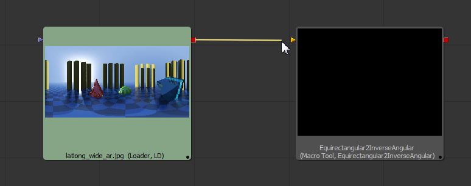

If you want to connect a macro with multiple output "red" boxes like the "VerticalCross2CubicFaces" macro to your node graph, it helps if you hover your cursor over the red box shape so a tool tip will pop-up with the name of the specific output.

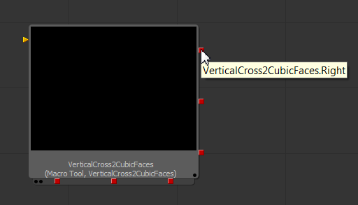

If you move your cursor over a specific view, you can press the F4 key on your keyboard to maximize the view fullscreen. This is useful when reviewing an image or when connecting a lot of nodes in the Flow view.

To view the current output of a node, you need to drag the node from the flow view to a viewer window. This will update the viewer window with that node's output.

If you drag a node with the shift key held down you can completely disconnect it from a node graph.

You can break the connection of a node by hovering over the starting part or ending part of a connection line. When the line end part turns light blue you can drag it away from the connection point and the node will be disconnected.

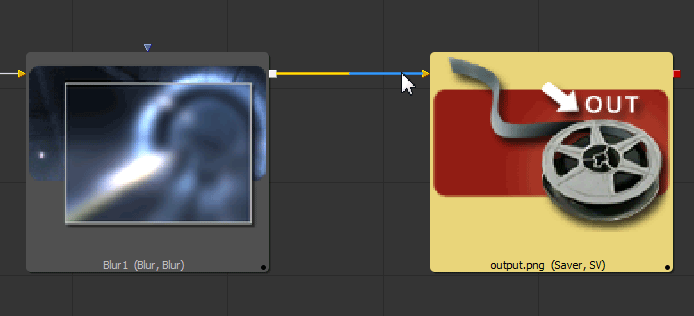

If you want to make a connection to a node that has multiple inputs, you can hold down the ALT/Option key on your keyboard as you drag a new connection line to the node shape. A handy popup will appear that lists each of the inputs by name.

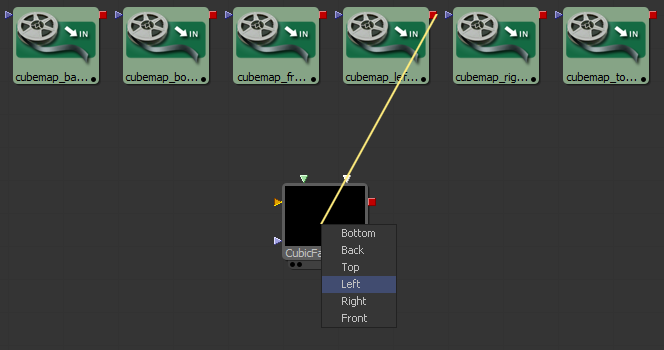

## The Fusion Viewer Window

You can toggle to a single viewer or a double viewer window layout using the following set of icons at the top of the screen :

In this toolbar, the first icon switches to a single viewer window, and the second icon shows two viewer windows.

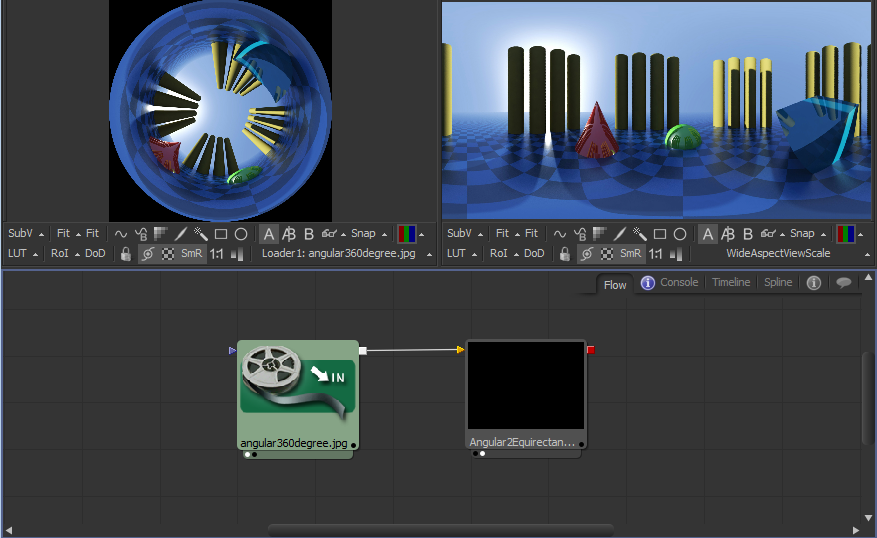

This is the typical viewer window layout in Fusion where there are two viewer windows available at the top of the Fusion UI.

When a node is selected in the "flow" area, you can load its imagery into a specific viewer window by  clicking with the left mouse button and dragging that node icon into the viewer window.

Another way to load a nodes imagery into a specific viewer is by pressing the "1" key for the left viewer window, or the "2" key for the right viewer window. To clear the imagery out of both viewer windows press the backquote "tilde" key that is located just below the escape key on most keyboards.

### Color and Viewer LUTs

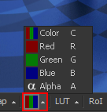

You can access individual color channels in the viewer window's toolbar with the color channel menu, or by pressing the clickig in the viewer window and pressint the hotkeys **C** (Shows the Color RGB Channels), **R** (Shows the Red Channel), **G** (Shows the Green Channel), **B** (Shows the Blue Channel), or **A** (Shows the Alpha Channel).

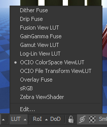

The LUT button allows you to change the viewer windows' preview LUT (Look Up Table) which means you can preview the effect of different color spaces on your imagery. This is useful for viewing RAW, sRGB, or Linear gamma based imagery. If your imagery looks washed out when loaded in Fusion it is typically due to a LUT setting mismatch.

If you have the KartaVR LUTs installed in Fusion 7.X or Fusion 8.2 Beta 2+ then you will see several additional items in the LUTs menu that allow you to view panoramic 360&deg; imagery right in the viewer window. You can [read more about these custom panoramic viewer LUTs here](luts).

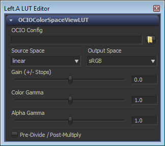

If you need to preview imagery in a color space other than the footage's native format, I recommend you try out the OpenColor IO based LUT menu option called **OCIO ColorSpace ViewLUT** as it is one of the easiest to use.

When the **OCIO ColorSpace LUT** is active, you can select the Edit... option in the LUT menu and change the OpenColor IO source space and output space to match your footage and monitor settings. This is handy for previewing LWF linear workflow based EXRs imagery in a monitor native sRGB format.

As a tip, you can type a Color Gamma value of 2.2 into the **OCIO ColorSpace LUT** window to perform a "live" on the fly linear workflow gamma 1.0 to sRGB gamma 2.2 conversion that will be displayed only in the Viewer window but the linear color values in the final rendered imagery with be unaffected.

### Viewer Zoom

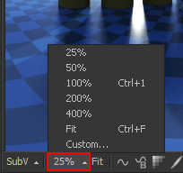

If an image is too large to easily be seen in the viewer window, you can press the "FIT" icon in the viewer window to scale the imagery to the size of the viewer window. The hotkey for fitting the image to the viewer window is Control + F.

You can adjust the image zoom level in the viewer window with the menu that is located to the left of the fit icon. To jump to the 100% zoom level you can use Control + 1 hotkey on your keyboard.

Holding down the control key and scrolling the mouse wheel also allows you to zoom in/out on the imagery in the viewer window.

If you press the F4 key on your keyboard you can maximize the specific viewer window full screen. You can press the F4 key again to switch back to the previous view layout. This F4 hotkey also works on the other Fusion view layouts like the Flow area too.

### Viewer Transparency

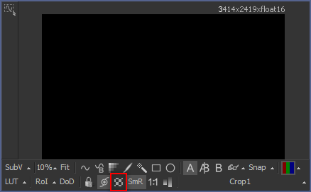

The viewer window's toolbar has an icon with a checker board pattern that is used to toggle on/off the transparent background checker pattern in the viewer. This will allow you to either have a black background shown behind your transparent alpha channel image areas or a dark grey checker pattern.

### Proxy Modes

There are two proxy mode buttons in the Fusion UI. The proxy buttons are labeled "Prx" and "APrx" and are located just below the timeline, to the right of the playback controls.

When you use the left mouse button to click on the "Prx" button you can toggle the proxy mode ON or OFF.

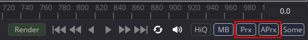

When the proxy mode is enabled, the viewer windows are rendered at a reduced resolution compared to your final output setting. This makes Fusion's viewer windows more responsive and interactive which is quite noticeable when you start to adjust nodes and update the node settings on footage over 2K in resolution.

Using proxies as you develop a new comp is a very effective way to improve the rendering speed in your Viewer windows which an essential workflow technique when working with high resolution media or on demanding composites that are slow to render.

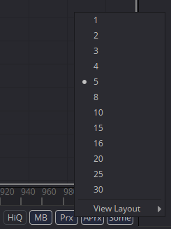

If you click on the "Prx" button with your right mouse button, a popup menu will appear that lets you adjust the level of the proxy resolution reduction that is used when the proxy mode is enabled.

Proxy level "1" will render the viewer window at full resolution. Setting the proxy level to a value higher than "1" will cause Fusion to reduce the quality of the image in the viewport by drastically reducing the render resolution which will massively increase the refresh rate that Fusion can update the imagery in the viewer windows.

The "APrx" button is the Auto Proxy mode and it is used to provide a way to have a "draft quality" like proxy mode enabled just as you are interactivity adjusting sliders and settings for a node so you have a realtime preview of the changes. When you stop adjusting the node settings, the auto proxy rendering state will deactivate and then your standard resolution / proxy settings will be used.

## Adding Nodes Quickly

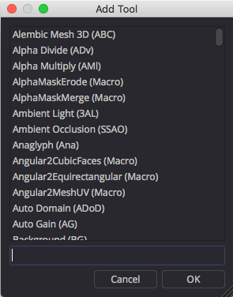

When you are working in Fusion's flow area, you can press the Shift+Space hotkeys to open up the Add Tool dialog. This window provides a quick way to add new tools and macros to your scene without having to navigate through the menu system to find the right item.

As you type in the name of the tool or macro you want to add, the list is updated with matching entries. You can type in partial names and the window will search for the closest item. In this example I typed in "Alpha" in the text field at the bottom of the dialog and only the nodes and macros with alpha in part of their name are listed.

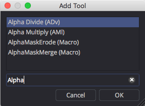

