# Publish Media to Google Cardboard VR View

## Overview

[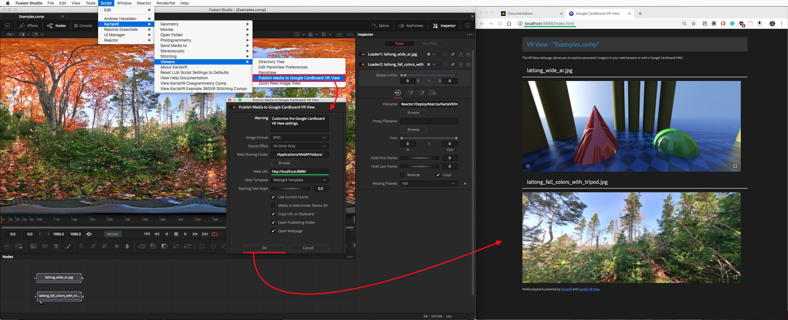](images/vrview-screenshot.jpg)

The "Publish Media to Google Cardboard VR View" script is a module from the [KartaVR](http://www.andrewhazelden.com/blog/downloads/kartavr/) that lets you customize the settings and generate a Google Cardboard VR View webpage that can be viewed locally or pushed via Apache web sharing and WiFi to a smartphone with a Google Cardboard HMD.

For more details on the Google VR View technology itself check out the [Google VR View Developers](https://developers.google.com/vr/concepts/vrview-web) page.

This script can be used with Windows, Mac, or Linux versions of Blackmagic Design's Fusion compositing system.

Recommended Apache Web sharing modules:

- [MAMP for macOS and Windows](https://www.mamp.info/en/downloads/)
- [Uniform Server for Windows](http://www.uniformserver.com/)
- [LAMP for Linux on Wikipedia](http://bit.ly/2dfYqd0)
- [Apache AMP on Wikipedia](https://en.wikipedia.org/wiki/List_of_Apache%E2%80%93MySQL%E2%80%93PHP_packages)

## Setting up the MAMP Web Sharing Settings

If you are using macOS or Windows the easiest Apache web sharing module to set up and install is [MAMP](https://www.mamp.info/en/downloads/). When using the VR View publishing features the free MAMP program is all you need and you can skip running MAMP Pro.

No discussion of web sharing programs would be complete without a brief suggestion that you talk with your system administrator about network security and firewalls before enabling an [Apache web sharing](http://httpd.apache.org/docs/2.4/) mode on your system. You may also want to research [Apache .htaccess files](https://httpd.apache.org/docs/2.2/howto/htaccess.html) to learn how to lock down the htdocs sharing folder to only allow access from users with a specific realm login account and password.

**Step 1.** Start by downloading and installing [MAMP](https://www.mamp.info/en/downloads/).

On Windows MAMP is installed on your hard disk at: `C:\MAMP\MAMP.exe`

On macOS MAMP is installed on your hard disk at: `/Applications/MAMP/MAMP.app`

When you are using MAMP with the "Publish Media to Google Cardboard VR View" script, the VR View webpage content is saved to the "htdocs" folder in the MAMP program directory. The Fusion script "[Open VR View Publishing Folder](scripts.html#open-vr-view-publishing-folder)" will open up the MAMP htdocs folder for you in an Explorer/Finder folder browsing window and make it easy to access this directory quickly in the future.

**Step 2.** Start MAMP for the first time. An easy to use GUI will appear.

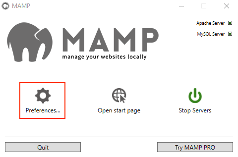

On the right side of the MAMP window is a button with a circular "power" icon that lets you Start and Stop the MAMP server. Click the **Start Servers** button if the MAMP server is not running yet.

On the left side of the MAMP window is a "Preferences" button that will open up the Apache server controls. Click the **Preferences** button.

**Step 3.** The Preferences window allows you to control the Apache server settings without having to manually edit any configuration files.

Enable the "Start Servers when starting MAMP" and "Stop Servers when quitting MAMP" checkboxes in the Start/Stop tab. Turning on these two controls means you can easily use MAMP when you want to view panoramic Google VR View content. Then when you have finished with that task you can quit the MAMP GUI, and MAMP will then immediately stop the Apache web sharing background system service.

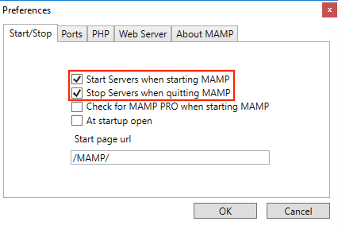

There are several other settings in the MAMP preferences window you could adjust if you wanted to.

**Step 4.** Click on the Ports tab in the MAMP preferences window. The Ports tab allows you to change the default server port settings for the Apache web sharing.

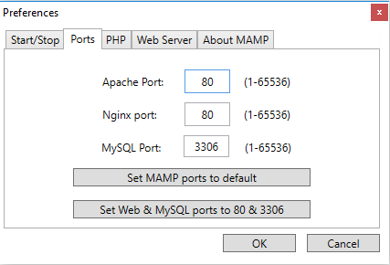

On Windows the Apache Port is set to 80 by default. This is the typical port used for all HTTP based web servers. The MAMP localhost address for your Windows system would be: **http://localhost/**

On macOS the Apache Port is set to 8888 by default to avoid conflicts with the macOS built-in web sharing modes. In your web browser a custom port is defined in the URL by typing a colon and then the port number like :8888 after the website server address. The MAMP localhost address for your macOS system would be: **http://localhost:8888/**

**Step 5.** Click on the Web Server tab in the MAMP preferences window. This tab allows you to change the "Document Root" folder that is shared by the Apache server module. By default this "Document Root" directory path is set to the "htdocs" directory in the MAMP program folder.

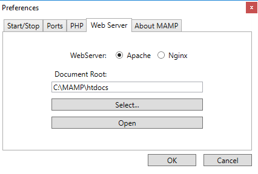

Unless you have a very specific technical reason to adjust the "Document Root" setting in MAMP it is a good idea to leave this text field at the default value in the MAMP preferences dialog.

## Setting up Apache httpd on Linux

If you are going to be using the "Publish Media to Google Cardboard VR View" script on Linux you will need to install the clipboard tool xclip, along with the Apache (httpd) server modules for web sharing:

	yum install xclip httpd
	
You can start Apache (httpd) using:

	systemctl start httpd.service
	systemctl enable httpd.service

On CentOS 7 if you want to make the Apache HTTP port 80 accessible external to the machine you can open that port up on the firewall rules:

	firewall-cmd --permanent --zone=public --add-service=http
	firewall-cmd --reload

On Linux the Apache Port is set to 80 by default. This is the typical port used for all HTTP based web servers. The httpd localhost address for your Linux system would be: **http://localhost/**

The Apache "Document Root" path is the `/var/www/html/`directory. This is where the Fusion VR View Publishing script will save the VR view webpage exports.

**Note:** You will have to make the /var/www/html/ folder writable for the users that are running the Fusion based VR View publishing script. You can either use **chmod** to change the folder permissions to do this, or you can use **chown** to add the user to a group with write permissions. The various Apache setup guides on the internet can provide details on this step.

## Finding Your IP Address

If you don't know the current IP address for your computer you can check in your operating system's "Network" control panel for more details.

## Mac Network Preferences

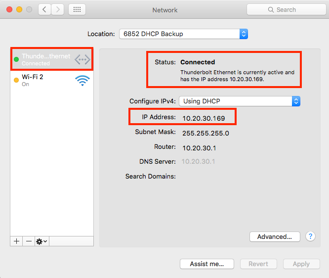

On macOS you need to click on the **System Preferences** icon in your Dock. Then open the **Network** control panel. On the left side of the Network control panel is a listing of each of the network adapters on your computer with entries for things like WiFi, and Ethernet devices.

Select the network adapter you are currently using to access the internet. This network connection will have a green circle icon next to it. With the network adapter selected, the main part of the control panel displays your local IP address next to the words "IP Address:".

You will also see information about this network adapter at the top of the network view next to the words **Status: Connected**   [Device] is currently active and has the IP Address of [address].

## Windows Network Control Panel

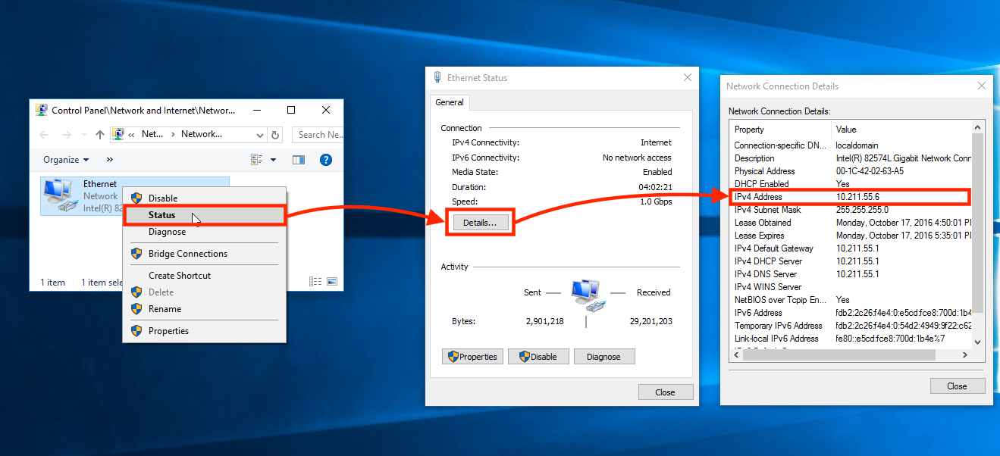

On Windows you need to open the **Control Panel > Network and Internet > Network Connections** window. Right click on your active network connection. Then select the "Status" item in the popup menu.

A status window will open. Click on the **Details...** button to find out more information about this network device. Then a "Network Connection Details" window will appear. Your current local IP address is listed next to the IPv4 Address line.

## Linux Network Settings

The easiest way to find out your IP address visually on Linux is to load the Network settings window.

Open the triangle shaped menu at the top right of the screen and select the **Settings** icon. This will load the "All Settings" window that is used to configure the Linux system.

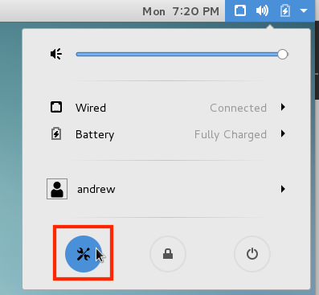

Look in the "All Settings" window for the Hardware section. Then click on the **Network** icon on the far right side of the window.

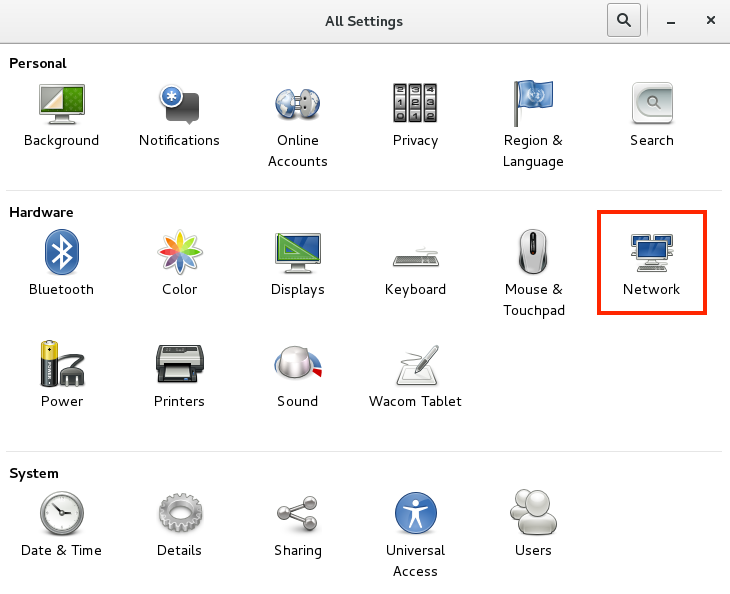

On the left side of the Network settings window is a listing of each of the network adapters on your computer with entries for things like WiFi, Bluetooth, and Wired Ethernet devices.

Select the network adapter you are currently using to access the internet.

This network connection will probably be called "Wired" on a Linux workstation. With the network adapter selected, the main part of the Network window displays your local IP address next to the words "IPv4 Address".

If you have multiple network adapters on your Linux system the active interface will have the word "Connected" displayed next to in the main part of the Network window to the left of the ON/OFF button.

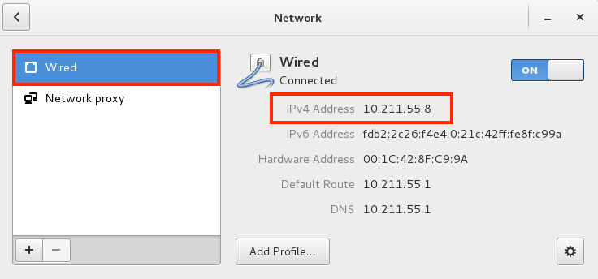

### Finding your External IP Address Using your Web Browser

A quick and easy way to find out your external ip address is to visit a website like [ipecho.net](http://ipecho.net) or [whatsmyip.org](http://www.whatsmyip.org/).

This external IP address is only reachable if your computer is directly connected to the internet and your IP address is not hidden by NAT (Network Address Translation) from your computer existing behind a router or hardware firewall.

If you are behind a router that has NAT enabled then you may have to set up a port forward to route port 80 from your cable modem/router and map it to your computer's manually configured local IP address. This is something that your system administrator or ISP (internet service provider) can assist you with.

### Finding your External IP Address on Mac and Linux

Your current external internet facing IP address can be also found out on Mac and Linux systems using this terminal command:

`curl ipecho.net/plain; echo`

### ifconfig on Mac and Linux

On Mac and Linux systems your local IP address can be found using the ifconfig program from the terminal:

`ifconfig`

You have to scroll through the output to look for an "en" network entry like `net 192.168.0.100 netmask 0xffffff00 broadcast 192.168.0.255`

### hostname on Linux

On CentOS 7 and Redhat 7 Linux systems your local IP address can often be found using the hostname program from the terminal:

`hostname -i`

### ipconfig on Windows

On Windows your local IP address can be found using the ipconfig program from the command prompt:

`ipconfig`

You have to scroll through the output to look for a network entry like: `IPv4 Address. . . . . . . . . . . : 192.168.0.100`

### get-wmiobject on Windows

On Windows you could also use the get-wmiobject program from the command prompt to look up the local IP address:

`powershell -Command "& {get-wmiobject -class Win32_NetworkAdapterConfiguration -Filter IPEnabled=true | select ipaddress}"`

This command will return the IP Address and network MAC address details in a long string of text like:

`{192.168.0.100, fe80::e5cd:fce8:700d:1b4e, fdb2:2c26:f4e4:0:54d2:4949:9f22:c62b, fdb2:2c26:f4e4:0:e5cd:fce8:700d:1b4e}`

The first `192.168.0.100` entry in this block of text is your computer's local network IP address.

## How to use the "Publish Media to Google Cardboard VR View" Script

The "Publish Media to Google Cardboard VR View" script for Fusion 7 and Fusion 8 supports sending loader and saver node media or a snapshot of any kind of node from the flow view to a custom Google VR View compatible webpage that can be viewed as a panorama in a desktop web browser or via WiFi on a smartphone with a Google Cardboard HMD.

**Step 1.** Install an HTTP based web sharing program like Apache, LAMP (LINUX), MAMP (Mac/Windows), or Uniform Server (Windows). You can still use the VR View feature without a webserver module if you set the "Web Sharing Folder" output to a folder with write permissions and then you view the index.html page in a web browser like Firefox.

**Step 2.** Start Fusion and open a new comp. Select a saver or loader node in the flow area. If you select a node other than a loader or saver node a left viewport window snapshot will be created automatically.

**Step 3.** Run the **Script > KartaVR > Viewers > Publish Media to Google Cardboard VR View** menu item. You can also run this script when the flow area is active with the "V" hotkey on your keyboard.

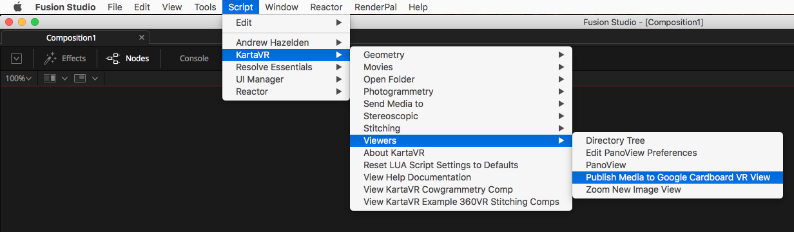

**Step 4.** In the "Publish Media to Google Cardboard VR View" dialog window you need to define the initial paths and settings for the script. Choose the "Web Sharing Folder", and enable the required checkbox if your panoramic images are Over/Under stereo 3D or not. Then click the "OK" button.

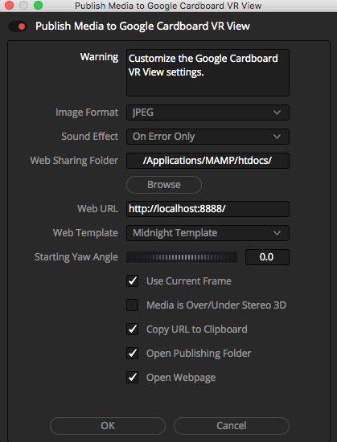

### Script GUI Controls

When the Publish Media to Google Cardboard VR View script is run you are presented with several settings that let you customize the generated VR View webpage.

#### Image Format

The "Image Format" control allows you to customize the snapshot image format used when a node other than a loader or saver is selected and a temporary image is saved to disk. This temporary image is saved using the left viewer window. You can choose one of the following options: "JPEG" or "PNG".

#### Sound Effect

The "Sound Effect" control allows you to choose if you want to have an audio alert played when an error occurs or when the script task completes. You can choose one of the following audio playback options: "None", "On Error Only", "Steam Train Whistle Sound", "Trumpet Sound", or "Braam Sound".

#### Web Template

The Web Template options menu provides the choice of three different web page themes named "Custom Template", "Charcoal Template", and "Midnight Template".

The **Custom Template** creates a VR View webpage with a white background color and a simple layout.

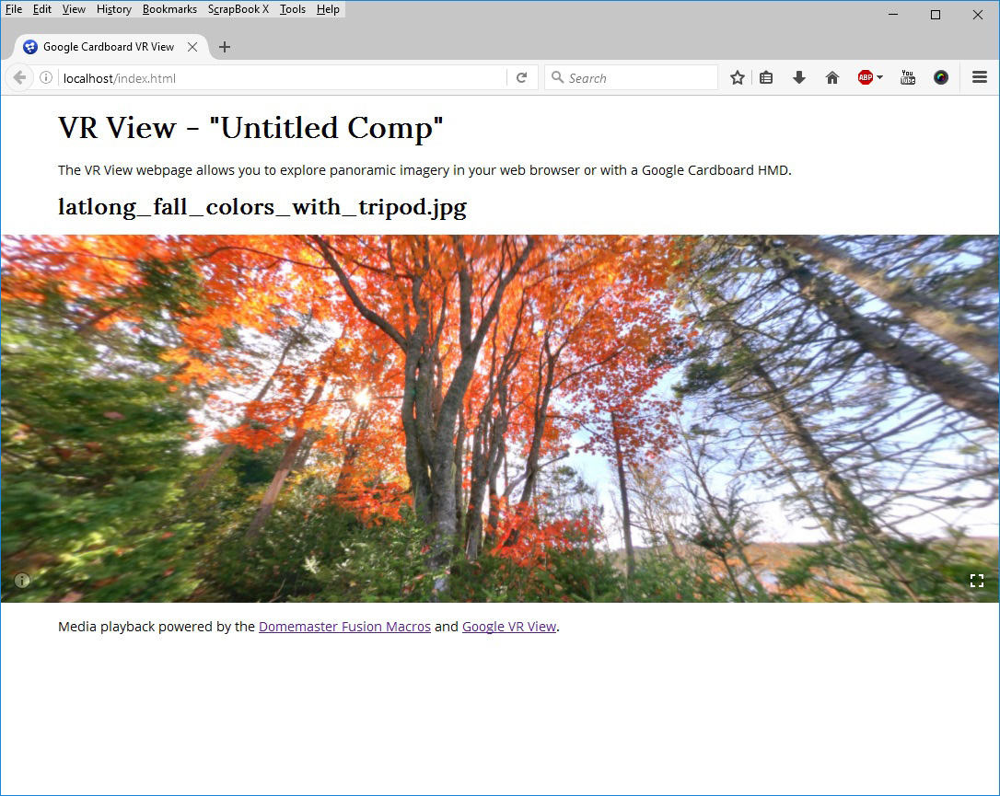

The **Charcoal Template** creates a VR View webpage with a dark grey background color.

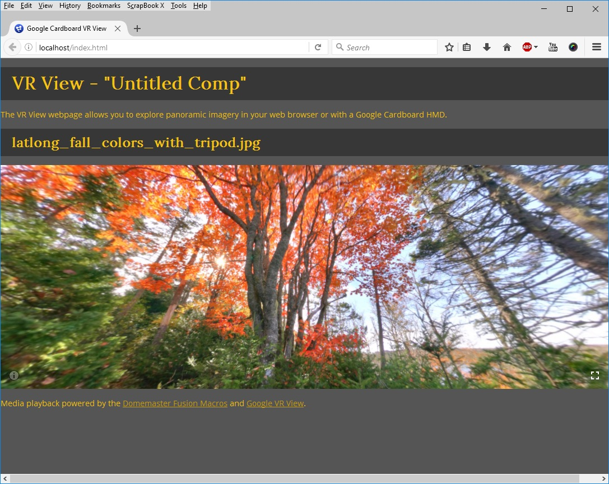

The **Midnight Template** creates a VR View webpage with an even darker background color.

The resources for the original VR View webpage assets and the HTML/CSS templates are stored in the folder:

**Windows:**

`C:\Program Files\KartaVR\vr_view\`

**Mac:**

`/Applications/KartaVR/vr_view/`

**Linux:**

`/opt/KartaVR/vr_view/`

The Custom Template is created using the HTML/CSS files `custom_template.html` and `custom_template.css`. When the script is run and the VR View webpage is generated the `custom_template.html` file is renamed to `index.html` and saved into your active "Web Sharing" folder path.

The Charcoal Template is created using the HTML/CSS files `charcoal_template.html` and `charcoal_template.css`. When the script is run and the VR View webpage is generated the `charcoal_template.html` file is renamed to `index.html` and saved into your active "Web Sharing" folder path.

The Midnight Template is created using the HTML/CSS files `midnight_template.html` and `midnight_template.css`. When the script is run and the VR View webpage is generated the `midnight_template.html` file is renamed to `index.html` and saved into your active "Web Sharing" folder path.

If you want to override the default panoramic image viewer dimensions in the VR View webpage this setting is controlled in the "Publish Media to Google Cardboard VR View.lua" script near the top of the document on the lines:

    vrviewWidth = '100%%'
    vrviewHeight = '300px'

**Note:** If you want to use a percent based size you need to use double `%%` characters to escape the `%` symbol in the variable.

You can change the opening paragraph for the VR View webpage by editing the "Publish Media to Google Cardboard VR View.lua" script near the top of the document on the `vrviewIntroParagraph` variable line.

#### Web Sharing

The "Web Sharing" text field and folder browsing button allows you to specify the location of your APACHE/WAMP/LAMP/MAMP webserver htdocs/www folder on your hard disk.

Linux Apache Sharing folder:
`/var/www/html/`

MAMP macOS Sharing Folder:
`/Applications/MAMP/htdocs/`

MAMP Windows Sharing Folder:
`C:\MAMP\htdocs\`

Uniform Server Windows Folder:
`C:\UniServerZ\www`

macOS Built-in Sharing Folder:
`/Library/WebServer/Documents/`

macOS Built-in User Account Sharing Folder:
`/Users/<Your Account Name>/Sites/`

##### Creating a Web Sharing SubFolder

If you would like to manage your VR View rendered content for a specific Fusion composite you can place the VR View webpage elements in a project specific subfolder in the web server sharing location.

The standard MAMP Windows Sharing Folder is:

`C:\MAMP\htdocs\`

If my Fusion compositing project was called "parachute" I could modify the Web Sharing folder location so the webpage is saved in a subfolder named "parachute" by changing the "Web Sharing" folder to:

`C:\MAMP\htdocs\parachute\`

Since the Web Sharing folder was modified to have the "parachute" project entry, the corresponding "Web URL" address would also need to have the same subfolder name like "parachute" added to the URL address as well like this:

`http://localhost/parachute/`

You can write in any custom address for the "Web Sharing" folder that is valid on your system and the script will save that setting in its preferences. You also have the option of writing in a network mounted hard disk location in the web sharing field as well. This would let you run the Apache web server on a different system than Fusion and the KartaVR are running on.

###### Working Locally in Firefox

If you are working on a VR project by yourself you can still use the VR View publishing feature with a program like Firefox by opening the .html files from your local hard disk without having to activate and use an HTTP based web server.

This would let you skip installing an Apache based web server module.

You can simply use this Web Sharing Folder location as the path where you want the webpage elements to be saved on your hard disk. You could make a custom folder on your Desktop or in your personal Documents folder and manually view the exported HTML webpages.

In this situation you would uncheck the "Open Webpage" option since you aren't working from an HTTP based URL address.

#### Web URL

The "Web URL" text field allows you to specify the current internet IP address or domain name address for your Apache web server. This is the HTTP or HTTPS based URL location where a web browser should look for the VR View webpage.

This "Web URL" is the HTTP address that a smartphone with a Google Cardboard HMD would connect to using WiFi.

The main purpose of the "Web URL" setting is to tell the "Open Webpage" checkbox were it can find the generated VR View webpage.

If you are using the MAMP webserver module then the default localhost Web URL for macOS is `http://localhost:8888/` and the localhost web URL for windows is `http://localhost/`.

This Web URL address can be set manually to your local WAN IP address (with a format like `192.168.1.100` or `10.20.30.100`) or if your firewall "port forwarding" rules and system admin allows it to use your external internet facing IP address or DNS (domain name) address.

If your computer has a dynamic DNS service like [dyn.com](http://dyn.com/dns/) active on it you could also write that address in the "Web URL" text field. This would make it easier to share the VR View webpage with a co-worker that is located outside of your local network.

#### Starting Yaw Angle

The "Starting Yaw Angle" control is a numeric input field that lets you specify the initial viewing angle of the panoramic image. The control range goes from -360 degrees to 360 degrees.

#### Use Current Frame

The "Use Current Frame" control allows you to choose how image sequences are loaded.

If the checkbox is enabled then the script will load the image sequence frame from the current timeline playhead position. If the checkbox is disabled the first frame from the image sequence will be loaded instead.

Sometimes you may have to manually disable the "Use Current Frame" checkbox when you are working with still images that have a number as the last element in the filename before the file extension like `domemaster180.jpg` or `domemaster220.jpg`. In these cases Fusion will sometimes confuse this as frame 180 and frame 220 from an image sequence.

#### Media is Over/Under Stereo 3D

When the "Media is Over/Under Stereo 3D" checkbox is enabled the VR View script will be set to load the video and images as stereo imagery. When the checkbox is disabled the media is loaded as 2D monoscopic imagery.

#### Copy URL to Clipboard

When the "Copy URL to Clipboard" checkbox is enabled the script will take the current settings from the Web URL text field and copy the website address into the operating system's clipboard.

This control makes it easy to be able to paste the current webpage link for the active VR View webpage into an email or instant messenger window so you can view the media on a smartphone with a Google Cardboard HMD.

#### Open Publishing Folder

When the "Open Publishing Folder" checkbox is enabled an Explorer/Finder/Nautilus file browser window will be opened up and the directory where the VR View webpage is saved will be displayed.

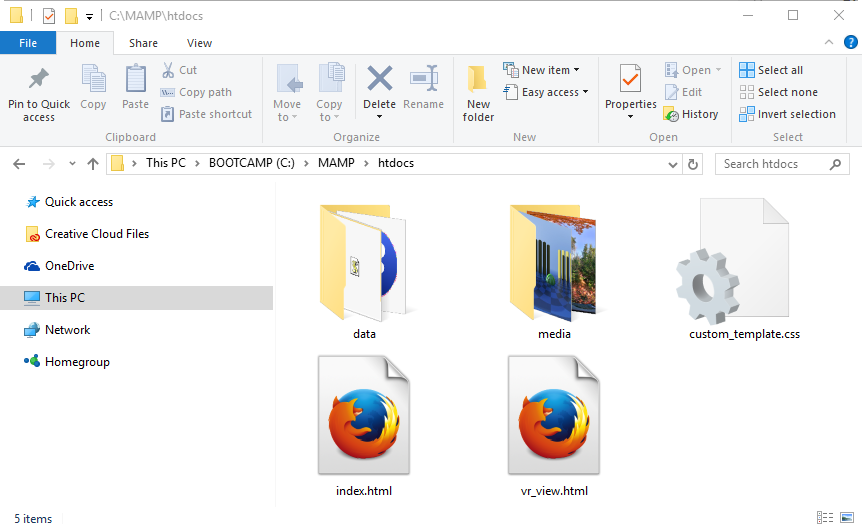

#### Open Webpage

When the "Open Webpage" checkbox is enabled your web browser will be opened up and the most recent VR View exported webpage will be displayed.

It is important to make sure you have a valid website address specified in the "Web URL" text field as this is the location that is loaded in your web browser when the "Open Webpage" control is used.

#### OK and Cancel Buttons

The "OK" button will save the revised preferences and generate the VR View webpage.

The "Cancel" button will close the script GUI and stop the script.
