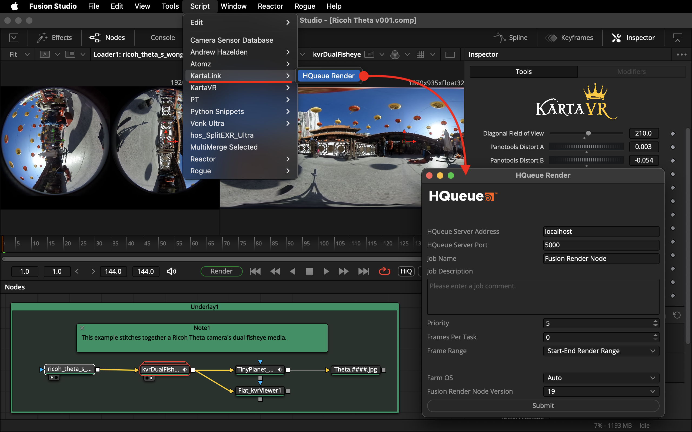
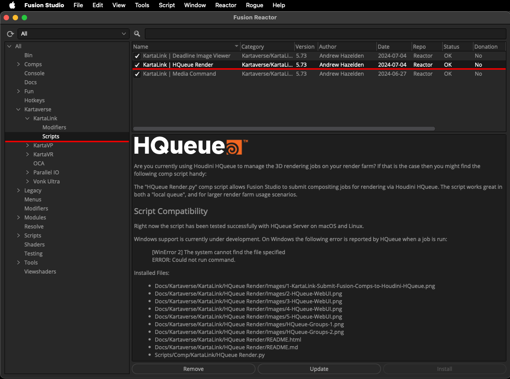
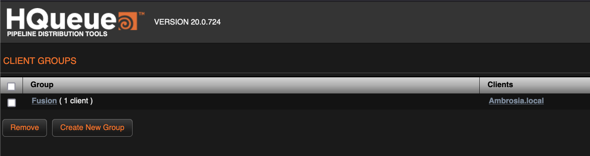
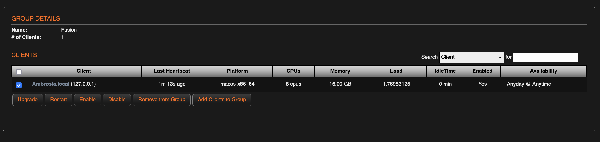
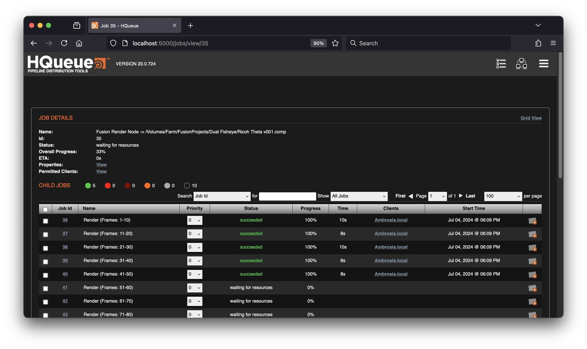
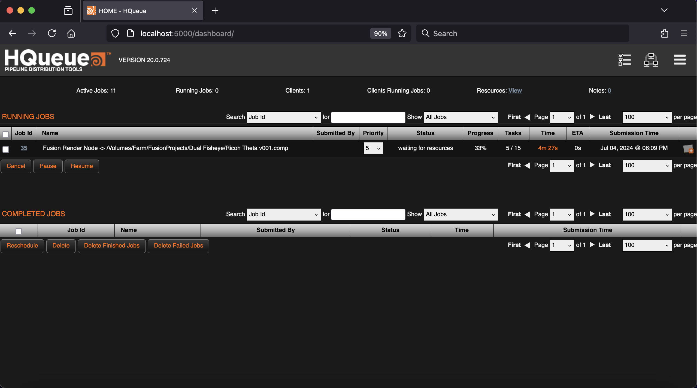
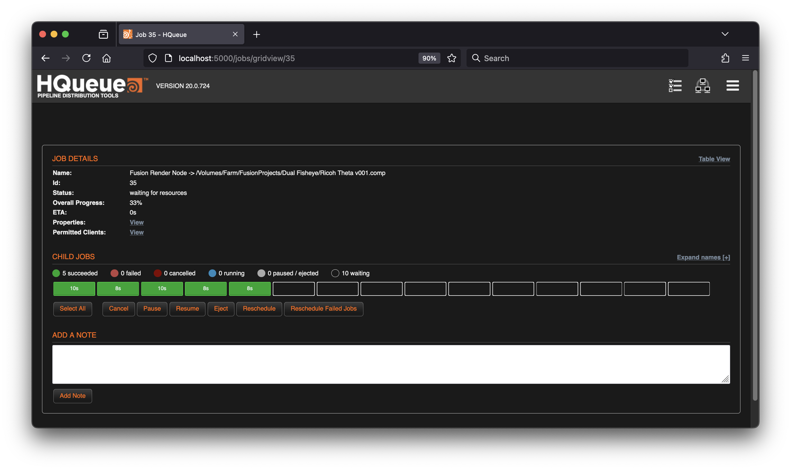
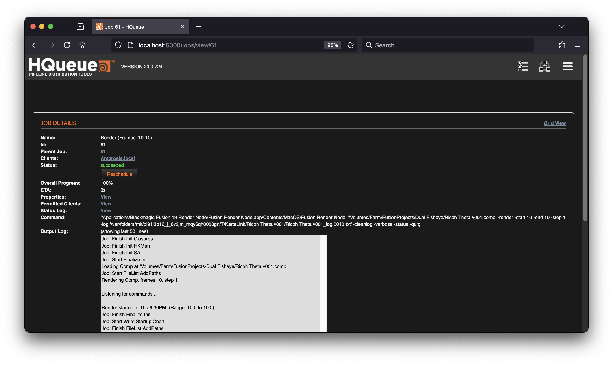
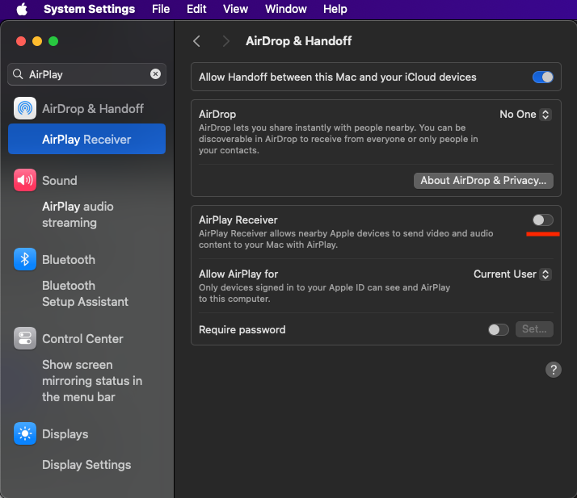

# KartaLink HQueue Render

## Overview

Are you currently using Houdini HQueue to manage the 3D rendering jobs on your render farm? If that is the case then you might find the following comp script handy:

The "HQueue Render.py" comp script allows Fusion Studio to submit compositing jobs for rendering via Houdini HQueue. The script works great in both a "local queue", and for larger render farm usage scenarios.

## Open Source Software License

- LGPL 3.0

## Known Issues

The script currently works with macOS and Linux based HQueue Client render nodes.

Windows support is currently under development. On Windows the following error is reported by HQueue when a job is run:

	[WinError 2] The system cannot find the file specified 
	ERROR: Could not run command.

## Installation

This toolset is available in the Reactor package manager under the category heading "Kartaverse/KartaLink/Scripts".

Note: If you haven't heard of the "HQueue" render farm management software before, it is the license-free render farm manager from SideFX Software.

## Usage

Step 1. Make sure you have defined the Reactor PathMap settings in your Fusion Render Node preferences. This will allow Reactor downloaded fuses and plugins to work correctly.

Step 2. Open the HQueue management webpage. (Typically this defaults to "http://localhost:5000"). Use the HQueue webUI to create an HQueue "Client Group" called "Fusion".

Step 3. Open a Fusion comp. Select the "Scripts > KartaLink > HQueue Render" menu item to submit a Fusion composite to your render farm.

Set the "Frames Per Task" value to define how large of a frame chunk you want each job task to use. A value of zero sets the job to render as a single job task.

## Houdini HQueue on macOS Sonoma Setup Tip

The recent Houdini 20.0.724 release (houdini-20.0.724-macosx_arm64_clang14.0_13.dmg) has several issues that impact the ease of running HQueue on macOS Sonoma systems.

Step 1. The first problem is the Launch Daemon file (/Library/LaunchDaemons/com.sidefx.hqclient.plist) points at a missing Python v3.9 library, while HQueueClient's Frameworks' folder now ships with Python v3.10. This requires an edit of the plist file in two places to correct the file paths to point at Py 3.10:

"`/Library/HQueueClient/Frameworks/Python.framework/Versions/3.10/bin/python3`"  
and  
"`DYLD_LIBRARY_PATH /Library/HQueueClient/Frameworks/Python.framework/Versions/3.10`"  

Step 2. The macOS Sonoma operating system now uses "AirDrop" on port 5000. This setting can be disabled by changing the "`System Settings… -> General -> AirDrop & Handoff -> AirPlay Receiver`" setting to OFF.

 This is relevant if you really want to keep HQueue running on the default port 5000 setting for Houdini cross-platform consistency.
The following macOS zsh terminal command checks for programs using an open network port (like port 5000):

"`lsof -i :5000`"

You will likely see an lsof output similar to the text below when running on a default install of macOS Sonoma:

	COMMAND   PID USER   FD   TYPE             DEVICE SIZE/OFF NODE NAME
	ControlCe 436  vfx   10u  IPv4 0xf34c3b387af78c55      0t0  TCP *:commplex-main (LISTEN)
	ControlCe 436  vfx   11u  IPv6 0x3aa6667abc89221b      0t0  TCP *:commplex-main (LISTEN)

In the Isof output, the text "ControlCe" indicates that the macOS AirDrop setting is active, which in turn means port 5000 is already in use. This is solved by disabling the AirPlay Receiver.