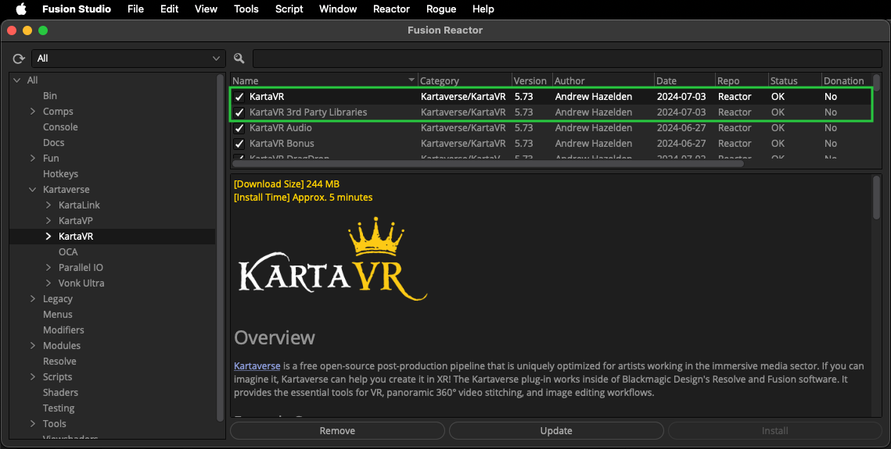
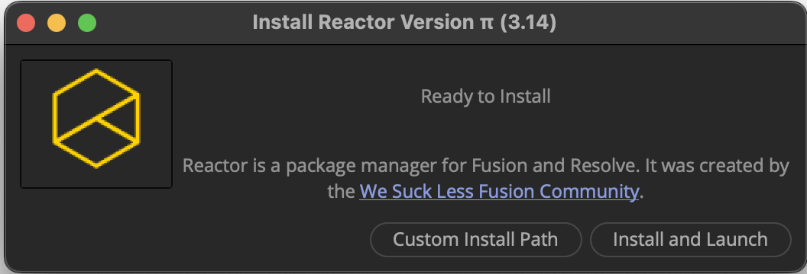

# Install

## Kartaverse Atom Packages

Kartaverse is a free open-source (GNU LGPL/GPL v3) toolset. It is distributed through the [Reactor Package Manager](https://gitlab.com/WeSuckLess/Reactor) for Resolve Studio/Fusion Studio. Install the Reactor package manager, and select the "Kartaverse" category on the left side of the Reactor GUI to access the tools.

Kartaverse/KartaVR can be used on personal and commercial projects at no cost. It can be installed, for free, on an unlimited number of computers and render nodes via the Reactor Package Manager. You can even install Reactor + Kartaverse on a shared NAS storage volume to be used across a local area network.

Kartaverse works with Fusion Studio v9-19+, Fusion Render Node v9-19+, DaVinci Resolve (Free) v15-19+, and DaVinci Resolve Studio v15-19+. It runs on Windows 10-11, macOS Monterey - Sonoma, and Linux 64-Bit RHEL 7+, CentOS 7+, and recent Ubuntu distributions.

## Reactor Package Manager

> To start using Kartaverse for BMD Resolve Studio/Fusion Studio you need to get the [Reactor Package Manager](https://gitlab.com/WeSuckLess/Reactor) setup on your system. 

For most users, it only takes a few minutes to get Reactor installed.

### What's a Package Manager?

Reactor is the package manager for BMD Resolve/Fusion. Reactor is maintained by a team of volunteers in the Fusion community. The package manager holds the macros, scripts, fuses, plugins, and example comps needed to take your compositing skills to the next level.

> Reactor content is sourced from the official [Reactor GitLab repository](https://gitlab.com/WeSuckLess/Reactor). This means you have to allow an outgoing firewall rule to the GitLab repository when you want to download new atom package updates. 

After you have Reactor installed, you might be interested to browse a web based version of the Reactor Package Manager content. This allows you to easily search through all the Reactor atom packages to find what you are looking for when you are on the go.

### Troubleshooting Reactor

If you have accented characters, or UTF8 characters in your user account name / home folder path you might have to select the Reactor Installer "Custom Install Path" option when installing the software. The folder you select is the base path where a new "Reactor" directory will be created.

If the "Custom Install Path" process still has issues, there is a zipped download of the Reactor package manager support files that can be manually installed. 

You can also use a Reactor toolset called "Atomz Create" & "Atomz Expand" to do a 100% offline airgapped install of zipped Reactor packages. This is popular for artists working in a corporate environment with NAS local storage pools.

### macOS Resolve/Resolve Studio Tip

> The macOS App Store version of Resolve/Resolve studio is sandboxed and lacks a lot of features you may require.

If you are on macOS it is a good idea to install a copy of Resolve Studio from the official [BMD website support centre](https://www.blackmagicdesign.com/support/family/davinci-resolve-and-fusion) website. This will make life easier for you if you want to install 3rd party tools.
