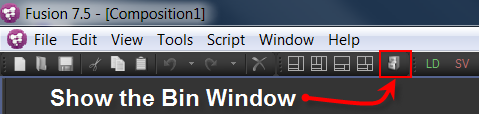

## KartaVR Fusion Bins Installation

### Standard Install

The KartaVR for Reactor atom packages dramatically simplify the process of setting up the panoramic 360&deg; compositing toolset in Fusion. You can now do the full installation process without leaving Fusion once.

### Windows 64-bit Install

#### Step 1.

**Step 1.**
Use Reactor to install the content found in the `KartaVR` category.

**Step 2.**
Open up the newly created KartaVR Macros, Scripts, Bin, and Docs folders to become accustomed to the new KartaVR toolset and what it offers:

		Reactor:/Deploy/Macros/KartaVR/
		Reactor:/Deploy/Scripts/Comp/KartaVR/
		Reactor:/Deploy/Scripts/Tools/KartaVR/
		Reactor:/Deploy/Bin/KartaVR/
		Reactor:/Deploy/Docs/KartaVR/

**Step 3.**

You need to add the KartaVR "Cygwin" bin folder to your Windows %PATH% environment variable. This is a required step if you want to use the KartaVR "Import PTGui Masks" lua script.

Editing the Windows OS `%PATH%` environment variable is done by opening your Windows **System** Control Panel. Click on the **Advanced system settings** button on the left side of the window.

The "System Properties" window will appear. Click on the **Environment Variables...** button.

In the "Environment Variable" window you need to scroll down in the "System variables" section of the view and select the **Path** entry. Click the **Edit...** button.

On Windows 10 a visual "Edit environment variable" editor window will appear. This UI  has separate path entry text fields that makes it easy to add/remove and re-order each of the environment %Path% variable items:

To add the new "cygwin" environment variable item to this window you have to copy/paste the following text into the bottom text field of the "Edit environment variable" list:

**Fusion on Windows Cygwin Path:**

`C:\ProgramData\Blackmagic Design\Fusion\Reactor\Deploy\Bin\cygwin\bin`

**Resolve on Windows Cygwin Path:**

`C:\ProgramData\Blackmagic Design\DaVinci Resolve\Fusion\Reactor\Deploy\Bin\cygwin\bin`

**Note:** On Windows 7 the "Edit environment variable" window looks a bit different as the dialog is basically a single super long text field where you have to manually add each PATH entry and use semi-colon `;` characters as separators between each of the folder paths.

**Step 4.**
Launch Fusion and open the Bins window.

**Step 5.**
Click on the `Library on localhost` tab on the left side of the Bins window. This is the root folder in the bin.

**Step 6.**
Right click in the folder view area on the right side of the Bins window. In the contextual menu select the `New Folder` option.

Let's name the new folder `KartaVR`. After you type in the new name, press the `Enter` key to accept the changes.

The Fusion Bins window now lists the `KartaVR` folder on the left side bar. Select this entry to show the folder contents.

Using the same folder creation approach we need to add sub-folders for each of the following entries: "Conversion", "Filter", "Mask", "Miscellaneous", "Renderer3D", "Stereoscopic", "Transform", "UV Pass", "Viewer". This is what the Bin folder will look like when when have successfully completed the task:

**Step 7.**
The next step will take a few minutes to carry out. You need to navigate into each of the sub-folders and repeat the process as you add the .settings files to each folder.

Click in the folder view. In the contextual menu, select the `Add Item...` menu option.

An `Open File` window will appear that allows you to select and add items to the current Fusion Bin.

Use the file path selector at the top of the window to navigate to the new "KartaVR" folder that was copied into the Fusion macros folder in step 2. If you want to get to this folder easily, try the PathMap section in the dialog and choose "`Reactor:`".

Fusion 9 Macros Directory:

`C:\ProgramData\Blackmagic Design\Fusion\Reactor\Deploy\Macros\KartaVR\`

Resolve Macros Directory:

`C:\ProgramData\Blackmagic Design\DaVinci Resolve\Fusion\Reactor\Deploy\Macros\KartaVR\`

(You can access this folder by expanding the Path Maps section in the file dialog and then selecting the **Reactor:** item.)

Open up the sub-folder in the file dialog with the matching name like "Conversion", "Filter", "Mask", "Miscellaneous", "Renderer3D", "Stereoscopic", "Transform", "UV Pass", and "Viewer".

To make it easier to select the correct files, click on the `Type` heading to sort all of the files by their file extension. Scroll down until you see the list of files that have a `.setting` extension. The `.setting` files are Fusion macros.

You can select the group of KartaVR macros by clicking on the first setting at the top of the view with a .setting file name extension like `Angular2Equirectangular.setting`. Then hold down the SHIFT key and select the last .setting file in the list. This will select the whole group of macros at the same time.

Clicking the `Open` button will add the macros to the Bin window.

After you have added each set of macros to the bin view it will be easier to access in the future.

The macros are now ready to be used in your Fusion composites. To use a macro, drag it from the  Bin window into your Flow view.

**Step 8.**
To make it easy to access the sample panoramic images that come with the KartaVR, you can add an "Images" sub-folder to the Bins window.

Select the `KartaVR` folder on the left side of the Bins window.

Right click in the folder view area on the right side of the Bins window. In the contextual menu select the `New Folder` option. Name this folder `Images` and double click on it to open it up.

Let's add the sample panoramic imagery to the images folder. Right click in the `Images` folder and select the `Add Item...` menu option.

In the `Open File` window, navigate to the folder path:

Fusion 9 Images Directory:

`C:\ProgramData\Blackmagic Design\Fusion\Reactor\Deploy\Macros\KartaVR\Images\`

Resolve Images Directory:

`C:\ProgramData\Blackmagic Design\DaVinci Resolve\Fusion\Reactor\Deploy\Macros\KartaVR\Images\`

(You can access this folder by expanding the Path Maps section in the file dialog and then selecting the **Reactor:** item.)

Uncheck the "Gather Sequences" checkbox in the open `Open File` window. This will allow the dialog to list the single frame duration images in the folder correctly.

Use the SHIFT key and select all of the images in the folder. Click the `Open` button to load the images into the new Bin.

You now have a collection of sample images that can be quickly dropped into an active Fusion composite document. This makes it a lot faster to build a simple comp with the sample images compared to manually adding a loader node for each image.

As a note, in Fusion you can only drop one image at a time from the Bin window into your comp. If you try to "group select" multiple images at once the loader nodes are overwritten in the Flow view.

**Step 9.**
To make it quicker to access the example Fusion composite files that come with the KartaVR, you can add a "Demos" sub-folder to the Bins window.

Select the `KartaVR` folder on the left side of the Bins window.

Right click in the folder view area on the right side of the Bins window. In the contextual menu select the `New Folder` option. Name this folder `Demos` and double click on it to open it up.

Let's add the sample panoramic imagery to the images folder. Right click in the `Examples` folder and select the `Add Item...` menu option.

In the `Open File` window, navigate to the `Reactor:/Comps/KartaVR/` PathMap folder:

Fusion 9 Examples Directory:

`C:\ProgramData\Blackmagic Design\Fusion\Reactor\Comps\KartaVR\`

Resolve Examples Directory:

`C:\ProgramData\Blackmagic Design\DaVinci Resolve\Fusion\Reactor\Deploy\Comps\Kartaverse\KartaVR\`

Use the SHIFT key and select all of the files in the folder. Click the `Open` button to load the example fusion composite files into the new Bin.

At this point we have finished setting up Fusion's Bin window.

**Step 10.**
The KartaVR includes a panoramic media playback script called PanoView that supports the Oculus Rift/HTC VIVE/OSVR HMD. You should run the **Script > KartaVR > Viewers > Edit PanoView Preferences** script menu item to configure your viewing tools [using the PanoView instructions here.](pano-view)

It is also a good idea to set up your **[Send Media to ](scripts#edit-send-media-to-preferences)** scripts using the **Script > KartaVR > Send Media to > Edit Send Media to Preferences** script menu item to finish configuring the rest of the pipeline scripts.

If you are using Fusion 9 you will likely want to use the built-in 360 viewer mode for displaying images live on an Oculus Rift CV1 and HTC VIVE HMD screen.

**Step 11. Hotkeys Customization**

There is a Fusion 9/Resolve 15 Hotkey file included with the KartaVR. [For more details check out the  Hotkeys documentation page here](hotkeys).

The `KartaVR Hotkeys.fu` file can be found in the `Reactor:/Deploy/Config/` folder.

If you want to use the StatixVFX provided "nuke2fusion" toolset from Reactor, then you will need to edit some of the hotkey bindings in `KartaVR Hotkeys.fu`.

**Step 12. Google VR View Web Sharing Option**

If you are going to be using the "Publish Media to Google Cardboard VR View" script you will need to install a web sharing program. On Windows and macOS the MAMP program is the easiest Apache server module to use. You can find out how to [set up the MAMP web sharing settings here](google-cardboard-vr-view#mamp-setup).

### macOS Install

**Prerequisites**

After installing KartaVR using Reactor, make sure to also install the "Bin/Imagemagick" Reactor package. Open up the zipped copy of ImageMagick and run the ImageMagick macOS installer pkg file which can be found at
"Reactor:/Deploy/Bin/imagemagick/ImageMagick-6.9.1-0.pkg.zip".

Alternatively you can use ImageMagick from one of these sources:

The Cactus Lab website has an ImageMagick for macOS build that works with macOS X 10.5 to 10.13. You want the first download item `ImageMagick 6.9.1-0 for Mac OS X 10.5 – 10.10` listed on the Cactus Lab webpage:

[http://cactuslab.com/imagemagick/](http://cactuslab.com/imagemagick/)

The ImageMagick Project also hosts a macOS build version of the library:

[http://www.imagemagick.org/script/binary-releases.php#macosx](http://www.imagemagick.org/script/binary-releases.php#macosx)

You can install ImageMagick using [homebrew](http://brew.sh):

    brew install ImageMagick

For the technically inclined macOS user you can install ImageMagick using Xcode and the [Mac Ports tool](https://www.macports.org/) with the terminal command:

    sudo ports install ImageMagick

**Step 1.**
Use Reactor to install the content found in the `KartaVR` category.

**Step 2.**
Open up the newly created KartaVR Macros, Scripts, Bin, and Docs folders to become accustomed to the new KartaVR toolset and what it offers:

		Reactor:/Deploy/Macros/KartaVR/
		Reactor:/Deploy/Scripts/Comp/KartaVR/
		Reactor:/Deploy/Scripts/Tools/KartaVR/
		Reactor:/Deploy/Bin/KartaVR/
		Reactor:/Deploy/Docs/KartaVR/

**Fusion on Mac Reactor Path:**

`/Library/Application Support/Blackmagic Design/Fusion/Reactor/`

**Resolve on Mac Reactor Path:**

`/Library/Application Support/Blackmagic Design/DaVinci Resolve/Fusion/Reactor/`

**Step 3.**
Launch Fusion and open the Bins window.

**Step 4.**
Click on the `Library on localhost` tab on the left side of the Bins window. This is the root folder in the bin.

**Step 5.**
Right click in the folder view area on the right side of the Bins window. In the contextual menu select the `New Folder` option.

Let's name the new folder `KartaVR`. After you type in the new name, press the `Enter` key to accept the changes.

The Fusion Bins window now lists the `KartaVR` folder on the left side bar. Select this entry to show the folder contents.

Using the same folder creation approach we need to add sub-folders for each of the following entries: "Conversion", "Filter", "Mask", "Miscellaneous", "Renderer3D", "Stereoscopic", "Transform", "UV Pass", "Viewer". This is what the Bin folder will look like when when have successfully completed the task:

**Step 6.**

The next step will take a few minutes to carry out. You need to navigate into each of the sub-folders and repeat the process as you add the .settings files to each folder.

Right click in the `KartaVR` folder view. In the contextual menu, select the `Add Item...` menu option.

An `Open File` window will appear that allows you to select and add items to the current Fusion Bin.

Use the file path selector at the top of the window to navigate to the new "KartaVR" folder that was copied into the Fusion macros folder in step 2. If you want to get to this folder easily, try the PathMap section in the dialog and choose "`Reactor:`".

Fusion 9 Macros Directory:

`/Library/Application Support/Blackmagic Design/Fusion/Reactor/Deploy/Macros/KartaVR/`

Resolve Macros Directory:

`/Library/Application Support/Blackmagic Design/DaVinci Resolve/Fusion/Reactor/Deploy/Macros/KartaVR/`

(You can access this folder by expanding the Path Maps section in the file dialog and then selecting the **Reactor:** item.)

Open up the sub-folder in the file dialog with the matching name like "Conversion", "Filter", "Mask", "Miscellaneous", "Renderer3D", "Stereoscopic", "Transform", "UV Pass", and "Viewer".

To make it easier to select the correct files, click on the `Kind` heading to sort all of the files by their file extension. Scroll down until you see the list of files that have a `.setting` extension. The `.setting` files are Fusion macros.

You can select the group of KartaVR macros by clicking on the first setting at the top of the view with a .setting file name extension like `Angular2Equirectangular.setting`. Then hold down the SHIFT key and select the last .setting file in the list. This will select the whole group of macros at the same time.

Clicking the `Open` button will add the macros to the Bin window.

After you have added each set of macros to the bin view it will be easier to access in the future.

The macros are now ready to be used in your Fusion composites. To use a macro, drag it from the  Bin window into your Flow view.

**Step 7.**

If you want to make it easy to access the sample panoramic images that come with the KartaVR, you can add an "Images" sub-folder to the Bins window.

Select the `KartaVR` folder on the left side of the Bins window.

Right click in the folder view area on the right side of the Bins window. In the contextual menu select the `New Folder` option. Name this folder `Images` and double click on it to open it up.

Let's add the sample panoramic imagery to the images folder. Right click in the `Images` folder and select the `Add Item...` menu option.

In the `Open File` window, navigate to the folder path:

Fusion 9 Macros Directory:

`/Library/Application Support/Blackmagic Design/Fusion/Reactor/Deploy/Macros/KartaVR/Images/`

Resolve 15 Macros Directory:

`/Library/Application Support/Blackmagic Design/DaVinci Resolve/Fusion/Reactor/Deploy/Macros/KartaVR/Images/`

(You can access this folder by expanding the Path Maps section in the file dialog and then selecting the **Reactor:** item.)

Uncheck the "Gather Sequences" checkbox in the open `Open File` window. This will allow the dialog to list the single frame duration images in the folder correctly.

Use the SHIFT key and select all of the images in the folder. Click the `Open` button to load the images into the new Bin.

You now have a collection of sample images that can be quickly dropped into an active Fusion composite document. This makes it a lot faster to build a simple comp with the sample images compared to manually adding a loader node for each image.

As a note, in Fusion you can only drop one image at a time from the Bin window into your comp. If you try to "group select" multiple images at once the loader nodes are overwritten in the Flow view.

**Step 8.**
To make it quicker to access the example Fusion composite files that come with the KartaVR, you can add a "Demos" sub-folder to the Bins window.

Select the `KartaVR` folder on the left side of the Bins window.

Right click in the folder view area on the right side of the Bins window. In the contextual menu select the `New Folder` option. Name this folder `Demos` and double click on it to open it up.

Let's add the sample panoramic imagery to the images folder. Right click in the `Demos` folder and select the `Add Item...` menu option.

In the `Open File` window, navigate to the folder path `Reactor:/Deploy/Comp/KartaVR/`:

Fusion 9 Comp Directory:

`/Library/Application Support/Blackmagic Design/Fusion/Reactor/Deploy/Comp/Kartaverse/KartaVR/`

Resolve Comp Directory:

`/Library/Application Support/Blackmagic Design/DaVinci Resolve/Fusion/Reactor/Deploy/Comp/Kartaverse/KartaVR/`

(You can access this folder by expanding the Path Maps section in the file dialog and then selecting the **Reactor:** item.)

Use the SHIFT key and select all of the files in the folder. Click the `Open` button to load the example fusion composite files into the new Bin.

At this point we have finished setting up Fusion's Bin window.

**Step 9.**
The KartaVR includes a panoramic media playback script called PanoView that supports the Oculus Rift/HTC VIVE/OSVR HMD. You should run the **Script > KartaVR > Viewers > Edit PanoView Preferences** script menu item to configure your viewing tools [using the PanoView instructions here.](pano-view)

It is also a good idea to set up your **[Send Media to ](scripts#edit-send-media-to-preferences)** scripts using the **Script > KartaVR > Send Media to > Edit Send Media to Preferences** script menu item to finish configuring the rest of the pipeline scripts.

If you are using Fusion 9 you will likely want to use the built-in 360 viewer mode for displaying images live on an Oculus Rift CV1 and HTC VIVE HMD screen.

**Step 10. Hotkeys Customization**

There is a Fusion 9/Resolve 15 Hotkey file included with the KartaVR. [For more details check out the  Hotkeys documentation page here](hotkeys).

The `KartaVR Hotkeys.fu` file can be found in the `Reactor:/Deploy/Config/` folder.

If you want to use the StatixVFX provided "nuke2fusion" toolset from Reactor, then you will need to edit some of the hotkey bindings in `KartaVR Hotkeys.fu`.

**Step 14. Google VR View Web Sharing Option**

If you are going to be using the "Publish Media to Google Cardboard VR View" script you will need to install a web sharing program. On Windows and macOS the MAMP program is the easiest Apache server module to use. You can find out how to [set up the MAMP web sharing settings here](google-cardboard-vr-view#mamp-setup).

### Linux Manual Install

**Prerequisites**

Install the Linux versions of the Imagemagick graphics library, and FFmpeg.

#### YUM Installations

Install the Imagemagick library using YUM:

	yum install ImageMagick

Install the FFmpeg library using YUM with a 3rd party repository:

	yum install ffmpeg

If you are going to be using the "Publish Media to Google Cardboard VR View" script you will need to install the clipboard tool xclip, along with the Apache (httpd) server modules for web sharing:

	yum install xclip httpd
	
You can start Apache (httpd) using:

	systemctl start httpd.service
	systemctl enable httpd.service

On CentOS 7 if you want to make the Apache HTTP port 80 accessible external to the machine you can open that port up on the firewall rules:

	firewall-cmd --permanent --zone=public --add-service=http
	firewall-cmd --reload

**Note:** You will have to make the /var/www/html/ folder writable for the users that are running the Fusion based VR View publishing script. You can either use **chmod** to change the folder permissions to do this, or you can use **chown** to add the user to a group with write permissions. The various Apache setup guides on the internet can provide details on this step.

**Note:** Redhat / Fedora / Centos Linux users will have to add a repository like **[nux-desktop](http://li.nux.ro/download/nux/dextop/el7/x86_64/)** for Hugin or **[RPM Fusion](http://rpmfusion.org/)** for ffmpeg if it isn't available in your standard yum distribution. On the RPM Fusion website you want the add the [RPM Fusion free](http://rpmfusion.org/Configuration) repository to yum.

#### APT-GET Installations

Install the Imagemagick library using apt-get:

	sudo apt-get -y install ImageMagick

Install the FFmpeg library using apt-get with a 3rd party repository:

	sudo add-apt-repository ppa:mc3man/trusty-media
	sudo apt-get update
	sudo apt-get dist-upgrade
	sudo apt-get -y install ffmpeg

If you are going to be using the "Publish Media to Google Cardboard VR View" script you will need to install the clipboard tool xclip, along with the Apache (apache2) server modules for web sharing:

	sudo apt-get -y install xclip apache2

Ubuntu / Debian Linux users can also use the pre-compiled [ffmpeg package from the ffmpeg website directly](https://www.ffmpeg.org/download#build-linux).

**Step 1.**
Use Reactor to install the content found in the `KartaVR` category.

**Step 2.**
Open up the newly created KartaVR Macros, Scripts, Bin, and Docs folders to become accustomed to the new KartaVR toolset and what it offers:

		Reactor:/Deploy/Macros/KartaVR/
		Reactor:/Deploy/Scripts/Comp/KartaVR/
		Reactor:/Deploy/Scripts/Tools/KartaVR/
		Reactor:/Deploy/Bin/KartaVR/
		Reactor:/Deploy/Docs/KartaVR/

**Step 3.**
Launch Fusion and open the Bins window.

**Step 4.**
Click on the `Library on localhost` tab on the left side of the Bins window. This is the root folder in the bin.

**Step 5.**
Right click in the folder view area on the right side of the Bins window. In the contextual menu select the `New Folder` option.

Let's name the new folder `KartaVR`. After you type in the new name, press the `Enter` key to accept the changes.

The Fusion Bins window now lists the `KartaVR` folder on the left side bar. Select this entry to show the folder contents.

Using the same folder creation approach we need to add sub-folders for each of the following entries: "Conversion", "Filter", "Mask", "Miscellaneous", "Renderer3D", "Stereoscopic", "Transform", "UV Pass", "Viewer". This is what the Bin folder will look like when when have successfully completed the task:

**Step 6.**

The next step will take a few minutes to carry out. You need to navigate into each of the sub-folders and repeat the process as you add the .settings files to each folder.

Right click in the `KartaVR` folder view. In the contextual menu, select the `Add Item...` menu option.

An `Open File` window will appear that allows you to select and add items to the current Fusion Bin.

Use the file path selector at the top of the window to navigate to the new "KartaVR" folder that was copied into the Fusion macros folder in step 2. If you want to get to this folder easily, try the PathMap section in the dialog and choose "`Reactor:`".

Fusion 9 Macros Directory:

`/var/BlackmagicDesign/Fusion/Reactor/Deploy/Macros/KartaVR/`

Resolve Macros Directory:

`/var/BlackmagicDesign/DaVinci Resolve/Fusion/Reactor/Deploy/Macros/KartaVR/`

(You can access this folder by expanding the Path Maps section in the file dialog and then selecting the **Reactor:** item.)

Open up the sub-folder in the file dialog with the matching name like "Conversion", "Filter", "Mask", "Miscellaneous", "Renderer3D", "Stereoscopic", "Transform", "UV Pass", and "Viewer".

To make it easier to select the correct files, click on the `Kind` heading to sort all of the files by their file extension. Scroll down until you see the list of files that have a `.setting` extension. The `.setting` files are Fusion macros.

You can select the group of KartaVR macros by clicking on the first setting at the top of the view with a .setting file name extension like `Angular2Equirectangular.setting`. Then hold down the SHIFT key and select the last .setting file in the list. This will select the whole group of macros at the same time.

Clicking the `Open` button will add the macros to the Bin window.

After you have added each set of macros to the bin view it will be easier to access in the future.

The macros are now ready to be used in your Fusion composites. To use a macro, drag it from the Bin window into your Flow view.

**Step 7.**

If you want to make it easy to access the sample panoramic images that come with the KartaVR, you can add an "Images" sub-folder to the Bins window.

Select the `KartaVR` folder on the left side of the Bins window.

Right click in the folder view area on the right side of the Bins window. In the contextual menu select the `New Folder` option. Name this folder `Images` and double click on it to open it up.

Let's add the sample panoramic imagery to the images folder. Right click in the `Images` folder and select the `Add Item...` menu option.

In the `Open File` window, navigate to the folder path:

Fusion 9 Images Directory:

`/var/BlackmagicDesign/Fusion/Reactor/Deploy/Macros/KartaVR/Images/`

Resolve 15 Images Directory:

`/var/BlackmagicDesign/DaVinci Resolve/Fusion/Reactor/Deploy/Macros/KartaVR/Images/`

Uncheck the "Gather Sequences" checkbox in the open `Open File` window. This will allow the dialog to list the single frame duration images in the folder correctly.

Use the SHIFT key and select all of the images in the folder. Click the `Open` button to load the images into the new Bin.

You now have a collection of sample images that can be quickly dropped into an active Fusion composite document. This makes it a lot faster to build a simple comp with the sample images compared to manually adding a loader node for each image.

As a note, in Fusion it looks like you can only drop one image at a time from the Bin window into your comp. If you try to "group select" multiple images at once the loader nodes are overwritten in the Flow view.

**Step 8.**
If you want to make it easy to access the example conversion and stereo demo comp files that come with the KartaVR, you can add a "Demos" sub-folder to the Bins window.

Select the `KartaVR` folder on the left side of the Bins window.

Right click in the folder view area on the right side of the Bins window. In the contextual menu select the `New Folder` option. Name this folder `Demos` and double click on it to open it up.

Let's add the sample panoramic imagery to the images folder. Right click in the `Demos` folder and select the `Add Item...` menu option.

In the `Open File` window, navigate to the folder path:

Fusion 9 Examples Directory:

`/var/BlackmagicDesign/Fusion/Reactor/Deploy/Comps/KartaVR/`

Resolve 15 Examples Directory:

`/var/BlackmagicDesign/DaVinci Resolve/Fusion/Reactor/Deploy/Comps/KartaVR/`

(You can access this folder by expanding the Path Maps section in the file dialog and then selecting the **Reactor:** item.)

Use the SHIFT key and select all of the files in the folder. Click the `Open` button to load the example fusion composite files into the new Bin.

At this point we have finished setting up Fusion's Bin window.

**Step 9.**
The KartaVR includes a panoramic media playback script called PanoView that supports the Oculus Rift/HTC VIVE/OSVR HMD. You should run the **Script > KartaVR > Viewers > Edit PanoView Preferences** script menu item to configure your viewing tools [using the PanoView instructions here.](pano-view)

It is also a good idea to set up your **[Send Media to ](scripts#edit-send-media-to-preferences)** scripts using the **Script > KartaVR > Send Media to > Edit Send Media to Preferences** script menu item to finish configuring the rest of the pipeline scripts.

If you are using Fusion 9 you will likely want to use the built-in 360 viewer mode for displaying images live on an Oculus Rift CV1 and HTC VIVE HMD screen.

**Step 10. Hotkeys Customization**

There is a Fusion 9/Resolve 15 Hotkey file included with the KartaVR. [For more details check out the  Hotkeys documentation page here](hotkeys).

The `KartaVR Hotkeys.fu` file can be found in the `Reactor:/Deploy/Config/` folder.

If you want to use the StatixVFX provided "nuke2fusion" toolset from Reactor, then you will need to edit some of the hotkey bindings in `KartaVR Hotkeys.fu`.

**Step 14. Google VR View Web Sharing Option**

If you are going to be using the "Publish Media to Google Cardboard VR View" script you will need to install a web sharing program like Apache (httpd). On Windows and macOS the MAMP program is the easiest Apache server module to use. You can find out how to [set up the MAMP web sharing settings here](google-cardboard-vr-view#mamp-setup).
