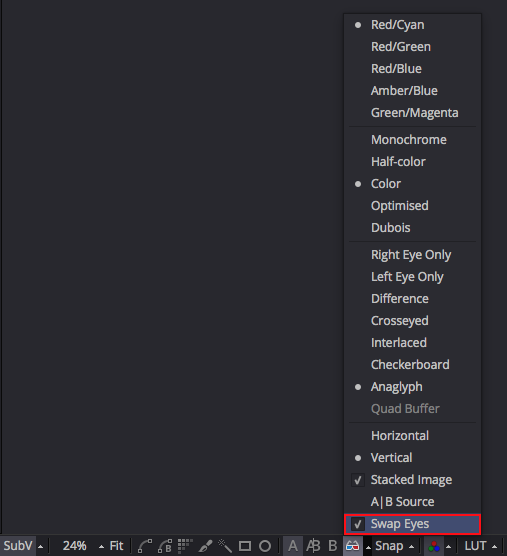

## Known Issues ##

### Fusion (Free) Limits Output Resolution ###

If you want to render 4K+ resolution footage you need to use Fusion Studio. The free version of Fusion limits the frame size on images rendered to disk by a saver node to a maximum of the Ultra HD resolution of 3840x2160 pixels.

### Send Media to After Effects and Image Sequences ###

At this point in time the "Send Media to After Effects" LUA script is only able to send still frames, and video files to After Effects. Image sequences are loaded into After Effects as a single still image with the frame number that is present in the loader/saver node's filename field.

### PanoView and Image Sequences ###

At this point in time the "PanoView' LUA script is only able to send still frames, and video files to the active 360&deg; media viewer tool. Image sequences are loaded into the viewer tool as a single still image with the frame number that is present in the loader/saver node's filename field.

### PTGui Project Filename ###

If you are using KartaVR's "Generate UV Pass in PTGui" script you need to pay attention to the PTGui .pts filename and avoid adding any extra period characters other than the period that is present in the final file extension.

Good Filename:

> mountain top panorama.pts

Bad Filename:

> mountain.top.panorama.pts

Bad Filename:

> mountain.00000 panorama.pts

### PTGui Bit-Depth ###

If you are using KartaVR's "Generate UV Pass in PTGui" script you need to pay attention to the bit depth of the imagery you have loaded in the PTGui project file when using the script. 

In order for the script to be able to correctly adjust all of the PTGui project settings using regular expressions, the source imagery that was used to create the PTGui project file should be in an 8 bit per channel image format like a PNG, TIFF, or JPG. 

This 8 bit per channel image input is a required step so the color adjustments and exposure optimization done in PTGui don't effect the final UV pass image outputs and cause any non-linearity or exposure adjustments in the rendered uv pass warping gradient images.

### Viewing Stereo Over/Under Images ###

If you are trying to view Stereo Over/Under images in Fusion Studio's native viewer window you will typically need to turn on the Fusion Viewer Windows' **Stereo** "Swap Eyes" control.

This step is required if you are reviewing Over/Under stereo footage where the left view is on the top of the frame layout, and the right view is on the bottom of the frame layout like YouTube 360 formatted movies use.

