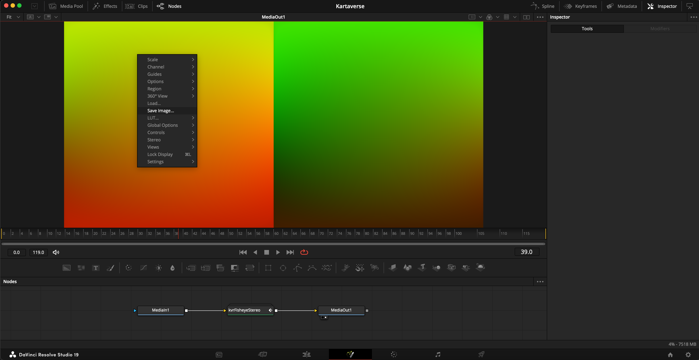

# kvrFisheyeStereo Effects Template

## Overview

The "kvrFisheyeStereo" Effects Template and example lens profile composites process footage from SBS 180VR cameras that use a dual circular fisheye lens layout. This includes Canon EOS VR gear.

## Open Source Software License

- LGPL 3.0

## Software Required

- Resolve Studio or Fusion Studio v17-19+ 
- Reactor Package Manager + Kartaverse
- Reactor Atom Packages Used:
	- STMapper
	- Vonk Ultra
	- KartaVR DragDrop
	- KartaVP
		- LensProfiles (for the kvrFisheyeStereo node)
		- kvrCreateStereo
		- kvrCropStereo
		- kvrGrade
		- kvrLens
		- kvrViewer

**Note: The kvrFisheyeStereo effects template makes use of the "Global Align" and "Anaglyph" nodes that are not available in Resolve Free.**

### Please Consider Installing Fusion Studio Standalone

**Pro Tip:** If you are working with a variety of 180VR cameras with different lenses, it can be a huge time saver to simply take the time and [install BMD Fusion Studio Standalone from the BMD Support Center ](https://www.blackmagicdesign.com/support/family/davinci-resolve-and-fusion) downloads page. If you already have Resolve Studio, your same license activation key/dongle also gives you Fusion Studio Standalone at no extra cost. 

IMHO, the way Fusion Studio manages media resolution in Loader and Saver nodes is a lot simpler, and more direct, when rapidly building STMap warping templates. Having acces to Fusion Studio Standalone will reduce a ton of headaches and save you time. Even if 100% of your VR workflows involves video editing in Resolve Studio, at the end of the day, I think you will be VERY happy you did this step!

### JSON Data Exchange

When you select the kvrFisheyeStereo node, you now have access to "Import JSON" and "Export JSON" buttons in the Inspector panel. These controls allow you to quickly and easily work with the JSON lens calibration data files.

To kick things off, there are initial Canon R5C, R7, R6 presets along with RED V-Raptor 8K presets. More presets will be added in time. The bundled "Lens Profile" example Fusion .comp files are updated as well.

### STMap Usage

The STMaps you create with the kvrFisheyeStereo node are designed to be used on the Resolve Edit page with the help of the kvrSuperSTMap effects template. You can also take the STMap warping template .exr image file and use it with real-time live-streaming programs like [Assimilate LiveFX](https://www.assimilateinc.com/products/livefx/), or [Derivative TouchDesigner](https://derivative.ca/download) if you want to have on-set previews during a 180VR film production. 

Note: If you are using Assimilate LiveFX, make sure to check out [Alex Pearce's STMap workflow tutorials](https://www.youtube.com/watch?v=InRCgvPvfA8&list=PLembEBBB8AcesyQ4bYsdsvOWhRyaVEluU) for on-set HMD review of dual fisheye filmed media.

### kvrFisheyeStereo View Mode Control

The "kvrFisheyeStereo" node has a "View Mode" control that allows you to inspect the internal processing stages used. If you want to export an STMap warping template set the "View Mode" control to "STMap". Then you can either use a Saver node set to export an .exr image to disk. 

Or you could right-click in the Viewer window, if you have the STMap displayed, and then choose the "Save Image..." option to write an .exr image to disk directly.

Otherwise, you will typically use a combination of the "RGB" output mode if you want to directly inspect the final RGB color version of the 180VR output, along with the "Global Align" mode to perform vertical and horizontal disparity corrections using the "GlobalAlign X Shift" and "GlobalAlign Y Shift" controls in the Inspector panel.

#### View Mode - Source Image

The two green rectangle boxes are the interactive cropping handles. When the "View Mode" is set to "Source Image", those rectangular boxes should align with the left and right eye "fisheye image" circles regions. The true meaning of the onscreen crop region shape is only valid when the first "View Mode" that is named "Source Image" is active.

#### View Mode - Grade

When you switch to the "Grade" View Mode, the left and right eye views are swapped to correct for the stereo 3D "eye ordering". This eye swap process is why the green rectangle boxes, that defined the cropping region in the "Source View" View Mode doesn't perfectly align now.

The Grade controls are helpful when creating an STMap output as it allows you to more precisely see your footage with a quick grade applied. This makes it easier to work with "flat" profile filmed media when doing lens calibrations.

The Grade task uses the following controls in the Inspector window:

There are two pairs of settings for each of the grade controls. This allows you to tune the left vs right eye grade individually. You can manually copy/paste the same value between the controls, such as "Exposure 1" and "Exposure 2", etc.

#### View Mode - Crop

The "Crop" View Mode shows the results of the cropping settings. The active image data should have the viewer window perfectly filled with the top/left/right/bottom of the "1:1 aspect ratio" fisheye circles landing at the frame border.

The Cropping task uses the following controls in the Inspector window:

The "Crop 1" controls are for the left image in the SBS stereo layout, and the "Crop 2" controls are for the right image in the SBS stereo layout.

#### View Mode - Lens Distort

The "Lens Distort" controls allow you to apply "Panotools" lens model based barrel/pincushion distortion correction to an SBS stereo 3D image.

The Lens Distort "Center X/Y" controls allow you to shift the optical center of the image when the distortion correction is computed. This is helpful if the lens is not mounted at the optical center of the frame.

Pro Tip: The Panotools A/B/C correction values are very subtle. When you have a new lens, you can compute the values for your lens once, using a panoramic stitching tool like Hugin or PTGui, and then re-use those parameters inside of Kartaverse's nodes.

#### View Mode - Global Align

The "Global Align" controls are used to adjust the Fusion native "Global Align" node that is packed inside of the kvrFisheyeStereo effects template. The X/Y Shift values are used to refine the horizontal and vertical stereo 3D convergence.

Note: Resolve Studio and Fusion Studio include the "Global Align" node. This is not something that is available in Resolve Free.

The X/Y Shift controls apply an X/Y based 2D transform to the individual SBS left and right eye views. This transform is applied in a balanced fashion to both eyes. In an ideal scenario, the kvrFisheyeStereo cropping stage will have gotten you fairly close to the correct convergence setting, as far as the vertical and horizontal disparity goes. The X/Y Shift is then used to refine this to a higher degree of precision.

Pro Tip: If you use the Kartaverse kvrSuperSTMap node to apply your STMap warping template to your Edit page based footage, that node also has an X/Y Shift control you can use. This is handy as it allows you to tune things on a per-clip fashion, later on, if you want to dynamically adjust the stereo convergence of a pre-rendered STMap.
This is relevant if editing a sequence, with quick cuts and camera motion, where you want the end viewer's eyes to not have to continuously re-adjust as they follow the primary area of interest.

#### View Mode - RGB

The "RGB" View Mode shows the result of the dual fisheye lens to 180VR image projection conversion.

The RGB task uses the following controls in the Inspector window:

**Anagylph:**  
Turning on the "Anagylph" checkbox in the Inspector window will apply a Red/Cyan based anaglyph stereo 3D preview mode. It is helpful when tuning the Global Align step, as well as for the RGB output tuning.

**Diagonal Field of View:**  
The "Diagonal Field of View" setting relates to the FOV value that your lens manufacture specifies in the documentation. A Canon RF 5.2mm dual fisheye lens has 190 degrees of FOV. The Canon 3.9mm APS format dual fisheye lens is 144 degrees.

The "Diagonal Field of View" control value assumes the crop region has been fit to match the fisheye circle border zone. 

Pro tip: If your final 180VR output has vertical details that are slanted/leaning heavily, such as buildings that aren't straight on the vertical axis, you likely need to refine the crop region slightly, and to experiment with adjusting the "Diagonal Field of View" control "to taste" as it will help solve the problem.

**Mask:**
The "Mask Diameter" and "Mask Softness" controls allow you to apply a vingetting masking effect to the final RGB output. This can allow you to focus the viewer's attention on an area of the frame without distractions like the opposite eye's lens being visible in the corner of the image.

#### View Mode - STMap

The "STMap" View Mode shows the generated STMap warping template output. If you click the magic wand icon in the Edit page "Inspector" panel, you can hop to the Fusion page and export the STMap image to disk.

This newly exported STMap warping template can then be used with your choice of the "kvrSuperSTMap", "STMapperInline", and "STMapper" tools.

**STMap Width and STMap Height:**
The kvrFisheyeStereo effects template has a pair of resolution controls that allow you to tune the STMap image output size. The "STMap Width" and "STMap Height" controls function by pre-scaling the input image framebuffer size that is then used by the internal STMap gradient generator. 

When you are customizing the STMap sizing values, it's a bit of a "twitchy" process that is more of an art than an exact science. The reason for this is that you are defining the input image dimensions that is then passed through the cropping, lens distortion, global align, and 180VR warping processes.

You can type an offset value into the number controls to bump the value up/down slightly to hone in on the final size you desire 

Example: If the number is at "4096" and you need the map to be slightly higher resolution, you can incrementally increase the value by entering "+ 100" into the field like "4096 + 100", then tying in the next value "NNN + 100", until you get closer to the final output frame size, then you would go "NNN + 10", and finally "NNN + 1". If you overshot you can then subtract by typing in "NNN - 10". (This was written where NNN is the current number in the input field.

On the Edit page, it is helpful to keep an eye on the final image dimension shown at the top right corner of the Fusion page viewer window.

## Usage

**Step 1.** Install Reactor and add the "kvrFisheyeStereo" package to your Resolve based system.

**Step 2.** Open a Resolve video editing timeline in the Edit page.

**Step 3.** Display the Effects Library tab, and switch to the "Toolbox > Effects > KartaVP > Warp" section. Drag the "kvrFisheyeStereo" entry onto a video clip in the timeline.

**Step 4.** Click on the video clip in the timeline and switch to the Inspector's Effects tab. Modify the "Effects > Fusion > kvrFisheyeStereo" settings if the default value doesn't give you the output you desire.

**Step 5.** 
If you modify the "kvrFisheyeStereo" Effects Template's "View Mode" control you can preview the different output modes. The viewer window in the Edit page should update to show the result. If the view doesn't update instantly, you can try bumping the timeline playhead position forwards/backwards by one frame to force a refresh of the view.

In the inspector view, if you click the little magic wand icon next to the right of the heading "kvrFisheyeStereo" you can hop into the Fusion page to customize the macro node.

If you display the kvrFisheyeStereo node in the Fusion Viewer window you will be able to see the effect's output. 

To save an STMap warping template image to disk, set the kvrFisheyeStereo node's "View Mode" control in the Inspector panel to "STMap".

Then right click on in the Fusion viewer window and select the "Save image..." contextual menu item. Give the new image a name and make sure to save it with the ".exr" image extension at the end of the filename.

### Lens Profiles Presets Folder

If you have the "KartaVR Scripts | Open Folder" Reactor atom package installed, as well, there is a handy "Script > KartaVR > Open Folder > Open Kartaverse Lens Profiles Folder" menu item in Fusion.

This menu entry makes it possible to quickly hop into the folder were all the .json files live so you can access your presets:

		Reactor:Deploy/Scripts/Support/Kartaverse/LensProfiles/

The kvrFisheyeStereo node is designed to process dual fisheye content into a 180VR SBS (180x180° cropped format). You can now start the lens calibration process from an initial .json preset file to streamline the tuning steps when you have a new camera body and lens.

When the kvrFisheyeStereo node is shown in the Inspector window, there are fields at the bottom of the view that list the "Camera", "Lens", as well as the "Lens Profile Version" number details. Use these attributes to label the camera body and dual fisheye lens that is in use. This step makes it easier to know what exact preset is loaded.

If you click the kvrFisheyeStereo node's "Export JSON" button, the camera and lens information is written out to the JSON lens profile document. If you want to bring in an external lens profile preset simply click the "Import JSON' button.

### About the Lens Profile Comps

The Kartaverse Lens Profile atom package ships with a collection of comps examples. They show the basics of how the kvrFisheyeStereo macro works as a 180VR dual fisheye stereo conversion toolset. Each of the provided Fusion .comp files are tuned for a specific camera body like the RED V-Raptor 8K, Canon R5C, R7, and R6.

The lens profiles example comps are located on disk at the following Pathmap location:

		Reactor:/Deploy/Comps/Kartaverse/KartaVP/Lens Profiles/

Note: If you change the sensor resolution on a camera body, this will typically modify the captured dual fisheye media's aspect ratio, and frame cropping. This sensor resolution adjustment typically requires the STMap to be regenerated so it matches the current dual fisheye lens stereo frame layout.

When the example comp files are opened up in Fusion Studio Standalone or the Resolve Studio Fusion page it looks like this:

The comp has Saver nodes that export the new STMap template, a Apple Vision Pro HMD formatted "spatial video" SBS image at 16:9 aspect ratio, and a 180VR formatted RGB output that is processed using the STMapper fuse.

#### Internal Macro Logic

This is what the internal node connections look like inside the expanded macro group:

This example processes Canon EOS 180VR footage filmed with a Canon R5C camera body and a Canon RF 5.2mm Dual Stereo Fisheye 190° Lens. An ST Map warping template was generated using a kvrSTMapGenerator node to create the source ST Map default red/green gradient pattern.

The kvrCropStereo node is used to swap the position of the left and right eye fisheye images, and re-crop the images to center them.

The kvrLensStereo node is set to use the Panotools lens distortion model. You can use this node to correct circular fisheye lens based f-theta distortion.

The GlobalAlign node is used to adjust for vertical and horizontal disparity. The transform is done using the "split" mode so a balanced adjustment is applied to the left and right eye views.

The kvrViewer node set to use the Fisheye image projection converts the circular fisheye imagery into 180VR stereo 3D 180x180° LatLong output.

The STMapper node allows us to preview the STMap effect in the comp to validate the output.

Fusion's right-click in the node view > Copy/Paste Instance contextual menu items were used to duplicate the warping nodes and create a instanced version of the nodes that automatically mirror those settings. This allowed us to swap out the RGB imagery and run an ST map warping template through in their place. Instanced node connections are visible in the node graph when you see a green connection line between two similar nodes. Individual controls on an instanced node can be made unique  aka "de-instanced" by right-clicking on an attribute in the Inspector panel and selecting "Deinstance".

When you go to render out the STMap template image, make sure to set the timeline duration of the Fusion comp to 1 frame so you don't end up rendering a longer sequence of STMap files to disk.

For more information about ST Maps check out the article:  
[Google Docs | KartaVR Workflows | Creating ST Maps](https://docs.google.com/document/d/1lQ-wc9ucLJqj-HL7iKMNWA71klV5O1fk2-JicRB6gDY/edit?usp=sharing)
