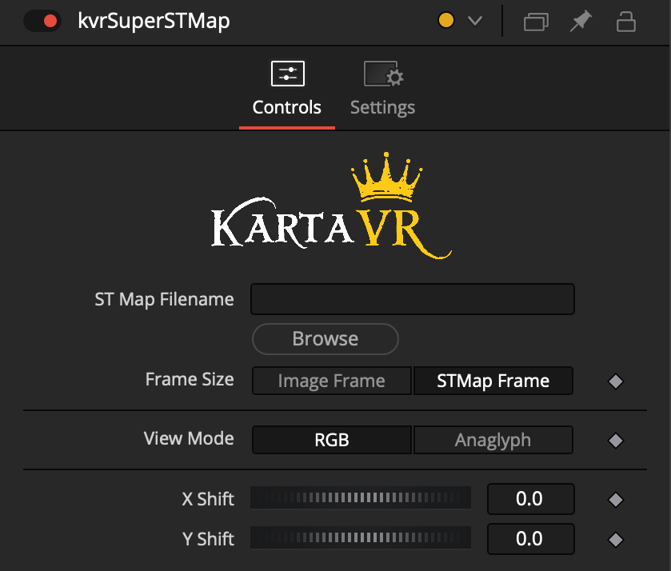
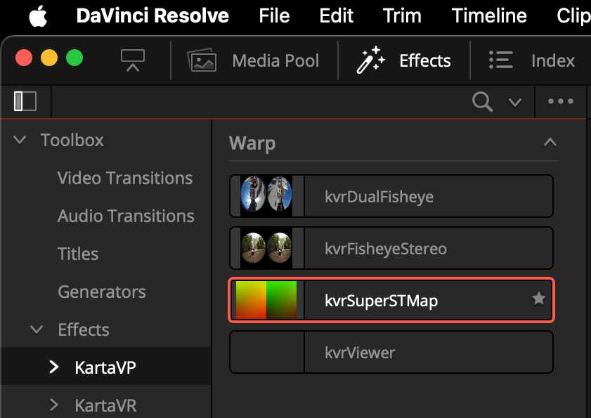
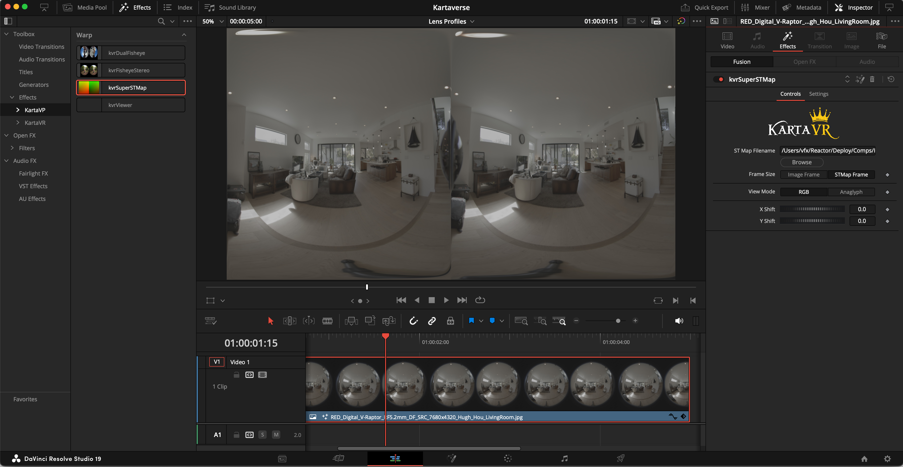
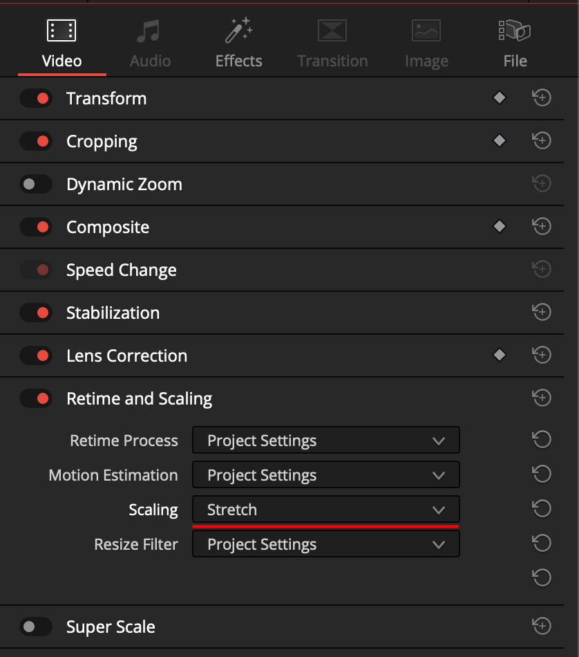
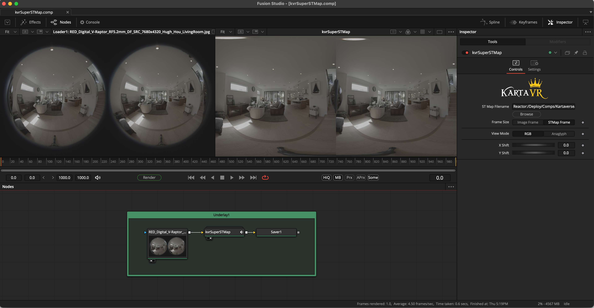
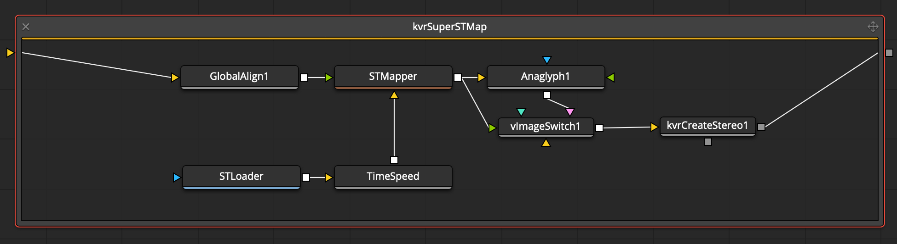

# kvrSuperSTMap Effects Template

## Overview

The "kvrSuperSTMap" Effects Template is the next-generation update for the STMapperInline Effects Template in Resolve/Fusion.

## Open Source Software License

- LGPL 3.0

## Software Required

- Resolve Studio or Fusion Studio v17-19+ 
- Reactor Package Manager + Kartaverse
- Reactor Atom Packages Used:
	- STMapper
	- KartaVR LensProfiles

## Usage

The "kvrSuperSTMap" Effects Template can be used on a Resolve Edit page timeline to transform VR imagery between different image projections with the addition of an STMap warping template image.

Add the "kvrSuperSTMap" effects template to the Edit page timeline clip. In the Inspector page, you can then link in STMap warping template in. The stereo convergence properties can be refined with the X/Y Shift controls.

Make sure to fit the media to the Timeline to corect for aspect ratio differences:

The "kvrSuperSTMap" macro node is also available in the Fusion page, too.

## Node Logic

If you double-click on the kvrSuperSTMap node in the Fusion page nodes view you can see the internal wiring logic of the node.

