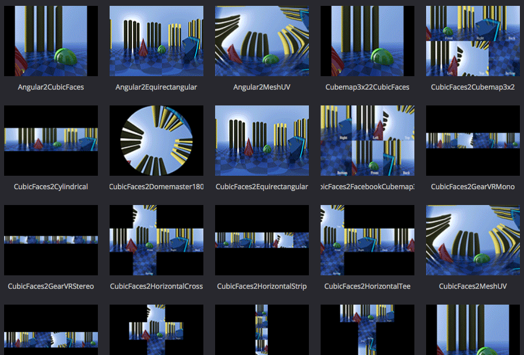

# KartaVR Legacy Content

> The following KartaVR content was designed back in 2014-2017 for the Fusion (Free) v7.7, v8.2.1, and 9.0.2 era of fulldome and 360VR post-production. If you are wondering what you should use on a new project started today, skip the legacy macros, and just go with the Kartaverse fuse nodes!

> Some of this material might have relevancy for learning more about node based compositing workflows. However in Resolve/Fusion v19+ many of the techniques have been replaced by newer and faster to render Kartaverse DCTL Fuses.

-------------------------

- [What's New](new)
- [Legacy Macros](macros-guide)
- [Legacy Compositing Examples](examples)
- Supplementary Content
	- [Legacy Bins](bins)
	- [Getting Started With Nodes in Fusion](getting-started)
	- [Sample Imagery](sample-imagery)
	- [Gallery](gallery)
	- [Tips & Tricks](tips)
	- [Known Issues](known-issues)
	- [Fusion Hotkeys](hotkeys)
	- [Fusion Bins](install#install)
	- [Fusion Macro LUTs](luts)
	- [Source Compositions](source-comp)
	- [Publish Media to Google Cardboard VR View](google-cardboard-vr-view)

