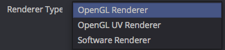

# LUTs for KartaVR

----

This document is a summary of the Macro LUTs included with the KartaVR toolset. A LUT is a custom viewer module that can be activated in the left and right Fusion image viewer windows. As you load and view media in the Fusion viewer windows the LUT will be applied interactively to the images as you scrub the timeline, apply effects, or change node parameters.

Once the KartaVR LUTs have been installed on your system as part of the regular KartaVR installation processyou can access them using Fusion's viewer window **LUT** popup menu items.

The LUT popup menu's "Edit..." control will open a LUT settings window that lets you modify attributes such as the field of view in the panoramic media LUT viewers, or the XYZ rotation controls. You may have to toggle the LUT on/off to see the changes of editing the LUT preferences like the rotation controls as the media in the viewer window can be cached into RAM memory.

Macro LUTs only work with Fusion 7.x and the Fusion 8.2 Beta 2+ releases. If you are running Fusion 8.0-8.1.1 you will not see the Macro LUT files in the LUTs menu.

For more information on Macro LUTs and how use them check out the Fusion help documentation file "Fusion 8 User Manual.pdf" in the "Managing Look Up Tables (LUTs)" chapter.

## Alternative Panoramic Image Viewers

The KartaVR new "Macro LUT" features are a recent addition and as such are slightly experimental at this point. The panoramic viewer Macro LUTs should generally be used with the Proxy mode off, or enabled at Proxy level 1 as they are unable to detect the reduced resolution of the higher proxy modes and the panoramic viewer output may look cropped or distorted.

Besides using the Macro LUT based panoramic 360&deg; media viewers listed on this page, there are two extra panoramic image viewing methods available in the KartaVR toolset:

- [Panoview](pano-view): The PanoView script will send the imagery from the currently selected Fusion node to an Oculus Rift/HTC VIVE/OSVR HMD using an external media viewer / playback tool.

- The following macro nodes could be used directly inline in a VR composite: "ViewerCubicFaces", "ViewerCubicFacesStereo", "ViewerEquirectangular", "ViewerEquirectangularStereo", "ViewerMesh" and "ViewerMeshStereo". These viewer macro nodes have GUI controls that are nearly identical to the Macro LUTs.

## Bright LUT

The "Bright LUT" tool allows you to use a LUT to preview color correction settings like applying a custom gamma setting to view for working with RAW Gamma 1.0 based linear workflow EXR media files in Fusion.

The LUT popup menu's "Edit..." control will open a LUT settings window that lets you modify the gamma, contrast, brightness, and saturation color correction settings.

**Gamma Control**

The Gamma control starts with a default value of 1.0. Although it is not generally recommended, you can use a Gamma value of 0.4545 to apply an inverse "degamma" effect to a linear workflow image that was rendered with an incorrectly configured Gamma 1.0/2.2 based output setting in your 3D rendering package.

## ViewerEquirectangular LUT

The "ViewerEquirectangular LUT" tool is an Equirectangular/Spherical/LatLong panoramic 360&deg;x180&deg; media viewer that works interactively in the viewer windows.

The LUT popup menu's "Edit..." control will open a LUT settings window that lets you modify the field of view of the panoramic media viewer, and adjust the XYZ rotation controls. You may have to toggle the LUT on/off to see the changes of editing the LUT preferences like the rotation controls as the media in the viewer window can be cached into RAM memory.

**Renderer Type**

The Renderer Type options menu allows you to choose if you want to use the Fusion Software Renderer or the OpenGL Renderer to drive the panoramic 360&deg; media viewer graphics context. You can compare the performance of both options to see which one works best with your GPU or CPU and delivers the fastest interactive performance.

**Camera Lens Controls**

The camera controls allow you to change the simulated lens that is used on the virtual camera in the panorama viewer. This is good to help simulate the actual field of view you would see if you photographed the scene with a traditional camera lens.

The Angle of View and Focal Length (mm) controls are interlinked so you can choose to use either mode to adjust the lens.

The Film Gate options menu allows you to simulate the film back and image/sensor parameters from a traditional film or digital camera. This allows you to simulate effects like digital FOV cropping if you use a camera that doesn't have a full frame sensor. As a note, an APS style sensor camera is also known as a Super35mm film gate which has an approximate 1.6X digital FOV cropping effect compared to a traditional 35 mm full frame sensor.

The Aperture Width and Aperture Height controls allow you to enter the parameters directly to match a digital camera's imager size.

The Lens Shift X and Lens Shift Y parameters simulate a 2D "screen space" horizontal and vertical offset on the camera. This can be used to create an effect something like scrolling the view context slightly in a 2D flat canvas way.

**Rotation Controls**

The rotation controls allow you to spin your camera's viewing position inside the panoramic viewer window. Sometimes you may have to toggle the viewer's "LUT" button on/off if you need to force a viewer window refresh to show the latest update from these controls.

The Rotation Order buttons allow you to choose which rotation axes are used first in the transformation calculations and can help solve a issue known as a rotation based gimbal lock. This can occur when you are rotating the viewer on all three axes at the same time. Having the Rotation Order set to XYZ is a good choice for 90% of the time.

The X/Y/Z Rotation controls are used to adjust the roll/yaw/pitch of the virtual camera in the panoramic viewer window. If you want to scroll the panorama around horizontally in a circle to look around the scene that is usually done with just sliding the Y Rotation control and leaving everything else at the default rotation setting.

You can jump the viewer X/Y/Z Rotation controls back to the default starting values by clicking the little grey circle that appears under the sliders.

## ViewerEquirectangular Stereo OU LUT

The "ViewerEquirectangular Stereo OU LUT" tool is an Equirectangular/Spherical/LatLong panoramic 360&deg;x180&deg; media viewer that works interactively in the viewer windows with Over/Under formatted stereo panoramas.

If you use this macro LUT you can also activate Fusion Studio's native stereo viewer mode in the viewer window, for the best anaglyph preview viewing experience you should right click on the stereo glasses icon and set the following options [x] Stacked Image, [x] Vertical, [x] Swap Eyes, [x] Dubois options.

The LUT popup menu's "Edit..." control will open a LUT settings window that lets you modify the field of view of the panoramic media viewer, and adjust the XYZ rotation controls. You may have to toggle the LUT on/off to see the changes of editing the LUT preferences like the rotation controls as the media in the viewer window can be cached into RAM memory.

**Camera Lens Controls**

The camera controls allow you to change the simulated lens that is used on the virtual camera in the panorama viewer. This is good to help simulate the actual field of view you would see if you photographed the scene with a traditional camera lens.

The Angle of View and Focal Length (mm) controls are interlinked so you can choose to use either mode to adjust the lens.

The Film Gate options menu allows you to simulate the film back and image/sensor parameters from a traditional film or digital camera. This allows you to simulate effects like digital FOV cropping if you use a camera that doesn't have a full frame sensor. As a note, an APS style sensor camera is also known as a Super35mm film gate which has an approximate 1.6X digital FOV cropping effect compared to a traditional 35 mm full frame sensor.

The Aperture Width and Aperture Height controls allow you to enter the parameters directly to match a digital camera's imager size.

The Lens Shift X and Lens Shift Y parameters simulate a 2D "screen space" horizontal and vertical offset on the camera. This can be used to create an effect something like scrolling the view context slightly in a 2D flat canvas way.

**Rotation Controls**

The rotation controls allow you to spin your camera's viewing position inside the panoramic viewer window. Sometimes you may have to toggle the viewer's "LUT" button on/off if you need to force a viewer window refresh to show the latest update from these controls.

The Rotation Order buttons allow you to choose which rotation axes are used first in the transformation calculations and can help solve a issue known as a rotation based gimbal lock. This can occur when you are rotating the viewer on all three axes at the same time. Having the Rotation Order set to XYZ is a good choice for 90% of the time.

The X/Y/Z Rotation controls are used to adjust the roll/yaw/pitch of the virtual camera in the panoramic viewer window. If you want to scroll the panorama around horizontally in a circle to look around the scene that is usually done with just sliding the Y Rotation control and leaving everything else at the default rotation setting.

You can jump the viewer X/Y/Z Rotation controls back to the default starting values by clicking the little grey circle that appears under the sliders.

## ViewerMesh LUT

The "ViewerMesh LUT" tool allows you to view custom format panoramic images in Fusion's viewer windows using an OBJ or FBX format mesh file for the base geometry. This lets you create your own fulldome, cubemap, Facebook 3x2, Facebook Pyramid, Ricoh Theta S Camera Unstitched, or Samsung Gear 360 Camera Unstitched image viewer in seconds.

The LUT popup menu's "Edit..." control will open a LUT settings window that lets you modify the field of view of the panoramic media viewer, and adjust the XYZ rotation controls. You may have to toggle the LUT on/off to see the changes of editing the LUT preferences like the rotation controls as the media in the viewer window can be cached into RAM memory.

The KartaVR include a broad set of polygon meshes that can be used with the ViewerMesh LUT tool.

After you apply the ViewerMesh LUT for the first time in a composite a file open dialog will be displayed. In the file dialog select the "Path Map" button on the left of the window. Then expand the `Macros:/` folder option and navigate to the `Macros:/KartaVR/Images/` folder. Select the appropriate FBX/OBJ/etc... format mesh that matches the image projection of the media you are trying to view.

To edit the active mesh again if have already applied to the ViewerMesh LUT in your comp, select the the **LUT > Edit...** menu and then change the **Mesh File** setting in the View LUT dialog window.

Here is a list of the most useful panoramic viewer meshes that are included in the `Macros:/KartaVR/Images/` folder:

  <table>
    <tr><td><strong>Mesh Filename</strong></td> <td><strong>Image Projection</strong></td></tr>
    <tr><td>`3x2cubemap.obj`</td> <td>Garden Gnome 3x2 Cubemap</td></tr>
    <tr><td>`angular360degree.obj`</td> <td>Angular Fisheye 360&deg;/Light Probe IBL/Angular</td></tr>
    <tr><td>`cylinder.obj`</td> <td>Cylinder 360&deg;x90&deg;</td></tr>
    <tr><td>`domebase.obj`</td> <td>Flat bottom LatLong/Equirectangular/Spherical 360&deg;x180&deg;</td></tr>
    <tr><td>`facebook_cubemap3x2.obj`</td> <td>Facebook 3x2 Cubemap</td></tr>
    <tr><td>`facebook_pyramid.obj`</td> <td>Facebook Pyramid 1:1</td></tr>
    <tr><td>`facebook_vertical_strip.obj`</td> <td>Facebook Vertical Strip Cubemap</td></tr>
    <tr><td>`fulldome_quads_16_9.obj`</td> <td>16:9 Video Frame Padded Fulldome/Domemaster/Angular Fisheye 180&deg;</td></tr>
    <tr><td>`fulldome_quads_4_3.obj`</td> <td>4:3 Video Frame Padded Fulldome/Domemaster/Angular Fisheye 180&deg;</td></tr>
    <tr><td>`fulldome_quads.obj`</td> <td>Fulldome/Domemaster/Angular Fisheye 180&deg;</td></tr>
    <tr><td>`fulldome.fbx`</td> <td>High Resolution Fulldome/Domemaster/Angular Fisheye 180&deg;</td></tr>
    <tr><td>`gearvr.obj`</td> <td>Gear VR/Octane ORBX/VRay based 6:1 Horizontal Strip Cubemap</td></tr>
    <tr><td>`horizontal_cross.obj`</td> <td>Horizontal Cross Cubemap</td></tr>
    <tr><td>`horizontal_strip.obj`</td> <td>Horizontal 6:1 Strip Cubemap</td></tr>
    <tr><td>`horizontal_tee.obj`</td> <td>Horizontal Tee Cubemap</td></tr>
    <tr><td>`latlong.obj`</td> <td>LatLong/Equirectangular/Spherical 360&deg;x180&deg;</td></tr>
    <tr><td>`lg360.obj`</td> <td>LG 360 Camera Unsitched</td></tr>
    <tr><td>`mentalray_cube1_horizontal_strip.obj`</td> <td>Mental Ray Cube 1 Based 6:1 Horizontal Strip Cubemap</td></tr>
    <tr><td>`ricoh_theta_s.obj`</td> <td>Ricoh Theta S Camera Unstitched</td></tr>
    <tr><td>`samsung_gear360.obj`</td> <td>Samsung Gear 360 Camera Unstitched</td></tr>
    <tr><td>`starglobe.obj`</td> <td>Starglobe 1:1 Cubemap</td></tr>
    <tr><td>`vertical_cross.obj`</td> <td>Vertical Cross Cubemap</td></tr>
    <tr><td>`vertical_strip.obj`</td> <td>Vertical Strip Cubemap</td></tr>
    <tr><td>`vertical_tee.obj`</td> <td>Vertical Tee Cubemap</td></tr>
  </table>

**Mesh File**

The Mesh File control provides a file browser button and text field that is used to select a custom polygon mesh that is used to drive the panoramic viewer image projection geometry. Clicking on the folder icon next to the Mesh File control displays an Open File dialog that can be used to browse for polygon meshes.

At the bottom of the Open File dialog is an "All Types" options menu that lets you filter the dialog to only show specific file types. The "ViewerMesh LUT" tool supports the most common polygon formats on the market that are also available in Fusion's 3D system such as the 3DS/DAE/DXF/FBX/OBJ formats.

**Note:** It is important that the meshes loaded in the Mesh File control have their face normals facing inwards towards the virtual camera that is placed in the middle of the mesh at the origin of the model. Having the surface normals oriented correctly is important if you want to have a consistent texture map shading appearance on the polygon surface when it is used as the panoramic media viewer surface.

**Camera Lens Controls**

The camera controls allow you to change the simulated lens that is used on the virtual camera in the panorama viewer. This is good to help simulate the actual field of view you would see if you photographed the scene with a traditional camera lens.

The Angle of View and Focal Length (mm) controls are interlinked so you can choose to use either mode to adjust the lens.

The Film Gate options menu allows you to simulate the film back and image/sensor parameters from a traditional film or digital camera. This allows you to simulate effects like digital FOV cropping if you use a camera that doesn't have a full frame sensor. As a note, an APS style sensor camera is also known as a Super35mm film gate which has an approximate 1.6X digital FOV cropping effect compared to a traditional 35 mm full frame sensor.

The Aperture Width and Aperture Height controls allow you to enter the parameters directly to match a digital camera's imager size.

The Lens Shift X and Lens Shift Y parameters simulate a 2D "screen space" horizontal and vertical offset on the camera. This can be used to create an effect something like scrolling the view context slightly in a 2D flat canvas way.

**Rotation Controls**

The rotation controls allow you to spin your camera's viewing position inside the panoramic viewer window. Sometimes you may have to toggle the viewer's "LUT" button on/off if you need to force a viewer window refresh to show the latest update from these controls.

The Rotation Order buttons allow you to choose which rotation axes are used first in the transformation calculations and can help solve a issue known as a rotation based gimbal lock. This can occur when you are rotating the viewer on all three axes at the same time. Having the Rotation Order set to XYZ is a good choice for 90% of the time.

The X/Y/Z Rotation controls are used to adjust the roll/yaw/pitch of the virtual camera in the panoramic viewer window. If you want to scroll the panorama around horizontally in a circle to look around the scene that is usually done with just sliding the Y Rotation control and leaving everything else at the default rotation setting.

You can jump the viewer X/Y/Z Rotation controls back to the default starting values by clicking the little grey circle that appears under the sliders.

## ViewerWarp LUT

The "ViewerWarp LUT" tool allows you to easily preview UV Pass warping image transforms on the media that is loaded in the Fusion viewer windows. This LUT is helpful as a warping preview tool if you are using the "Generate UV Pass in PTGui.lua" script along with the "UVPassFromRGBImage" or "UVPassFromRGBImageOnDisk" macro nodes to perform panoramic 360&deg; video stitching on your imagery.

The ViewerWarp LUT is also useful if you are working with horizontally oriented 180&deg; fisheye video and you want a simple and interactive way to preview a UV pass based LatLong transformation before rendering your entire sequence to disk as a horizontally positioned LatLong/Equirectangular/Spherical frame format.

The LUT popup menu's "Edit..." control will open a LUT settings window that lets you select the uv pass warping mesh file, adjust the Keep Aspect Ratio checkbox, or flip the UV pass warping effect horizontally or vertically. You may have to toggle the LUT on/off to see the changes of editing the LUT preferences like the Keep Aspect Ratio checkbox as the media in the viewer window can be cached into RAM memory.

**Note:** Fusion Viewer windows don't let a Macro LUT change the final resolution of the viewer window. A simple solution to this issue is to import your panoramic footage and add a resize node to the comp to match the resolution and aspect ratio of the final uv pass warping map before looking at the clip with the ViewerWarp LUT.

If the "Keep Aspect Ratio" button is enabled and the UV pass map is a significantly different size or aspect ratio from the source imagery that is being warped you may see the imagery shrunk to fit the width of the image and the height axis is padded with the color from the top row of the image. You also may notice that composites that use a uv pass map to both warp and rotate a 16:9 video frame by 90&deg; will have content go off the border of the viewer screen if the "Keep Aspect Ratio" checkbox is disabled.

## Z360 Stereo LUT

The "Z360 Stereo LUT" tool works with panoramic color + depthmap formatted over/under stereo media. This node allows you to convert a color + depthmap image into a pair of left and right displaced stereo views.

The "Enable Stereo Metadata" checkbox tells the Fusion Viewer windows to autodetect the image as a stereoscopic vertically stacked image whenever the Stereo viewing mode glasses icon is activated in the Viewer toolbar. This is done by adding the "Stereo = { Method = vstack }" metadata tag to the footage. You still need to remember to manually enable the "Swap" viewing mode in the View window's stereo viewer settings so Fusion shows the image correctly as an Over/Under stereo image.

If you use this macro LUT you can also activate Fusion Studio's native stereo viewer mode in the viewer window, for the best anaglyph preview viewing experience you should right click on the stereo glasses icon and set the following options [x] Stacked Image, [x] Vertical, [x] Swap Eyes, [x] Dubois options.

**Note:** You should try using a resize or scale node in your composite to lower the resolution of footage instead of relying on Fusion's Proxy "Prx" button system. At this point in time the Fusion Viewer window does not respond as expected when Z360 images are processed with an interactive Proxy mode active.

This is the Z360Stereo LUT preferences window:

