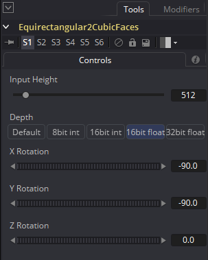
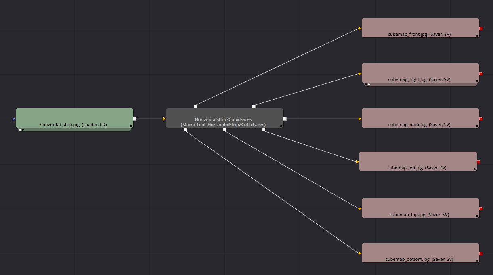
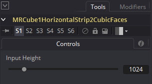

# Conversion Macros

## Angular2CubicFaces

This macro takes a full frame angular fisheye/angular IBL/light probe image with a 360&deg; diagonal FOV and extracts a set of six 90&deg; FOV cubic camera views as separate cubic image outputs.

The "Input Height" control is used to specify the vertical resolution of the extracted cubic views. The final width for the cubic images will be the Input Height value due to the fact cubic views represents a 90&deg; FOV and have a natural 1:1 aspect ratio.

The "Depth" control allows you to specify the bit depth for the panoramic output. The "8bit int" option is for PNG/TGA/JPG outputs, and the "16bit float" or "32bit float" options are perfect for floating point EXR based outputs that have HDR (high dynamic range) based color values that exceed the standard 0.0-1.0 color range.

The X Rotation/Y Rotation/Z Rotation sliders allow you to rotate your panoramic imagery before it is converted into a cubemap output. This is handy for leveling horizons or adjusting the front facing image view. The Z Rotation will be the most used rotation control as it lets you perform a horizontal panning effect on the panoramic imagery which can be used to adjust and re-center the front facing part of the panorama.

To use this node, the angular fisheye source imagery is connected to the node's yellow colored "Input" attribute. There are six image outputs from the node called `Front`, `Right`, `Back`, `Left`, `Top`, and `Bottom`.

**Note:** If you hover your cursor over each of the red color node outputs you will see a tool tip appear that indicates what the currently selected output is called.

## Angular2Equirectangular

This macro converts a full frame angular fisheye/angular IBL/light probe image with a 360&deg; diagonal FOV into an equirectangular/LatLong/spherical panorama with a 360&deg; x 180&deg; FOV with an aspect ratio of 2:1.

The "Input Height" control is used to specify the vertical resolution of the imagery. The final width for the panoramic image conversion will be twice the Input Height value due to the fact LatLong panoramas have a natural 2:1 aspect ratio.

This means a fisheye image with a 2048x2048 resolution will be converted into a 4096x2048 resolution LatLong image.

To use this node, the angular fisheye source imagery is connected to the node's yellow colored "Input" attribute. The image output from the node is called "Output".

This conversion is done with the help of the polar to rectangular coordinates filter.

## Angular2MeshUV

This node allows you to reformat panoramic imagery from the angular fisheye projection to an arbitrary image projection of your own design that is defined using an FBX/OBJ/DAE/3DS/Alembic format polygon mesh and a custom UV Layout.

The new MeshUV macros are able to support HDRI high dynamic range 16-bit and 32-bit per channel color depth based panoramic image conversions which are essential when dealing with 360&deg; media that will be used as source imagery for an IBL (image based lighting) workflow.

The following image shows the result of an angular fisheye 360&deg; image (on the left) being converted into the Facebook cube map 3x2 image projection format (on the right) using the `Angular2MeshUV` macro node with sample OBJ mesh file `Macros:/KartaVR/Images/facebook_cubemap3x2.obj` loaded in the macro node's "FBX File" text field.

The "Input Height" control is used to specify the vertical and horizontal resolution of the 360&deg; angular fisheye imagery that is loaded into the node.

The "FBX File" text field and file browser button allows you to select an OBJ/FBX/DAE/3DS/Alembic based polygon mesh file from your hard disk.

The "Render Height" control is used to specify the vertical resolution of the final rendered Mesh UV output.

The "Render Width" control is used to specify the horizontal resolution of the final rendered Mesh UV output.

The "Cull Front Face" and "Cull Back Face" checkboxes allow you to hide hidden parts of a mesh if you have overlapping regions or reversed faces/normals on the Mesh UV based geometry that is loaded in the FBX File section of the node.

The "UV Gutter Size" control allows you to extend the edge texture map color beyond the border zone region of each of the texture baked polygon mesh based UV Layout regions.

The "Depth" control allows you to specify the bit depth for the panoramic output. The "8bit int" option is for PNG/TGA/JPG outputs, and the "16bit float" or "32bit float" options are perfect for floating point EXR based outputs that have HDR (high dynamic range) based color values that exceed the standard 0.0-1.0 color range.

The X Offset/Y Offset/Z Offset sliders allow you to translate the model around the virtual world inside the Fusion 3D scene prior to performing the texture baking effect.

The Rotation Order control allows you to control the precedence for each of the rotation axis. This is helpful when you need to solve gimbal lock by selecting the most important rotation channel for your camera animation and making it the first of the three axes listed in the Rotation Order settings.

The "X Rotation", "Y Rotation", and "Z Rotation" values allow you to pan the panoramic footage as it is mapped onto the texture baking mesh geometry.

The "Y Rotation" slider lets you perform a horizontal panning effect on the camera rig which can be used to adjust and re-center the front facing part of the panoramic rendering.

The "X Pivot", "Y Pivot", "Z Pivot" lets you move the rotation and offset (translation) origin point that is used when the base mesh is loaded into the texture baking world.

The "Lock X/Y/Z" checkbox will link together the "Scale" control into a single unified slider. When this slider is un-checked you will have direct control over the Scale X/Scale Y/Scale Z controls which allow for non-proportional scaling.

The Scale control allows you to change the size of the mesh used in the texture baking operation. If the model is extremely large or small it can be helpful to change the scale setting control so the model fits within Fusion's default near and far clipping plane regions.

If you disable the "Lock X/Y/Z" checkbox you can create cartoon like squash and stretch distortions in the environment map imagery by doubling the Scale value on a single axis in relation to the other scale controls.

The node has one input which is labelled "Image". The node has a single output called "Output".

**Note:** If the environment map to Mesh UV texture baking operation doesn't seem to have the correct "infinite" like look to the conversion it is usually an indication the scale control needs to be adjusted to fix the issue.

## Cubemap3x22CubicFaces

This macro takes a cubemap 3x2 panoramic format image with a 3:2 aspect ratio and extracts a set of six 90&deg; FOV cubic camera views as separate cubic image outputs.

The "Input Height" control is used to specify the vertical resolution of the extracted cubic views. The final width for the cubic images will be the Input Height value due to the fact cubic views represents a 90&deg; FOV and have a natural 1:1 aspect ratio.

A cubemap 3x2 panorama has the faces oriented in the following order:

<table>
  <tr>
    <td>Front</td> <td>Right</td> <td>Back</td>
  </tr>
  <tr>
    <td>Left</td> <td>Top</td> <td>Bottom</td>
  </tr>
</table>

To use this node, the cubemap 3x2 source imagery is connected to the node's yellow colored "Input" attribute. There are six image outputs from the node called `Front`, `Right`, `Back`, `Left`, `Top`, and `Bottom`.

**Note:** If you hover your cursor over each of the red color node outputs you will see a tool tip appear that indicates what the currently selected output is called.

## CubicFaces2Cubemap3x2

This macro takes a set of six individual 90&deg; FOV based cubic view source images and merges them into a single combined image with a 3x2 cube map face arrangement.

The "Input Height" control is used to specify the vertical resolution of each of the merged cubic views. The final width and height for the cubemap 3x2 images will be an image width of three times the Input Height value, and an image height of two times the Input Height value. This is due to the fact each of the cubic views represents a 90&deg; FOV and have a natural 1:1 aspect ratio, and the document consists of three cubemap images horizontally, and two cubemap images high.

A cubemap 3x2 panorama has the faces oriented in the following order:

<table>
  <tr>
    <td>Front</td> <td>Right</td> <td>Back</td>
  </tr>
  <tr>
    <td>Left</td> <td>Top</td> <td>Bottom</td>
  </tr>
</table>

To use this node, individual 90&deg; FOV based cubic view source imagery is connected to the node's colored inputs named `Front`, `Right`, `Back`, `Left`, `Top`, and `Bottom` attributes. There is a single image output from the node called "Output" which creates a merged cubemap 3x2 frame.

**Note:** If you hover your cursor over each of the colored triangle inputs on the node you will see a tool tip appear that indicates what the currently selected input is called.

## CubicFaces2Cylindrical

This macro takes a set of six individual 90&deg; FOV based cubic view source images and merges them into a single combined cylindrical image.

The "Height" control is used to specify the vertical resolution. The final width for the cylindrical panoramic output will be an image width of four times the Height value. This is due to the fact each of the cubic views represents a 90&deg; FOV and have a natural 1:1 aspect ratio, and the cylindrical document consists of four cubemap images horizontally.

To use this node, individual 90&deg; FOV based cubic view source imagery is connected to the node's colored inputs named `Front`, `Right`, `Back`, `Left`, `Top`, and `Bottom` attributes. There is a single image output from the node called "Output" which creates a merged cylindrical frame.

**Note:** If you hover your cursor over each of the colored triangle inputs on the node you will see a tool tip appear that indicates what the currently selected input is called.

## CubicFaces2Domemaster180

This macro takes a set of six individual 90&deg; FOV based cubic view source images and merges them into a single combined angular fisheye 180&deg; FOV image that is known as a domemaster image. A domemaster image has an aspect ratio of 1:1.

The "Input Height" control is used to specify the vertical and horizontal resolution of the final domemaster frame.

The "Depth" control allows you to specify the bit depth for the panoramic output. The "8bit int" option is for PNG/TGA/JPG outputs, and the "16bit float" or "32bit float" options are perfect for floating point EXR based outputs that have HDR (high dynamic range) based color values that exceed the standard 0.0-1.0 color range.

The X Rotation/Y Rotation/Z Rotation sliders allow you to rotate your cubic panoramic imagery before it is converted into a domemaster output. This is handy for leveling horizons or adjusting the front facing image view. The Z Rotation will be the most used rotation control as it lets you perform a horizontal rotation effect on the panoramic imagery which can be used to adjust and re-center the front facing part of the panorama.

To use this node, individual 90&deg; FOV based cubic view source imagery is connected to the node's colored inputs named `Front`, `Right`, `Back`, `Left`, `Top`, and `Bottom` attributes. There is a single image output from the node called "Output" which creates a merged domemaster 180&deg; frame.

**Note:** Gimbal lock can happen on the X Rotation/Y Rotation/Z Rotation sliders so you will have to pull the X Rotation value off from its initial -90 setting if you want to use the Y Rotation and Z Rotation sliders.

## CubicFaces2Equirectangular

This macro takes a set of six individual 90&deg; FOV based cubic view source images and merges them into a single combined equirectangular/LatLong/spherical 360&deg;x180&deg; FOV image. An equirectangular image has an aspect ratio of 2:1.

The "Input Height" control is used to specify the vertical and horizontal resolution of the final domemaster frame.

The "Depth" control allows you to specify the bit depth for the panoramic output. The "8bit int" option is for PNG/TGA/JPG outputs, and the "16bit float" or "32bit float" options are perfect for floating point EXR based outputs that have HDR (high dynamic range) based color values that exceed the standard 0.0-1.0 color range.

The Rotation Order control allows you to control the precedence for each of the rotation axis. This is helpful when you need to solve gimbal lock by selecting the most important rotation channel for your camera animation and making it the first of the three axes listed in the Rotation Order settings.

The X Rotation/Y Rotation/Z Rotation sliders allow you to rotate your cubic panoramic imagery before it is converted into an equirectangular output. This is handy for leveling horizons or adjusting the front facing image view. The Z Rotation will be the most used rotation control as it lets you perform a horizontal rotation effect on the panoramic imagery which can be used to adjust and re-center the front facing part of the panorama.

To use this node, individual 90&deg; FOV based cubic view source imagery is connected to the node's colored inputs named `Front`, `Right`, `Back`, `Left`, `Top`, and `Bottom` attributes. There is a single image output from the node called "Output" which creates a merged equirectangular frame.

**Note:** Gimbal lock can happen on the X Rotation/Y Rotation/Z Rotation sliders so you might have to change the "Rotation Order" control to set a different priority for the rotation channels.

## CubicFaces2FacebookCubemap3x2

This macro takes a set of six individual 90&deg; FOV based cubic view source images and merges them into a single combined image with a Facebook 3x2 cube map face arrangement.

The "Input Height" control is used to specify the vertical resolution of each of the merged cubic views. The final width and height for the Facebook cubemap 3x2 images will be an image width of three times the Input Height value, and an image height of two times the Input Height value. This is due to the fact each of the cubic views represents a 90&deg; FOV and have a natural 1:1 aspect ratio, and the document consists of three cubemap images horizontally, and two cubemap images high.

A Facebook cubemap 3x2 panorama has the faces oriented in the following order:

<table>
  <tr>
    <td>Right</td> <td>Left</td> <td>Top</td>
  </tr>
  <tr>
    <td>Bottom</td> <td>Front</td> <td>Back</td>
  </tr>
</table>

To use this node, individual 90&deg; FOV based cubic view source imagery is connected to the node's colored inputs named `Front`, `Right`, `Back`, `Left`, `Top`, and `Bottom` attributes. There is a single image output from the node called "Output" which creates a merged Facebook cubemap 3x2 frame.

As another example, if you wanted to convert a LatLong/equirectangular/spherical image to the Facebook Cubemap 3x2 format you would connect the nodes like this in Fusion:

In this picture a LatLong format image is brought into Fusion with a Loader node. The Loader node is connected to an Equirctangular2CubicFaces node that will convert the LatLong panorama to a set of six 90&deg; FOV cubic images. These six images are then routed into a CubicFaces2FacebookCubemap3x2 node where they are merged into the final cubemap 3x2 format frame. Then lastly a saver node is connected to the end of the comp to save the resulting media file to disk.

**Note:** If you hover your cursor over each of the colored triangle inputs on the node you will see a tool tip appear that indicates what the currently selected input is called.

## CubicFaces2FacebookVerticalStrip

This macro takes a set of six individual 90&deg; FOV based cubic view source images and merges them into a single combined image with a Facebook Vertical Strip face arrangement.

The "Input Height" control is used to specify the vertical resolution of each of the merged cubic views. The final width and height for the Facebook Vertical Strip image will be an image width of the Input Height value, and an image height of six times the Input Height value. This is due to the fact each of the cubic views represents a 90&deg; FOV and have a natural 1:1 aspect ratio, and the document consists of six cubemap images high.

A Facebook Vertical Strip panorama has all of the images flipped horizontally and the faces are oriented in the following order:

<table>
  <tr>
    <td>right</td>
  </tr>
  <tr>
    <td>left</td>
  </tr>
  <tr>
    <td>top (Rotated 180&deg;)</td>
  </tr>
  <tr>
    <td>bottom (Rotated 180&deg;)</td>
  </tr>
  <tr>
    <td>back</td>
  </tr>
  <tr>
    <td>front</td>
  </tr>
</table>

To use this node, individual 90&deg; FOV based cubic view source imagery is connected to the node's colored inputs named `Front`, `Right`, `Back`, `Left`, `Top`, and `Bottom` attributes. There is a single image output from the node called "Output" which creates a merged Facebook Vertical Strip frame.

**Note:** If you hover your cursor over each of the colored triangle inputs on the node you will see a tool tip appear that indicates what the currently selected input is called.

## CubicFaces2GearVRMono

This macro takes a set of six individual 90&deg; FOV based cubic view source images and merges them into a single combined image with a Gear VR/Octane ORBX/Vray Cubic face arrangement. A Gear VR mono image has an aspect ratio of 6:1.

The "Input Height" control is used to specify the vertical resolution of each of the merged cubic views. The final width of the Gear VR mono panorama will be six times the Input Height value to create the final 6:1 aspect ratio image.

A Gear VR mono panorama has the faces oriented in the following order:

<table>
  <tr>
   <td>Left</td> <td>Right</td> <td>Top (Rotated 180&deg;)</td> <td>Bottom (Rotated 180&deg;)</td> <td>Back</td> <td>Front</td>
  </tr>
</table>

To use this node, individual 90&deg; FOV based cubic view source images are connected to the node's colored inputs named `Front`, `Right`, `Back`, `Left`, `Top`, and `Bottom` attributes. There is a single image output from the node called "Output" which creates a merged Gear VR mono frame.

**Note:** If you hover your cursor over each of the colored triangle inputs on the node you will see a tool tip appear that indicates what the currently selected input is called.

## CubicFaces2GearVRStereo

This macro takes a set of six individual 90&deg; FOV based cubic view source images and merges them into a single combined image with a Gear VR/Octane ORBX/Vray Cubic face arrangement. A Gear VR Stereo image has an aspect ratio of 12:1.

The "Input Height" control is used to specify the vertical resolution of each of the merged cubic views. The final width of the Gear VR Stereo panorama will be twelve times the Input Height value to create the final 12:1 aspect ratio image.

A Gear VR stereo panorama has a side by side stereo format that has the right camera views placed first then the left camera views placed second. The right (R) and left (L) camera cubic faces are oriented in the following order:

<table>
  <tr>
   <td>R-Left</td> <td>R-Right</td> <td>R-Top (Rotated 180&deg;)</td> <td>R-Bottom (Rotated 180&deg;)</td> <td>R-Back</td> <td>R-Front</td> <td>L-Left</td> <td>L-Right</td> <td>L-Top (Rotated 180&deg;)</td> <td>L-Bottom (Rotated 180&deg;)</td> <td>L-Back</td> <td>L-Front</td>
  </tr>
</table>

To use this node, individual 90&deg; FOV based cubic view source images are connected to the node's colored inputs named `LeftCam_Front`, `LeftCam_Right`, `LeftCam_Back`, `LeftCam_Left`, `LeftCam_Top`, `LeftCam_Bottom`,  `RightCam_Front`, `RightCam_Right`, `RightCam_Back`, `RightCam_Left`, `RightCam_Top`, and `RightCam_Bottom` attributes. There is a single image output from the node called "Output" which creates a merged Gear VR stereo frame.

Don't forget as you are connecting image inputs to a node, you can hold down the Alt/Option key as you drag a connection line to the middle of the node and as you release your mouse button a connection popup dialog will appear that makes it easier to wire up the node inputs by name.

**Note:** If you hover your cursor over each of the colored triangle inputs on the node you will see a tool tip appear that indicates what the currently selected input is called.

## CubicFaces2HorizontalCross

This macro takes a set of six individual 90&deg; FOV based cubic view source images and merges them into a single combined image with a horizontal cross cube map face arrangement. A horizontal cross image has an aspect ratio of 4:3.

The converted horizontal cross faces are located in the format:

<table>
  <tr>
    <td>Blank</td> <td>Top</td> <td>Blank</td> <td>Blank</td>
  </tr>
  <tr>
    <td>Left</td> <td>Front</td> <td>Right</td> <td>Back</td>
  </tr>
  <tr>
    <td>Blank</td> <td>Bottom</td> <td>Blank</td> <td>Blank</td>
  </tr>
</table>

To use this node, individual 90&deg; FOV based cubic view source images are connected to the node's colored inputs named `Front`, `Right`, `Back`, `Left`, `Top`, and `Bottom` attributes. There is a single image output from the node called "Output" which creates a merged panoramic frame.

## CubicFaces2HorizontalStrip

This macro takes a set of six individual 90&deg; FOV based cubic view source images and merges them into a single combined image with a horizontal strip cube map face arrangement. A horizontal strip image has an aspect ratio of 6:1.

The horizontal strip faces are located in the format:

<table>
  <tr>
    <td>Front</td> <td>Right</td> <td>Back</td> <td>Left</td> <td>Top</td> <td>Bottom</td>
  </tr>
</table>

To use this node, individual 90&deg; FOV based cubic view source images are connected to the node's colored inputs named `Front`, `Right`, `Back`, `Left`, `Top`, and `Bottom` attributes. There is a single image output from the node called "Output" which creates a merged panoramic frame.

## CubicFaces2HorizontalTee

This macro takes a set of six individual 90&deg; FOV based cubic view source images and merges them into a single combined image with a horizontal tee cube map face arrangement. A horizontal tee image has an aspect ratio of 4:3.

The converted horizontal tee faces are located in the format:

<table>
  <tr>
    <td>Top</td> <td>Blank</td> <td>Blank</td> <td>Blank</td>
  </tr>
  <tr>
    <td>Front</td> <td>Right</td> <td>Back</td> <td>Left</td>
  </tr>
  <tr>
     <td>Bottom</td> <td>Blank</td> <td>Blank</td> <td>Blank</td>
  </tr>
</table>

To use this node, individual 90&deg; FOV based cubic view source images are connected to the node's colored inputs named `Front`, `Right`, `Back`, `Left`, `Top`, and `Bottom` attributes. There is a single image output from the node called "Output" which creates a merged panoramic frame.

## CubicFaces2MeshUV

This node allows you to reformat panoramic imagery from the cubic projection to an arbitrary image projection of your own design that is defined using an FBX/OBJ/DAE/3DS/Alembic format polygon mesh and a custom UV Layout.

The new MeshUV macros are able to support HDRI high dynamic range 16-bit and 32-bit per channel color depth based panoramic image conversions which are essential when dealing with 360&deg; media that will be used as source imagery for an IBL (image based lighting) workflow.

The following image shows the result of a set of six cubemap images (the front view visible on the left) being converted into the Facebook cube map 3x2 image projection format (on the right) using the `CubicFaces2MeshUV` macro node with sample OBJ mesh file `Macros:/KartaVR/Images/facebook_cubemap3x2.obj` loaded in the macro node's "FBX File" text field.

The "Input Height" control is used to specify the vertical and horizontal resolution of the 360&deg; angular fisheye imagery that is loaded into the node.

The "FBX File" text field and file browser button allows you to select an OBJ/FBX/DAE/3DS/Alembic based polygon mesh file from your hard disk.

The "Render Height" control is used to specify the vertical resolution of the final rendered Mesh UV output.

The "Render Width" control is used to specify the horizontal resolution of the final rendered Mesh UV output.

The "Cull Front Face" and "Cull Back Face" checkboxes allow you to hide hidden parts of a mesh if you have overlapping regions or reversed faces/normals on the Mesh UV based geometry that is loaded in the FBX File section of the node.

The "UV Gutter Size" control allows you to extend the edge texture map color beyond the border zone region of each of the texture baked polygon mesh based UV Layout regions.

The "Depth" control allows you to specify the bit depth for the panoramic output. The "8bit int" option is for PNG/TGA/JPG outputs, and the "16bit float" or "32bit float" options are perfect for floating point EXR based outputs that have HDR (high dynamic range) based color values that exceed the standard 0.0-1.0 color range.

The X Offset/Y Offset/Z Offset sliders allow you to translate the model around the virtual world inside the Fusion 3D scene prior to performing the texture baking effect.

The Rotation Order control allows you to control the precedence for each of the rotation axis. This is helpful when you need to solve gimbal lock by selecting the most important rotation channel for your camera animation and making it the first of the three axes listed in the Rotation Order settings.

The "X Rotation", "Y Rotation", and "Z Rotation" values allow you to pan the panoramic footage as it is mapped onto the texture baking mesh geometry.

The "Y Rotation" slider lets you perform a horizontal panning effect on the camera rig which can be used to adjust and re-center the front facing part of the panoramic rendering.

The "X Pivot", "Y Pivot", "Z Pivot" lets you move the rotation and offset (translation) origin point that is used when the base mesh is loaded into the texture baking world.

The "Lock X/Y/Z" checkbox will link together the "Scale" control into a single unified slider. When this slider is un-checked you will have direct control over the Scale X/Scale Y/Scale Z controls which allow for non-proportional scaling.

The Scale control allows you to change the size of the mesh used in the texture baking operation. If the model is extremely large or small it can be helpful to change the scale setting control so the model fits within Fusion's default near and far clipping plane regions.

If you disable the "Lock X/Y/Z" checkbox you can create cartoon like squash and stretch distortions in the environment map imagery by doubling the Scale value on a single axis in relation to the other scale controls.

To use this node, individual 90&deg; FOV based cubic view source imagery is connected to the node's colored inputs named `Front`, `Right`, `Back`, `Left`, `Top`, and `Bottom` attributes. There is a single image output from the node called "Output".

**Note:** If the environment map to Mesh UV texture baking operation doesn't seem to have the correct "infinite" like look to the conversion it is usually an indication the scale control needs to be adjusted to fix the issue.

## CubicFaces2MrCube1Map

This macro takes a set of six individual 90&deg; FOV based cubic view source images and merges them into a single combined image with a mental ray cube1 horizontal strip face arrangement. A mental ray cube1 image has an aspect ratio of 6:1.

The converted mental ray `mib_lookup_cube1` horizontal strip faces are located in the format:

<table>
  <tr>
    <td>Left</td> <td>Right</td> <td>Bottom</td> <td>Top (Flipped Vertically)</td> <td>Back</td> <td>Front</td>
  </tr>
</table>

To use this node, individual 90&deg; FOV based cubic view source images are connected to the node's colored inputs named `Front`, `Right`, `Back`, `Left`, `Top`, and `Bottom` attributes. There is a single image output from the node called "Output" which creates a merged panoramic frame.

## CubicFaces2VerticalCross

This macro takes a set of six individual 90&deg; FOV based cubic view source images and merges them into a single combined image with a vertical cross cube map face arrangement. A vertical cross image has an aspect ratio of 3:4.

The converted vertical cross faces are located in the format:

<table>
  <tr>
    <td>Blank</td> <td>Top</td> <td>Blank</td>
  </tr>
  <tr>
    <td>Left</td> <td>Front</td> <td>Right</td>
  </tr>
  <tr>
    <td>Blank</td> <td>Bottom</td> <td>Blank</td>
  </tr>
  <tr>
    <td>Blank</td> <td>Back (Rotated 180&deg;)</td> <td>Blank</td>
  </tr>
</table>

To use this node, individual 90&deg; FOV based cubic view source images are connected to the node's colored inputs named `Front`, `Right`, `Back`, `Left`, `Top`, and `Bottom` attributes. There is a single image output from the node called "Output" which creates a merged panoramic frame.

## CubicFaces2VerticalStrip

This macro takes a set of six individual 90&deg; FOV based cubic view source images and merges them into a single combined image with a vertical strip cube map face arrangement. A vertical strip image has an aspect ratio of 1:6.

The vertical strip faces are located in the format:

<table>
  <tr>
    <td>Front</td>
  </tr>
  <tr>
    <td>Right</td>
  </tr>
  <tr>
    <td>Back</td>
  </tr>
  <tr>
    <td>Left</td>
  </tr>
  <tr>
    <td>Top</td>
  </tr>
  <tr>
    <td>Bottom</td>
  </tr>
</table>

To use this node, individual 90&deg; FOV based cubic view source images are connected to the node's colored inputs named `Front`, `Right`, `Back`, `Left`, `Top`, and `Bottom` attributes. There is a single image output from the node called "Output" which creates a merged panoramic frame.

## CubicFaces2VerticalTee

This macro takes a set of six individual 90&deg; FOV based cubic view source images and merges them into a single combined image with a vertical tee cube map face arrangement. A vertical tee image has an aspect ratio of 3:4.

The converted vertical tee faces are located in the format:

<table>
  <tr>
    <td>Left</td> <td>Front</td> <td>Right</td>
  </tr>
  <tr>
     <td>Blank</td> <td>Bottom</td><td>Blank</td>
  </tr>
  <tr>
     <td>Blank</td> <td>Back (Rotated 180&deg;)</td> <td>Blank</td>
  </tr>
  <tr>
     <td>Blank</td> <td>Top</td> <td>Blank</td>
  </tr>
</table>

To use this node, individual 90&deg; FOV based cubic view source images are connected to the node's colored inputs named `Front`, `Right`, `Back`, `Left`, `Top`, and `Bottom` attributes. There is a single image output from the node called "Output" which creates a merged panoramic frame.

## CubicFaces2YouTube180

This macro takes a set of six individual 90&deg; FOV based cubic view source images and merges them into a YouTube 180 based equirectangular 180&deg;x180&deg; horizontally cropped 1:1 aspect ratio frame format.

To use this node, individual 90&deg; FOV based cubic view source images are connected to the node's colored inputs named `Front`, `Right`, `Back`, `Left`, `Top`, and `Bottom` attributes. There is a single image output from the node called "Output" which creates a merged panoramic frame.

## CubicFaces2YouTubeCubemap3x2

This macro takes a set of six individual 90&deg; FOV based cubic view source images and merges them into a single combined image with a YouTube 360&deg; based 3x2 cubic face arrangement.

To use this node, individual 90&deg; FOV based cubic view source images are connected to the node's colored inputs named `Front`, `Right`, `Back`, `Left`, `Top`, and `Bottom` attributes. There is a single image output from the node called "Output" which creates a merged panoramic frame.

## Cylindrical2CubicFaces

This macro takes a 360&deg; x 90&deg; cylindrical panorama and extracts a set of six 90&deg; FOV cubic camera views as separate cubic image outputs.

The "Height" control is used to specify the vertical resolution of the extracted cubic views. The final width for the cubic images will be the Height value due to the fact cubic views represents a 90&deg; FOV and have a natural 1:1 aspect ratio.

The "Depth" control allows you to specify the bit depth for the panoramic output. The "8bit int" option is for PNG/TGA/JPG outputs, and the "16bit float" or "32bit float" options are perfect for floating point EXR based outputs that have HDR (high dynamic range) based color values that exceed the standard 0.0-1.0 color range.

The X Rotation/Y Rotation/Z Rotation sliders allow you to rotate your panoramic imagery before it is converted into a cubemap output. This is handy for leveling horizons or adjusting the front facing image view. The Z Rotation will be the most used rotation control as it lets you perform a horizontal panning effect on the panoramic imagery which can be used to adjust and re-center the front facing part of the panorama.

To use this node, the cylindrical source imagery is connected to the node's yellow colored "Input" attribute. There are six image outputs from the node called `Front`, `Right`, `Back`, `Left`, `Top`, and `Bottom`.

**Note:** If you hover your cursor over each of the red color node outputs you will see a tool tip appear that indicates what the currently selected output is called.

## Domemaster2Equirectangular

This macro converts a 180&deg; domemaster angular fisheye image into a 360&deg; x 180&deg; equirectangular/LatLong/spherical panorama with an aspect ratio of 2:1.

Since a domemaster frame only has a vertical coverage area of 90 degrees when converted into a spherical format, this image will have the bottom half of the spherical image output remain empty.

The "Input Height" control is used to specify the vertical resolution of the imagery. The final width for the panoramic image conversion will be twice the Input Height value due to the fact LatLong panoramas have a natural 2:1 aspect ratio.

To use this node, the 180 degree angular fisheye source imagery is connected to the node's yellow colored "Input" attribute. The image output from the node is called "Output".

This conversion is done with the help of the polar to rectangular coordinates filter.

## Equirectangular2Angular

This macro converts a 360&deg; x 180&deg; equirectangular/LatLong/spherical panorama into a full frame fisheye image. This means a LatLong image with a 2:1 aspect ratio like 4096x2048 pixels will be converted to a 2048x2048 angular fisheye image.

The "Input Height" control is used to specify the vertical resolution of the imagery. The final width for the panoramic image conversion will be the Input Height value due to the fact angular fisheye panoramas have a natural 1:1 aspect ratio.

To use this node, the equirectangular source imagery is connected to the node's yellow colored "Input" attribute. The image output from the node is called "Output".

This conversion is done with the help of the rectangular to polar coordinates filter.

## Equirectangular2CubicFaces

This macro takes a 360&deg; x 180&deg; equirectangular/LatLong/spherical panorama and extracts a set of six 90&deg; FOV cubic camera views as separate cubic image outputs.

The "Input Height" control is used to specify the vertical resolution of the extracted cubic views. The final width for the cubic images will be the Input Height value due to the fact cubic views represents a 90&deg; FOV and have a natural 1:1 aspect ratio.

The "Depth" control allows you to specify the bit depth for the panoramic output. The "8bit int" option is for PNG/TGA/JPG outputs, and the "16bit float" or "32bit float" options are perfect for floating point EXR based outputs that have HDR (high dynamic range) based color values that exceed the standard 0.0-1.0 color range.

The X Rotation/Y Rotation/Z Rotation sliders allow you to rotate your panoramic imagery before it is converted into a cubemap output. This is handy for leveling horizons or adjusting the front facing image view. The Z Rotation will be the most used rotation control as it lets you perform a horizontal panning effect on the panoramic imagery which can be used to adjust and re-center the front facing part of the panorama.

To use this node, the equirectangular source imagery is connected to the node's yellow colored "Input" attribute. There are six image outputs from the node called `Front`, `Right`, `Back`, `Left`, `Top`, and `Bottom`.

**Note:** If you hover your cursor over each of the red color node outputs you will see a tool tip appear that indicates what the currently selected output is called.

## Equirectangular2Cylindrical

This macro takes a 360&deg; x 180&deg; equirectangular/LatLong/spherical panorama and converts it into a 360&deg; x 90&deg; cylindrical output.

The "Height" control is used to specify the vertical resolution of the extracted cubic views. The final width for the cubic images will be four times the Input Height value.

The "Depth" control allows you to specify the bit depth for the panoramic output. The "8bit int" option is for PNG/TGA/JPG outputs, and the "16bit float" or "32bit float" options are perfect for floating point EXR based outputs that have HDR (high dynamic range) based color values that exceed the standard 0.0-1.0 color range.

The X Rotation/Y Rotation/Z Rotation sliders allow you to rotate your panoramic imagery before it is converted into a cylindrical output. This is handy for leveling horizons or adjusting the front facing view. The Z Rotation will be the most used rotation control as it lets you perform a horizontal panning effect on the panoramic imagery which can be used to adjust and re-center the front facing part of the panorama.

To use this node, the equirectangular source imagery is connected to the node's yellow colored "Input" attribute. There image output from the node is called "Output".

**Note:** If you hover your cursor over each of the red color node outputs you will see a tool tip appear that indicates what the currently selected output is called.

## Equirectangular2Domemaster180

This macro will take a 360&deg;x180&deg; equirectangular/LatLong/spherical panorama and convert it into a 180&deg; angular fisheye image that has a circular appearance.

This conversion will use the upward (zenith) facing part of the equirectangular image and make that the center part of the domemaster 180&deg; image output.

A typical domemaster image in a planetarium covers a 180&deg; image area which is the full coverage area of a dome theater screen.

**Note:** An angular fisheye image with a quoted 180&deg; FOV value can be thought of as a diagonal 180&deg; field of view value in the panoramic image frame. If this image was later converted back into an equirectangular image it would fully cover a 360&deg;x90&deg; image area.

## Equirectangular2Domemaster220

This macro will take a 360&deg;x180&deg; equirectangular/LatLong/spherical panorama and convert it into a 220&deg; angular fisheye image that has a circular appearance.

This conversion will use the upward (zenith) facing part of the equirectangular image and make that the center part of the domemaster 220&deg; image output.

A typical domemaster image in a planetarium covers a 180&deg; image area which is the full coverage area of a dome theater screen. This Equirectangular2InverseDomemaster220 node compresses a slightly wider 220&deg; field of view output into the same domemaster frame which is useful for squeezing a bit more of the foreground part of the scene into the frame. This extra field of view compression effect is something of a cheat but it looks fine on a dome screen and can compositionally help you fit content below the standard horizon line into the frame which is good for live action type imagery.

**Note:** An angular fisheye image with a quoted 220&deg; FOV value can be thought of as a diagonal 220&deg; field of view value in the panoramic image frame. If this image was later converted back into an equirectangular image it would fully cover a 360&deg;x110&deg; image area.

## Equirectangular2Fisheye

This macro will take a 360&deg;x180&deg; equirectangular/LatLong/spherical panorama and convert it into a circular fisheye image. The node has a FOV control that makes it easy to adjust the field of view of the converted imagery.

Setting the **Z Rotation** control to "-90" is the setting to use for a horizontal "front axis" orientation on the fisheye conversion. Setting the Z Rotation control to "0" is the setting to use for a fulldome like vertical "upwards sky" looking orientation on the fisheye conversion.

**Note:** An angular fisheye image with a quoted 360&deg; FOV value can be thought of as a diagonal 360&deg; field of view value in the panoramic image frame. If this image was later converted back into an equirectangular image it would fully cover a 360&deg;x180&deg; image area.

## EquirectangularStereo2FisheyeStereo

This macro will take a pair of left and right view stereo 360&deg;x180&deg; equirectangular/LatLong/spherical panoramas and convert them into circular fisheye imaged. The node has a FOV control that makes it easy to adjust the field of view of the converted imagery.

Setting the **Z Rotation** control to "-90" is the setting to use for a horizontal "front axis" orientation on the fisheye conversion. Setting the Z Rotation control to "0" is the setting to use for a fulldome like vertical "upwards sky" looking orientation on the fisheye conversion.

**Note:** An angular fisheye image with a quoted 360&deg; FOV value can be thought of as a diagonal 360&deg; field of view value in the panoramic image frame. If this image was later converted back into an equirectangular image it would fully cover a 360&deg;x180&deg; image area.

## Equirectangular2InverseAngular

This macro will take a 360&deg;x180&deg; equirectangular/LatLong/spherical panorama and convert it into a 360&deg; angular fisheye image that has a circular appearance.

The "Inverse" part of this conversion means that it will use the downward (nadir) facing part of the equirectangular image and make that the center part of the angular fisheye 360&deg; image output.

**Note:** An angular fisheye image with a quoted 360&deg; FOV value can be thought of as a diagonal 360&deg; field of view value in the panoramic image frame. If this image was later converted back into an equirectangular image it would fully cover a 360&deg;x180&deg; image area.

## Equirectangular2InverseDomemaster180

This macro will take a 360&deg;x180&deg; equirectangular/LatLong/spherical panorama and convert it into a 180&deg; angular fisheye image that has a circular appearance.

The "Inverse" part of this conversion means that it will use the downward (nadir) facing part of the equirectangular image and make that the center part of the domemaster 180&deg; image output.

A typical domemaster image in a planetarium covers a 180&deg; image area which is the full coverage area of a dome theater screen.

**Note:** An angular fisheye image with a quoted 180&deg; FOV value can be thought of as a diagonal 180&deg; field of view value in the panoramic image frame. If this image was later converted back into an equirectangular image it would fully cover a 360&deg;x90&deg; image area.

## Equirectangular2InverseDomemaster220

This macro will take a 360&deg;x180&deg; equirectangular/LatLong/spherical panorama and convert it into a 220&deg; angular fisheye image that has a circular appearance.

The "Inverse" part of this conversion means that it will use the downward (nadir) facing part of the equirectangular image and make that the center part of the domemaster 220&deg; image output.

A typical domemaster image in a planetarium covers a 180&deg; image area which is the full coverage area of a dome theater screen. This Equirectangular2InverseDomemaster220 node compresses a slightly wider 220&deg; field of view output into the same domemaster frame which is useful for squeezing a bit more of the foreground part of the scene into the frame. This extra field of view compression effect is something of a cheat but it looks fine on a dome screen and can compositionally help you fit content below the standard horizon line into the frame which is good for live action type imagery.

**Note:** An angular fisheye image with a quoted 220&deg; FOV value can be thought of as a diagonal 220&deg; field of view value in the panoramic image frame. If this image was later converted back into an equirectangular image it would fully cover a 360&deg;x110&deg; image area.

## Equirectangular2MeshUV

This node allows you to reformat panoramic imagery from the equirectangular fisheye projection to an arbitrary image projection of your own design that is defined using an FBX/OBJ/DAE/3DS/Alembic format polygon mesh and a custom UV Layout.

The new MeshUV macros are able to support HDRI high dynamic range 16-bit and 32-bit per channel color depth based panoramic image conversions which are essential when dealing with 360&deg; media that will be used as source imagery for an IBL (image based lighting) workflow.

The following image shows the result of an equirectangular image (on the left) being converted into the new Facebook pyramid image projection format (on the right) using the `Equirectangular2MeshUV` macro node with sample OBJ mesh file `Macros:/KartaVR/Images/facebook_pyramid.obj` loaded in the macro node's "FBX File" text field.

The "Input Height" control is used to specify the vertical and horizontal resolution of the 360&deg; angular fisheye imagery that is loaded into the node.

The "FBX File" text field and file browser button allows you to select an OBJ/FBX/DAE/3DS/Alembic based polygon mesh file from your hard disk.

The "Render Height" control is used to specify the vertical resolution of the final rendered Mesh UV output.

The "Render Width" control is used to specify the horizontal resolution of the final rendered Mesh UV output.

The "Cull Front Face" and "Cull Back Face" checkboxes allow you to hide hidden parts of a mesh if you have overlapping regions or reversed faces/normals on the Mesh UV based geometry that is loaded in the FBX File section of the node.

The "UV Gutter Size" control allows you to extend the edge texture map color beyond the border zone region of each of the texture baked polygon mesh based UV Layout regions.

The "Depth" control allows you to specify the bit depth for the panoramic output. The "8bit int" option is for PNG/TGA/JPG outputs, and the "16bit float" or "32bit float" options are perfect for floating point EXR based outputs that have HDR (high dynamic range) based color values that exceed the standard 0.0-1.0 color range.

The X Offset/Y Offset/Z Offset sliders allow you to translate the model around the virtual world inside the Fusion 3D scene prior to performing the texture baking effect.

The Rotation Order control allows you to control the precedence for each of the rotation axis. This is helpful when you need to solve gimbal lock by selecting the most important rotation channel for your camera animation and making it the first of the three axes listed in the Rotation Order settings.

The "X Rotation", "Y Rotation", and "Z Rotation" values allow you to pan the panoramic footage as it is mapped onto the texture baking mesh geometry.

The "Y Rotation" slider lets you perform a horizontal panning effect on the camera rig which can be used to adjust and re-center the front facing part of the panoramic rendering.

The "X Pivot", "Y Pivot", "Z Pivot" lets you move the rotation and offset (translation) origin point that is used when the base mesh is loaded into the texture baking world.

The "Lock X/Y/Z" checkbox will link together the "Scale" control into a single unified slider. When this slider is un-checked you will have direct control over the Scale X/Scale Y/Scale Z controls which allow for non-proportional scaling.

The Scale control allows you to change the size of the mesh used in the texture baking operation. If the model is extremely large or small it can be helpful to change the scale setting control so the model fits within Fusion's default near and far clipping plane regions.

If you disable the "Lock X/Y/Z" checkbox you can create cartoon like squash and stretch distortions in the environment map imagery by doubling the Scale value on a single axis in relation to the other scale controls.

The node has one input which is labelled "Image". The node has a single output called "Output".

**Note:** If the environment map to Mesh UV texture baking operation doesn't seem to have the correct "infinite" like look to the conversion it is usually an indication the scale control needs to be adjusted to fix the issue.

## EquirectangularStereo2GearVRStereo

This macro takes the left and right eye views from a pair of stereoscopic 360&deg;x180&deg; equirectangular/LatLong/spherical panoramas and converts them into a single Gear VR cubic format stereo panoramic image with a 12:1 aspect ratio.

The "Depth" control allows you to specify the bit depth for the panoramic output. The "8bit int" option is for PNG/TGA/JPG outputs, and the "16bit float" or "32bit float" options are perfect for floating point EXR based outputs that have HDR (high dynamic range) based color values that exceed the standard 0.0-1.0 color range.

A Gear VR stereo panorama has a side by side stereo format that has the right camera views placed first then the left camera views placed second. The right (R) and left (L) camera cubic faces are oriented in the following order:

<table>
  <tr>
   <td>R-Left</td> <td>R-Right</td> <td>R-Top (Rotated 180&deg;)</td> <td>R-Bottom (Rotated 180&deg;)</td> <td>R-Back</td> <td>R-Front</td> <td>L-Left</td> <td>L-Right</td> <td>L-Top (Rotated 180&deg;)</td> <td>L-Bottom (Rotated 180&deg;)</td> <td>L-Back</td> <td>L-Front</td>
  </tr>
</table>

The node has a set of "Left" and "Right" inputs that take equirectangular 360&deg;x180&deg; images, and the merged Gear VR cubic stereo output from the node is called "Output".

## FacebookCubemap3x22CubicFaces

This macro takes a Facebook Cubemap 3x2 panoramic format image with a 3:2 aspect ratio and extracts a set of six 90&deg; FOV cubic camera views as separate cubic image outputs.

The "Input Height" control is used to specify the vertical resolution of the extracted cubic views. The final width for the cubic images will be the Input Height value due to the fact cubic views represents a 90&deg; FOV and have a natural 1:1 aspect ratio.

A Facebook Cubemap 3x2 panorama has the faces oriented in the following order:

<table>
  <tr>
    <td>Right</td> <td>Left</td> <td>Top</td>
  </tr>
  <tr>
    <td>Bottom</td> <td>Front</td> <td>Back</td>
  </tr>
</table>

To use this node, the cubemap 3x2 source imagery is connected to the node's yellow colored "Input" attribute. There are six image outputs from the node called `Front`, `Right`, `Back`, `Left`, `Top`, and `Bottom`.

**Note:** If you hover your cursor over each of the red color node outputs you will see a tool tip appear that indicates what the currently selected output is called.

## FacebookCubemap3x2Stereo2CubicFacesStereo

This macro takes an over/under stereo formatted Facebook Cubemap 3x2 panoramic format image and extracts a set of six 90&deg; FOV cubic left and right camera views as separate cubic image outputs.

## FacebookCubemap3x2Stereo2EquirectangularStereo

This macro takes an over/under stereo formatted Facebook Cubemap 3x2 panoramic format image and creates left and right view equirectangular stereo image outputs.

## FacebookVerticalStrip2Equirectangular

This macro takes a Facebook Vertical Strip panoramic format image with a 1:6 aspect ratio and converts it into an equirectangular/LatLong/spherical panorama with a 360&deg; x 180&deg; FOV with an aspect ratio of 2:1.

The "Height" control is used to specify the vertical resolution of the equirectangular image. The final width for the panoramic image conversion will be twice the height value due to the fact LatLong panoramas have a natural 2:1 aspect ratio.

A Facebook Vertical Strip panorama has all of the images flipped horizontally and the faces are oriented in the following order:

<table>
  <tr>
    <td>right</td>
  </tr>
  <tr>
    <td>left</td>
  </tr>
  <tr>
    <td>top (Rotated 180&deg;)</td>
  </tr>
  <tr>
    <td>bottom (Rotated 180&deg;)</td>
  </tr>
  <tr>
    <td>back</td>
  </tr>
  <tr>
    <td>front</td>
  </tr>
</table>

To use this node, the Facebook Vertical Strip source imagery is connected to the node's yellow colored "Input" attribute. There is a single image output from the node called `output`.

## FacebookVerticalStrip2CubicFaces

This macro takes a Facebook Vertical Strip panoramic format image with a 1:6 aspect ratio and extracts a set of six 90&deg; FOV cubic camera views as separate cubic image outputs.

The resolution of the input imagery is used to automatically specify the width and height of the extracted cubic views.

A Facebook Vertical Strip panorama has all of the images flipped horizontally and the faces are oriented in the following order:

<table>
  <tr>
    <td>right</td>
  </tr>
  <tr>
    <td>left</td>
  </tr>
  <tr>
    <td>top (Rotated 180&deg;)</td>
  </tr>
  <tr>
    <td>bottom (Rotated 180&deg;)</td>
  </tr>
  <tr>
    <td>back</td>
  </tr>
  <tr>
    <td>front</td>
  </tr>
</table>

To use this node, the Facebook Vertical Strip source imagery is connected to the node's yellow colored "Input" attribute. There are six image outputs from the node called `Front`, `Right`, `Back`, `Left`, `Top`, and `Bottom`.

**Note:** If you hover your cursor over each of the red color node outputs you will see a tool tip appear that indicates what the currently selected output is called.

## Fisheye2Equirectangular

This macro converts a fisheye image with an arbitrary FOV (field of view) value into an equirectangular/LatLong/spherical panorama with a 360&deg; x 180&deg; FOV with an aspect ratio of 2:1. With this node you can rotate the fisheye imagery into place in the final equirectangular frame layout.

The Fisheye2Equirectangular node is very useful in a panoramic 360&deg; image and video stitching workflow. This stitching workflow is typically done by taking the output from a Fisheye2Equirectangular node and connecting it to a merge node with a custom B-Spline mask blend each layer of the source camera views into a seamless equirectangular 360&deg; panoramic result.

The "Height" control is used to specify the vertical resolution of the imagery. The final width for the panoramic image conversion will be twice the Height value due to the fact LatLong panoramas have a natural 2:1 aspect ratio.

This means a fisheye image with a 2048x2048 resolution will be converted into a 4096x2048 resolution LatLong image.

The "FOV" control allows you to enter circular fisheye lens field of view setting that will be used when the image is re-projected into an equirectangular output. Common values are 180&deg;, 195&deg;, 200&deg;, 220&deg;, and 360&deg;.

The "Depth" control allows you to specify the bit depth for the panoramic output. The "8bit int" option is for PNG/TGA/JPG outputs, and the "16bit float" or "32bit float" options are perfect for floating point EXR based outputs that have HDR (high dynamic range) based color values that exceed the standard 0.0-1.0 color range.

The Yaw (Y Rotation)/Pitch(Z Rotation)/Roll (X Rotation) sliders are used to spin the orientation of the view around and can be used to level the horizon in an image or reposition the final frame layout.

If you start to notice a gimbal lock issue occur you should try to do a majority of the rotation effect with just two axis at a time like using the Yaw and Pitch rotation controls. Often a gimbal lock issue can be solved by pre-rotating a sideways shot fisheye image into a vertical orientation before you use the Fisheye2Equirectangular node on the footage.

The "Background Color" control allows you to specify what should be placed in the blank area outside the image data when the fisheye image is remapped into an equirectangular panoramic projection.

By default the "A" alpha channel slider is set to 0.0 which means the background is transparent. You can add a custom color to the background region in the equirectangular frame by setting the alpha channel to 1.0 to make the background solid and then you can change the Red/Green/Blue color sliders.

To use this node, the fisheye source imagery is connected to the node's yellow colored "Input" attribute. The image output from the node is called "Output".

This conversion is done with the help of the polar to rectangular coordinates filter.

## FisheyeStereo2EquirectangularStereo

This macro converts a pair of stereoscopic 3D fisheye images with an arbitrary FOV (field of view) value into an equirectangular/LatLong/spherical stereo panorama with a 360&deg; x 180&deg; FOV with an aspect ratio of 2:1. With this node you can rotate the left and right stereo fisheye images into place in the final equirectangular frame layout.

The FisheyeStereo2EquirectangularStereo node is very useful in a panoramic 360&deg; image and video stitching workflow. This stitching workflow is typically done by taking the output from a FisheyeStereo2EquirectangularStereo node and connecting it to a merge node with a custom B-Spline mask blend each layer of the source camera views into a seamless equirectangular 360&deg; panoramic result.

The "Height" control is used to specify the vertical resolution of the imagery. The final width for the panoramic image conversion will be twice the Height value due to the fact LatLong panoramas have a natural 2:1 aspect ratio.

This means a fisheye image with a 2048x2048 resolution will be converted into a 4096x2048 resolution LatLong image.

The "Depth" control allows you to specify the bit depth for the panoramic output. The "8bit int" option is for PNG/TGA/JPG outputs, and the "16bit float" or "32bit float" options are perfect for floating point EXR based outputs that have HDR (high dynamic range) based color values that exceed the standard 0.0-1.0 color range.

The "Rotation Order" control allows you to control the precedence for each of the rotation axis. This is helpful when you need to solve gimbal lock by selecting the most important rotation channel for your camera animation and making it the first of the three axes listed in the Rotation Order settings.

The X Rotation/Y Rotation/Z Rotation sliders are used to spin the orientation of the view around and can be used to level the horizon in an image or reposition the final frame layout.

The "Background Color" control allows you to specify what should be placed in the blank area outside the image data when the fisheye image is remapped into an equirectangular panoramic projection.

By default the "A" alpha channel slider is set to 0.0 which means the background is transparent. You can add a custom color to the background region in the equirectangular frame by setting the alpha channel to 1.0 to make the background solid and then you can change the Red/Green/Blue color sliders.

To use this node, the stereo fisheye source imagery is connected to the node's yellow colored "LeftInput" and "RightInput" attributes. The left and right equirectangular image outputs from the node are called "Left" and "Right".

This conversion is done with the help of the polar to rectangular coordinates filter.

## GearVRMono2CubicFaces

This macro takes a single Gear VR mono cubic panorama with a 6:1 aspect ratio and extracts a set of six 90&deg; FOV cubic camera views as separate cubic image outputs.

The "Input Height" control is used to specify the vertical resolution of the extracted cubic views. The final width for the cubic images will be the Input Height value due to the fact cubic views represents a 90&deg; FOV and have a natural 1:1 aspect ratio.

A Gear VR mono panorama has the faces oriented in the following order:

<table>
  <tr>
   <td>Left</td> <td>Right</td> <td>Top (Rotated 180&deg;)</td> <td>Bottom (Rotated 180&deg;)</td> <td>Back</td> <td>Front</td>
  </tr>
</table>

To use this node, the Gear VR mono source imagery is connected to the node's yellow colored "Input" attribute. There are six image outputs from the node called `Front`, `Right`, `Back`, `Left`, `Top`, and `Bottom`.

**Note:** If you hover your cursor over each of the red color node outputs you will see a tool tip appear that indicates what the currently selected output is called.

## GearVRStereo2CubicFaces

This macro takes a single Gear VR stereo cubic panorama with a 12:1 aspect ratio and extracts each of the right eye and left eye's six cubic 90&deg; FOV camera views into separate image outputs.

The "Input Height" control is used to specify the vertical resolution of the extracted cubic views. The final width for the cubic images will be the Input Height value due to the fact cubic views represents a 90&deg; FOV and have a natural 1:1 aspect ratio.

A Gear VR stereo panorama has a side by side stereo format that has the right camera views placed first then the left camera views placed second. The right (R) and left (L) camera cubic faces are oriented in the following order:

<table>
  <tr>
   <td>R-Left</td> <td>R-Right</td> <td>R-Top (Rotated 180&deg;)</td> <td>R-Bottom (Rotated 180&deg;)</td> <td>R-Back</td> <td>R-Front</td> <td>L-Left</td> <td>L-Right</td> <td>L-Top (Rotated 180&deg;)</td> <td>L-Bottom (Rotated 180&deg;)</td> <td>L-Back</td> <td>L-Front</td>
  </tr>
</table>

To use this node, the Gear VR Stereo source imagery is connected to the node's yellow colored "Input" attribute. There are six image outputs from the node called `Front`, `Right`, `Back`, `Left`, `Top`, and `Bottom`.

**Note:** If you hover your cursor over each of the red color node outputs you will see a tool tip appear that indicates what the currently selected output is called.

## GearVRMono2Equirectangular

This macro takes a monoscopic Gear VR/Octane Render/Vray horizontal strip cubic panorama with a 6:1 aspect ratio and converts it into an equirectangular view.

The "Height" control is used to specify the vertical resolution of the equirectangular view. The final width for the equirectangular image will be the twice the Height value due to the fact equirectangular views represents a 360&deg;x180&deg; FOV and have a natural 2:1 aspect ratio.

The "Depth" control allows you to specify the bit depth for the panoramic output. The "8bit int" option is for PNG/TGA/JPG outputs, and the "16bit float" or "32bit float" options are perfect for floating point EXR based outputs that have HDR (high dynamic range) based color values that exceed the standard 0.0-1.0 color range.

A Gear VR mono panorama has a side by side stereo format that has the right camera views placed first then the left camera views placed second. The right (R) and left (L) camera cubic faces are oriented in the following order:

A Gear VR mono panorama has the faces oriented in the following order:

<table>
  <tr>
   <td>Left</td> <td>Right</td> <td>Top (Rotated 180&deg;)</td> <td>Bottom (Rotated 180&deg;)</td> <td>Back</td> <td>Front</td>
  </tr>
</table>

To use this node, a Gear VR Mono source image is connected to the node's yellow colored "Input" attribute. There is one equirectangular image output from the node called `Image`.

**Note:** If you hover your cursor over each of the red color node outputs you will see a tool tip appear that indicates what the currently selected output is called.

## GearVRStereo2EquirectangularStereo

This macro takes a stereo Gear VR/Octane Render/Vray horizontal strip cubic panorama with a 12:1 aspect ratio and converts it into a pair of left eye and right eye equirectangular stereo camera views with separate image outputs.

The "Height" control is used to specify the vertical resolution of the equirectangular views. The final width for the equirectangular image will be the twice the Height value due to the fact equirectangular views represents a 360&deg;x180&deg; FOV and have a natural 2:1 aspect ratio.

The "Depth" control allows you to specify the bit depth for the panoramic output. The "8bit int" option is for PNG/TGA/JPG outputs, and the "16bit float" or "32bit float" options are perfect for floating point EXR based outputs that have HDR (high dynamic range) based color values that exceed the standard 0.0-1.0 color range.

A Gear VR stereo panorama has a side by side stereo format that has the right camera views placed first then the left camera views placed second. The right (R) and left (L) camera cubic faces are oriented in the following order:

<table>
  <tr>
   <td>R-Left</td> <td>R-Right</td> <td>R-Top (Rotated 180&deg;)</td> <td>R-Bottom (Rotated 180&deg;)</td> <td>R-Back</td> <td>R-Front</td> <td>L-Left</td> <td>L-Right</td> <td>L-Top (Rotated 180&deg;)</td> <td>L-Bottom (Rotated 180&deg;)</td> <td>L-Back</td> <td>L-Front</td>
  </tr>
</table>

To use this node, a Gear VR Stereo source image is connected to the node's yellow colored "Input" attribute. There are two equirectangular image outputs from the node called `Left`, and `Right`.

**Note:** If you hover your cursor over each of the red color node outputs you will see a tool tip appear that indicates what the currently selected output is called.

## HorizontalCross2CubicFaces

This macro takes a horizontal cross panoramic image with a 4:3 aspect ratio and extracts a set of six 90&deg; FOV cubic camera views as separate cubic image outputs.

The "Input Height" control is used to specify the vertical resolution of the extracted cubic views. The final width for the cubic images will be the Input Height value due to the fact cubic views represents a 90&deg; FOV and have a natural 1:1 aspect ratio.

The horizontal cross faces are located in the format:

<table>
  <tr>
    <td>Blank</td> <td>Top</td> <td>Blank</td> <td>Blank</td>
  </tr>
  <tr>
    <td>Left</td> <td>Front</td> <td>Right</td> <td>Back</td>
  </tr>
  <tr>
    <td>Blank</td> <td>Bottom</td> <td>Blank</td> <td>Blank</td>
  </tr>
</table>

To use this node, the horizontal cross source imagery is connected to the node's yellow colored "Input" attribute. There are six image outputs from the node called `Front`, `Right`, `Back`, `Left`, `Top`, and `Bottom`.

**Note:** If you hover your cursor over each of the red color node outputs you will see a tool tip appear that indicates what the currently selected output is called.

## HorizontalStrip2CubicFaces

This macro takes a horizontal strip panoramic image with a 6:1 aspect ratio and extracts a set of six 90&deg; FOV cubic camera views as separate cubic image outputs.

The "Input Height" control is used to specify the vertical resolution of the extracted cubic views. The final width for the cubic images will be the Input Height value due to the fact cubic views represents a 90&deg; FOV and have a natural 1:1 aspect ratio.

The horizontal strip faces are located in the format:

<table>
  <tr>
    <td>Front</td> <td>Right</td> <td>Back</td> <td>Left</td> <td>Top</td> <td>Bottom</td>
  </tr>
</table>

To use this node, the source imagery is connected to the node's yellow colored "Input" attribute. There are six image outputs from the node called `Front`, `Right`, `Back`, `Left`, `Top`, and `Bottom`.

**Note:** If you hover your cursor over each of the red color node outputs you will see a tool tip appear that indicates what the currently selected output is called.

## HorizontalTee2CubicFaces

This macro takes a horizontal tee panoramic image with a 4:3 aspect ratio and extracts a set of six 90&deg; FOV cubic camera views as separate cubic image outputs.

The "Input Height" control is used to specify the vertical resolution of the extracted cubic views. The final width for the cubic images will be the Input Height value due to the fact cubic views represents a 90&deg; FOV and have a natural 1:1 aspect ratio.

The horizontal tee faces are located in the format:

<table>
  <tr>
    <td>Top</td> <td>Blank</td> <td>Blank</td> <td>Blank</td>
  </tr>
  <tr>
    <td>Front</td> <td>Right</td> <td>Back</td> <td>Left</td>
  </tr>
  <tr>
     <td>Bottom</td> <td>Blank</td> <td>Blank</td> <td>Blank</td>
  </tr>
</table>

To use this node, the source imagery is connected to the node's yellow colored "Input" attribute. There are six image outputs from the node called `Front`, `Right`, `Back`, `Left`, `Top`, and `Bottom`.

**Note:** If you hover your cursor over each of the red color node outputs you will see a tool tip appear that indicates what the currently selected output is called.

## MeshUV2Equirectangular

## MeshUV2EquirectangularStereo

## MRCube1HorizontalStrip2CubicFaces

This macro takes a mental ray cube1 format horizontal strip panoramic image with a 6:1 aspect ratio and extracts a set of six 90&deg; FOV cubic camera views as separate cubic image outputs.

The "Input Height" control is used to specify the vertical resolution of the extracted cubic views. The final width for the cubic images will be the Input Height value due to the fact cubic views represents a 90&deg; FOV and have a natural 1:1 aspect ratio.

The mental ray `mib_lookup_cube1` horizontal strip faces are located in the format:

<table>
  <tr>
    <td>Left</td> <td>Right</td> <td>Bottom</td> <td>Top (Flipped Vertically)</td> <td>Back</td> <td>Front</td>
  </tr>
</table>

To use this node, the source imagery is connected to the node's yellow colored "Input" attribute. There are six image outputs from the node called `Front`, `Right`, `Back`, `Left`, `Top`, and `Bottom`.

**Note:** If you hover your cursor over each of the red color node outputs you will see a tool tip appear that indicates what the currently selected output is called.

## Rectilinear2Equirectangular

This macro allows you to take a regular 2D rectangular image and re-project it into an Equirectangular/Spherical/LatLong panoramic image format. This is great for allowing to you position titles, logos, or other elements into a 360&deg; scene.

This Rectilinear2Equirectangular node can also be used to creating wide format and panoramic matte paintings by manually using one node per image to stitch a series of regular (non-fisheye) images into a seamless panoramic output. You can animate the placement of the image in the frame and control the field of view for how the 2D image is positioned relative to the camera.

If you are trying to stitch multiple image together that are being processed with the Rectilinear2Equirectangular node, it is helpful to connect a "Rectangle" matting node to the loader node's effect mask input. The Rectangle node's Soft Edge control is perfect for adding just a small amount of edge smoothing that can help blend the views together.

The Rectilinear2Equirectangular node's XYZ rotation controls can be keyframe animated to create panning title graphics that work nicely for 360&deg; VR videos.

## RectilinearStereo2EquirectangularStereo

This macro allows you to take a pair of left and right camera view regular 2D rectangular images and re-project them into an Equirectangular/Spherical/LatLong panoramic image format. This is great for allowing to you position titles, logos, or other elements into a 360&deg; scene.

You can animate the placement of the image in the frame and control the field of view for how the 2D imagery is positioned relative to the camera.

If you are trying to stitch multiple image together that are being processed with the RectilinearStereo2EquirectangularStereo node, it is helpful to connect a "Rectangle" matting node to the loader node's effect mask input. The Rectangle node's Soft Edge control is perfect for adding just a small amount of edge smoothing that can help blend the views together.

The RectilinearStereo2EquirectangularStereo node's XYZ rotation controls can be keyframe animated to create panning title graphics that work nicely for 360&deg; VR videos.

## VerticalCross2CubicFaces

This macro takes a vertical cross panoramic format image with a 3:4 aspect ratio and extracts a set of six 90&deg; FOV cubic camera views as separate cubic image outputs.

The vertical cross faces are located in the format:

<table>
  <tr>
    <td>Blank</td> <td>Top</td> <td>Blank</td>
  </tr>
  <tr>
    <td>Left</td> <td>Front</td> <td>Right</td>
  </tr>
  <tr>
    <td>Blank</td> <td>Bottom</td> <td>Blank</td>
  </tr>
  <tr>
    <td>Blank</td> <td>Back (Rotated 180&deg;)</td> <td>Blank</td>
  </tr>
</table>

To use this node, the vertical strip source imagery is connected to the node's yellow colored "Input" attribute. There are six image outputs from the node called `Front`, `Right`, `Back`, `Left`, `Top`, and `Bottom`.

**Note:** If you hover your cursor over each of the red color node outputs you will see a tool tip appear that indicates what the currently selected output is called.

## VerticalStrip2CubicFaces

This macro takes a vertical strip panoramic format image with a 1:6 aspect ratio and extracts a set of six 90&deg; FOV cubic camera views as separate cubic image outputs.

The "Input Height" control is used to specify the vertical resolution of the extracted cubic views. The final width for the cubic images will be the Input Height value due to the fact cubic views represents a 90&deg; FOV and have a natural 1:1 aspect ratio.

The vertical strip faces are located in the format:

<table>
  <tr>
    <td>Front</td>
  </tr>
  <tr>
    <td>Right</td>
  </tr>
  <tr>
    <td>Back</td>
  </tr>
  <tr>
    <td>Left</td>
  </tr>
  <tr>
    <td>Top</td>
  </tr>
  <tr>
    <td>Bottom</td>
  </tr>
</table>

To use this node, the vertical strip source imagery is connected to the node's yellow colored "Input" attribute. There are six image outputs from the node called `Front`, `Right`, `Back`, `Left`, `Top`, and `Bottom`.

**Note:** If you hover your cursor over each of the red color node outputs you will see a tool tip appear that indicates what the currently selected output is called.

## VerticalTee2CubicFaces

This macro takes a vertical tee panoramic format image with a 3:4 aspect ratio and extracts a set of six 90&deg; FOV cubic camera views as separate cubic image outputs.

The "Input Height" control is used to specify the vertical resolution of the extracted cubic views. The final width for the cubic images will be the Input Height value due to the fact cubic views represents a 90&deg; FOV and have a natural 1:1 aspect ratio.

The vertical tee faces are located in the format:

<table>
  <tr>
    <td>Left</td> <td>Front</td> <td>Right</td>
  </tr>
  <tr>
     <td>Blank</td> <td>Bottom</td><td>Blank</td>
  </tr>
  <tr>
     <td>Blank</td> <td>Back (Rotated 180&deg;)</td> <td>Blank</td>
  </tr>
  <tr>
     <td>Blank</td> <td>Top</td> <td>Blank</td>
  </tr>
</table>

To use this node, the vertical tee source imagery is connected to the node's yellow colored "Input" attribute. There are six image outputs from the node called `Front`, `Right`, `Back`, `Left`, `Top`, and `Bottom`.

**Note:** If you hover your cursor over each of the red color node outputs you will see a tool tip appear that indicates what the currently selected output is called.

## YouTubeCubemap3x22CubicFaces

This macro takes a single combined image with a YouTube 360&deg; based 3x2 cubic face arrangement and outputs a set of six individual 90&deg; FOV based cubic view source images.

## YouTubeCubemap3x22Equirectangular

This macro takes a single combined image with a YouTube 360&deg; based 3x2 cubic face arrangement and outputs an equirectangular/LatLong/spherical panorama with a 360&deg; x 180&deg; FOV.
