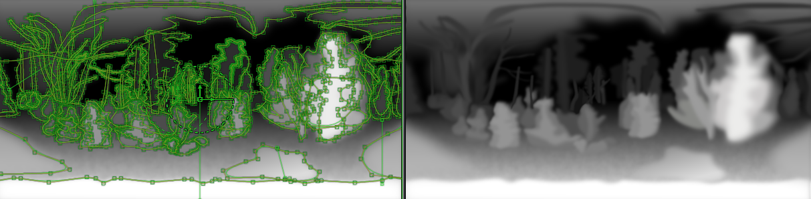
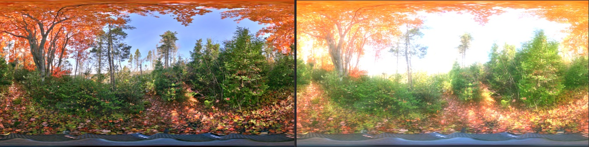

# Filter Macros

## BlurPanoramicWrap

The BlurPanoramicWrap node applies a soft blurring effect that is panoramic 360&deg; aware and wraps around the left/right frame border edges to avoid a visual seam artifact that would happen if you used Fusion's built in blur node.

In this example the BlurPanoramicWrap macro is used to create a title graphic with the Text+ character generator applied as an effects mask. The alpha channel on the text is inverted so it results in the background of the image being filled with a soft blurry effect while the text is clear.

The Red/Green/Blue/Alpha checkbox controls allow you to toggle the output of the blur filter effect per channel in the image.

The "Lock X/Y" checkbox allows you to choose if you want the Blur Size control to be uniform on the X and Y axis. If you disable the the "Lock X/Y" checkbox then you can individually adjust the Blur Size with a pair of "X Blur Size" and "Y Blur Size" controls.

The "Blur Size" control allows you to change the radius of the blur effect.

The gradient controls at the bottom of the node parameters in the GUI along with the gradient "line" placement control in the viewer window allow you to sculpt the fade-off of the blur effect. This can be used to good effect to make the pole regions clearer and less blurry in an equirectangular image. The Red channel in the gradient control drives the effect with 0 equalling no blur, and 1 equalling a full strength blur.

The "Blend" control allows you to mix a percentage of the original image back into the blur effect rendered image.

You can also use the effect mask control input to add your own vector mask or greyscale map to control where the blur effect is applied.

## ColorCorrectorMasked

This node is a hybrid color corrector that allows you to use an internal gradient generator to selectively apply color correction to an image.

This is useful for example, if you want to target the color correction effect on a specific part of the frame using a linear gradient to fade off the strength of the color correction. This can help target the adjustments to the Zenith/Nadir pole regions, or for the left and right seam edge of a LatLong frame.

The ColorCorrectorMasked node is also good for applying graduated neutral density filter style color corrections that can restore the details in the cloud and sky region of a panorama.

You can control the gradient's start position and end position visually using either the red or green colored square box control handles in the viewer window when the node is selected, or numerically by entering the raw position values in the node settings.

The "Width" control is used to specify the horizontal resolution of the gradient mask used for the color correction.

The "Height" control is used to specify the vertical resolution of the gradient mask used for the color correction.

The "Depth" control is use to specify the gradient mask's bit depth / color precision. The "Default" setting for the Depth control is usually fine. If you are working with high dynamic range imagery and need to avoid banding artifacts on the gradient effect you can try either the "16bit float" or "32bit float" options.

The Linear/Reflect/Square/Cross/Radial/Angle buttons let you choose what gradient mode is used when masking the color corrector effect. The Linear or Radial options are used about 90% of the time. If you are working with a LatLong image projection you will likely use the linear mode all of the time. If you are working with an angular fisheye or "Domemaster" image you will probably want to experiment with the radial mode.

The "Start" and "End" controls let you choose the beginning and ending zones for the color correction effect masking. You can visually control these settings in the viewer window with the two small box control handles, or you can numerically adjust these settings in the node settings.

This is an example of targeting the color correction effect on the vertical axis by setting the gradient control handles to Start X=0.5 Y=1.0 and End X=0.5 Y=0.5:

This is an example of targeting the color correction effect on the horizontal axis by setting the gradient control handles to Start X=1.0 Y=0.5 and End X=0.5 Y=0.5:

**Tip:** Typically I will drag the control handles to their rough position in the viewer window using the visual control handles, and then round those values off to a precise setting by adjusting the start and end numeric values to lock a specific handle to either: the edge of the frame, the exact middle point of the frame, or to keep the gradient perfectly horizontally or vertically aligned with no leaning or tilting effect.

The Gradient color control sliders allow you to add more control handles to the gradient ramp, or to adjust the RBA values numerically. As a note, the alpha channel "A" slider in the gradient color sliders section is what controls the masking effect, not the RGB channels color sliders.

You can move the low and high points on the gradient by pulling the triangular controls that are located below the gradient band in the node settings:

The remaining visual controls in the ColorCorrectorMasked node are identical feature wise to the standard Fusion Color Corrector node.

If you need more control for the placement of the masking and color correction effects, you can always stack up several of the ColorCorrectorMasked nodes in a row connected to each other if you want to control the color correction on different parts of the frame.

The ColorCorrectorMasked node and the [AlphaMaskErode](macros-guide-filters#AlphaMaskErode) nodes are primarily designed to work with imagery that was stitched and warped in a program like PTgui with the individual layers mode enabled. This gives you footage that is ready for use with a compositing package and means you can easily refine the stitching and blending on each view from a multi-camera panoramic 360&deg; rig.

A pair of AlphaDivide and AlphaMultiply nodes are internally connected to the ColorCorrectorMasked node so you don't have to worry about pre-multiplication artifacts showing up like elevated black levels.

**Tip:** You should start by entering the current image's width and height settings at the top of the `ColorCorrectorMasked` node settings before you begin using the node. If these settings aren't set correctly the masking effect won't line up with the frame size.

To use the ColorCorrectorMasked node, the source imagery is connected to the node's "Input" attribute. There is a single output from the node called "Output".

## DefocusPanoramicWrap

The DefocusPanoramicWrap node applies a defocus / bokeh lens blur effect that is panoramic 360&deg; aware and wraps around the left/right frame border edges to avoid a visual seam artifact that would happen if you used Fusion's built in Defocus node.

The "Filter" control is used to choose if you want a slow to render but high quality "Lens" blur with a shaped out of focus bokeh region, or a faster to render "Gaussian Blur" that is uniform in its shape.

The "Defocus Size" is the primary control for adjusting the blurriness of the defocus effect.

The "Bloom Level" and "Bloom Threshold" allow you to control how the highlights are blown out in the out of focus regions in the image.

The "Lens Type" control allows you to choose the shape of the bokeh blur effect. You can choose to use a polygonal shape with a variable number of sides, or a pure circular bokeh blur geometry.

The "Lens Angle", "Lens Sides", and "Lens Shape" controls adjust the look of the shaped blur region.

The Lens Sides control only applies when you have the Lens Type control set to one of the NGon options. This lets you have a hexagon, octogon, or higher number of polygon sides present in each bokeh spot.

The "Use OpenCL" checkbox allow you to choose if you want to render the effect on the CPU or using your GPU. If you are rendering a bokeh blur with either a high resolution image, or with a large defocus size you will likely have to use the CPU option (which means having the "Use OpenCL" checkbox disabled).

The "Blend" control allows you to mix a percentage of the original image back into the defocus effect rendered image.

The gradient controls at the bottom of the node parameters in the GUI along with the gradient "line" placement control in the viewer window allow you to sculpt the fade-off of the defocus effect. This can be used to good effect to make the pole regions clearer and less blurry in an equirectangular image. The Red channel in the gradient control drives the effect with 0 equalling no defocus, and 1 equalling a full strength defocus.

You can also use the effect mask control input to add your own vector mask or greyscale map to control where the defocus effect is applied.

## DepthBlurPanoramicWrap

The DepthBlurPanoramicWrap node applies a depthmap driven variable defocus / bokeh style lens blur kind of effect that is panoramic 360&deg; aware and wraps around the left/right frame border edges to avoid a visual seam artifact that would happen if you used Fusion's built in DepthBlur node.

This image is a DepthBlurPanoramicWrap example from the included compositing file "Stereo 3D Roto Conversion.comp".

This image below shows the rotoscope drawn greyscale depth map that was connected to the "depth" input on the DepthBlurPanoramicWrap node to create the varying depth of field effect. The depthmap image is also an element from the demo file "Stereo 3D Roto Conversion.comp".

The "Depth Blur Channel" is set to Luma (Luminance) by default. This is used to let the node known what RGB/A/Z channel is providing the required depthmap information to the node's "depth" input connection.

The "Depth Blur Filter" control is used to choose if you want a slow to render but high quality lens blur effect with the "Super Soften" mode, a medium fast to render "Soften" mode, or a quick to render but cubic looking blur with the "Box" option.

The "Depth Blur Size" control adjusts the overall blurriness of the defocus effect.

The DepthBlurPanoramicWrap node has three inputs: An "image" input for the panoramic media, a "depth" input for the depthmap imagery, and an "Effect Mask" which can be used to disable the depth blur effect selectively in the frame.

## DisplaceEquirectangular

The DisplaceEquirectangular macro node pushes and pulls the pixels in a panoramic 360&deg; image to turn a 2D panorama into a stereosopic 3D panoramic output by generating the extra missing eye camera view required to have a stereo pair image. The displacement effect is wrapped around the left/right frame border edge to create a seamless result.

Here is a wiggle format GIF animation that shows the generated "in between" stereoscopic camera views that are possible to create from an original 2D mono panorama with this node. This image was created using the included demo file "Stereo 3D Roto Conversion.comp" that also has an over/under stereo image output as well that can be viewed on an HMD.

This image below shows the rotoscope drawn greyscale depth map that was connect to the "depth" input on the DisplaceEquirectangular node to create the above wiggle animation. Each of the rotosplines are give a specific greyscale shaded depth value from 0-1 which represents the depth from the back of the world to the front of the scene. The depthmap image is also an element from the demo file "Stereo 3D Roto Conversion.comp".

The "Depth Input Channel" button is set to Luma (Luminance) by default. This control is used to let the node know what RGB/A/Luminance channel is providing the required depthmap information to the node's "depth" input connection.

The "Stereo Convergence" control provides a horizontal offset style of control to shift the simulated "zero parallax point" in the displacement effect which allows you to choose where the neutral depth is in the scene.

The "Stereo Depth Displacement" control is the primary control for this node and it is used to shift all of the pixels in the image horizontally based upon the greyscale value of the depthmap image. This can be used to excellent effect to create a 2D monoscopic to 3D stereo image conversion.

The "Depth Blur Filter" control allows you to choose the style of depth map blurring you want to apply. Gaussian is the smoothest choice available.

The "Depth Blur Size" control allows you to smooth out the differences in the depth map image details that are connected to the "depth" input on the node before the displacement effect is applied. This can even out large disparities in the depthmap and remove high frequency noise.

The DisplaceEquirectangular node has three inputs: An "image" input for the panoramic media, a "depth" input for the depthmap imagery, and an "Effect Mask" which can be used to disable the displacement effect selectively in the frame.

## GlowPanoramicWrap

The GlowPanoramicWrap node applies a soft glowing effect that is panoramic 360&deg; aware and wraps around the left/right frame border edges to avoid a visual seam artifact that would happen if you used Fusion's built in glow node.

The GlowPanoramicWrap node is perfect if you are creating panoramic 360&deg; CG renderings and are trying to simulate bright light sources with halos. This node can help you render your image correctly where the glow needs to be emanating from the incandescent surface and fully wrap around the frame edge like the image below illustrates:

The Red/Green/Blue/Alpha checkbox controls allow you to toggle the output of the glow filter effect per channel in the image.

The "Lock X/Y" checkbox allows you to choose if you want the Glow Size control to be uniform on the X and Y axis. If you disable the the "Lock X/Y" checkbox then you can individually adjust the Glow Size with a pair of "X Glow Size" and "Y Glow Size" controls.

The "Glow Size" control allows you to change the radius of the glowing effect.

The "Glow" control is the overall intensity of the glowing light that is overlaid on the image.

The "Blend" control allows you to mix a percentage of the original image back into the glow effect rendered image.

The "Apply Mode" control lets you choose the way the glow effect is composited with the orignal imagery.

The "Red Scale", "Green Scale", Blue Scale", and "Alpha Scale" sliders let you tune the overall intensity of the glowing effect for each individual image channel in the rendered output.

The gradient controls at the bottom of the node parameters in the GUI along with the gradient "line" placement control in the viewer window allow you to sculpt the fade-off of the glow effect. This can be used to good effect to make the pole regions clearer and less glowy in an equirectangular image. The Red channel in the gradient control drives the effect with 0 equalling no glow, and 1 equalling a full strength glow.

You can also use the effect mask control input to add your own vector mask or greyscale map to control where the glow effect is applied.

## SharpenPanoramicWrap

The SharpenPanoramicWrap node applies a sharpening effect that is panoramic 360&deg; aware and wraps around the left/right frame border edges to avoid a visual seam artifact that would happen if you used Fusion's built in sharpen node.

(As a tip, the UnSharpenMaskPanoramicWrap node is also a nice node to use to improve the overall crispness of an image too and can be a little more nuanced in it's sharpening effect.)

This image has the sharpening effect cranked up really high so the effect is easily visible but harsh. The SharpenPanoramicWrap node should be used subtly for a gentle improvement of clarity.

The Red/Green/Blue/Alpha checkbox controls allow you to toggle the output of the sharpen filter effect per channel in the image.

The "Lock X/Y" checkbox allows you to choose if you want the Amount control to be uniform on the X and Y axis. If you disable the the "Lock X/Y" checkbox then you can individually adjust the Amount with a pair of "X Amount" and "Y Amount" controls.

The "Blend" control allows you to mix a percentage of the original image back into the sharpen effect rendered image.

The gradient controls at the bottom of the node parameters in the GUI along with the gradient "line" placement control in the viewer window allow you to sculpt the fade-off of the sharpen effect. This can be used to good effect to make the pole regions clearer and less sharpened in an equirectangular image. The Red channel in the gradient control drives the effect with 0 equalling no sharpening, and 1 equalling a full strength sharpen.

You can also use the effect mask control input to add your own vector mask or greyscale map to control where the sharpen effect is applied.

## UnSharpenMaskPanoramicWrap

The UnSharpenMaskPanoramicWrap node applies a sharpening effect that is panoramic 360&deg; aware and wraps around the left/right frame border edges to avoid a visual seam artifact that would happen if you used Fusion's built in un-sharpen mask node.

The UnSharpenMaskPanoramicWrap node should be used subtly for a gentle improvement of clarity.

The Red/Green/Blue/Alpha checkbox controls allow you to toggle the output of the sharpen filter effect per channel in the image.

The "Lock X/Y" checkbox allows you to choose if you want the Size control to be uniform on the X and Y axis. If you disable the the "Lock X/Y" checkbox then you can individually adjust the Size with a pair of "X Size" and "Y Size" controls.

The "Size" control allows you to adjust the overall radius of the un-sharpen mask effect on the image.

The "Gain" controls allow you to fine tune the intensity of the un-sharpen filter.

The "Threshold" control allows you to adjust the equivalent of a cut in point where the un-sharpen filter is active.

The "Blend" control allows you to mix a percentage of the original image back into the sharpen effect rendered image.

The gradient controls at the bottom of the node parameters in the GUI along with the gradient "line" placement control in the viewer window allow you to sculpt the fade-off of the sharpen effect. This can be used to good effect to make the pole regions clearer and less sharpened in an equirectangular image. The Red channel in the gradient control drives the effect with 0 equalling no un-sharpening, and 1 equalling a full strength un-sharpen.

You can also use the effect mask control input to add your own vector mask or greyscale map to control where the un-sharpen filter is applied.

