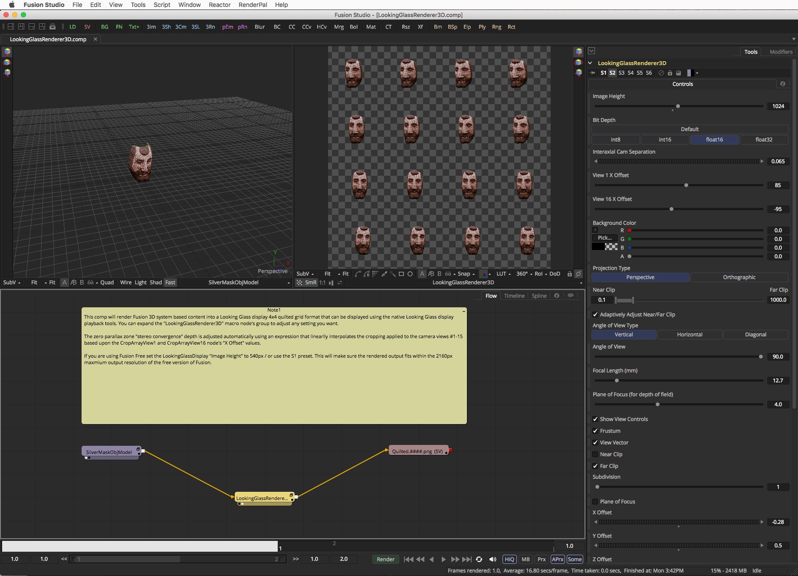
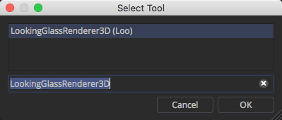
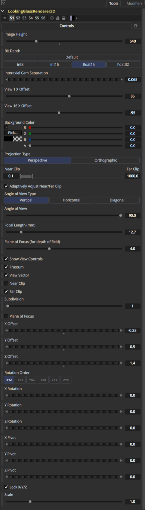
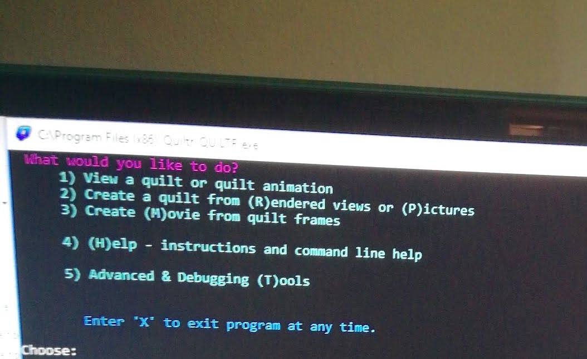

# LookingGlass Macros

## <a name="LookingGlassRenderer3D">LookingGlassRenderer3D</a>

The `LookingGlassRenderer3D` macro is a proof of concept Looking Glass "quilted" grid 16 view rendering node.

The `Tools > Macro > KartaVR > Looking Glass > LookingGlassRenderer3D` menu item can be used to add the node to your comp.

### Select Tool Dialog

You can also use the `Shift+Spacebar` hotkey in the Flow area to display the `Select Tool` dialog. As you start to type in the `LookingGlassRenderer3D` macro node name into the `Select Tool` dialog, the list will be filtered down to just the node you want to add. Press the `OK` button to insert the node in your comp.

## Usage

This image shows the controls on version 1 of the  `LookingGlassRenderer3D` node.

### Node Connections

To use the node you need to add the `LookingGlassRenderer3D` node to your Fusion comp. Connect the Fusion 3D system based 3D scene to the node's yellow input connection.

The red output connection on the `LookingGlassRenderer3D` node generates a rendered 2D image with a 16 view, 4x4 quilted, tiled grid image layout.

### Adjusting the Settings

The `Interaxial Cam Separation` control allows you to adjust the strength of the stereo effect. This control will shift each of the cameras in the linear array apart from each other by a unified `X Offset` translation value on each Camera3D node.

The `View 1 X Offset` and `View 16 X Offset` controls allow you to shift the zero parallax distance in the rendered image. When you adjust the two `View 1 & 16 X Offset` controls, the zero parallax distance "stereo convergence" depth is adjusted automatically for all of the in-between cameras in the rig using an expression that linearlly interpolates the cropping applied to the camera views #1-15 based upon the `CropArrayView1` and `CropArrayView16` node's `X Offset` values.

If you are using Fusion Free set the LookingGlassDisplay "Image Height" to 540px / or use the S1 preset. This will make sure the rendered output fits within the 2160px maxmium output resolution of the free version of Fusion.

### Output Resolution

If you are using Fusion Free then you should set the output resolution `Image Height` setting to 540px to keep the output within the 3840x2160px maximum frame size.

If you are using Fusion Studio then you should set the output resolution `Image Height` setting to 1024px to generate a 4096x4096 image output.

## Quiltr Metadata Notes

The Looking Glass Quiltr app allows you to use a CLI app to add a custom set of metadata tags to your stereo linear array rendered imagery to define the X and Y image grid layout.

The Looking Glass Quiltr application is installed to:

`C:\Program Files (x86)\Quiltr\QUILTR.exe`

If you are curious, you can take a peek at the metadata tags that the QUILTR app embeds into your imagery. The exiftool program shows the embedded QUILTR metadata tags as:

		Background Color                : 65535 65535 65535
		Comment                         : <lkg><properties vX=4 vY=4 pixelAspect=1/><info renderer="KartaVR"/></lkg>

Exiftool makes it easy to embed a Looking Glass `QUILTR` style comment tag in your imagery:

Green Lantern 5x9 Quilted Image:

		exiftool -overwrite_original -Comment='<lkg><properties vX=5 vY=9 pixelAspect=1.3/><info renderer="KartaVR"/></lkg>' /Volumes/Media/Green_Lantern_5x9_Quilted.0001.jpg

Silver Mask 4x4 Quilted Image:

		exiftool -overwrite_original -Comment='<lkg><properties vX=4 vY=4 pixelAspect=1/><info renderer="KartaVR"/></lkg>' /Volumes/Media/Silver_Mask_4x4_Quilted.0001.jpg

## Fusion Macro Todos

After creating this initial v1 macro I realized there is an even more powerful approach that could be used to align the rendered stereo images, and to precisely tune the zero parallax distance setting at the pixel level in each of the rendered multi-camera array views.

Fusion has a Locator3D node that can be placed in the 3D workspace. This node converts the actual 3D coordinates of a locator as seen in a camera's viewing frustum into 2D screen space coordinates that are aligned to the rendered image. The Locator3D node could be used with each camera view to provide an automatic stereo convergence alignment that would match an arbitrary point in the scene, and it would live update as the Interaxial Cam separation value is adjusted.

