# Mask Macros #

## AlphaMaskErode ##

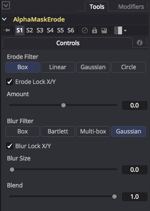

The AlphaMaskErode macro helps dilate/erode, and blur the edge of an alpha mask. This is useful for smoothly blending together multi-camera panoramic 360&deg; footage that was stitched in PTgui with the "individual layers" or "individual HDR layers" export options.

This node is great for contracting the border of an alpha channel when doing masking on tripod removal tasks, or to help smooth the junction of UV pass converted panoramic imagery when you have overlapping hard edges on the image layers you want to composite together.

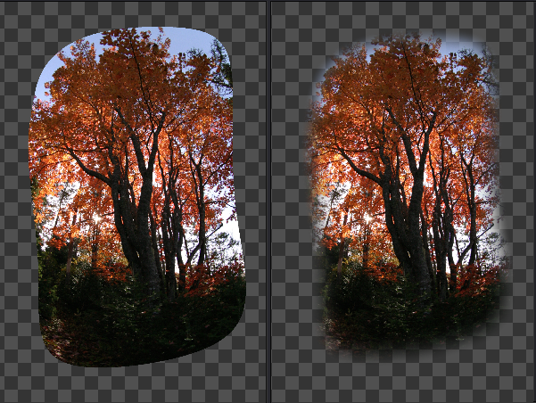

The "Erode Filter" control is used to specify if you want to shrink the alpha channel using a hard "box" style erode/dilate setting, or you could use a soft and smooth "Gaussian" type of erode/dilate effect.

The "Erode Lock X/Y" control is used to choose if you want to control the alpha channel contracting "Erode Amount"  with one linked control, or with two separate horizontal (Erode X Amount) and vertical (Erode Y Amount) controls.

The "Erode Amount" control is used to expand/shrink the alpha channel mask border using an erode/dilate type of image filtering effect. You can contract the alpha channel inwards in different geometric ways depending on your choice of "Erode Filter" setting.  The Box filter gives a hard edge contraction, and Gaussian filter will be very soft and diffused.

The "Blue Filter" control is used to specify what type of smoothing effect is used when the blur is generated. Generally speaking "Gaussian" is a good choice for almost all use cases.

The "Blur Lock X/Y" control is used to choose if you want to control the alpha channel frame blurring "Blur Size"  with one linked control, or with two separate horizontal (Blur X Size) and vertical (Blur Y Size) controls.

The "Blur Size" control is used to soften and blur out the alpha channel mask after the erode control has been used to erode/dilate the mask border.

**Note:** The Blur controls should only be used if you are truly contracting the frame border smaller using the dilate erode options. If you are not watching what you are doing and have set the erode mode to dilate and expand the mask outwards, the blurred/feathered edge can add a slight clipped hard edge "cookie cutter" effect at the matte border!

The "Blur Blend" control is used to choose if you want to mix in a percentage of the original image with the blurred image result. A value of 1.0 will show only the blurred output, a value of 0.5 will show 50% of the blurred result mixed with 50% of the original unblurred image, and a value of 0.0 will show only the original unblurred image.

The output from the AlphaMaskErode node is called "output". Typically you would connect an RGBA image with an alpha channel into the AlphaMaskErode node and effect it directly.

You can also use the AlphaMaskErode node on an image that only has an alpha channel or a vector BSpline mask and then send the contracted / expanded shape result on to another node using the typical "Effect Mask" connection approach.

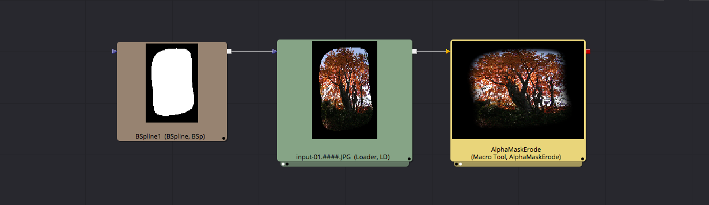

## AlphaMaskMerge ##

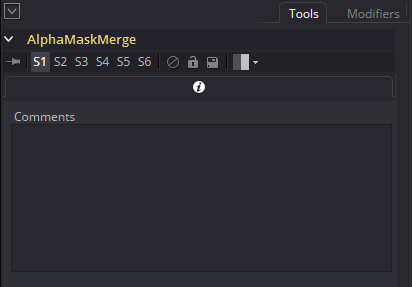

The AlphaMaskMerge node allows you to merge an external alpha mask image / B-Spline mask with the current image data. Then an Alpha Multiply operation will clean up transparent areas in the image and fill them with black in the RGB channels by pre-multiplying the alpha channel data.

This macro cuts down on the node sprawl when creating a Fusion based UV Pass panoramic stitching project file.

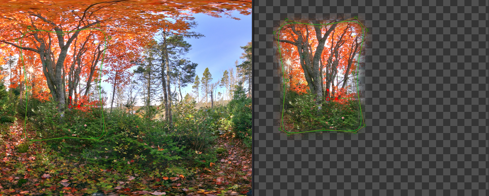

**Noe:** If you set the AlphaMaskMerge node to "bypass" mode then the external alpha channel matte input will be skipped and the original RGB image will pass through the node unaffected.

The AlphaMaskMerge node has two inputs called "Image" and "EffectMask". The output from the AlphaMaskMerge node is called "output".

To use the AlphaMaskMerge node you would connect an RGB image to the "image" channel and a B-Spline mask to the "EffectMask" channel.

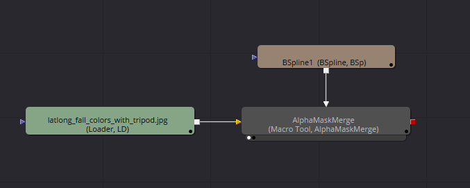

## FisheyeCropMask ##

The FisheyeCropMask macro generates a circular alpha channel mask element with a customized control for clipping off and feathering out the square border edges on an angular fisheye image that was filmed using a typically cropped (non full-frame edge preserving) 16:9 aspect ratio video sensor.

This node was added primarily for its use in helping create quick and painless blending masks for use in 360&deg; image stitching workflows in the KartaVR [PTGui Project Importer](scripts#ptgui-project-importer) script.

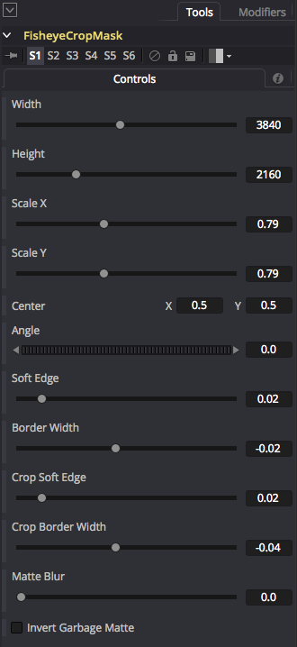

When the Crop Soft Edge and Crop Border Width controls are used to bring in the rectangular edges of the FisheyeCropMask node you will get a fisheye mask that looks like this:

The when the scaling controls are used in the Fusion Viewer window they will adjust the ScaleX/Scale Y settings. The 2D move manipulator in the viewer window will adjust the Center X and Center Y settings on the node.

Matte Blur is used to smooth out the edges of the alpha channel and can turn harsh corners where the rectangle border edge trims off the circular mask into super smooth rounded corners.

## FisheyeMask ##

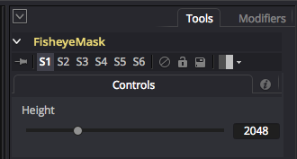

The FisheyeMask macro generates a circular alpha channel mask element that is useful for cutting out the border around a domemaster or angular fisheye image and making that area transparent.

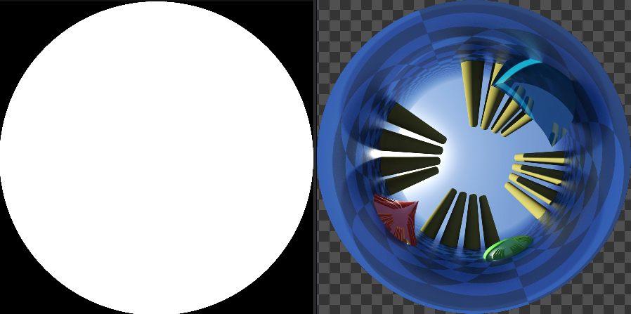

The "Height" control is used to specify the vertical resolution of the FisheyeMask node output. The final width for the mask will be the Height value due to the fact angular fisheye images have a natural 1:1 aspect ratio.

The output from the FisheyeMask node is called "Mask". The FisheyeMask node's output is typically connected to an image node's "Effect Mask" input.

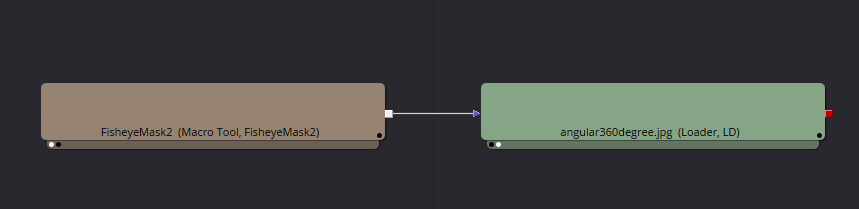

## PTGuiMatteControl ##

The PTGuiMatteControl macro is used to process imagery that has a mix of red and green color channel data that was generated by the [PTGui Mask Importer](scripts#ptgui-mask-importer) script. The PTGui mask imagery is connected to the PTGuiMatteControl node's "image" input. The PTGuiMatteControl node will isolate the green/red color include and exclude masking information that was sourced from a PTGui project and split it into two separate alpha mask output appropriately named "Exclude" and "Include". 

A BSpline curve is typically connected to the Garbage Mask input on the PTGuiMatteControl node. There is a modified version of the MatteControl UI present in this node which is used when refining the mask edges and applying the garbage mask. This UI gives you the possibility of outputting a pre-multiplied alpha channel. The Garbage Mask feature in the  PTGuiMatteControl node will equally cut away at both the include and exclude masking alpha channel outputs so it works like a big cookie cutter.

The "Matte Blur" control is very handy for giving a nice smooth edge feathering to the masking data if you want to soften a hard edge.

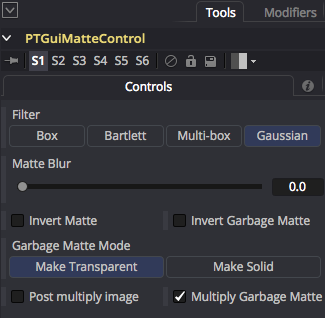

## SplitViewMaskInline ##

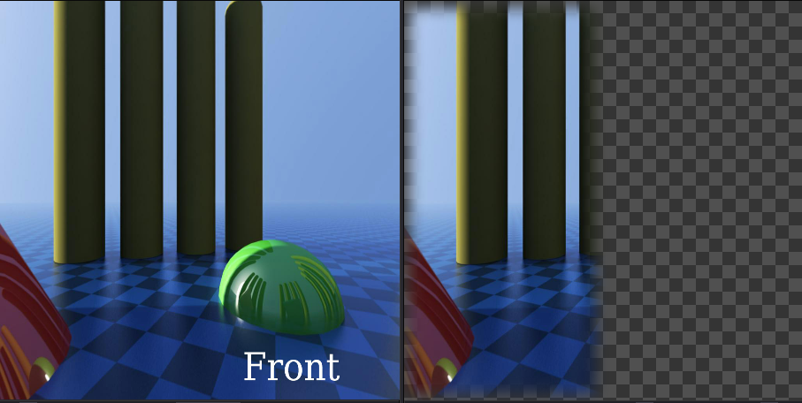

The SplitViewMaskInline macro is used to mask the left/right or top/bottom view layouts when stitching circular "ring" shaped multi-camera stereo 360&deg; camera rigs. This node is special as it works downstream in the Fusion comp and can be placed after the loader node.

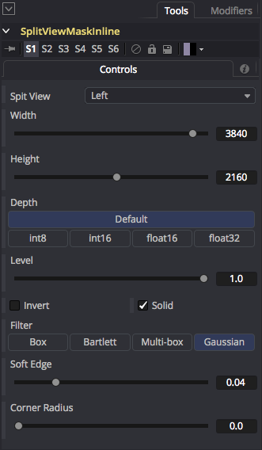

The **Split View** options menu has entries for "Left", "Right", "Top", "Bottom", and "Full Frame" masking:

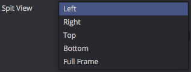

The **Invert** control can flip the include/excluded areas of the mask image.

The **Invert** control can flip the include/excluded areas of the mask image.

The **Soft Edge** control makes it easy to apply a smooth feathering effect to the mask which makes blending the camera view images easier when the camera rig footage is connected to a Merge node.

The **Corner Radius** control turns a square shaped mask into a rounded rectangle by applying a circular radius to the edges of the shape.

A Loader node output is connected to the SplitViewMaskInline.Background input connection.

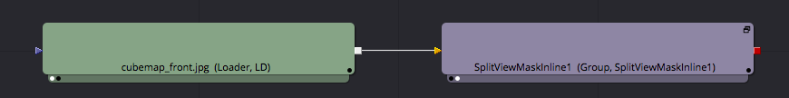

## SplitViewMaskRectangle ##

The SplitViewMaskRectangle macro is used to mask the left/right or top/bottom view layouts when stitching circular "ring" shaped multi-camera stereo 360&deg; camera rigs. This node is typically connected to the EffectsMask input on a Loader node.

The SplitViewMaskRectangle node has a mask input that can be used to connect b-spline rotoshapes to further control what part of the image is masked and "clipped out".

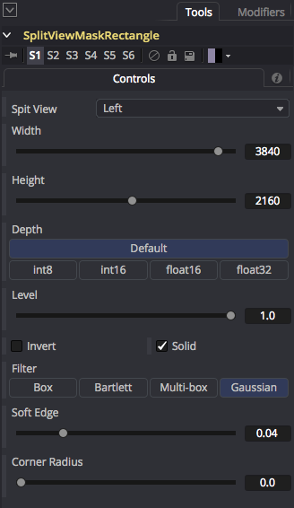

The **Split View** options menu has entries for "Left", "Right", "Top", "Bottom", and "Full Frame" masking:

The **Invert** control can flip the include/excluded areas of the mask image.

The **Soft Edge** control makes it easy to apply a smooth feathering effect to the mask which makes blending the camera view images easier when the camera rig footage is connected to a Merge node.

The **Corner Radius** control turns a square shaped mask into a rounded rectangle by applying a circular radius to the edges of the shape.

The SplitViewMaskRectangle node output connection is typically connected to a Loader.EffectsMask input when the original unstitched panoramic camera rig media files are loaded into Fusion.

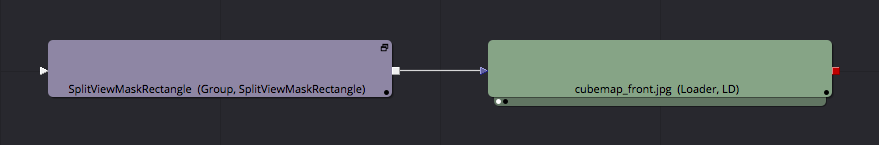