# Miscellaneous Macros #

## DomemasterCrossbounceSim ##

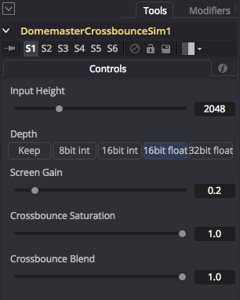

The DomemasterCrossbounceSim macro creates a simple fulldome crossbounce lighting simulation using fast 2D image operations. This crossbounce simulation mimics the contrast robbing effect that happens in a planetarium theater when video projectors are used to display imagery on a 180&deg; hemispherical dome surface. The crossbounce light spill effect is caused by stray light bouncing across from one side of the hemisphere screen in a dome theater and will raise the ambient lighting levels on the opposite part of the dome screen.

**Note:** This macro is able to provide a blazing fast interactive preview of the crossbounce lighting issue because it skips the more complex stages of modeling the full theater environment such as the floor area of the room, the theater seating, walls, and the audience that a full global illumination based lighting simulation might be able to perform.

Here is a view of a raw crossbounce lighting simulation that was created with the "Crossbounce Blend" control set to 0:

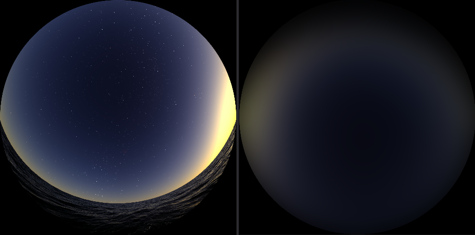

Here is a view of a raw crossbounce lighting simulation that was created with the "Crossbounce Blend" control set to 0, and the "Crossbounce Saturation" was set to 0 to create a desaturated greyscale / luminance style output:

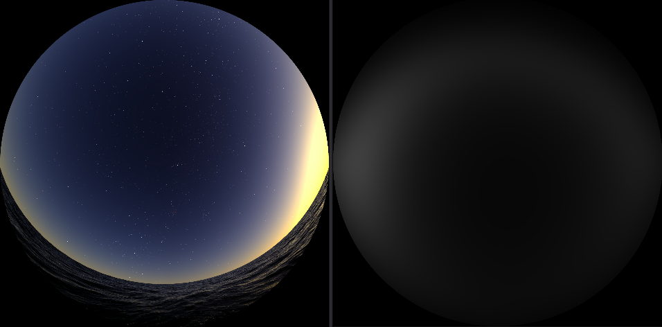

This is a view of a crossbounce lighting simulation where the simulation data was automatically composited over the original fulldome plate footage. This was created by setting the "Crossbounce Blend" control to 1:

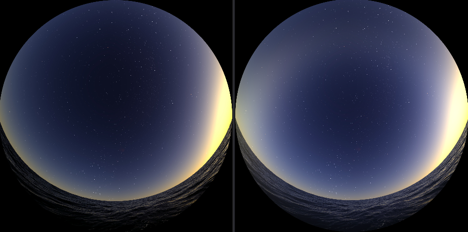

The "Input Height" control is used to specify the vertical and horizontal resolution of the rendered domemaster view.

The "Depth" control allows you to specify the bit depth for the panoramic output. It is a good idea to leave this setting at its default value of float 16. If you do want to change the Depth value you could also choose a float 32 mode.

The "Screen Gain" control is used to adjust the reflectivity of the dome theater's projection screen surface coating and can be thought of as an approximation of the albedo or reflection coefficient. The Screen Gain control will typically be set to a value between 0.1 and 0.25.

The "Crossbounce Saturation" control allows you to adjust the color purity of the crossbounced light. A setting of 1 means a fully detailed and saturated color will be used, a value of 0.5 will use 50% color saturation on the crossbounce reflected light, and a value of 0 will use the greyscale luminance intensity value when calculating the crossbounce light effect.

When the "Crossbounce Blend" control is set to 0 you get the raw crossbounce light contribution information. When the Crossbounce Blend control is set to 1.0 you get a combination of the crossbounce lighting simulation data that is then composited on top of the original fulldome imagery.

This example shows how you might create a crossbounce lighting simulation of fulldome imagery using the DomemasterCrossbounceSim node. The crossbounce sim output was then saved to disk with the help of a saver node.

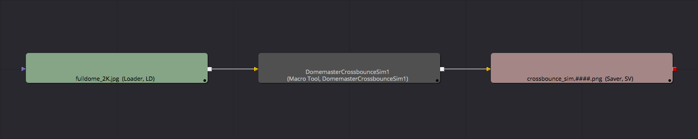

This example shows how you can use a LatLong format source image as part of a fulldome crossbounce lighting simulation. For this screenshot the loader node opened up a LatLong format source image. Then an Equirectangular2Domemaster220 node was used to convert the original LatLong footage into a domemaster format before it was sent into the DomemasterCrossbounceSim node. After the crossbounce simulation was computed, the resulting fulldome format output was saved to disk.

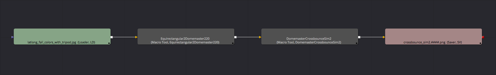

## MayaBackgroundGradient ##

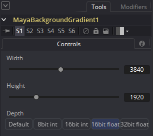

The MayaBackgroundGradient macro generates a rectangular frame with a version of the Maya style viewport gradient effect.

The "Depth" control allows you to specify the bit depth for the panoramic output. The "8bit int" option is for PNG/TGA/JPG outputs, and the "16bit float" or "32bit float" options are perfect for floating point EXR based outputs that have HDR (high dynamic range) based color values that exceed the standard 0.0-1.0 color range.

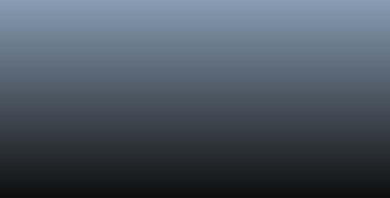

This example shows how you might route the MayaBackgroundGradient node as a background layer to a merge node in a comp. Typically, either 3D rendered content or a character generator like Text+ would be wired in for the foreground imagery.

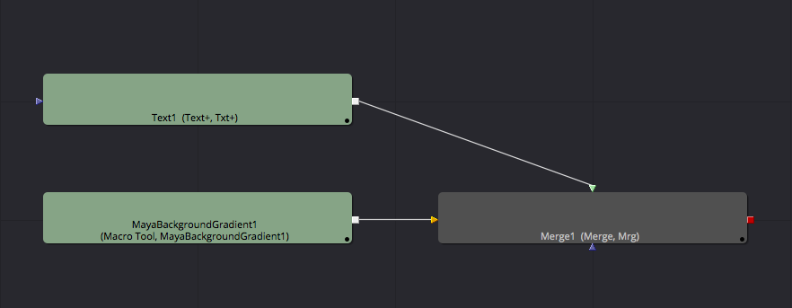

## MayaBackgroundGradientCubicFaces ##

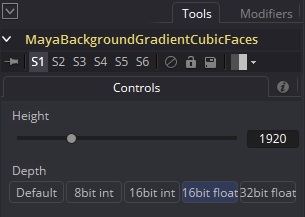

The MayaBackgroundGradientCubicFaces macro generates a set of six 90&deg; FOV cubic faces with a panoramic version of the Maya style viewport gradient effect.

The "Depth" control allows you to specify the bit depth for the panoramic output. The "8bit int" option is for PNG/TGA/JPG outputs, and the "16bit float" or "32bit float" options are perfect for floating point EXR based outputs that have HDR (high dynamic range) based color values that exceed the standard 0.0-1.0 color range.

The following image shows result of sending the panoramic cubic output from the MayaBackgroundGradientCubicFaces macro into a CubicFaces2VerticalCross node:

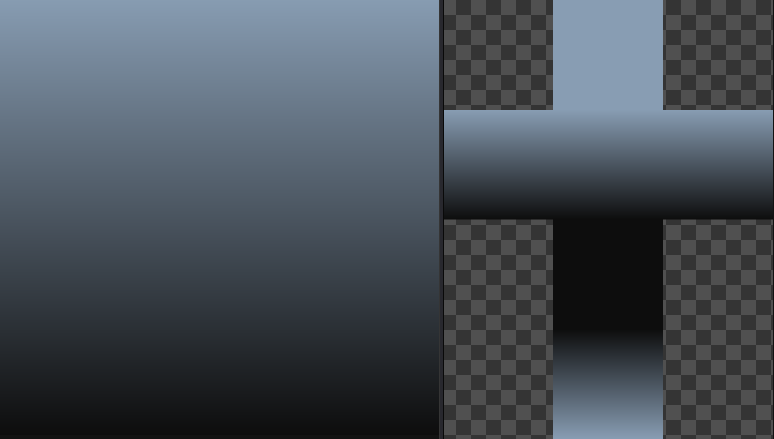

There are six image outputs from the node called `Front`, `Right`, `Back`, `Left`, `Top`, and `Bottom`.

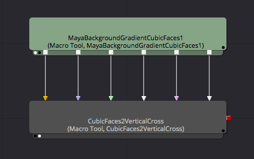

## MayaBackgroundGradientEquirectangular ##

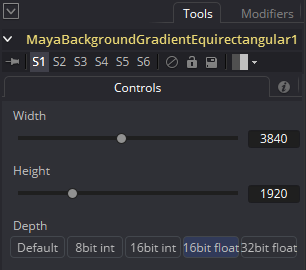

The MayaBackgroundGradientEquirectangular macro generates an equirectangular/LatLong/spherical panoramic version of the Maya style viewport gradient effect.

The "Depth" control allows you to specify the bit depth for the panoramic output. The "8bit int" option is for PNG/TGA/JPG outputs, and the "16bit float" or "32bit float" options are perfect for floating point EXR based outputs that have HDR (high dynamic range) based color values that exceed the standard 0.0-1.0 color range.

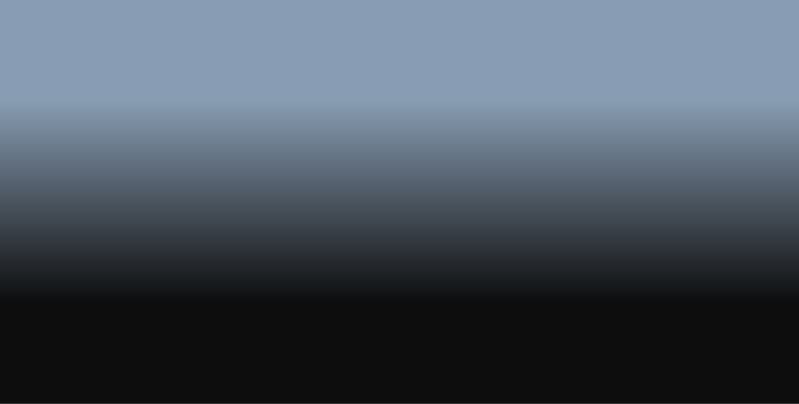

This example shows how you might route the MayaBackgroundGradientEquirectangular node as a background layer to a merge node in a comp. Typically, either 3D rendered content or a character generator like Text+ would be wired in for the foreground imagery.

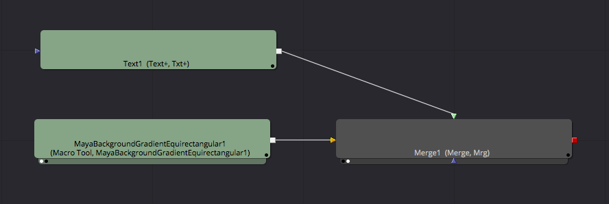

## SaverIntool ##

The `SaverIntool` macro adds an FFMPEG Encoding Intool **End Render Script**. This Fusion Intool script is used to FFMPEG encode your saver node rendered image sequences into MP4 H.264 movies. If the Saver node footage is in the EXR format a gamma 1.0 to 2.2 conversion applied automatically.

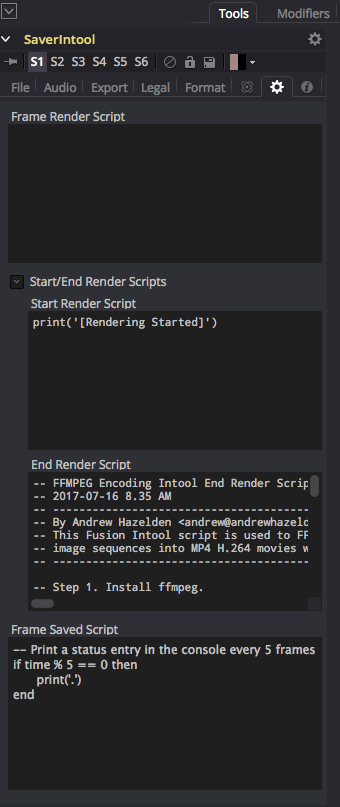

**Step 1.** Install ffmpeg. 

Windows ffmpeg Download URL: 

[https://ffmpeg.org/download.html](https://ffmpeg.org/download)

MacOS Homebrew Based Install (ffmpeg comes bundled with KartaVR on macOS):

    brew install ffmpeg

CentOS Install:

    sudo yum -y install ffmpeg

Ubuntu Install:

    sudo add-apt-repository ppa:mc3man/trusty-media
    sudo apt-get update
    sudo apt-get dist-upgrade
    sudo apt-get -y install ffmpeg 

**Step 2.** Add the "SaverIntool" node to your composite and enter a filename for your rendered image sequence.

**Step 3.** Change the script's "ffmpegProgramPath" variable to point to the absolute filepath of the installed copy of ffmpeg. 

On Mac/Linux you can find out the active ffmpeg path using: "which ffmpeg". On Windows you should install ffmpeg to `C:\ffmpeg\bin\ffmpeg.exe`.

**Step 4.** Render a short test sequence in Fusion. You should have a new .mp4 movie and a log .txt file saved in the same folder as your rendered image sequence. If you have a saver node based Sound Filename entered it will be added automatically as an audio track to the encoded movie file.

### Script Notes ###

- You can edit the "audioFilename" variable to choose if you want the Saver node's audio track included in the movie or if you want to use the Fusion timeline based audio clip.

- ffmpeg might truncate the frame size using the EXR window data if the background image area is transparent.

- Fusion 8.2.1 on Linux doesn't process the `cmp = fusion:GetCurrentComp()` command so a fallback mode of "cmp = fusion" option will be used. This means comp specific PathMaps are ignored on Fusion 8 on Linux and only Global setting based PathMaps work.

## SetMetadataVR ##

The `SetMetadataVR` macro allows you tag footage with image projection and stereo display metadata. 

This node is handy if you have manually resized panoramic imagery away from the image projection's standard aspect ratio and are having issues loading the footage into Fusion's native 360&deg; media viewer when the "Auto" mode is active. An example of this would be trying to load a 1:1 aspect ratio equirectangular/LatLong/Spherical image when the 360&deg; media viewer would prefer a 2:1 aspect ratio.

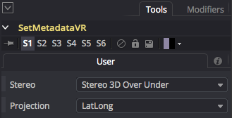

The "Stereo" control allows you to choose the stereo display mode that will be used when footage is loaded into Fusion's Stereo viewer window. The options are  "Mono 2D", "Stereo 3D Over Under", "Stereo 3D Side by Side".

The "Projection" control allows you to choose the image projection that will be used when footage is loaded into Fusion's 360° media viewer window. The options are  "None", "LatLong", "Vertical Cross", "Horizontal Cross", "Vertical Strip", "Horizontal Strip. 

If you are working with panoramic imagery that is of a different image projection then the Projection control provides such as Facebook Cubemap 3x2 footage, Domemaster, or angular fisheye footage it is a good idea to leave the Projection setting at the default value of "None".

### Viewing Metadata Information ###

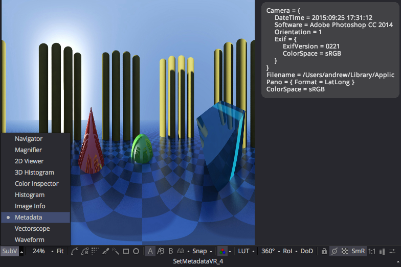

You can view the metadata tags that are being added to your imagery by activating the "Metadata" mode in the Fusion Viewer Window "SubV" tool list which is located on the far left side of the viewer window toolbar.

### Viewing Stereo Over/Under Images ###

If you are trying to view Stereo Over/Under images in Fusion Studio's native viewer window you will typically need to turn on the Fusion Viewer Windows' **Stereo** "Swap Eyes" control. 

This step is required if you are reviewing Over/Under stereo footage where the left view is on the top of the frame layout, and the right view is on the bottom of the frame layout like YouTube 360 formatted movies use.

### Node Connections ###

This example shows how you can connect un-tagged 360&deg; panoramic footage from a Loader node to a SetMetadataVR node's "Input" connection.

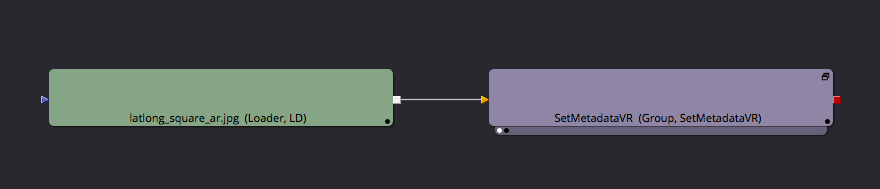

