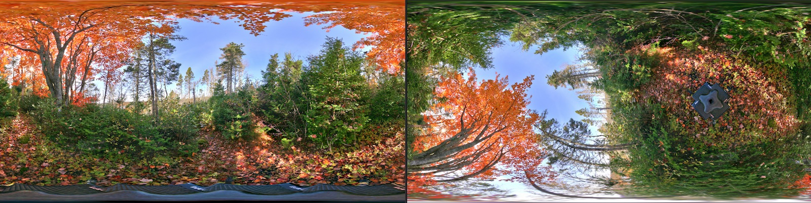
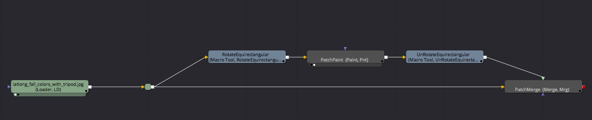
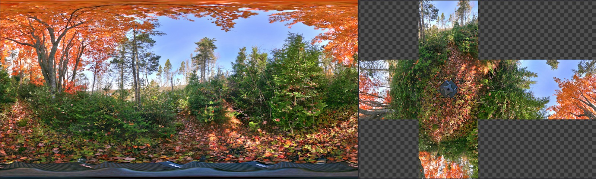
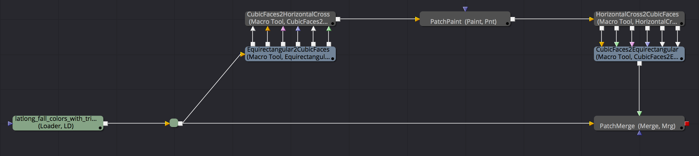

# Paint Macros

## PaintEquirectangular

This macro uses the RotateEquirectangular node to spin the equirectangular view sideways. This makes it easier to work on the zenith and nadir zones while still being in an equirectangular image projection. I personally prefer using this approach to fix a smallish area like a tripod as it is quick and easy to do. The Shift+X hotkey in the flow area adds an RotateEquirectangular node.

A paint node is then added to patch part of the frame that has issues you want to fix. The "P" hotkey in the flow area adds a paint node.

You can freely rotate the view on the intial "RotateEquirectangular" node and expressions are used on the 2nd "RotateEquirectangular" node to invert the transforms so the extracted view lines up with the original image.

Adding a BSpline mask to the merge node is the easiest way to control the blending of the result and feather the edges in. Having the merge node selected and then pressing the "B" hotkey in the flow area adds a BSpline node that is connected automatically.

Setting the Merge node at the end of the comp to use the "Difference" Apply Mode is handy to check that the views are accurately lined up and lets you see how much of the frame has been modified.

## PaintHorizontalCross

This macro converts an equirectangular image into a horizontal cross cubemap layout. This makes it easier to work across multiple cubic view faces with the paint based clone multi-stroke tool. You can freely rotate the view on the intial "Equirectangular2CubicFaces" node to center the front camera view on a specfic part of the frame.

A paint node is then added to patch part of the frame that has issues you want to fix.

Finally the horizontal cross cubic view is translated back into an equirectangular image. Expressions are used on the "CubicFaces2Equirectangular" macro to automatically link the rotations so the extracted view lines up with the original image.

Adding a BSpline mask to the merge node is the easiest way to control the blending of the result and feather the edges in. Having the merge node selected and then pressing the "B" hotkey in the flow area adds a BSpline node that is connected automatically.

Setting the Merge node at the end of the comp to use the "Difference" Apply Mode is handy to check that the views are accurately lined up and lets you see how much of the frame has been modified.

