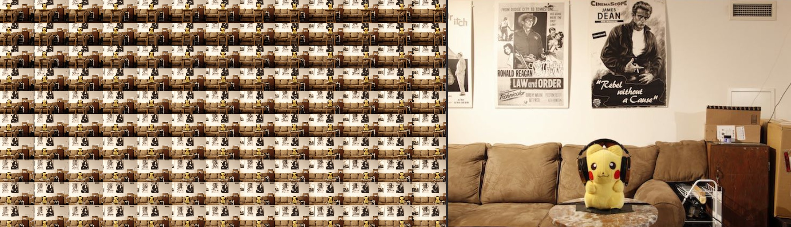

# Photogrammetry #

## <a name="ImageGridCreator">ImageGridCreator</a> ##

The ImageGridCreator fuse is used to generate tiled mosaic images from an image sequence. An image grid is another name for a sprite atlas. This node is handy if you are working with media coming from photogrammetry or lightfield workflows in Fusion.

This node is based upon the MIT open source licensed "hos_Tiler" fuse module from the [We Suck Less GitLab repository](https://gitlab.com/WeSuckLess/Reactor) project.

To use the ImageGridCreator node you need to connect a "Background" node to the ImageGridCreator.Background input that is the exact image size and bit depth of the final image layout you want to generate.

The image sequence is then connected to the ImageGridCreator.Foreground input.

The ImageGridCreator node's **Frames** control is then set to a value that matches the frame duration of your image sequence clip.

The footage you are using to create the image grid needs to have a duration as long as the **Frames** value you have defined in the ImageGridCreator node. The Frames setting controls the number of combined mosaic image views you are generating. 

You can adjust a Loader node's **Frame Hold** setting to give you a longer frame range if required when working with a short video clip or a still image as the source footage.

The **Frames** control specifies how many images are loaded from the Fusion timeline into the combined image grid mosaic layout. The default value is 130. The minimum useful Frames setting is 1 image.

The **ReverseXOrder** checkbox flips the horizontal axis layout of the images as the tiled image grid is created.

The **ReverseYOrder** checkbox flips the vertical axis layout of the images as the tiled image grid is created. By default the ReverseYOrder checkbox is enabled so it matches the output from the "ImageGridExtractor" node.

This node is accessible by selecting the **Fuses > KartaVR > Photogrammetry > ImageGridCreator** menu item.

This is a node view of the node connections that would be used to take an image sequence and turn it into a combined image grid mosaic layout:

**Note:** A sample image grid style photo called "pikachu_13x10_image_grid.jpg" is included with KartaVR in the `Macros:/KartaVR/Images/` folder. This image has a 13 wide by 10 high grid layout of photos that was taken with a regular grid spacing distance when photographed. This sample image is 8320x4270 px in size and has individual 640x427 px image tiles for each of the 130 views that are combined. This image was photographed by [Tobias Chen](http://www.tobiaschen.com).

## <a name="ImageGridExtractor">ImageGridExtractor</a> ##

The "ImageGridExtractor" macro is used to turn a combined image grid layout of photos back into an image sequence. An image grid is another name for a sprite atlas. This node is handy if you are working with media coming from photogrammetry or lightfield workflows in Fusion.

This Fusion approach is based upon research by [Theodor Groeneboom (theotheo)](http://www.euqahuba.com/) that uses a **TimeStretcher > Custom Tool > Crop** node workflow.

The combined mosaic grid image is connected to the `ImageGridExtractor.input` connection.

Set the HorizontalTiles control to match the horizontal number of images in the grid view layout. Then change the VerticalTiles control to match the number of vertical images in the grid view layout.

The **HorizontalTiles** control sets how many images are present on the horizontal axis of the grid. 

The **VerticalTiles** control sets how many images are present on the vertical axis of the grid. 

This node is accessible by selecting the **Macro > KartaVR > Photogrammetry > ImageGridExtractor** menu item.

This is a node view of the node connections that would be used to take an image grid and save out a series of cropped frames as an image sequence:

**Note:** A sample image grid style photo called "pikachu_13x10_image_grid.jpg" is included with KartaVR in the `Macros:/KartaVR/Images/` folder. This image has a 13 wide by 10 high grid layout of photos that was taken with a regular grid spacing distance when photographed. This sample image is 8320x4270 px in size and has individual 640x427 px image tiles for each of the 130 views that are combined. This image was photographed by [Tobias Chen](http://www.tobiaschen.com).
