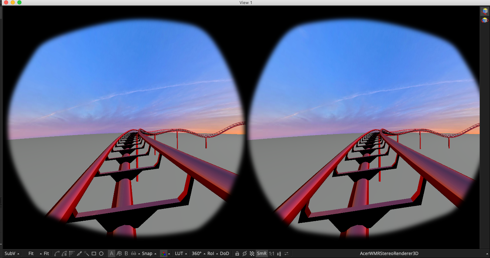

# Renderer3D Macros #

## AcerWMRStereoRenderer3D ##

This roller coaster ride example shows how the "AcerWMRStereoRenderer3D" macro allows you to use an Acer Windows Mixed Reality HMD display as the output device from the Fusion 3D system. 

To use this macro you need to mount the AcerWMR as a regular monitor on Mac/Windows/Linux. 

In Fusion select the "Windows  > New Image View"  menu item. Then drag this floating image view onto the AcerWMR display monitor and then resize the image view to be fullscreen.  You can now load the rendered image in Fusion on the new view using the 3 hotkey and the content will show up on the Rift's screen. It helps to turn off the View window's "Show Controls" (Command+K) and "Show Checker Underlay" options. 

Clicking on the view and selecting the Fit (Command+F) option will make sure the image fills the HMD screen.

Check out the [Zoom New Image View](scripts#zoom-new-image-view) script documentation for tips on how to display this node on an HMD using a floating Viewer Windows.

## CubicRenderer3D ##

The CubicRenderer3D macro creates a monoscopic "2D" cubic panorama camera rig that renders out six 90&deg; FOV views and works with Fusion's native 3D animation system. You can wire this macro node into your Shape3D nodes and then can generate panoramic 360&deg; output from your 3D compositing environment.

This node would typically be connected to either one of the nodes like CubicFaces2VerticalCross and could be used as an environment map.

The "Height" control is used to specify the vertical resolution of the rendered cubic views. The final width for the cubic images will be the Input Height value due to the fact cubic views represents a 90&deg; FOV and have a natural 1:1 aspect ratio.

The "Depth" control allows you to specify the bit depth for the panoramic output. The "8bit int" option is for PNG/TGA/JPG outputs, and the "16bit float" or "32bit float" options are perfect for floating point EXR based outputs that have HDR (high dynamic range) based color values that exceed the standard 0.0-1.0 color range.

The "Renderer Type" options menu allows you to choose if you want to use the Fusion Software Renderer or the OpenGL Renderer to drive the panoramic 360&deg; media viewer graphics context. You can compare the performance of both options to see which one works best with your GPU or CPU and delivers the fastest interactive performance.

You have the option of enabling several different render channels. The default option is RGBA which gives you a standard color image output from the CubicRenderer3D node.

The Z channel gives you a z-depth pass from the scene. The other attributes like Coverage, BGColor, Normal, TexCoord0, ObjectID, MaterialID, WorldCoord, Vector, and BackVector are not as commonly used.

The Enable Lighting and Enable Shadows options are useful for creating photorealistic renderings from Fusion's 3D animation system.

The X Offset/Y Offset/Z Offset sliders allow you to translate the cubic camera rig around the virtual world inside the Fusion 3D scene.

The "Z Rotation" slider lets you perform a horizontal panning effect on the camera rig which can be used to adjust and re-center the front facing part of the panoramic rendering.

To use this node, the Fusion 3D scene's output is connected to the node's yellow colored "SceneInput1" attribute. There are six rendered image outputs from the node called `Front`, `Right`, `Back`, `Left`, `Top`, and `Bottom`.

This example shows how you might route elements from the Fusion 3D system into the CubicRenderer3D node and then send the cubic output into a vertical cross panoramic output format.

This example shows how you might route elements from the Fusion 3D system into the CubicRenderer3D node and then send the six cubic outputs to the Comp-Fu Cube to LatLong fuse and then route that into a set of merge nodes to create a finished LatLong panoramic frame.

## CylindricalRenderer3D ##

The CylindricalRenderer3D macro creates a monoscopic "2D" cylindrical panorama camera rig that renders out a cylindrical 360&deg; x 90&deg; view and works with Fusion's native 3D animation system. You can wire this macro node into your Shape3D nodes and then can generate panoramic animations from your 3D compositing environment.

The "Height" control is used to specify the vertical resolution of the rendered cylindrical view.

The "Depth" control allows you to specify the bit depth for the panoramic output. The "8bit int" option is for PNG/TGA/JPG outputs, and the "16bit float" or "32bit float" options are perfect for floating point EXR based outputs that have HDR (high dynamic range) based color values that exceed the standard 0.0-1.0 color range.

The Enable Lighting and Enable Shadows options are useful for creating photorealistic renderings from Fusion's 3D animation system.

The X Offset/Y Offset/Z Offset sliders allow you to translate the camera rig around the virtual world inside the Fusion 3D scene.

The Rotation Order control allows you to control the precedence for each of the rotation axis. This is helpful when you need to solve gimbal lock by selecting the most important rotation channel for your camera animation and making it the first of the three axes listed in the Rotation Order settings.

The X Rotation/Y Rotation/Z Rotation sliders are used to spin the orientation of the domemaster camera view around and can be used to level the horizon or adjust the front facing view.

To use this node, the Fusion 3D scene's output is connected to the node's yellow colored "SceneInput1" attribute. There is one rendered image output from the node called "Output".

## CylindricalRenderer3DAdvanced ##

The CylindricalRenderer3D macro creates a monoscopic "2D" cylindrical panorama camera rig that renders out a cylindrical 360&deg; x 90&deg; view and works with Fusion's native 3D animation system. You can wire this macro node into your Shape3D nodes and then can generate panoramic animations from your 3D compositing environment.

The "Height" control is used to specify the vertical resolution of the rendered cylindrical view.

The "Depth" control allows you to specify the bit depth for the panoramic output. The "8bit int" option is for PNG/TGA/JPG outputs, and the "16bit float" or "32bit float" options are perfect for floating point EXR based outputs that have HDR (high dynamic range) based color values that exceed the standard 0.0-1.0 color range.

You have the option of enabling several different render channels. The default option is RGBA which gives you a standard color image output from the CylindricalRenderer3DAdvanced node.

The Z channel gives you a z-depth pass from the scene. The other attributes like Coverage, BGColor, TexCoord0, ObjectID, MaterialID, WorldCoord, are not as commonly used.

The Enable Lighting and Enable Shadows options are useful for creating photorealistic renderings from Fusion's 3D animation system.

The X Offset/Y Offset/Z Offset sliders allow you to translate the camera rig around the virtual world inside the Fusion 3D scene.

The Rotation Order control allows you to control the precedence for each of the rotation axis. This is helpful when you need to solve gimbal lock by selecting the most important rotation channel for your camera animation and making it the first of the three axes listed in the Rotation Order settings.

The X Rotation/Y Rotation/Z Rotation sliders are used to spin the orientation of the domemaster camera view around and can be used to level the horizon or adjust the front facing view.

To use this node, the Fusion 3D scene's output is connected to the node's yellow colored "SceneInput1" attribute. There is one rendered image output from the node called "Output".

You might have to enable the viewer window's normalize icon (that looks a bit like two gradient bars) to be able to properly view channels like WorldCoord (Positions) or the Z channel (Depth).
 
The ChannelBoolean node can be used to extract one of these additional channels from the rendered image.

## DomemasterRenderer3D ##

The DomemasterRenderer3D macro creates a monoscopic "2D" cubic panorama camera rig that renders out an angular fisheye 180&deg; domemaster view and works with Fusion's native 3D animation system. You can wire this macro node into your Shape3D nodes and then can generate domemaster animations from your 3D compositing environment.

The "Input Height" control is used to specify the vertical and horizontal resolution of the rendered domemaster view.

The "Depth" control allows you to specify the bit depth for the panoramic output. The "8bit int" option is for PNG/TGA/JPG outputs, and the "16bit float" or "32bit float" options are perfect for floating point EXR based outputs that have HDR (high dynamic range) based color values that exceed the standard 0.0-1.0 color range.

You have the option of enabling several different render channels. The default option is RGBA which gives you a standard color image output from the DomemasterRenderer3D node.

The Enable Lighting and Enable Shadows options are useful for creating photorealistic renderings from Fusion's 3D animation system.

The X Offset/Y Offset/Z Offset sliders allow you to translate the camera rig around the virtual world inside the Fusion 3D scene.

The Rotation Order control allows you to control the precedence for each of the rotation axis. This is helpful when you need to solve gimbal lock by selecting the most important rotation channel for your camera animation and making it the first of the three axes listed in the Rotation Order settings.

The X Rotation/Y Rotation/Z Rotation sliders are used to spin the orientation of the domemaster camera view around and can be used to level the horizon or compensate for dome tilt.

The "Z Rotation" slider lets you perform a horizontal panning effect on the camera rig which can be used to adjust and re-center the front facing part of the panoramic rendering.

To use this node, the Fusion 3D scene's output is connected to the node's yellow colored "SceneInput1" attribute. There is one rendered image output from the node called "Output".

This example shows how you might route elements from the Fusion 3D system into the DomemasterRenderer3D node.

## DomemasterRenderer3DAdvanced ##

The DomemasterRenderer3DAdvanced macro creates a monoscopic "2D" cubic panorama camera rig that renders out an angular fisheye 180&deg; domemaster view and works with Fusion's native 3D animation system. You can wire this macro node into your Shape3D nodes and then can generate domemaster animations from your 3D compositing environment.

The "Height" control is used to specify the vertical and horizontal resolution of the rendered domemaster view.

The "Depth" control allows you to specify the bit depth for the panoramic output. The "8bit int" option is for PNG/TGA/JPG outputs, and the "16bit float" or "32bit float" options are perfect for floating point EXR based outputs that have HDR (high dynamic range) based color values that exceed the standard 0.0-1.0 color range.

You have the option of enabling several different render channels. The default option is RGBA which gives you a standard color image output from the DomemasterRenderer3DAdvanced node.

The Z channel gives you a z-depth pass from the scene. The other attributes like Coverage, BGColor, TexCoord0, ObjectID, MaterialID, WorldCoord, are not as commonly used.

The Enable Lighting and Enable Shadows options are useful for creating photorealistic renderings from Fusion's 3D animation system.

The X Offset/Y Offset/Z Offset sliders allow you to translate the camera rig around the virtual world inside the Fusion 3D scene.

The Rotation Order control allows you to control the precedence for each of the rotation axis. This is helpful when you need to solve gimbal lock by selecting the most important rotation channel for your camera animation and making it the first of the three axes listed in the Rotation Order settings.

The X Rotation/Y Rotation/Z Rotation sliders are used to spin the orientation of the domemaster camera view around and can be used to level the horizon or compensate for dome tilt.

The "Z Rotation" slider lets you perform a horizontal panning effect on the camera rig which can be used to adjust and re-center the front facing part of the panoramic rendering.

To use this node, the Fusion 3D scene's output is connected to the node's yellow colored "SceneInput1" attribute. There is one rendered image output from the node called "Output".

This example shows how you might route elements from the Fusion 3D system into the DomemasterRenderer3D node.

You might have to enable the viewer window's normalize icon (that looks a bit like two gradient bars) to be able to properly view channels like WorldCoord (Positions) or the Z channel (Depth).
 
The ChannelBoolean node can be used to extract one of these additional channels from the rendered image.

## EquirectangularRenderer3D ##

The EquirectangularRenderer3D macro creates a monoscopic "2D" panoramic camera rig that renders out an Equirectangular/LatLong/spherical 360&deg;x180&deg; view and works with Fusion's native 3D animation system. You can wire this macro node into your Shape3D nodes and then can generate Equirectangular animations from your 3D compositing environment.

The "Height" control is used to specify the vertical resolution of the rendered Equirectangular view. The width is set automatically to twice the value of the height setting due to the fact an equirectangular panorama has a 2:1 aspect ratio.

The "Depth" control allows you to specify the bit depth for the panoramic output. The "8bit int" option is for PNG/TGA/JPG outputs, and the "16bit float" or "32bit float" options are perfect for floating point EXR based outputs that have HDR (high dynamic range) based color values that exceed the standard 0.0-1.0 color range.

You have the option of enabling several different render channels. The default option is RGBA which gives you a standard color image output from the EquirectangularRenderer3D node.

The Enable Lighting and Enable Shadows options are useful for creating photorealistic renderings from Fusion's 3D animation system.

The X Offset/Y Offset/Z Offset sliders allow you to translate the camera rig around the virtual world inside the Fusion 3D scene.

The Rotation Order control allows you to control the precedence for each of the rotation axis. This is helpful when you need to solve gimbal lock by selecting the most important rotation channel for your camera animation and making it the first of the three axes listed in the Rotation Order settings.

The X Rotation/Y Rotation/Z Rotation sliders are used to spin the orientation of the camera view around and can be used to level the horizon or compensate for dome tilt.

The "Z Rotation" slider lets you perform a horizontal panning effect on the camera rig which can be used to adjust and re-center the front facing part of the panoramic rendering.

To use this node, the Fusion 3D scene's output is connected to the node's yellow colored "SceneInput1" attribute. There is one rendered image output from the node called "Output".

This example shows how you might route elements from the Fusion 3D system into the EquirectangularRenderer3D node.

## EquirectangularRenderer3DAdvanced ##

The EquirectangularRenderer3DAdvanced macro creates a monoscopic "2D" panoramic camera rig that renders out an Equirectangular/LatLong/spherical 360&deg;x180&deg; view and works with Fusion's native 3D animation system. You can wire this macro node into your Shape3D nodes and then can generate Equirectangular animations from your 3D compositing environment.

The "Height" control is used to specify the vertical resolution of the rendered Equirectangular view. The width is set automatically to twice the value of the height setting due to the fact an equirectangular panorama has a 2:1 aspect ratio.

The "Depth" control allows you to specify the bit depth for the panoramic output. The "8bit int" option is for PNG/TGA/JPG outputs, and the "16bit float" or "32bit float" options are perfect for floating point EXR based outputs that have HDR (high dynamic range) based color values that exceed the standard 0.0-1.0 color range.

You have the option of enabling several different render channels. The default option is RGBA which gives you a standard color image output from the EquirectangularRenderer3D node.

The Z channel gives you a z-depth pass from the scene. The other attributes like Coverage, BGColor, TexCoord0, ObjectID, MaterialID, WorldCoord are not as commonly used.

The Enable Lighting and Enable Shadows options are useful for creating photorealistic renderings from Fusion's 3D animation system.

The X Offset/Y Offset/Z Offset sliders allow you to translate the camera rig around the virtual world inside the Fusion 3D scene.

The Rotation Order control allows you to control the precedence for each of the rotation axis. This is helpful when you need to solve gimbal lock by selecting the most important rotation channel for your camera animation and making it the first of the three axes listed in the Rotation Order settings.

The X Rotation/Y Rotation/Z Rotation sliders are used to spin the orientation of the domemaster camera view around and can be used to level the horizon or compensate for dome tilt.

The "Z Rotation" slider lets you perform a horizontal panning effect on the camera rig which can be used to adjust and re-center the front facing part of the panoramic rendering.

To use this node, the Fusion 3D scene's output is connected to the node's yellow colored "SceneInput1" attribute. There is one rendered image output from the node called "Output".

This example shows how you might route elements from the Fusion 3D system into the EquirectangularRenderer3DAdvanced node.

You might have to enable the viewer window's normalize icon (that looks a bit like two gradient bars) to be able to properly view channels like WorldCoord (Positions) or the Z channel (Depth).
 
The ChannelBoolean node can be used to extract one of these additional channels from the rendered image.

## OculusDK1MonoRenderer3D ##

This node allows you to take content from inside of Fusion's 3D workspace and use an OpenGL based rendering mode to display the scene live on an Oculus Rift HMD. This implementation of stereo VR rendering for the Oculus Rift works in both Fusion (Free) and Fusion Studio.

The XYZ Rotation and XYZ Offset controls in the node allow you to control the panning and camera translation applied to the renderer3d node's camera. If you want to animate the Oculus Rift renderer3D node's position in the scene, you can use either keyframes on the attributes directly, or you could use expressions to link these translation controls to moving elements in the scene. 

Another way to deal with camera animation is to place a Transform3D node in your composite just before the renderer3D node. Then you could animate this camera by connecting the Transform3D node to other cameras in your Fusion scene, or by importing an FBX Mesh or Alembic mesh into your composite that has an existing keyframe animated camera that was created using a motion path. This has the benifit that the renderer3D node's own  XYZ Rotation and XYZ Offset controls would be available to let you "look around" in the virtual world.

When this node is used you would typically set up a floating image viewer window placed on the HMD display, or if you have Fusion Studio you can use the Fusion based "Video Monitoring" output to allows you to push the interactive Viewer window frame buffer contents to the Rift. This first version of the node has no head tracking support. To use this macro you need to mount the Oculus Rift DK1 or DK2 HMD as a regular monitor on Mac/Windows/Linux.

Check out the [Zoom New Image View](scripts#zoom-new-image-view) script documentation for tips on how to display this node on an Oculus Rift DK1 or DK2 HMD using a floating Viewer Windows.

## OculusDK1StereoRenderer3D ##

This node allows you to take content from inside of Fusion's 3D workspace and use an OpenGL stereo based rendering mode to display the scene live on an Oculus Rift HMD. This implementation of stereo VR rendering for the Oculus Rift works in both Fusion (Free) and Fusion Studio.

The "Camera Separation" control is used to adjust the eye spacing in the stereo renderings. The default Camera Separation value is 0.65 units of distance in Fusion's 3D workspace but this setting can be easily adjusted to any value that is comfortable for your eyes based upon your scene's scale and the proximity of the geometry in the scene to the camera rig.

The XYZ Rotation and XYZ Offset controls in the node allow you to control the panning and camera translation applied to the renderer3d node's camera. If you want to animate the Oculus Rift renderer3D node's position in the scene, you can use either keyframes on the attributes directly, or you could use expressions to link these translation controls to moving elements in the scene. 

Another way to deal with camera animation is to place a Transform3D node in your composite just before the renderer3D node. Then you could animate this camera by connecting the Transform3D node to other cameras in your Fusion scene, or by importing an FBX Mesh or Alembic mesh into your composite that has an existing keyframe animated camera that was created using a motion path. This has the benifit that the renderer3D node's own  XYZ Rotation and XYZ Offset controls would be available to let you "look around" in the virtual world.

When this node is used you would typically set up a floating image viewer window placed on the HMD display, or if you have Fusion Studio you can use the Fusion based "Video Monitoring" output to allows you to push the interactive Viewer window frame buffer contents to the Rift. This first version of the node has no head tracking support. To use this macro you need to mount the Oculus Rift DK1 or DK2 HMD as a regular monitor on Mac/Windows/Linux.

Check out the [Zoom New Image View](scripts#zoom-new-image-view) script documentation for tips on how to display this node on an Oculus Rift DK1 or DK2 HMD using a floating Viewer Windows.

## OculusDK2MonoRenderer3D ##

This node allows you to take content from inside of Fusion's 3D workspace and use an OpenGL based rendering mode to display the scene live on an Oculus Rift HMD. This implementation of stereo VR rendering for the Oculus Rift works in both Fusion (Free) and Fusion Studio.

The XYZ Rotation and XYZ Offset controls in the node allow you to control the panning and camera translation applied to the renderer3d node's camera. If you want to animate the Oculus Rift renderer3D node's position in the scene, you can use either keyframes on the attributes directly, or you could use expressions to link these translation controls to moving elements in the scene. 

Another way to deal with camera animation is to place a Transform3D node in your composite just before the renderer3D node. Then you could animate this camera by connecting the Transform3D node to other cameras in your Fusion scene, or by importing an FBX Mesh or Alembic mesh into your composite that has an existing keyframe animated camera that was created using a motion path. This has the benifit that the renderer3D node's own  XYZ Rotation and XYZ Offset controls would be available to let you "look around" in the virtual world.

When this node is used you would typically set up a floating image viewer window placed on the HMD display, or if you have Fusion Studio you can use the Fusion based "Video Monitoring" output to allows you to push the interactive Viewer window frame buffer contents to the Rift. This first version of the node has no head tracking support. To use this macro you need to mount the Oculus Rift DK1 or DK2 HMD as a regular monitor on Mac/Windows/Linux.

Check out the [Zoom New Image View](scripts#zoom-new-image-view) script documentation for tips on how to display this node on an Oculus Rift DK1 or DK2 HMD using a floating Viewer Windows.

## OculusDK2StereoRenderer3D ##

This node allows you to take content from inside of Fusion's 3D workspace and use an OpenGL stereo based rendering mode to display the scene live on an Oculus Rift HMD. This implementation of stereo VR rendering for the Oculus Rift works in both Fusion (Free) and Fusion Studio.

The "Camera Separation" control is used to adjust the eye spacing in the stereo renderings. The default Camera Separation value is 0.65 units of distance in Fusion's 3D workspace but this setting can be easily adjusted to any value that is comfortable for your eyes based upon your scene's scale and the proximity of the geometry in the scene to the camera rig.

When this node is used you would typically set up a floating image viewer window placed on the HMD display, or if you have Fusion Studio you can use the Fusion based "Video Monitoring" output to allows you to push the interactive Viewer window frame buffer contents to the Rift. This first version of the node has no head tracking support. To use this macro you need to mount the Oculus Rift DK1 or DK2 HMD as a regular monitor on Mac/Windows/Linux.

Check out the [Zoom New Image View](scripts#zoom-new-image-view) script documentation for tips on how to display this node on an Oculus Rift DK1 or DK2 HMD using a floating Viewer Windows.

## YouTube180Renderer3D ##

The YouTube180Renderer3D node allows you to render out monoscopic 2D content from Fusion's 3D system to the YouTube 180 based equirectangular 180&deg;x180&deg; horizontally cropped 1:1 aspect ratio frame format.

## YouTube180StereoRenderer3D ##

The YouTube180StereoRenderer3D node allows you to render out stereoscopic 3D content from Fusion's 3D system to the YouTube 180 based equirectangular 180&deg;x180&deg; horizontally cropped 1:1 aspect ratio frame format.

The OpenGL tab has options for supersample rendering, applying depth of field, and to enable color accumulation effects.

