# Stereoscopic Macros

## StereoAnaglyphHalfColorMerge

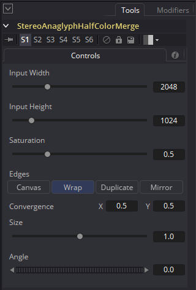

The StereoAnaglyphHalfColorMerge node is used to create an anaglyph red/cyan 3D glasses style stereo image by merging a pair of left and right images.

The Saturation control allows you do create an anaglyph image with either full strength colors (with the saturation at 1.0), a fully black and white anaglyph image (with the saturation at 0.0), or a 50% saturated image (with the saturation at 0.5).

Reducing the saturation of an anaglyph stereo image to 50% or less is sometimes helpful for reducing the visibility of distracting "retinal rivalry" color artifacts. This is evident when the source images have objects with a super pure red, green, or blue color shading that would only normally show up in either the left or right eye view in the anaglyph color filters and look very dark in the opposite eye's view of the stereo scene.

The Convergence controls named "X" and "Y" can be adjusted in the 0-1 range to pan the imagery. The Convergence X control is useful for scrolling the image horizontally which has the effect of changing the zero parallax zone in a LatLong 360&deg; panoramic stereo image. Having the convergence attributes set to X 0.5, and Y 0.5 will keep the image unmodified and centered. Setting the convergence X attribute to a value less than 0.5 will pan the image to the left, and a value above 0.5 will pan the image to the right.

The Size control allows you to scale the right stereo view to better line up with the left eye imagery.

The Angle control rotates the right eye imagery around the image's center point.

The Edges control allows you to control how the imagery is handled if it is rotated using the angle setting, or scrolled using the convergence setting outside of the image frame border zone. If the Edge control is set to "Canvas" the imagery is cropped on the frame edge. If the Edge control is set to "Wrap" then the image data that exits the frame border using the convergence control and the angle control will loop around to the other size of the image.

This is a node view of merging a left and right pair of stereo images into the anaglyph stereo format:

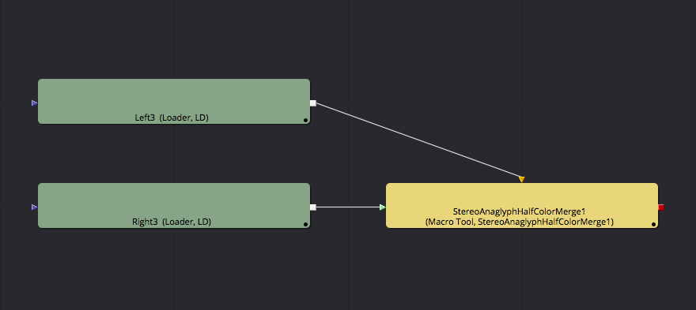

**Note:** If you are doing VR content creation on a tight budget without access to an HMD like an Oculus Rift, you can merge your left and right camera view stereoscopic LatLong 360&deg; images into the anaglyph format.

Then you would send the imagery to a panoramic 360&deg; media viewer tool using KartaVR's bundled PanoView script (using the Script > KartaVR > Viewers > PanoView menu item to launch the tool). With an affordable pair of red/cyan anaglyph 3D glasses on, you can pan the 360&deg; view with your mouse and still get a rough idea of the stereo effect without breaking the bank.

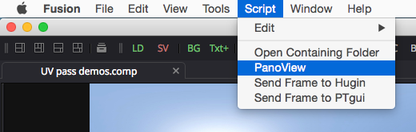

## StereoAnaglyphMerge

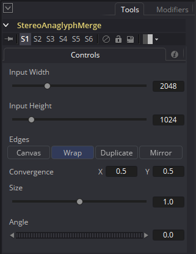

The StereoAnaglyphMerge node is used to create an anaglyph red/cyan 3D glasses style stereo image by merging a pair of left and right images. This node can be used easily with regular stereo images or panoramic stereo images.

The Convergence controls named "X" and "Y" can be adjusted in the 0-1 range to pan the imagery. The Convergence X control is useful for scrolling the image horizontally which has the effect of changing the zero parallax zone in a LatLong 360&deg; panoramic stereo image. Having the convergence attributes set to X 0.5, and Y 0.5 will keep the image unmodified and centered. Setting the convergence X attribute to a value less than 0.5 will pan the image to the left, and a value above 0.5 will pan the image to the right.

The Size control allows you to scale the right stereo view to better line up with the left eye imagery.

The Angle control rotates the right eye imagery around the image's center point.

The Edges control allows you to control how the imagery is handled if it is rotated using the angle setting, or scrolled using the convergence setting outside of the image frame border zone. If the Edge control is set to "Canvas" the imagery is cropped on the frame edge. If the Edge control is set to "Wrap" then the image data that exits the frame border using the convergence control and the angle control will loop around to the other size of the image.

This is a node view of merging a left and right pair of stereo images into the anaglyph stereo format:

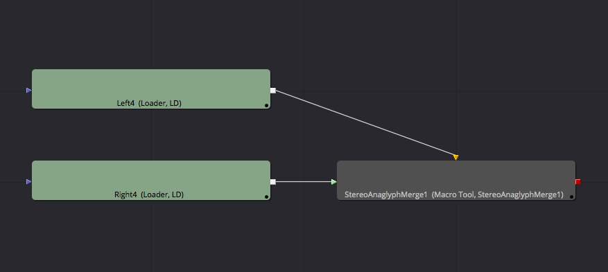

**Note:** If you are doing VR content creation on a tight budget without access to an HMD like an Oculus Rift, you can merge your left and right camera view stereoscopic LatLong 360&deg; images into the anaglyph format.

Then you would send the imagery to a panoramic 360&deg; media viewer tool using KartaVR's bundled PanoView script (using the Script > KartaVR > Viewers > PanoView menu item to launch the tool). With an affordable pair of red/cyan anaglyph 3D glasses on, you can pan the 360&deg; view with your mouse and still get a rough idea of the stereo effect without breaking the bank.

## StereoAnaglyphOU

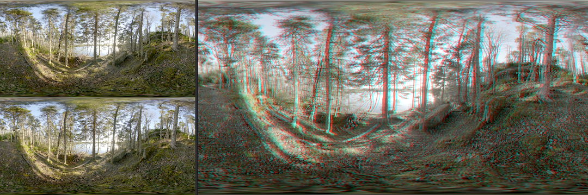

The StereoAnaglyphOU node is used to create an anaglyph red/cyan 3D glasses style stereo image from an over/under left and right image layout. This node can be used easily with regular stereo images or panoramic stereo images.

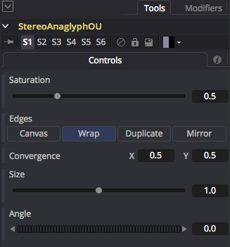

The Saturation control allows you do create an anaglyph image with either full strength colors (with the saturation at 1.0), a fully black and white anaglyph image (with the saturation at 0.0), or a 50% saturated image (with the saturation at 0.5).

The Convergence controls named "X" and "Y" can be adjusted in the 0-1 range to pan the imagery. The Convergence X control is useful for scrolling the image horizontally which has the effect of changing the zero parallax zone in a LatLong 360&deg; panoramic stereo image. Having the convergence attributes set to X 0.5, and Y 0.5 will keep the image unmodified and centered. Setting the convergence X attribute to a value less than 0.5 will pan the image to the left, and a value above 0.5 will pan the image to the right.

The Size control allows you to scale the right stereo view to better line up with the left eye imagery.

The Angle control rotates the right eye imagery around the image's center point.

The Edges control allows you to control how the imagery is handled if it is rotated using the angle setting, or scrolled using the convergence setting outside of the image frame border zone. If the Edge control is set to "Canvas" the imagery is cropped on the frame edge. If the Edge control is set to "Wrap" then the image data that exits the frame border using the convergence control and the angle control will loop around to the other size of the image.

To use this node an over/under image is connected to the `StereoAnaglyphOU.image` input. This example shows a Z360 color/depthmap image being converted into an over/under formatted left/right stereo image pair by the Z360Stereo node. Then the over/under image is converted into an anaglyph image format by the StereoAnaglyphOU node:

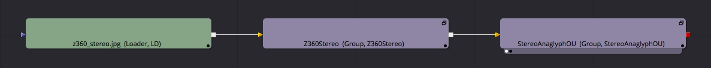

## StereoOverUnderExtract

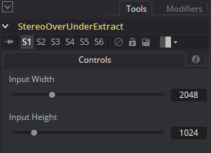

The StereoOverUnderExtract macro will separate a merged set of left and right stereo images from the Over/Under stereo format where the left image is placed on the top, and the right image is placed on the bottom part of the frame.

This is a node view of extracting a left and right pair of stereo images from a single picture in the "Over Under" stereo format:

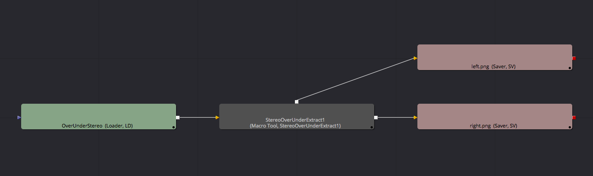

## StereoOverUnderMerge

The StereoOverUnderMerge macro will take a pair of separate left and right stereo images and place them into a single image frame. The left image is placed on top, and the right image is placed on the bottom part of the frame.

This is a node view of merging a left and right pair of stereo images into the "Over Under" stereo format:

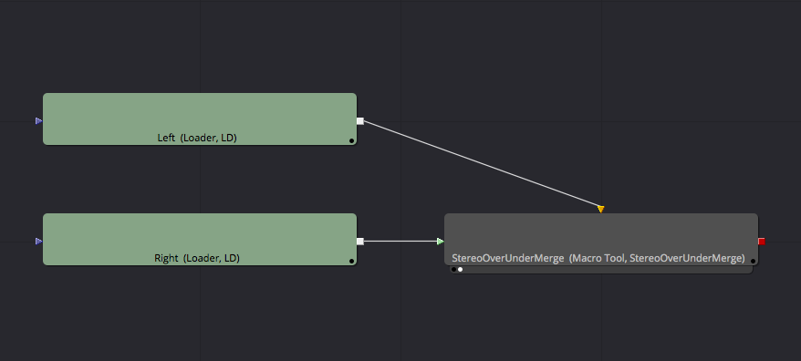

Note: If you are using an "offset" macro to horizontally scroll the canvas in the node tree immediately before applying the StereoOverUnderMerge operation it might result in a Mono 2D looking output without the left and right details present. The solution to this issue is to flatten the transforms of the media coming into the StereoOverUnderMerge macro using a crop node set to 100% of the image width and height.

## StereoSideBySideExtract

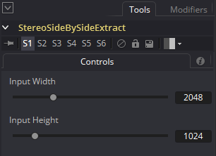

The StereoSideBySideExtract macro will separate a merged set of left and right stereo images from the Side by Side stereo format where the left image is placed on the left side, and the right image is placed on the right side of the frame.

This is a node view of extracting a left and right pair of stereo images from a single picture in the "Side by Side" stereo format:

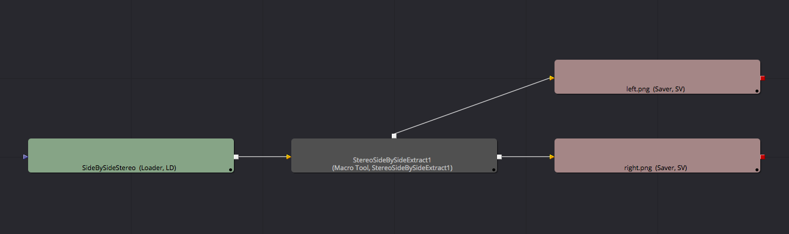

## StereoSideBySideMerge

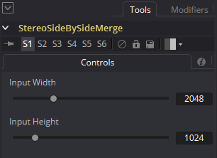

The StereoSideBySideMerge macro will take a pair of separate left and right stereo images and place them into a single image frame. The left image is placed on the left side, and the right image is placed on the right side of the frame.

This is a node view of merging a left and right pair of stereo images into the "Side by Side" stereo format:

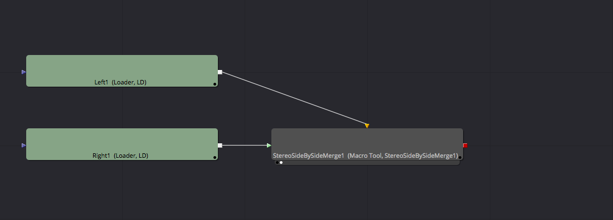

Note: If you are using an "offset" macro to horizontally scroll the canvas in the node tree immediately before applying the StereoSideBySideMerge operation it might result in a Mono 2D looking output without the left and right details present. The solution to this issue is to flatten the transforms of the media coming into the StereoSideBySideMerge macro using a crop node set to 100% of the image width and height.
