# Transform Macros

## Offset

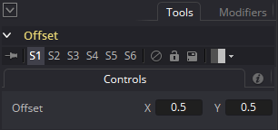

This macro is useful for preparing seamless tiling textures by allowing you to scroll the content of an image horizontally or vertically and the scrolled image content wraps around the edge of the image border.

The Offset node has two controls named "X" and "Y" that can be adjusted in the 0-1 range to pan the imagery. Having the Offset attributes set to X 0.5, and Y 0.5 will keep the image unmodified and centered. Setting the Offset X attribute to a value less than 0.5 will pan the image to the left, and a value above 0.5 will pan the image to the right.

The Offset X attribute is helpful for panning a LatLong/Equirectangular image horizontally and can be used to re-center the "front" looking part of a panoramic 360&deg; image without degrading the image quality.

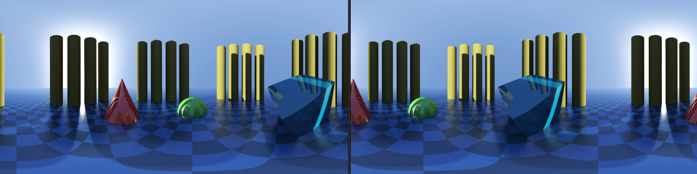

To use this node, the source imagery is connected to the node's yellow colored "Input" attribute. The image output from the node is called "Output".

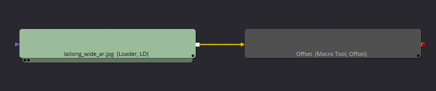

### Undoing the Offset Effect

If you use an offset node in your comp to re-center a LatLong panorama by scrolling the image horizontally, you can use a 2nd offset node and an expression to revert the footage back its original position with the help of the following workflow:

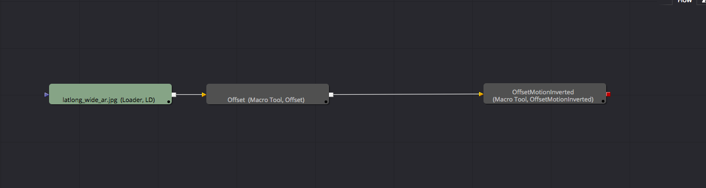

The original offset node at the beginning of the comp is used to re-center footage. This is useful for doing rotoscoping that might cross the edge boundary of the LatLong/equirectangular/spherical frame.

You can then apply any of your standard compositing operations to effect the imagery.

Finally to revert the footage back to it's original horizontal position you can add a 2nd offset node at the end of the comp. In the node screenshot for this example the final Offset node was renamed in the comp to "OffsetMotionInverted" to help clarify what it does.

To add the expression to the final offset node we need to open up the tool settings. Then right click Offset X & Y attributes for the node and in the pop up contextual menu select "Expression". This will add a text field where you can paste in your expression.

Assuming the first offset node was named "Offset" you can add the following expression `Point(1, 0.0)-Offset.Input1` that will undo the horizontal panning effect and your media will take on its original orientation.

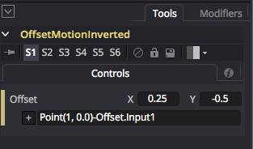

This type of expression is handy if you keyframe animated the panning offset effect on the first node as the expression will calculate the correct panning value for each frame of your sequence.

**Bonus Tip:** If you are using a UVPassFromRGBImage node to pan a LatLong image horizontally, you can use the following offset node expression `Point(1-UVPassFromRGBImage.Input3, 0.5)` to match the UV Pass node's U Offset scrolling rate.

## RotateCubicFaces

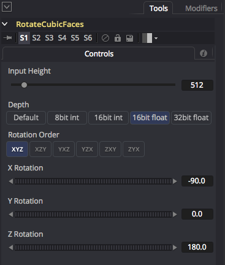

This macro allows you to rotate a set of six independent cubemap faces and then get the six transformed cubic faces back as separate outputs. This is useful for levelling horizons or adjusting the front facing view of a panorama.

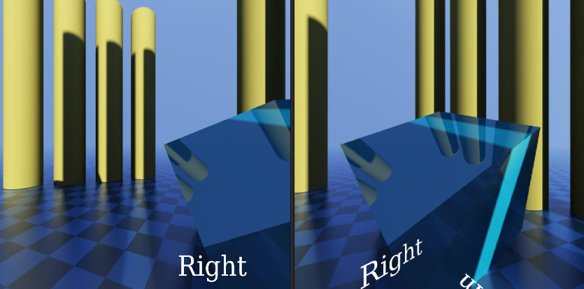

The "Input Height" control is used to specify the vertical and horizontal resolution of the rendered domemaster view.

The "Depth" control allows you to specify the bit depth for the panoramic output. The "8bit int" option is for PNG/TGA/JPG outputs, and the "16bit float" or "32bit float" options are perfect for floating point EXR based outputs that have HDR (high dynamic range) based color values that exceed the standard 0.0-1.0 color range.

The Rotation Order control allows you to control the precedence for each of the rotation axis. This is helpful when you need to solve gimbal lock by selecting the most important rotation channel for your camera animation and making it the first of the three axes listed in the Rotation Order settings.

The X Rotation/Y Rotation/Z Rotation sliders are used to spin the orientation of the view around and can be used to level the horizon. The "Z Rotation" slider lets you perform a horizontal panning effect on the camera view which can be used to adjust and re-center the front facing part of the panoramic image.

To use this node, individual 90&deg; FOV based cubic view source images are connected to the node's colored triangle shaped inputs named `Front`, `Right`, `Back`, `Left`, `Top`, and `Bottom` attributes. There is a set of similarly named outputs from the node called `Front`, `Right`, `Back`, `Left`, `Top`, and `Bottom`.

This example shows a sample node layout where a set of six images are loaded into the RotateCubicFaces macro. The individual cubic views are then rotated, and finally a CubicFaces2HorizontalCross node is used to combine the images into a horizontal cross panorama.

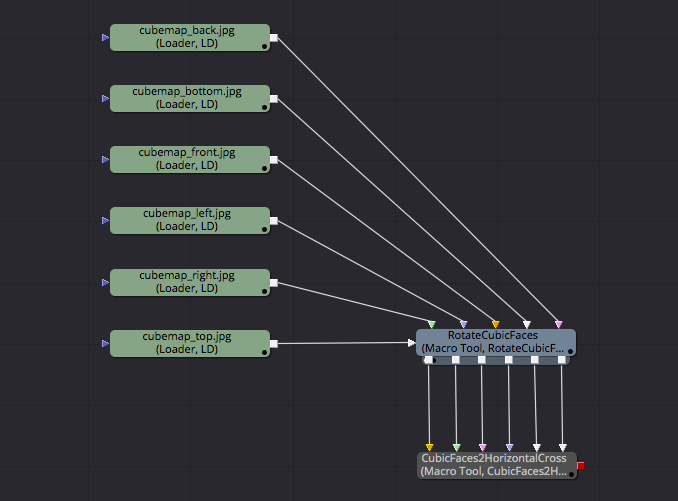

**Note:** The "RotateCubicFaces" node was previously called "CubicFaces2RotatedCubicFaces".

## RotateEquirectangular

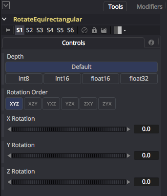

This macro allows you to rotate an equirectangular/LatLong/spherical image. This is useful for levelling horizons or adjusting the front facing view of a panorama.

You could also use the RotateEquirectangular node as a panoramic image roll stabilizer by using animation keys on the rotation controls or a linked expression to perform a panoramic 360&deg; roll correction on the XYZ rotation channels over the duration of an image sequence/video clip.

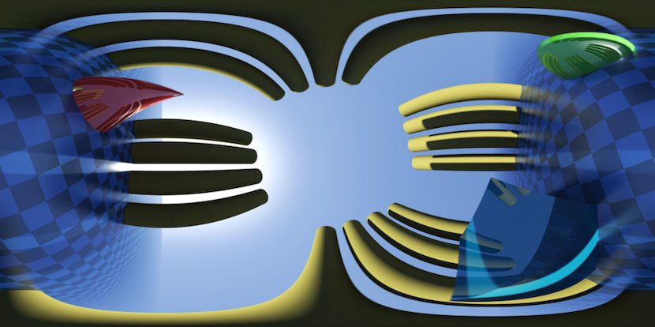

The "Depth" control allows you to specify the bit depth for the panoramic output. The "8bit int" option is for PNG/TGA/JPG outputs, and the "16bit float" or "32bit float" options are perfect for floating point EXR based outputs that have HDR (high dynamic range) based color values that exceed the standard 0.0-1.0 color range.

The Rotation Order control allows you to control the precedence for each of the rotation axis. This is helpful when you need to solve gimbal lock by selecting the most important rotation channel for your camera animation and making it the first of the three axes listed in the Rotation Order settings.

The X Rotation/Y Rotation/Z Rotation sliders are used to spin the orientation of the view around and can be used to level the horizon. The "Z Rotation" slider lets you perform a horizontal panning effect on the camera view which can be used to adjust and re-center the front facing part of the panoramic image.

This example shows a sample node layout where a LatLong image is loaded into the RotateEquirectangular macro. The view is then rotated and tilted.

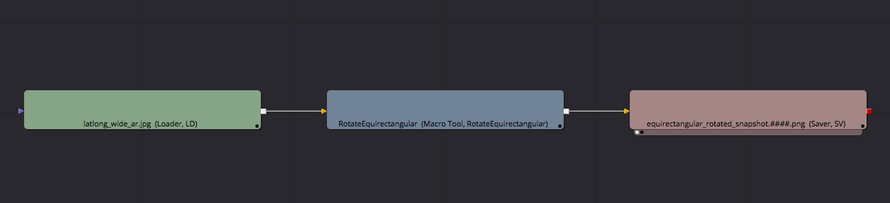

**Note:** The "RotateEquirectangular" node was previously called "Equirectangular2RotatedEquirectangular".

**Note:** The kartavr v2.2 release fixed a texture texture sampling issue on the left/right image border of the Equirectangular2RotatedEquirectangular node by switching the filtering from trilinear to bilinear sampling.

## RotateGearVRMono

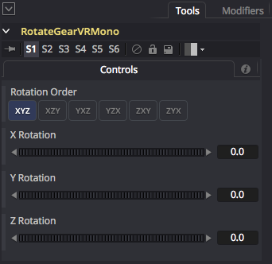

This macro allows you to rotate a single combined image with a Gear VR/Octane ORBX/Vray 6:1 cubic face arrangement. This is useful for levelling horizons or adjusting the front facing view of a panorama.

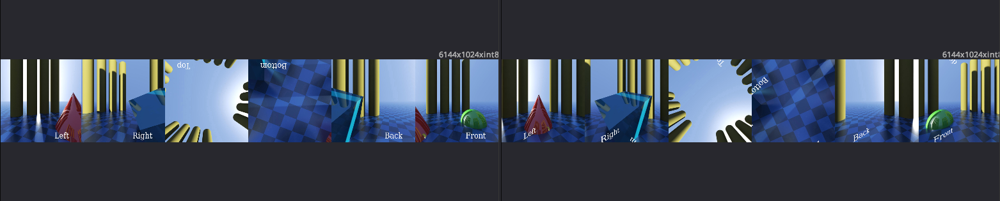

The Rotation Order control allows you to control the precedence for each of the rotation axis. This is helpful when you need to solve gimbal lock by selecting the most important rotation channel for your camera animation and making it the first of the three axes listed in the Rotation Order settings.

The X Rotation/Y Rotation/Z Rotation sliders are used to spin the orientation of the view around and can be used to level the horizon. The "Z Rotation" slider lets you perform a horizontal panning effect on the camera view which can be used to adjust and re-center the front facing part of the panoramic image.

A Gear VR mono panorama has the faces oriented in the following order:

<table>
  <tr>
   <td>Left</td> <td>Right</td> <td>Top (Rotated 180&deg;)</td> <td>Bottom (Rotated 180&deg;)</td> <td>Back</td> <td>Front</td>
  </tr>
</table>

To use this node a Gear VR mono 6:1 monoscopic cubemap image is connect to the node's colored input named "Image". There is a single image output from the node called "Output" which displays the final rotated Gear VR mono cubemap frame.

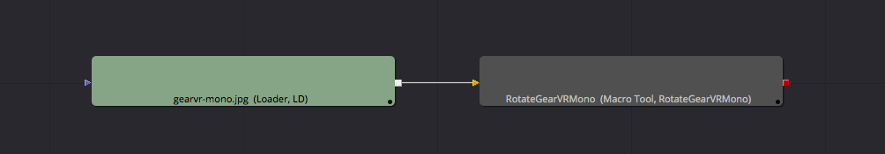

## RotateGearVRStereo

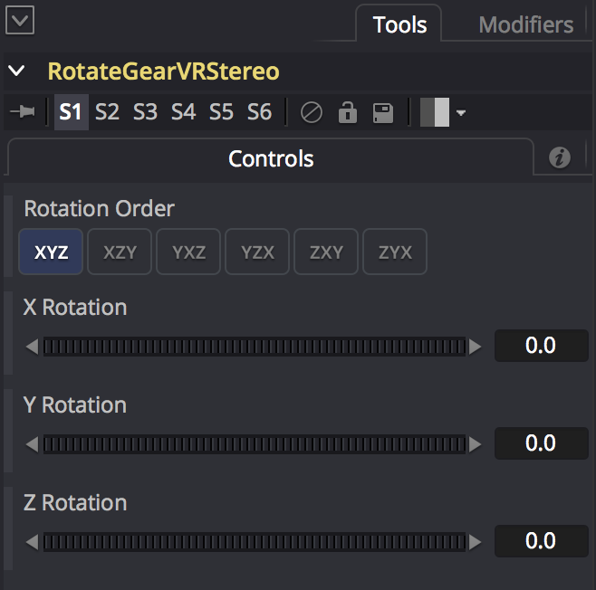

This macro allows you to rotate a single combined stereos image with a Gear VR/Octane ORBX/Vray 12:1 horizontal strip cubic face arrangement. This is useful for levelling horizons or adjusting the front facing view of a panorama.

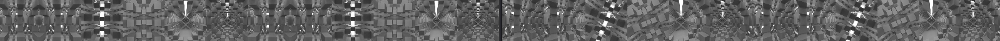

The Rotation Order control allows you to control the precedence for each of the rotation axis. This is helpful when you need to solve gimbal lock by selecting the most important rotation channel for your camera animation and making it the first of the three axes listed in the Rotation Order settings.

The X Rotation/Y Rotation/Z Rotation sliders are used to spin the orientation of the view around and can be used to level the horizon. The "Z Rotation" slider lets you perform a horizontal panning effect on the camera view which can be used to adjust and re-center the front facing part of the panoramic image.

A Gear VR stereo panorama has a side by side stereo format that has the right camera views placed first then the left camera views placed second. The right (R) and left (L) camera cubic faces are oriented in the following order:

<table>
  <tr>
   <td>R-Left</td> <td>R-Right</td> <td>R-Top (Rotated 180&deg;)</td> <td>R-Bottom (Rotated 180&deg;)</td> <td>R-Back</td> <td>R-Front</td> <td>L-Left</td> <td>L-Right</td> <td>L-Top (Rotated 180&deg;)</td> <td>L-Bottom (Rotated 180&deg;)</td> <td>L-Back</td> <td>L-Front</td>
  </tr>
</table>

To use this node a Gear VR stereo 12:1 stereoscopic cubemap image is connect to the node's colored input named "Image". There is a single image output from the node called "Output" which displays the final rotated Gear VR stereo cubemap frame.

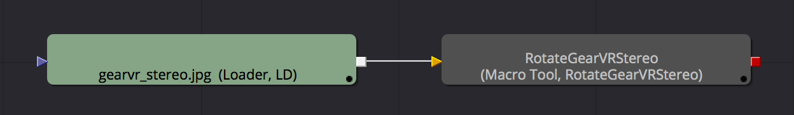

## RotateView

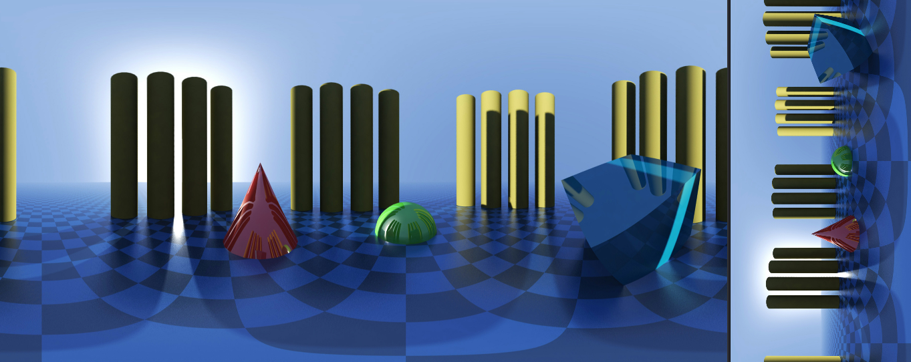

This macro simplifies the process of applying view rotations to switch your imagery between landscape and portrait style orientations in 90&deg; rotation increments. The node also keeps the view cropping centered as the image is rotated.

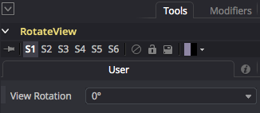

The View Rotation control allows you to apply 0&deg;, 90&deg;, 180&deg;, and 270&deg; rotations using a ComboControl menu.

To use this node an image is connect to the node's colored input named "Image". There is a single image output from the node called "Output" which displays the final rotated view.

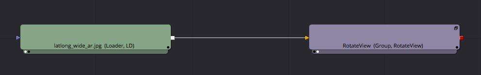
