# UV Pass Macros #

## UVAngular2EquirectangularGradientMap ##

The UVAngular2EquirectangularGradientMap macro generates a UV Pass texture that is used with the stock Fusion "Texture" node or the "UVPassFromRGBImage" node to convert panoramic image sequences between the angular fisheye 360&deg; format and the equirectangular/LatLong/spherical 360&deg;x180&deg; image projection.

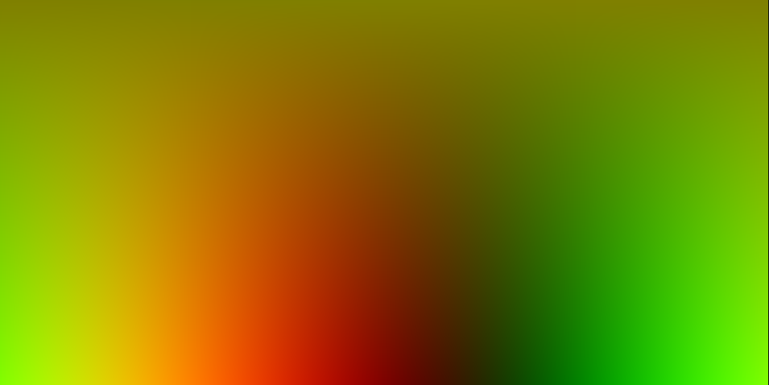

The "Depth" control allows you to specify the bit depth for the UV Pass image output. It is a good idea to always use the 32bit float option when generating a UV Pass image so you have the maximum color precision possible and can work with remapping a high resolution image.

If you use the 8bit int option when creating a UV Pass image you won't be able to remap an image over 256 pixels in width or height so a high dynamic range 16bit or 32bit output should be used at all times instead.

This is a node view of the typical UVPassFromRGBImage node connections that would be used to convert angular fisheye 360&deg; format imagery to the equirectangular/LatLong/spherical 360&deg;x180&deg; image projection:

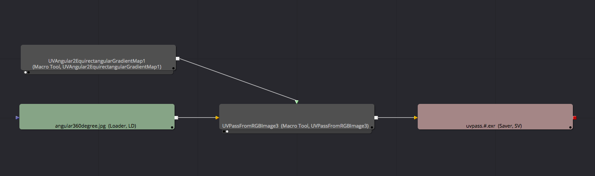

## UVDomemaster2EquirectangularGradientMap ##

The UVDomemaster2EquirectangularGradientMap macro generates a UV Pass texture that is used with the stock Fusion "Texture" node or the "UVPassFromRGBImage" node to convert panoramic image sequences between the angular fisheye 180&deg; format and the equirectangular/LatLong/spherical 360&deg;x180&deg; image projection.

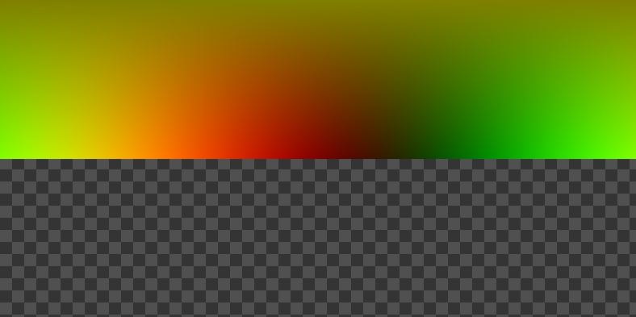

The "Depth" control allows you to specify the bit depth for the UV Pass image output. It is a good idea to always use the 32bit float option when generating a UV Pass image so you have the maximum color precision possible and can work with remapping a high resolution image.

If you use the 8bit int option when creating a UV Pass image you won't be able to remap an image over 256 pixels in width or height so a high dynamic range 16bit or 32bit output should be used at all times instead.

This is a node view of the typical UVPassFromRGBImage node connections that would be used to convert angular fisheye 180&deg; format imagery to the equirectangular/LatLong/spherical 360&deg;x180&deg; image projection:

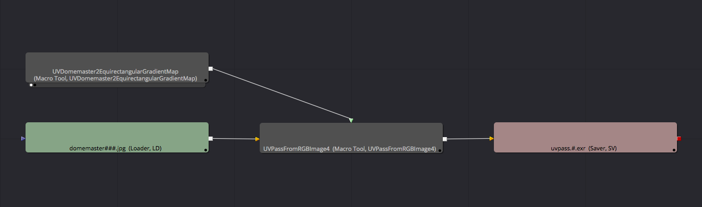

## UVEquirectangular2AngularGradientMap ##

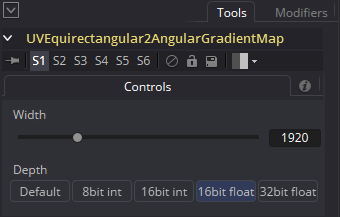

The UVEquirectangular2AngularGradientMap macro generates a UV Pass texture that is used with the stock Fusion "Texture" node or the "UVPassFromRGBImage" node to convert panoramic image sequences between the equirectangular/LatLong/spherical 360&deg;x180&deg; format and the angular fisheye 360&deg; image projection.

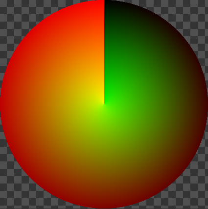

The "Depth" control allows you to specify the bit depth for the UV Pass image output. It is a good idea to always use the 32bit float option when generating a UV Pass image so you have the maximum color precision possible and can work with remapping a high resolution image.

If you use the 8bit int option when creating a UV Pass image you won't be able to remap an image over 256 pixels in width or height so a high dynamic range 16bit or 32bit output should be used at all times instead.

This is a node view of the typical UVPassFromRGBImage node connections that would be used to convert equirectangular/LatLong/spherical 360&deg;x180&deg; format imagery to the angular fisheye 360&deg; image projection:

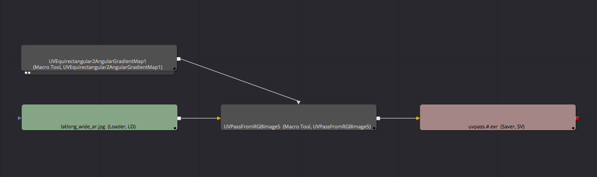

## UVEquirectangular2DomemasterGradientMap ##

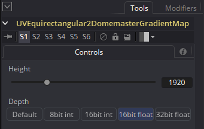

The UVEquirectangular2DomemasterGradientMap macro generates a UV Pass texture that is used with the stock Fusion "Texture" node or the "UVPassFromRGBImage" node to convert panoramic image sequences between the equirectangular/LatLong/spherical 360&deg;x180&deg; format and the angular fisheye 180&deg; image projection.

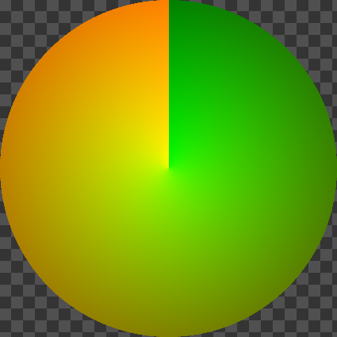

The "Depth" control allows you to specify the bit depth for the UV Pass image output. It is a good idea to always use the 32bit float option when generating a UV Pass image so you have the maximum color precision possible and can work with remapping a high resolution image.

If you use the 8bit int option when creating a UV Pass image you won't be able to remap an image over 256 pixels in width or height so a high dynamic range 16bit or 32bit output should be used at all times instead.

This is a node view of the typical UVPassFromRGBImage node connections that would be used to convert equirectangular/LatLong/spherical 360&deg;x180&deg; format imagery to the angular fisheye 180&deg; image projection:

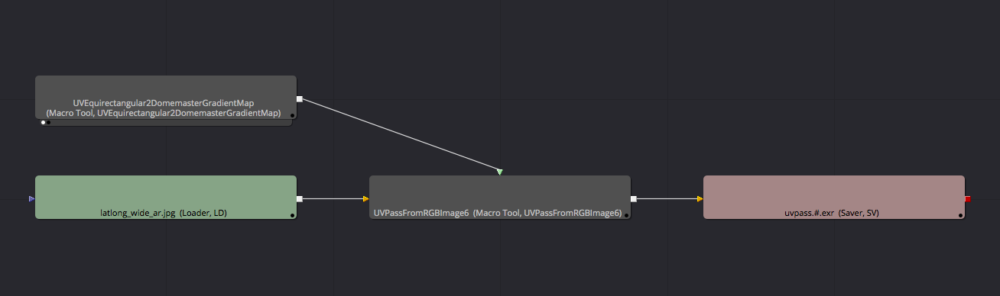

## UVGradientMap ##

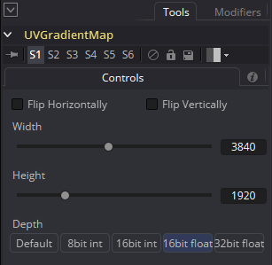

This macro creates an image with a simple Red/Green gradient effect that represents the base UV Pass texture map that all UV Pass remapping workflows are based upon. The Red channel represents the horizontal axis, and the green channel represents the vertical axis in a UV Pass.

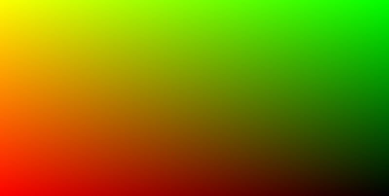

This UV Pass texture is used with the stock Fusion "Texture" node or the "UVPassFromRGBImage" node to remap a panoramic image sequence at a faster rate than just doing the transform math from scratch on each frame. A UV Pass workflow is used to bake the image transform and remapping data into a red/green channel high bit depth image that can speed up rendering by 30% or more since the image data acts like a pre-computed "look up table".

Typically a UVGradientMap texture map would be run through a Fusion node based warping process, or the imagery would be sent into a panoramic stitching tool like PTgui and transformed from its original red/green "flat" horizontal and vertical gradient look into the final pre-computed re-projection which can include lens distortion correction, panoramic rotations and transforms, image scaling, or other effects.

The "Depth" control allows you to specify the bit depth for the UV Pass image output. It is a good idea to always use the 32bit float option when generating a UV Pass image so you have the maximum color precision possible and can work with remapping a high resolution image.

The "Flip Horizontally" checkbox will reverse the gradient orientation on the X axis.

The "Flip Vertically" checkbox will reverse the gradient orientation on the Y axis.

The Flip Horizontally checkbox on the UVGradientMap node is handy for flipping the panoramic remapped imagery. This flipping action has the effect of simulating the world as if you are looking at the panoramic environment from either the "inside" or the "outside" and will reverse the imagery when the final imagery is routed through the UVPassFromRGBImage node. This is handy for fixing panoramic imagery that has the text reversed with details like lettering on road signs appearing backwards.

**Note:** If you use the 8bit int option when creating a UV Pass image, or save the resulting image to an 8bit per channel image format like a PNG/TGA/JPEG you won't be able to remap an image over 256 pixels in width or height. This is why it is so important to render and save a high dynamic range 16bit or 32bit UV Pass gradient image at all times to avoid any resolution limits (or banding artifacts) you would otherwise experience.

## UVPassFromRGBImage ##

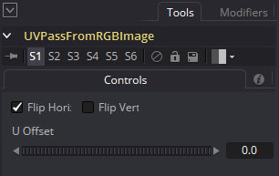

This macro works as a replacement for the standard Fusion "Texture" UV Pass remapping node. The UVPassFromRGBImage node simplifies the workflow for remapping a UV Pass image as it is able to pull the UV channel data directly from the RGB channels in the connected image.

By using this updated and improved UVPassFromRGBImage node in place of the older "Texture" node you don't need to add a separate Channel Booleans node to your composite each time you need to swap your RGB and UV pass image channels.

The "Flip Horizontally" checkbox will reverse the gradient orientation on the X axis.

The "Flip Vertically" checkbox will reverse the gradient orientation on the Y axis.

The Flip Horizontally checkbox on the UVGradientMap node is handy for flipping the panoramic remapped imagery from the "inside" to the "outside" and will reverse the imagery when it is routed through the UVPassFromRGBImage node.

The "U Offset" slider is handy for panning a remapped image horizontally and will work correctly across any of the remapped panoramic image projections. The "U Offset" slider works by "scrolling" the UV Pass color values in place which then adjusts the remapped output.

The final resolution of the UV Pass remapped imagery is determined based upon the width and height of the UV Pass input image that is fed into the UVPassFromRGBImage node.

The UVPassFromRGBImage node has two inputs which are labelled "Image", and "UV Pass". The node has a single output called "Output".

**Note:** If you are using a Fusion GridWarper to deform a UV Pass image and notice an ocasional "line dropout" like artifact in the warped output you switch to the GridWarper node's Render tab and change the Anti-aliasing setting to "None".

### UV Pass Equirectangular to Angular Fisheye Remapping ###

This image shows the result of taking a standard equirectangular panoramic image and running it through the UVPassFromRGBImage macro with the UVEquirectangular2AngularGradientMap node as the UV Pass remapping image:

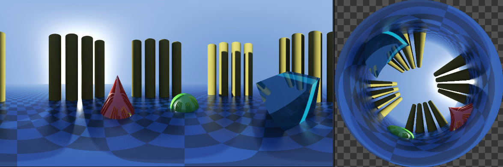

This is the node layout for the UVPassFromRGBImage macro when an equirectangular 360&deg;x180&deg; image is set as the "Image" input, and the "UVEquirectangular2AngularGradientMap" macro is set as the "UV Pass" input. The result is an angular fisheye 360&deg; based panoramic conversion.

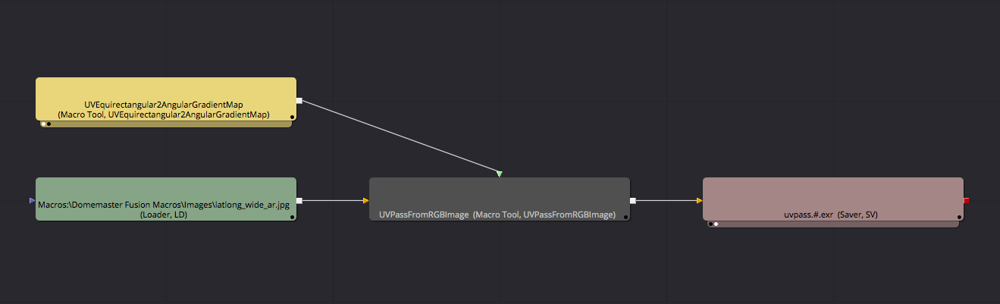

### UV Pass Equirectangular to Cubemap 3x2 Remapping ###

This image shows the result of the UV Pass node when it is used to do an equirectangular 360&deg;x180&deg; to cubemap 3x2 image conversion.

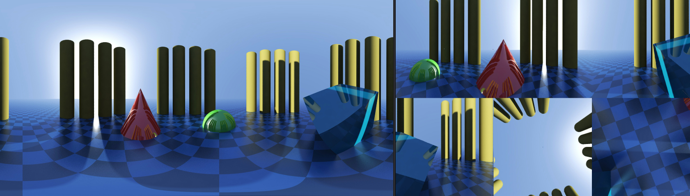

This is a Fusion node view screenshot that shows how the UV Pass remapping result was generated:

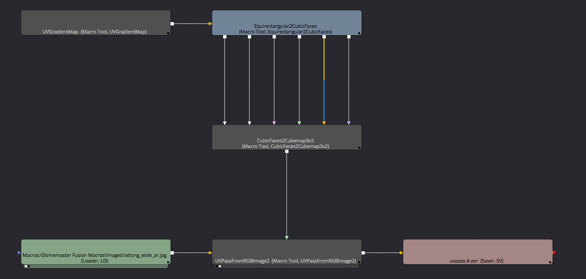

It works by feeding in a stock UVGradientMap node texture image into the Equirectangular2CubicFaces node which remaps the UV Pass texture into separate 90&deg; FOV cubic faces extracted from the UVGradientMap in the equirectangular projection.

Then the separate cubic faces (which hold the UV Pass data) from the Equirectangular2CubicFaces node are re-arranged and merged into a cubemap 3x2 layout using the CubicFaces2Cubemap3x2 macro. This final UV Pass map is fed into the UVPassFromRGBImage macro as the "UV Pass" input.

A panoramic equirectangular 360&deg;x180&deg; panoramic image is then connected to the UVPassFromRGBImage macro's "Image" input.

At this point you might be wondering what the final UV Pass texture map image looks like that was fed into the UVPassFromRGBImage macro for this panoramic conversion.

The original UVGradientMap map is on the left side, and the final equirectangular to cubemap 3x2 conversion UV Pass map texture is on the right side:

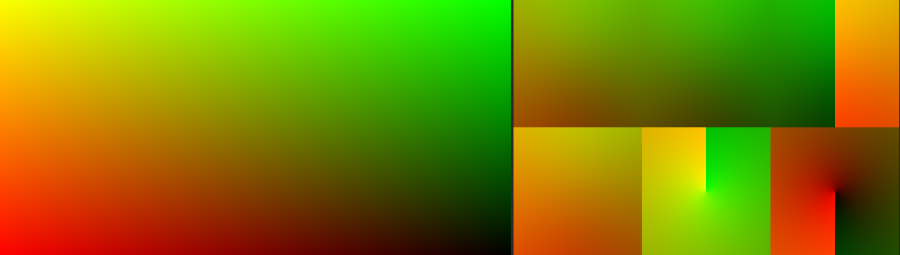

Quick Recap: The UV Pass map for equirectangular to Cubemap3x2 panoramic conversion was created by connecting the following macro nodes together:

`UVGradientMap` > `Equirectangular2CubicFaces` > `CubicFaces2Cubemap3x2`

**Note:** To make this whole UV Pass remapping process worthwhile and fast for panoramic image sequence processing, it would be a good idea to save a single frame .exr 16bit per channel or 32bit per channel image from your generated UV Pass texture map and then re-use it across the whole image sequence for a 30% plus speed boost.

**Note:** UV Pass images require special care to handle anti-aliasing and filtering on the UV Pass content is sensitive to image filtering in a way that is quite similar to the issues experienced with a traditional a Z-depth channel image.

## UVPassFromRGBImageOnDisk ##

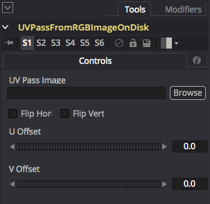

This macro works as a replacement for the standard Fusion "Texture" UV Pass remapping node, or the UVPassFromRGBImage node.

An advantage of using the UVPassFromRGBImageOnDisk node is that you don't need to add an image loader node to your composite each time you want to perform a UV Pass warping effect because this node stores the file loading attributes inside of the node. When you first add a UVPassFromRGBImageOnDisk node to your comp a file dialog appears that allows you to select a 16-bit or 32-bit per channel UV pass image from your hard disk.

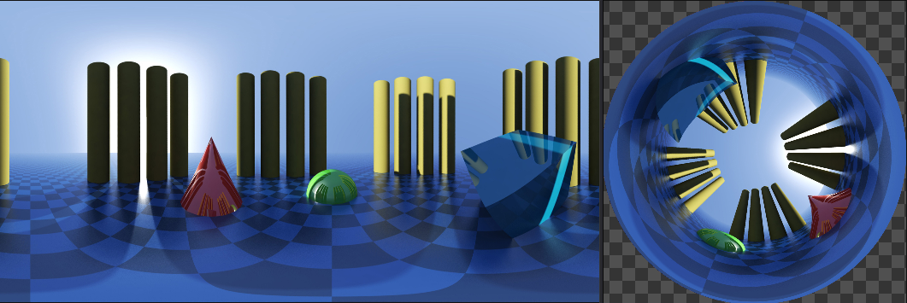

The "UV Pass Image" text field allows you to load a warping image off disk. This image should typically be a high dynamic range 16 bit per channel or 32 bit per channel .tiff or .exr image.

The "Flip Horizontally" checkbox will reverse the gradient orientation on the X axis.

The "Flip Vertically" checkbox will reverse the gradient orientation on the Y axis.

The "U Offset" slider is handy for panning a remapped image horizontally and will work correctly across any of the remapped panoramic image projections. The "U Offset" slider works by "scrolling" the UV Pass color values in place which then adjusts the remapped output.

The "V Offset" slider is handy for panning a remapped image vertically.

The final resolution of the UV Pass remapped imagery is determined based upon the width and height of the UV Pass input image that is used inside of the UVPassFromRGBImageOnDisk node.

The UVPassFromRGBImageOnDisk node has one input which is labelled "Image". The node has a single output called "Output".

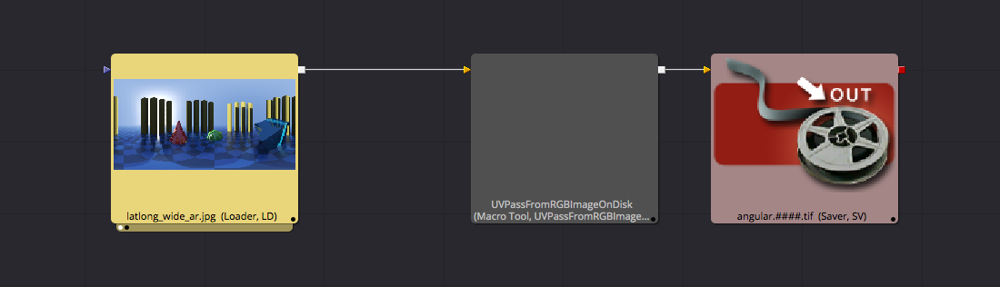

**Note:** To make this whole UV Pass remapping process worthwhile and fast for panoramic image sequence processing, it would be a good idea to save a single frame .exr 16bit per channel or 32bit per channel image from your generated UV Pass texture map and then re-use it across the whole image sequence for a 30% plus speed boost.

**Note:** UV Pass images require special care to handle anti-aliasing and filtering on the UV Pass content is sensitive to image filtering in a way that is quite similar to the issues experienced with a traditional a Z-depth channel image.

**Note:** If you are using a Fusion GridWarper to deform a UV Pass image and notice an ocasional "line dropout" like artifact in the warped output you switch to the GridWarper node's Render tab and change the Anti-aliasing setting to "None".

## UVPassVideoStitchingTemplate ##

This is a starting template for UV pass based panoramic 360&deg; video stitching. The final stitched panoramic video is written to disk using the saver node on the bottom right of the composite named "PanoramaSaver". 

You can duplicate and modify this structure to support stitching any number of panoramic cameras in your video rig. As you modify this node graph, you can connect each panoramic 360&deg; video camera view together in the composite using the merge nodes on the right named "ViewMerge".

To prepare your footage for use with this video stitching template the kartavr "Generate UV Pass in PTGui" script should be used to turn your PTGui stitching .pts project file into a set of UV pass based panoramic warping images (ST Maps) that allow you to warp your video into the final panoramic image projection.

The node named "CameraLoader" is used to load in the footage from one of your panoramic video rig cameras. The "UVPassLoader" node is used to load in a matching uv pass warping image for that specific camera view. 

The "BSplineMask" node is used along with an "AlphaMaskMerge" node to draw a custom rotoshape to select the part of a camera view you want to keep in the composite. 

The "AlphaMaskMerge" node is disabled by default with the Fusion "pass through" mode as it can only be used when you have created an acutal mask shape in the BSplineMask node. 

The saver nodes on the right hand side of the composite named "CameraMaskSaver" are used to allow you to export each of the camera view's custom BSpline alpha masks to disk if you want to use them later with an external compositing tool.

The "ColorCorrector" node is used to apply the primary color correction. Then the "ColorCorrectorMasked" node is used with the built-in gradient controls to adjust the masking of the color adjustments that will allow you to fine tune the brightness and color falloff in different regions in the frame like the pole area.

The "ViewerEquirectangular" node is used as a panoramic 360&deg; media viewer tool that simulates the playback of LatLong format media on an flat monitor view.

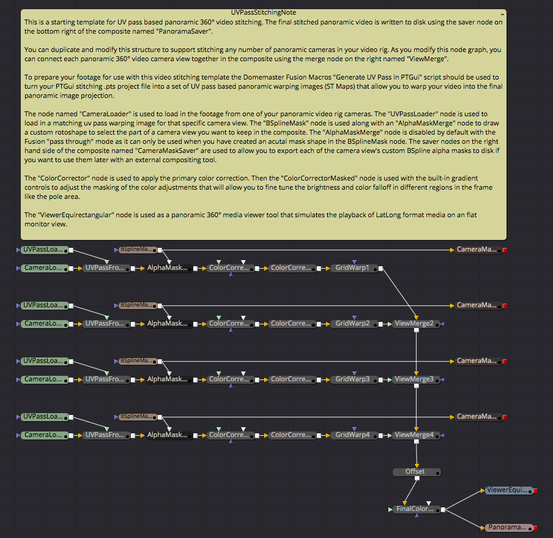
