# Viewer Macros #

## <a name="ViewerAcerWMR2StereoOU">ViewerAcerWMR2StereoOU</a> ##

This node allows you to use the Acer WMR HMD as a fullscreen stereo viewer window output device in Fusion that let you view your Fusion based equirectangular mono 2D imagery right on the HMD. This first version of the node has no head tracking support. To use this macro you need to mount the Acer WMR HMD as a regular monitor on Mac/Windows/Linux.

## <a name="ViewerOculusDK1Mono">ViewerOculusDK1Mono</a> ##

This node allows you to use the Oculus Rift DK1 HMD as a fullscreen stereo viewer window output device in Fusion that let you view your Fusion based equirectangular mono 2D imagery right on the HMD. This first version of the node has no head tracking support. To use this macro you need to mount the Oculus Rift DK1 or DK2 HMD as a regular monitor on Mac/Windows/Linux.

Check out the [Zoom New Image View](scripts#zoom-new-image-view) script documentation for tips on how to display this node on an Oculus Rift DK1 or DK2 HMD using a floating Viewer Windows.

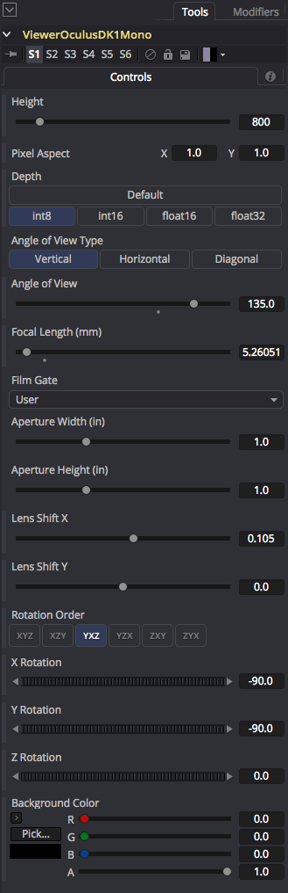

## <a name="ViewerOculusDK1Stereo">ViewerOculusDK1Stereo</a> ##

This node allows you to use the Oculus Rift DK1 HMD as a fullscreen stereo viewer window output device in Fusion that let you view your Fusion based equirectangular stereo 3D imagery right on the HMD. This first version of the node has no head tracking support. To use this macro you need to mount the Oculus Rift DK1 or DK2 HMD as a regular monitor on Mac/Windows/Linux.

Check out the [Zoom New Image View](scripts#zoom-new-image-view) script documentation for tips on how to display this node on an Oculus Rift DK1 or DK2 HMD using a floating Viewer Windows.

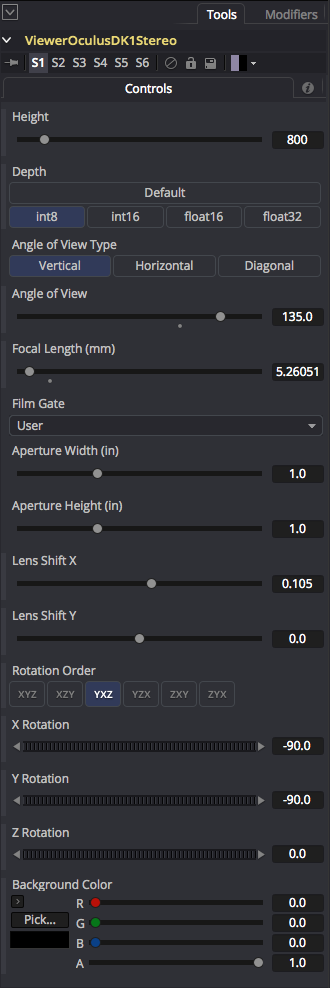

## ViewerOculusDK1StereoOU ##

This node allows you to use the Oculus Rift DK1 HMD as a fullscreen stereo viewer window output device in Fusion that let you view your Fusion based equirectangular stereo 3D over/under imagery right on the HMD. This first version of the node has no head tracking support. To use this macro you need to mount the Oculus Rift DK1 or DK2 HMD as a regular monitor on Mac/Windows/Linux.

Check out the [Zoom New Image View](scripts#zoom-new-image-view) script documentation for tips on how to display this node on an Oculus Rift DK1 or DK2 HMD using a floating Viewer Windows.

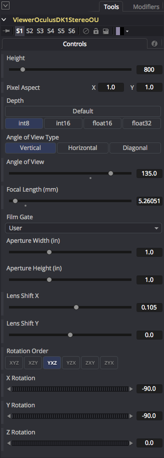

## <a name="ViewerOculusDK2Mono">ViewerOculusDK2Mono</a> ##

This node allows you to use the Oculus Rift DK2 HMD as a fullscreen stereo viewer window output device in Fusion that let you view your Fusion based equirectangular mono 2D imagery right on the HMD. This first version of the node has no head tracking support. To use this macro you need to mount the Oculus Rift DK1 or DK2 HMD as a regular monitor on Mac/Windows/Linux.

Check out the [Zoom New Image View](scripts#zoom-new-image-view) script documentation for tips on how to display this node on an Oculus Rift DK1 or DK2 HMD using a floating Viewer Windows.

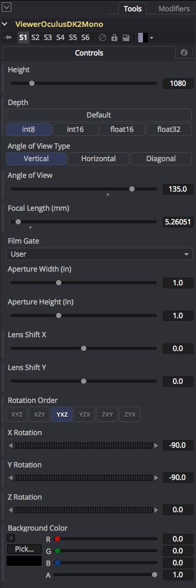

## <a name="ViewerOculusDK2Stereo">ViewerOculusDK2Stereo</a> ##

This node allows you to use th  Oculus Rift DK2 HMD as a fullscreen stereo viewer window output device in Fusion that let you view your Fusion based stereo equirectangular stereo 3D imagery right on the HMD. This first version of the node has no head tracking support. To use this macro you need to mount the Oculus Rift DK1 or DK2 HMD as a regular monitor on Mac/Windows/Linux.

Check out the [Zoom New Image View](scripts#zoom-new-image-view) script documentation for tips on how to display this node on an Oculus Rift DK1 or DK2 HMD using a floating Viewer Windows.

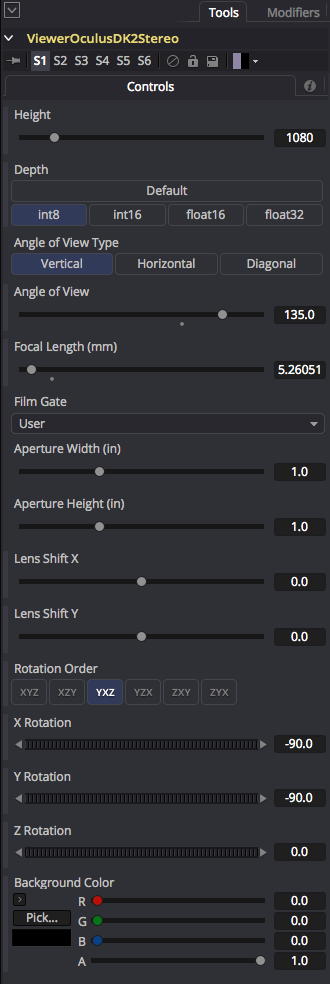

## <a name="ViewerOculusDK2StereoOU">ViewerOculusDK2StereoOU</a> ##

This node allows you to use the Oculus Rift DK2 HMD as a fullscreen stereo viewer window output device in Fusion that let you view your Fusion based stereo equirectangular stereo 3D over/under imagery right on the HMD. This first version of the node has no head tracking support. To use this macro you need to mount the Oculus Rift DK1 or DK2 HMD as a regular monitor on Mac/Windows/Linux.

Check out the [Zoom New Image View](scripts#zoom-new-image-view) script documentation for tips on how to display this node on an Oculus Rift DK1 or DK2 HMD using a floating Viewer Windows.

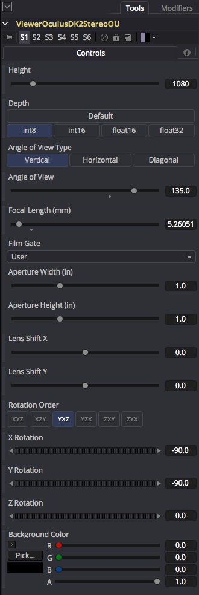

## ViewerCubicFaces ##

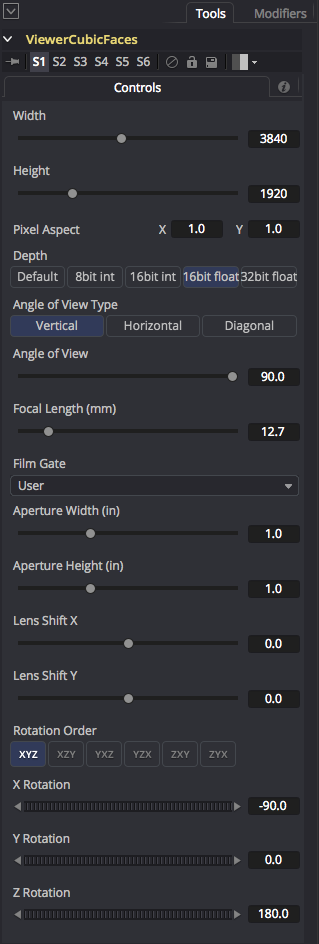

This macro takes a set of six individual 90&deg; FOV based cubic view source images and "defishes" it to extract a normal rectangular image (like a typical 16:9 or 4:3 style video frame) that can be displayed on a regular TV or a monitor.

This is handy as an panoramic 360&deg; image viewer that works in the Fusion node based environment. You can animate the XYZ rotation and field of view settings to explore different parts of the frame as you do the panoramic conversion.

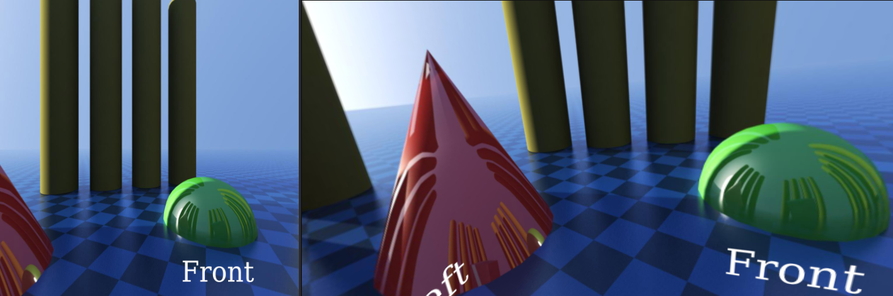

The "Width" and "Height" controls are used to specify the vertical and horizontal resolution of the extracted camera view.

The "Pixel Aspect" control can be used to create anamorphic stretching look if you want to go with a non square pixel format.

The "Depth" control allows you to specify the bit depth for the panoramic output. The "8bit int" option is for PNG/TGA/JPG outputs, and the "16bit float" or "32bit float" options are perfect for floating point EXR based outputs that have HDR (high dynamic range) based color values that exceed the standard 0.0-1.0 color range.

The "Angle of View Type" control allows you to choose which axis is used on the lens when the Focal Length and Angle of View value is computed. 

The "Angle of View" control changes the camera field of view setting in degrees used for the panoramic view extraction. The "Focal Length (mm)" control is linked together with the Angle of View control so you can use either slider and achieve the same field of view result.

The "Film Gate", "Aperture Width", "Aperture Height", and "Lens Shift X" and Y values are used to match your Fusion macro based extracted camera view against a traditional photographic lens based camera parameter.

The "Lens Shift X" and "Lens Shift Y" parameters allow you to adjust the 2D filmback based centering of the lens compared to the origin of a theoretical film back on the camera.

The "Rotation Order" control allows you to control the precedence for each of the rotation axis. This is helpful when you need to solve gimbal lock by selecting the most important rotation channel for your camera animation and making it the first of the three axes listed in the Rotation Order settings.

The X Rotation/Y Rotation/Z Rotation sliders are used to spin the orientation of the view around and can be used to level the horizon. The "Z Rotation" slider lets you perform a horizontal panning effect on the camera view which can be used to adjust and re-center the front facing part of the panoramic image.

If you have a TV or video projector connected in the Fusion preferences as a "Video Monitoring Device", you can view a final extracted 16:9 rectangular video version of your composite on a full screen video display.

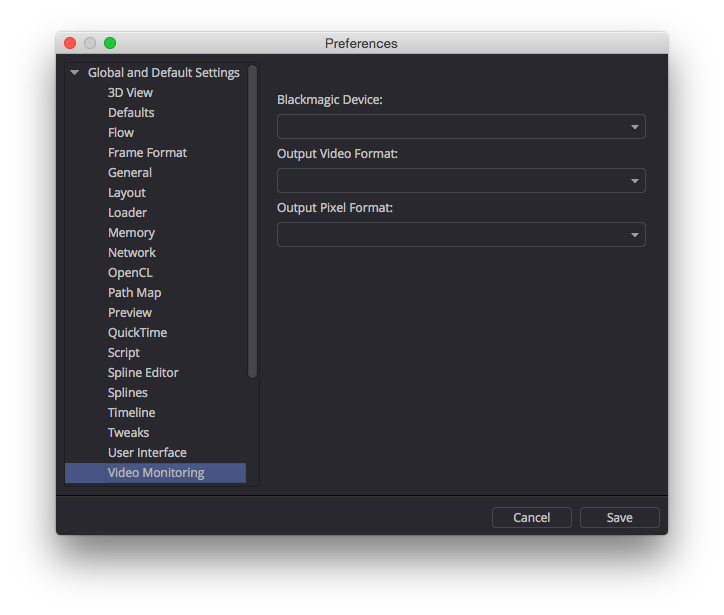

To use this node, individual 90&deg; FOV based cubic view source images are connected to the node's colored inputs named `Front`, `Right`, `Back`, `Left`, `Top`, and `Bottom` attributes. There is a single image output from the node called "Output".

The image below shows an example conversion from the composite file `Viewer Cubic Faces.comp`.

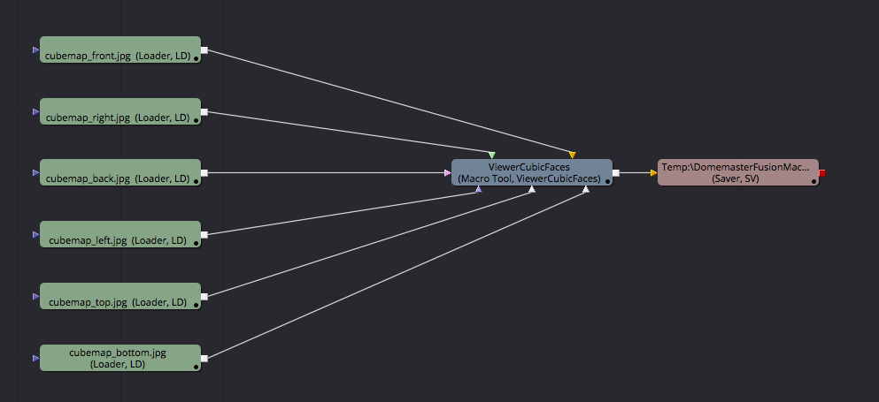

**Note:** If you hover your cursor over each of the colored triangle inputs on the node you will see a tool tip appear that indicates what the currently selected input is called.

## ViewerCubicFacesStereo ##

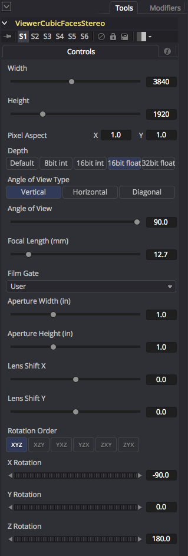

This macro takes a set of six individual 90&deg; FOV based cubic view source images for the left and right eye and "defishes" it to extract a stereoscopic rectangular image (like a typical 16:9 or 4:3 style video frame) that can be displayed on a stereo TV or a monitor.

This is handy as an panoramic 360&deg; image viewer that works in the Fusion node based environment. You can animate the XYZ rotation and field of view settings to explore different parts of the frame as you do the panoramic conversion.

The image below shows an example conversion from the composite file `Viewer Cubic Faces.comp` that has a Gear VR horizontal strip stereo cubemap image (on the left) that is run through the `ViewerCubicFacesStereo` macro and extracted into a pair of left and right rectangular stereo views. Those two images are then merged into an anagylph stereo output with the help of a StereoAnaglyphHalfColorMerge macro. This kind of approach allows you to quickly and cost effectively preview the stereo imagery on your monitor as you work on building a 360&deg; stereo composite.

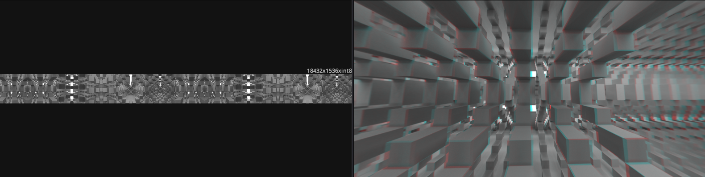

The "Width" and "Height" controls are used to specify the vertical and horizontal resolution of the extracted camera view.

The "Pixel Aspect" control can be used to create anamorphic stretching look if you want to go with a non square pixel format.

The "Depth" control allows you to specify the bit depth for the panoramic output. The "8bit int" option is for PNG/TGA/JPG outputs, and the "16bit float" or "32bit float" options are perfect for floating point EXR based outputs that have HDR (high dynamic range) based color values that exceed the standard 0.0-1.0 color range.

The "Angle of View Type" control allows you to choose which axis is used on the lens when the Focal Length and Angle of View value is computed.

The "Angle of View" control allows you to change the camera field of view setting in degrees used for the panoramic view extraction. The "Focal Length (mm)" control is linked together with the Angle of View control so you can use either slider and achieve the same field of view result.

The "Film Gate", "Aperture Width", "Aperture Height", and "Lens Shift X" and Y values are used to match your Fusion macro based extracted camera view against a traditional photographic lens based camera parameter.

The "Lens Shift X" and "Lens Shift Y" parameters allow you to adjust the 2D filmback based centering of the lens compared to the origin of a theoretical film back on the camera.

The "Rotation Order" control allows you to control the precedence for each of the rotation axis. This is helpful when you need to solve gimbal lock by selecting the most important rotation channel for your camera animation and making it the first of the three axes listed in the Rotation Order settings.

The X Rotation/Y Rotation/Z Rotation sliders are used to spin the orientation of the view around and can be used to level the horizon. The "Z Rotation" slider lets you perform a horizontal panning effect on the camera view which can be used to adjust and re-center the front facing part of the panoramic image.

If you have a stereo 3D capable TV or video projector connected in the Fusion preferences as a "Video Monitoring Device", you can view a final stereo extracted 16:9 rectangular video version of your composite on a true color stereo device with shutter glasses or polarizer lenses.

This is a snapshot of the example composite "Cubic Faces Defish to Rectangular.comp" that shows how to extract a perspective stereo camera view from a Gear VR horizontal strip cubic stereo panorama and convert it into a 16:9 rectangular format.

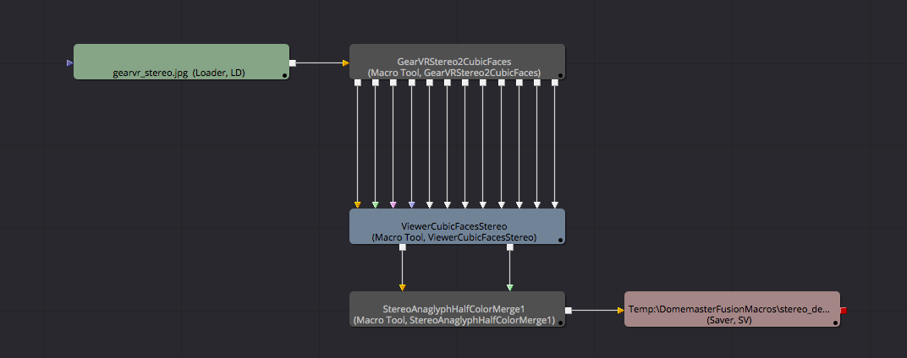

To use this node, individual 90&deg; FOV based cubic view source images are connected to the node's colored inputs named `LeftCam_Front`, `LeftCam_Right`, `LeftCam_Back`, `LeftCam_Left`, `LeftCam_Top`, `LeftCam_Bottom`,  `RightCam_Front`, `RightCam_Right`, `RightCam_Back`, `RightCam_Left`, `RightCam_Top`, and `RightCam_Bottom` attributes. There are two image outputs from the node called "LetOutput" and "RightOutput" that hold the left and right extracted and defished image views.

**Note:** If you hover your cursor over each of the colored triangle inputs on the node you will see a tool tip appear that indicates what the currently selected input is called.

## ViewerEquirectangular ##
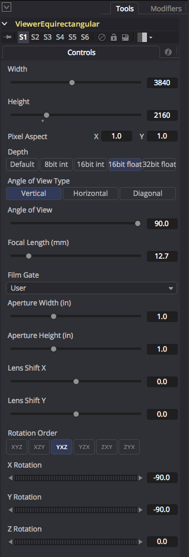

This macro takes a 360&deg; x 180&deg; equirectangular/LatLong/spherical panorama and "defishes" it to extract a normal rectangular image (like a typical 16:9 or 4:3 style video frame) that can be displayed on a normal TV or a monitor.

This is handy as an panoramic 360&deg; image viewer that works in the Fusion node based environment. You can animate the XYZ rotation and field of view settings to explore different parts of the frame as you do the panoramic conversion.

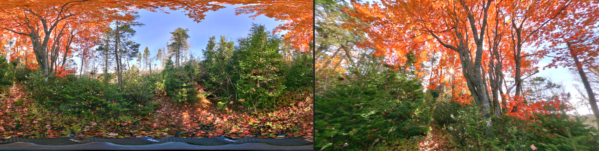

The "Width" and "Height" controls are used to specify the vertical and horizontal resolution of the extracted camera view.

The "Pixel Aspect" control can be used to create anamorphic stretching look if you want to go with a non square pixel format.

The "Depth" control allows you to specify the bit depth for the panoramic output. The "8bit int" option is for PNG/TGA/JPG outputs, and the "16bit float" or "32bit float" options are perfect for floating point EXR based outputs that have HDR (high dynamic range) based color values that exceed the standard 0.0-1.0 color range.

The "Angle of View Type" control allows you to choose which axis is used on the lens when the Focal Length and Angle of View value is computed.

The "Angle of View" control allows you to change the camera field of view setting in degrees used for the panoramic view extraction. The "Focal Length (mm)" control is linked together with the Angle of View control so you can use either slider and achieve the same field of view result.

The "Film Gate", "Aperture Width", "Aperture Height", and "Lens Shift X" and Y values are used to match your Fusion macro based extracted camera view against a traditional photographic lens based camera parameter.

The "Lens Shift X" and "Lens Shift Y" parameters allow you to adjust the 2D filmback based centering of the lens compared to the origin of a theoretical film back on the camera.

The "Rotation Order" control allows you to control the precedence for each of the rotation axis. This is helpful when you need to solve gimbal lock by selecting the most important rotation channel for your camera animation and making it the first of the three axes listed in the Rotation Order settings.

The X Rotation/Y Rotation/Z Rotation sliders are used to spin the orientation of the view around and can be used to level the horizon. The "Z Rotation" slider lets you perform a horizontal panning effect on the camera view which can be used to adjust and re-center the front facing part of the panoramic image.

If you have a TV or video projector connected in the Fusion preferences as a "Video Monitoring Device", you can view a final extracted 16:9 rectangular video version of your composite on a full screen video display.

This is a snapshot of the example composite "LatLong Defish to Rectangular.comp" that shows how to extract a perspective view from a LatLong panorama and convert it into a 16:9 rectangular format.

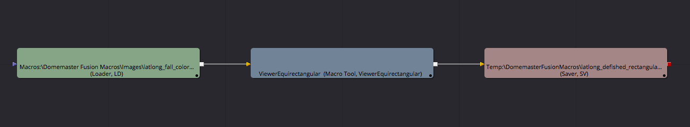

## ViewerEquirectangularStereo ##
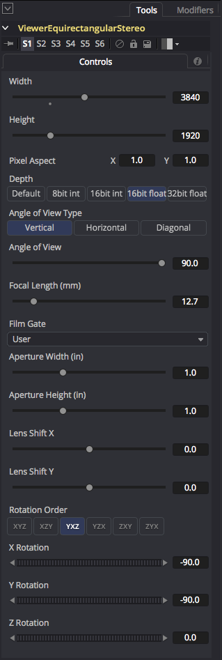

This macro takes a pair of separate left and right eye stereo 360&deg; x 180&deg; equirectangular/LatLong/spherical stereo panoramas and "defishes" them to extract a normal rectangular left and right eye images (like a typical 16:9 or 4:3 style video frame) that can be displayed on a normal TV or a monitor.

This is handy as a panoramic 360&deg; stereo image viewer that works in the Fusion node based environment. You can animate the XYZ rotation and field of view settings to explore different parts of the frame as you do the panoramic conversion.

The left and right image outputs from this node can be routed into an anaglyph merging node like "StereoAnaglyphHalfColorMerge", or the over/under stereoscopic node "StereoOverUnderMerge", or the side by side stereoscopic node "StereoSideBySideMerge" for a quick and interactive stereo preview of your composite.

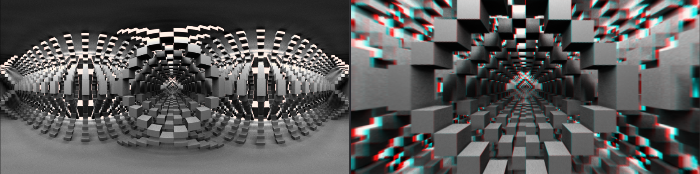

The "Width" and "Height" controls are used to specify the vertical and horizontal resolution of the extracted camera view.

The "Pixel Aspect" control can be used to create anamorphic stretching look if you want to go with a non square pixel format.

The "Depth" control allows you to specify the bit depth for the panoramic output. The "8bit int" option is for PNG/TGA/JPG outputs, and the "16bit float" or "32bit float" options are perfect for floating point EXR based outputs that have HDR (high dynamic range) based color values that exceed the standard 0.0-1.0 color range.

The "Angle of View Type" control allows you to choose which axis is used on the lens when the Focal Length and Angle of View value is computed.

The "Angle of View" control allows you to change the camera field of view setting in degrees used for the panoramic view extraction. The "Focal Length (mm)" control is linked together with the Angle of View control so you can use either slider and achieve the same field of view result.

The "Film Gate", "Aperture Width", "Aperture Height", and "Lens Shift X" and Y values are used to match your Fusion macro based extracted camera view against a traditional photographic lens based camera parameter.

The "Lens Shift X" and "Lens Shift Y" parameters allow you to adjust the 2D filmback based centering of the lens compared to the origin of a theoretical film back on the camera.

The "Rotation Order" control allows you to control the precedence for each of the rotation axis. This is helpful when you need to solve gimbal lock by selecting the most important rotation channel for your camera animation and making it the first of the three axes listed in the Rotation Order settings.

The X Rotation/Y Rotation/Z Rotation sliders are used to spin the orientation of the view around and can be used to level the horizon. The "Z Rotation" slider lets you perform a horizontal panning effect on the camera view which can be used to adjust and re-center the front facing part of the panoramic image.

If you have a stereo 3D capable TV or video projector connected in the Fusion preferences as a "Video Monitoring Device", you can view a final stereo extracted 16:9 rectangular video version of your composite on a true color stereo device with shutter glasses or polarizer lenses.

This is a snapshot of the example composite "LatLong Stereo Defish to Rectangular.comp" that shows how to extract a perspective view from a pair of left and right eye stereo LatLong panoramas and convert them into a 16:9 rectangular anaglyph stereo format.

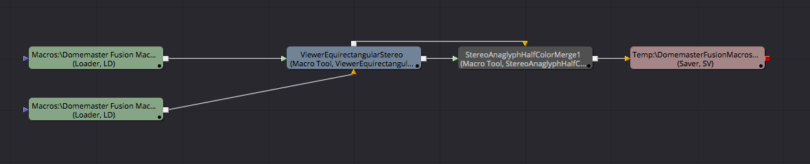

## ViewerEquirectangularStereoOU ##

This macro takes an over/under formatted pair of left and right eye stereo 360&deg; x 180&deg; equirectangular/LatLong/spherical stereo panoramas and "defishes" them to extract a normal rectangular left and right eye images (like a typical 16:9 or 4:3 style video frame) that can be displayed on a normal TV or a monitor.

This is handy as a panoramic 360&deg; stereo image viewer that works in the Fusion node based environment. You can animate the XYZ rotation and field of view settings to explore different parts of the frame as you do the panoramic conversion.

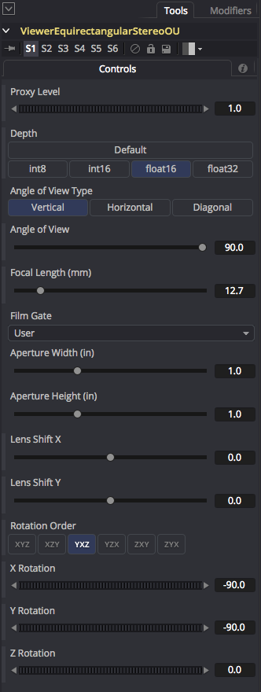

## ViewerMesh ##

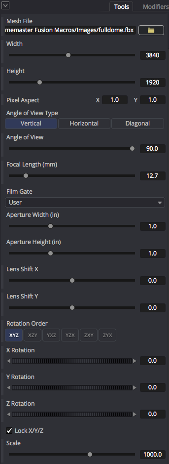

This node allows you to reformat panoramic imagery to an arbitrary image projection of your own design that is defined using an FBX/OBJ/DAE/3DS/Alembic format polygon mesh and a custom UV Layout.

This macro is also handy as a multi-purpose panoramic 360&deg; image viewer that works in the Fusion node based environment. You can animate the XYZ rotation and field of view settings to explore different parts of the frame as you do the panoramic conversion.

The following image shows the result of a fulldome image (on the left) being defished into a regular rectangular image projection format (on the right) using the `ViewerMesh` macro node with sample mesh file `Macros:/KartaVR/Images/fulldome.fbx` loaded in the macro node's "Mesh File" text field.

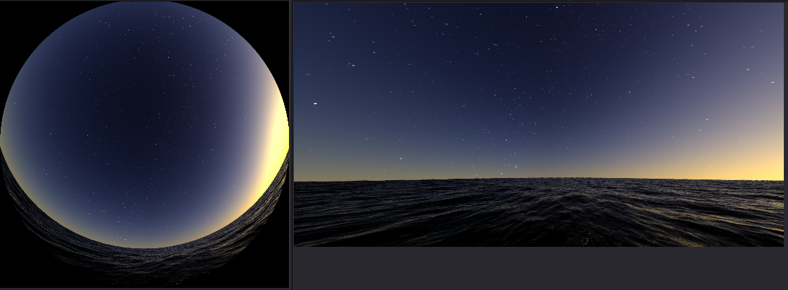

The "Width" and "Height" controls are used to specify the vertical and horizontal resolution of the extracted camera view.

The "Pixel Aspect" control can be used to create anamorphic stretching look if you want to go with a non square pixel format.

The "Angle of View Type" control allows you to choose which axis is used on the lens when the Focal Length and Angle of View value is computed.

The "Angle of View" control allows you to change the camera field of view setting in degrees used for the panoramic view extraction. The "Focal Length (mm)" control is linked together with the Angle of View control so you can use either slider and achieve the same field of view result.

The "Film Gate", "Aperture Width", "Aperture Height", and "Lens Shift X" and Y values are used to match your Fusion macro based extracted camera view against a traditional photographic lens based camera parameter.

The "Lens Shift X" and "Lens Shift Y" parameters allow you to adjust the 2D filmback based centering of the lens compared to the origin of a theoretical film back on the camera.

The "Rotation Order" control allows you to control the precedence for each of the rotation axis. This is helpful when you need to solve gimbal lock by selecting the most important rotation channel for your camera animation and making it the first of the three axes listed in the Rotation Order settings.

The X Rotation/Y Rotation/Z Rotation sliders are used to spin the orientation of the view around and can be used to level the horizon. The "Z Rotation" slider lets you perform a horizontal panning effect on the camera view which can be used to adjust and re-center the front facing part of the panoramic image.

The "Lock X/Y/Z" checkbox will link together the "Scale" control into a single unified slider. When this slider is un-checked you will have direct control over the Scale X/Scale Y/Scale Z controls which allow for non-proportional scaling.

The Scale control allows you to change the size of the mesh used in the texture baking operation. If the model is extremely large or small it can be helpful to change the scale setting control so the model fits within Fusion's default near and far clipping plane regions.

If you disable the "Lock X/Y/Z" checkbox you can create cartoon like squash and stretch distortions in the environment map imagery by doubling the Scale value on a single axis in relation to the other scale controls.

If you have a TV or video projector connected in the Fusion preferences as a "Video Monitoring Device", you can view a final extracted 16:9 rectangular video version of your composite on a full screen video display.

The node has one input which is labelled "Input". The node has a single output called "Output".

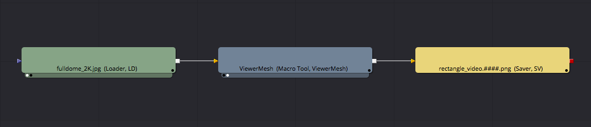

**Note:** If the ViewerMesh texture baking operation doesn't seem to have the correct "infinite" like look to the panoramic image conversion it is usually an indication the scale control needs to be adjusted to fix the issue.

## ViewerMeshStereo ##

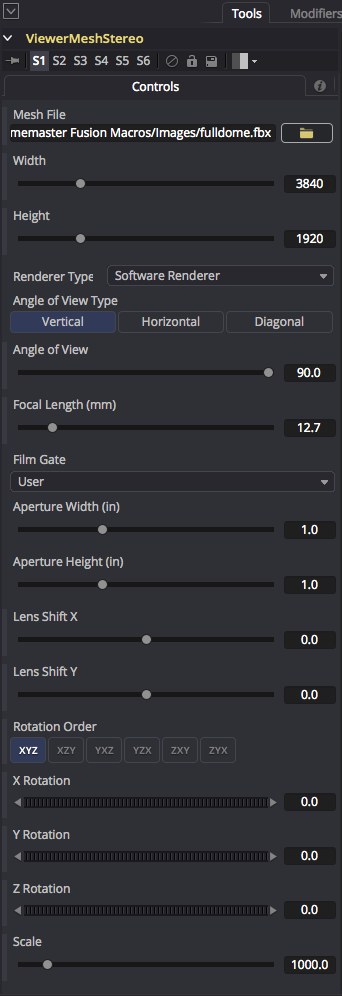

This node allows is a stereoscopic version of the standard ViewerMesh node. It allows you to reformat a pair of left and right panoramic images to an arbitrary image projection of your own design that is defined using an FBX/OBJ/DAE/3DS/Alembic format polygon mesh and a custom UV Layout.

This macro is also handy as a multi-purpose panoramic 360&deg; image viewer that works in the Fusion node based environment. You can animate the XYZ rotation and field of view settings to explore different parts of the frame as you do the panoramic conversion.

The "Width" and "Height" controls are used to specify the vertical and horizontal resolution of the extracted camera view.

The "Renderer Type" options menu allows you to choose if you want to use the Fusion Software Renderer or the OpenGL Renderer to drive the panoramic 360&deg; media viewer graphics context. You can compare the performance of both options to see which one works best with your GPU or CPU and delivers the fastest interactive performance.

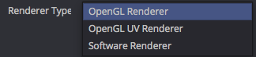

The "Angle of View Type" control allows you to choose which axis is used on the lens when the Focal Length and Angle of View value is computed.

The "Angle of View" control allows you to change the camera field of view setting in degrees used for the panoramic view extraction. The "Focal Length (mm)" control is linked together with the Angle of View control so you can use either slider and achieve the same field of view result.

The "Film Gate", "Aperture Width", "Aperture Height", and "Lens Shift X" and Y values are used to match your Fusion macro based extracted camera view against a traditional photographic lens based camera parameter.

The "Lens Shift X" and "Lens Shift Y" parameters allow you to adjust the 2D filmback based centering of the lens compared to the origin of a theoretical film back on the camera.

The "Rotation Order" control allows you to control the precedence for each of the rotation axis. This is helpful when you need to solve gimbal lock by selecting the most important rotation channel for your camera animation and making it the first of the three axes listed in the Rotation Order settings.

The X Rotation/Y Rotation/Z Rotation sliders are used to spin the orientation of the view around and can be used to level the horizon. The "Z Rotation" slider lets you perform a horizontal panning effect on the camera view which can be used to adjust and re-center the front facing part of the panoramic image.

The "Lock X/Y/Z" checkbox will link together the "Scale" control into a single unified slider. When this slider is un-checked you will have direct control over the Scale X/Scale Y/Scale Z controls which allow for non-proportional scaling.

The Scale control allows you to change the size of the mesh used in the texture baking operation. If the model is extremely large or small it can be helpful to change the scale setting control so the model fits within Fusion's default near and far clipping plane regions.

If you disable the "Lock X/Y/Z" checkbox you can create cartoon like squash and stretch distortions in the environment map imagery by doubling the Scale value on a single axis in relation to the other scale controls.

The node has two inputs which are labelled "Left" and "Right". The node has a two outputs called "LeftOutput" and "RightOutput".

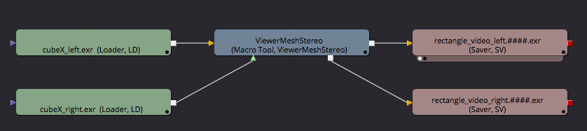

**Note:** If the ViewerMesh texture baking operation doesn't seem to have the correct "infinite" like look to the panoramic image conversion it is usually an indication the scale control needs to be adjusted to fix the issue.

