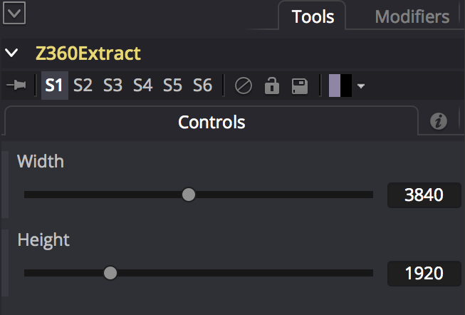
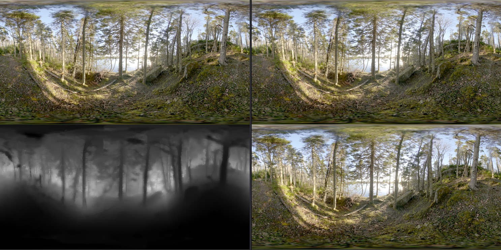

# Z360 Macros #

## <a name="Z360DepthBlur">Z360DepthBlur</a> ##

The Z360DepthBlur node can be used to apply a depth of field like blurring effect using the depthmap data in the Z360 over/under image layout.

The "ZDepth Blur Filter" control is used to choose if you want a slow to render but high quality lens blur effect with the "Super Soften" mode, a medium fast to render "Soften" mode, or a quick to render but cubic looking blur with the "Box" option.

The "ZDepth Depth Blur Channel" is set to Luma (Luminance) by default. This control is used to let the node know what RGB/A/Z channel is providing the required depthmap information to the node's "depth" input connection.

The "Blur Size" control adjusts the overall blurriness of the defocus effect.

The ZDepth and RGB color correction controls are handy if you want to tweak the image as it is being processed.

If you adjust the ZDepth controls the changes will be visible on the depthmap image data in the lower half of a Z360 image.

**Note:** After you apply the Z360DepthBlur effect, it is possible to connect a Z360Extract node to crop out and isolate just the top color equirectangular image view from a Z360 over/under format panorama. You can then view the RGB color image output from the Z360Extract node by connecting the RGB output to a saver node or to an image effect like a ColorCorrector.

This is a view of the Z360DepthBlur node connections:

## <a name="Z360Extract">Z360Extract</a> ##

The Z360Extract node takes a Z360 style over/under color/depthmap formatted image and separates the two views to provide individual "RGB" and "Depth" image outputs. 

Functionally, the "Z360Extract" macro is similar to the StereoOverUnderExtract macro with just the inputs renamed for convenience.

The Width control is the horizontal size of the final separated image views.

The Height control is the vertical size of the final separated image views.

This is a view of the Z360Extract node connections:

## <a name="Z360Merge">Z360Merge</a> ##

The Z360Merge node takes two color image inputs named "RGB" and "Depth" and merges them into a Z360 style over/under color/depthmap format. 

Functionally, the "Z360Merge" macro is similar to the StereoOverUnderMerge macro with just the inputs renamed for convenience.

The Width control is the horizontal size of the final combined image.

The Height control is the vertical size of the final combined image.

This is a view of the Z360Merge node connections:

## <a name="Z360Mesh3D">Z360Mesh3D</a> ##

The Z360Mesh3D node takes the color + depthmap image data and creates a new displaced environment sphere that allows you to explore a simulated real-time volumetric VR version of the scene in Fusion's 3D workspace.

You can easily toggle between viewing the color imagery or the raw depthmap data on the spherical environment shape using the Z360Mesh3D node's Enable RGB Texture checkbox control.

A Z360Mesh3D With **Enable RGB Texture** Checkbox On:

A Z360Mesh3D With the **Enable RGB Texture** Checkbox Off:

A Z360Mesh3D approach allows you to use Fusion's camera3D system in the Viewer window with stereo 3D previewing enabled, or to connect an HMD and explore the 3D world interactively. Since the Z360Mesh3D node creates real geometry in the scene that updates per frame you are able to easily move around with full XYZ rotation and translation controls. With this approach you can also place Fusion based Alembic/FBX/OBJ meshes inside the same 3D scene, or add photogrammetry generated elements, too.

The Yaw (Y Rotation)/Pitch(Z Rotation)/Roll( X Rotation) sliders are used to spin the orientation of the camera view around and can be used to level the horizon or compensate for dome tilt.

The Displacement Scale attribute is used to define the size in Fusion native units of the virtual environment sphere that has the depthmap based "surface relief" displacement effect applied.

The Displacement Bias control lets you adjust the inwards vs outwards offset that happens when the environment sphere surface is displaced.

The next control is a set of three "Depth Level" controls that are on a single row but don't have a visible text label. The three number fields and sliders are used to represent (left to right order) the Far/Mid/Near Depth Levels of the displacement depth effect.

The Environment Radius control is a simple multiplier that is used to scale the final environment sphere size and it has an effect on how the depth and XYZ world offset translations appear in the final left and right eye views when the scene is processed in the Z360Stereo node. The Environment Radius control is the fastest way to change how "big" the stereo 3D world feels when Z360 depth conversion is applied.

The Environment Subdivision Level (Base) control is the horizontal axis resolution of the polygonal environment sphere mesh. This control is used to define how much detail is present when the surface of the mesh is displaced. It has a default setting of 1536 subdivisions but can be set far lower if you only have a subtle amount of variations in the depthmap and most of the depth detail is close to the same distance. 

This is a view of the Z360Mesh3D node connections:

### Z360Mesh3D Performance Enhancements ###

Lowering the mesh resolution on the Z360Mesh3D node will make the tool more interactive. This is handy when you have a Z360 formatted movie/image sequence active and you try scrubbing the Fusion timeline playhead.

Try using these settings on the Z360Mesh3D node if you want to work with moving Z360 formatted imagery and you need to have a faster "draft" quality depth preview in the Fusion 3D viewport windows:

- Environment Subdivision Level (Base): 256
- Environment Subdivision Level (Base): 128

### Camera3D Node Settings for Z360Mesh3D Scenes ###

When you view a Z360Mesh3D scene in stereo 3D using a Camera3D node some initial settings you can start with are:

- Far Clip: 10000
- Stereo Mode: Off Axis
- Eye Separation: 65
- Convergence Distance: 175

You can expression link the Camera3D node's "Convergence Distance" control to use the exact size of the Z360Mesh3D node surface by multiplying the "Displacement Scale" attribute by the "Environment Radius" setting using the expression `Z360Mesh3D.Input9*Z360Mesh3D.Input14`.

## <a name="Z360Renderer3D">Z360Renderer3D</a> ##

The Z360Renderer3D node creates Equirectangular/LatLong/Spherical 360&deg; FOV style Z360 Over/Under color/depth renderings using Fusion's 3D animation system.

When the Z360 output from this node is combined with the "Z360Stereo" node you can create omni-directional stereo 360&deg; mograph style output using models and graphic elements loaded in the Fusion 3D workspace.

The "Height" control is used to specify the vertical resolution of the rendered Equirectangular Z360 over/under color/depthmap view. The final width is set automatically to the same value as the height setting due to the fact that an equirectangular panorama has a 2:1 aspect ratio and there are two equirectangular images placed in an over/under frame layout for a final 1:1 image aspect ratio.

The "Depth" control allows you to specify the bit depth for the panoramic output. The "8bit int" option is for PNG/TGA/JPG outputs, and the "16bit float" or "32bit float" options are perfect for floating point EXR based outputs that have HDR (high dynamic range) based color values that exceed the standard 0.0-1.0 color range.

The Enable Lighting and Enable Shadows options are useful for creating photorealistic renderings from Fusion's 3D animation system.

The X Offset/Y Offset/Z Offset sliders allow you to translate the camera rig around the virtual world inside the Fusion 3D scene.

The Rotation Order control allows you to control the precedence for each of the rotation axis. This is helpful when you need to solve gimbal lock by selecting the most important rotation channel for your camera animation and making it the first of the three axes listed in the Rotation Order settings.

The X Rotation/Y Rotation/Z Rotation sliders are used to spin the orientation of the camera view around and can be used to level the horizon or compensate for dome tilt.

To use this node, the Fusion 3D scene's output is connected to the node's yellow colored "SceneInput1" attribute. There is one rendered image output from the node called "Output".

**Note:** If you are rendering to a floating point format and you don't have a Shape3D spherical mesh wrapping around the scene with a panoramic image for the sky/background, you may have to either lower the Z360Stereo node's "ZDepth Gain setting", or add your own CustomTool node / ChangeDepth node to clamp the depth range to a 0-1 value. If you have "huge" floating point Z-Depth values rendered beyond a typical Z-Depth range of 1000 units from the camera then you may get unexpected artifacts when you try to apply a Z360Stereo conversion to the Z360Renderer3D rendered imagery.

This is a view of the node connections that are used to render a Z360 format image from Fusion's 3D system.

## <a name="Z360Stereo">Z360Stereo</a> ##

The "Z360Stereo" node works with panoramic color + depthmap formatted over/under stereo media. This node allows you to convert a color + depthmap image into a pair of left and right displaced stereo views. There is also a macro LUT version of the tool called [Z360 Stereo LUT](luts#z360-stereo-lut) that can be applied directly in the viewer window. 

When working with the Z360Stereo node's over/under style output you can activate Fusion Studio's native stereo viewer setting in the viewer window. For the best anaglyph preview viewing experience you should right click on the stereo glasses icon and set the following options [x] Anaglyph [x] Stacked Image, [x] Vertical, [x] Swap Eyes, [x] Dubois options like this screenshot shows:

The Z360 Stereo node is based upon the depthmap conversion approaches used in the original KartaVR [DisplaceEquirectangular](macros-guide-filters#DisplaceEquirectangular) node.

A Z360 Depthmap image should typically have the depth data fit within a nice and tidy 0-1 color range. A black color represents the near depth distance that is 0 units away from the camera, and white represents the "infinite" far depth distance in the scene.

If you need to work with an image that has the depthmap channel near/far ranges inverted you can simply change the "Stereo Depth Displacement" control from using a negative value like -0.003 to a positive value like 0.003.

If you are loading in an existing multi-channel RGBZ based EXR image that has a Z-Depth range of 0 to -1000 (or beyond) you can use the "CopyAux" node in Fusion Studio to remap that Z-Depth channel data into the visible RGB channel and fit it to have a color range of 0-1. Then you can use the Z360 merge node to combine the color and depthmap information into the required Z360 style over/under color/depthmap frame layout.

The "Depth Input Channel" button is set to Luma (Luminance) by default. This control is used to let the node know what RGB/A/Luminance channel is providing the required depthmap information to the node's "depth" input connection.

The "Stereo Displace Convergence" control rarely needs to be adjusted as it changes how the depth displacement math is applied and can result in giving a sheared / horizontally refracted like look to the image. It is more likely you want to apply all of your convergence adjustments with the "Stereo Offset Convergence" control instead. 

The "Stereo Depth Displacement" control is the primary control for this node and it is used to shift all of the pixels in the image horizontally which is based upon the greyscale value of the depthmap image. This can be used to excellent effect to create a 2D monoscopic to 3D stereo image conversion. A good range for this setting is -0.003 to -0.007. You should check this setting "full frame" by viewing the entire equirectangular stereo image using a pair of anaglyph glasses to make sure the depth is clear but not overdone. If your image has the depthmap near/far range flipped and it is not looking correct when viewed in stereo 3D you can fix the depth inversion issue by changing this setting to a number between 0.003 to 0.007.

The "Stereo Offset Convergence" control provides a horizontal offset style of control to shift the simulated "zero parallax point" in the displacement effect which allows you to choose where the neutral depth is in the scene.

The "ZDepth - Blur Filter" control allows you to choose the style of depth map blurring you want to apply. Gaussian is the smoothest choice available.

The "ZDepth - Blur Size" control allows you to smooth out the differences in the depth map image details before the displacement effect is applied. This can even out large variations in the depthmap and remove depthmap based "occlusion" artifacts that become visible on thin objects that stand out from the background. A good "ZDepth - Blur Size" value is typically between 2 to 8.

The ZDepth and RGB color correction controls are handy if you want to tweak the image as it is being processed.

Adjusting the "ZDepth - Contrast" and "ZDepth - Gamma" controls can make the depthmap details more contrasty (with large variations in the white to black shading) or gentler in contrast (for a logarithmic film like response curve on the shading). This can be used to increase/decrease the depthmap's midpoint/falloff curve for either a more linear or log like effect on the depth conversion. This can be used to make scenes more comfortable to view. 

The "ZDepth - Gamma" control is usually kept with a value range of 0.6 and 2.2. The default value is 1.0.

If your depthmap was processed with the [pfmtopsm command line tool](scripts#pfmtopsd-command-line-tool) that uses a log like curve to preserve the subtle near/far range depth details then you will probably want to set the "ZDepth - Gamma" to 0.6 and the "ZDepth - Contrast" to 2.2 as a starting point for the Z360Stereo controls to make the depth data in the image a bit "punchier" and less "flat".

The "Enable Stereo Metadata" checkbox tells the Fusion Viewer windows to autodetect the image as a stereoscopic vertically stacked image whenever the Stereo viewing mode glasses icon is activated in the Viewer toolbar. This checkbox works by adding the "Stereo = { Method = vstack }" metadata tag to the footage. You still need to remember to manually enable the "Swap" viewing mode in the View window's stereo viewer settings so Fusion shows the image correctly as an Over/Under stereo image.

This is a view of the connections used to convert imagery with the Z360Stereo node:

## <a name="Z360VRDolly">Z360VRDolly</a> ##

The Z360VRDolly node applies omni-directional stereo 6DOF compatible XYZ translation and rotation effects using an over/under formatted Z360 color/depthmap image as the source media. 

The Z360VRDolly node is designed to be used along side the Z360Stereo node to create animatable 6DOF stereo camera transforms.

The X Offset/Y Offset/Z Offset sliders allow you to translate the camera rig around the virtual world inside the Fusion 3D scene. It is a good idea to keep the camera offset translation effect within about 100 units of distance from the XYZ axis origin if you want to avoid getting visible 6DOF displacement "stretchy" artifacts.

The Yaw (Y Rotation)/Pitch(Z Rotation)/Roll( X Rotation) sliders are used to spin the orientation of the camera view around and can be used to level the horizon or compensate for dome tilt.

The Displacement Scale attribute is used to define the size in Fusion native units of the virtual environment sphere that has the depthmap based "surface relief" displacement effect applied.

The Displacement Bias control lets you adjust the inwards vs outwards offset that happens when the environment sphere surface is displaced.

The next control is a set of three "Depth Level" controls that are on a single row but don't have a visible text label. The three number fields and sliders are used to represent (left to right order) the Far/Mid/Near Depth Levels of the displacement depth effect.

The Environment Radius control is a simple multiplier that is used to scale the final environment sphere size and it has an effect on how the depth and XYZ world offset translations appear in the final left and right eye views when the scene is processed in the Z360Stereo node. The Environment Radius control is the fastest way to change how "big" the stereo 3D world feels when Z360 depth conversion is applied.

The Environment Subdivision Level (Base) control is the horizontal axis resolution of the polygonal environment sphere mesh. This control is used to define how much detail is present when the surface of the mesh is displaced. It has a default setting of 1536 subdivisions but can be set far lower if you only have a subtle amount of variations in the depthmap and most of the depth detail is close to the same distance. 

In an ideal world this setting would have a default value of 2048 (vs 1536) but the extra slowdown isn't worth the overhead of going for a true 2:1 aspect ratio on the Base vs Height subdivision settings.

The Environment Subdivision Level (Height) control is the vertical axis resolution of the polygonal environment sphere mesh. This control is used to define how much detail is present when the surface of the mesh is displaced. It has a default setting of 1024 subdivisions but can be set far lower if you only have a subtle amount of variations in the depthmap and most of the depth detail is close to the same distance.

Lowering the two subdivision settings can massively speed up the interactive performance of the Z360 depth conversion workflow.

This is a view of the connections that are used to take a raw Z360 over/under style color/depthmap image, apply a panoramic transform with the Z360VRDolly node, and then convert the image into an over/under left and right stereo 3D camera view using the Z360Stereo node:

