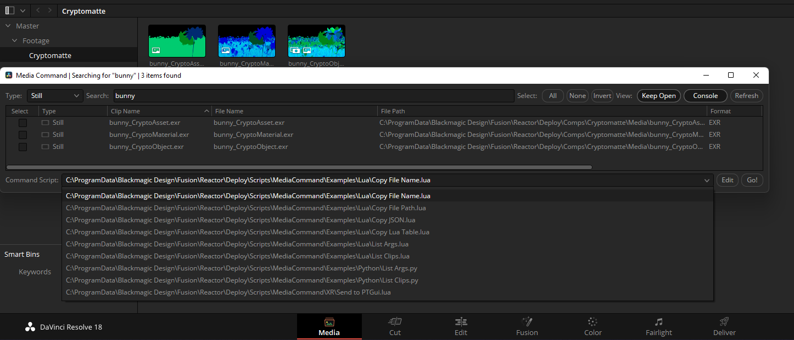
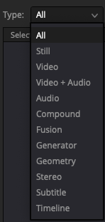
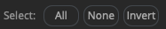
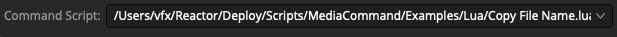
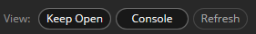
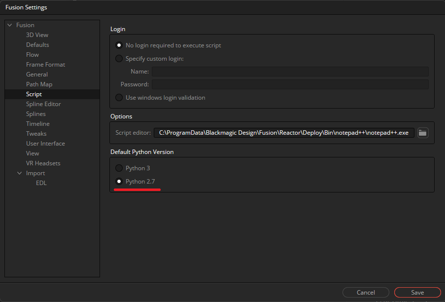
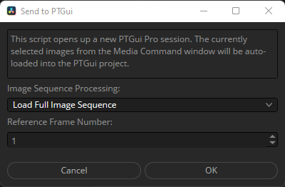
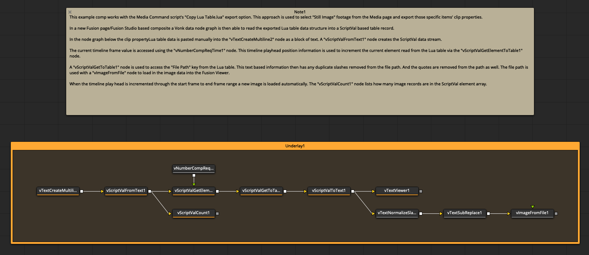

# KartaLink | Media Command

## Overview

Media Command is a scriptable interface for batch processing content that resides in your Resolve Media Pool. This streamlines the process of selecting footage, and running automation scripts on those specific items.

When Media Command is launched it automatically scans for Lua and Python scripts that are located on your hard disk inside the "Reactor:/Deploy/Scripts/MediaCommand/" folder. These items are added to the "Command Script" ComboMenu in the interface.

If you are a long time Fusion user, you will find the Media Command script was designed to give your Media page content management operations the same power and flexibility as you have with a Fusion page "tool" script in the Fusion nodes view context.

## Search Controls

The "Type:" ComboMenu allows you to limit the tree view to show only media of a certain format. The menu options are: "All", "Still", "Video", "Video + Audio", "Audio", "Compound", "Fusion", "Generator", "Geometry", "Stereo", "Subtitle", and "Timeline".

The "Search:" text field allows you to narrow down the results in the tree view with plain text search of the "Clip Name" and "File Name" records.

The "Select: (All) (None) (Invert)" buttons can be used to quickly modify the footage that is selected in the tree view. It is worth noting that the select buttons work on the content that is visible in the tree view at the current moment so you can apply the select buttons to the filtered search results, then flip back to the full unfiltered list of content in the tree view.

## Script Controls

The "Command Script:" ComboMenu allows you to select a Lua or Python script you would like to run.

The (Edit) button will open the active command script using the script editor defined in the Fusion preferences.

The (Go!) button will run the active command script and use it to process the media that is selected in the tree view.

## View Controls

The "Keep Open" button is active the Media Command window will remain open after a script is launched. This is handy if you need to batch process multiple clips in rapid succession. If this button is inactive the Media Command window will close each time a script is run.

The "Console" button toggles the visibility of the Console window. If you need to troubleshoot a script there is likely useful diagnostic information already visible in the Console.

The "Refresh" button allows you to reload the tree view listing. This is something you might want to do after modifying the content in the Media Pool/Media page, or if you have changed the currently active bin.

## Script Usage

Step 1. Place your custom .lua or .py scripts into the "Reactor:/Deploy/Scripts/MediaCommand/" folder.

Step 2. Launch the Media Command script from the Resolve "Workspaces > Scripts > Edit > Kartaverse > KartaLink > Media Command" menu entry.

Step 3. Select the footage you would like to batch process by clicking on the tree view row entries in the Media Command window. At the moment you need to click on the actual "text" words on the row to toggle the "selected" checkbox state.

Step 4. Choose a script you would like to run on the selected media using the "Command Script" ComboMenu, then press the "Go" button.

## Creating a Media Command Script

When a script is launched it has an "args" global variable that holds a plain text formatted Lua table structure.

Note: If you are using Python scripting in Resolve v18, you might have to set Resolve to use Python 2.7 if the built-in API command "bmd.readstring()" is unable to convert a plain text formatted table into a Python dict. This is done in the "Fusion > Fusion Settings..." menu item. Switch to the "Script" section on the left side of the view and then enable the "Default Python Version > Python 2.7" option in the window.

Edit 2022-11-11: The Resolve v18.1 release fixed a Python 3 scripting API issue so the above mentioned "bmd.readstring()" related bug is.. now resolved. :)

## Bundled Scripts

**Copy File Name.lua**  
Copies the file names from the selected footage into the clipboard buffer.

**Copy File Path.lua**  
Copies the absolute file path from the selected footage into the clipboard buffer.

**Copy JSON.lua**  
Copies the clip properties as JSON formatted data into the clipboard buffer.

**Copy Lua Table.lua**  
Copies the clip properties as Lua table formatted data into the clipboard buffer. This format of data can be reimported with the Fusion based Vonk data nodes directly into a ScriptVal.

**List Args**  
Outputs a Lua table/Python dict with the active clip properties to the Console window.

**List Clips**  
Outputs the clip name from the selected footage to the Console window.

**XR/Add MediaIn to Comp.lua**  
Adds the selected images to the currently open Fusion compositing session. The clip properties are automatically added to each of the MediaIn node "Comments" fields. This allows you to create Text+ node based burn-ins from any of the Clip properties with the help of a Text+ node StyledText field expression.

**XR/Send to DeoVR.lua**  
Opens a new DeoVR Player on Windows session where the currently selected images are auto-loaded into the media playback tool.

**XR/Send to PTGui.lua**  
Opens a new PTGui session where the currently selected images are auto-loaded into the project.

## Example Comps

**Clip Lua Table to ScriptVal.comp**  
This example shows how "Copy Lua Table" script exports can be used with the Vonk data nodes.

The file available on disk at the following PathMap location:

    Reactor:/Deploy/Comps/Kartaverse/KartaLink/Media Command/Clip Lua Table to ScriptVal.comp

* * *
