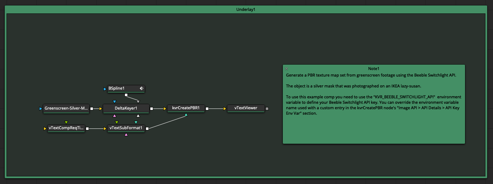
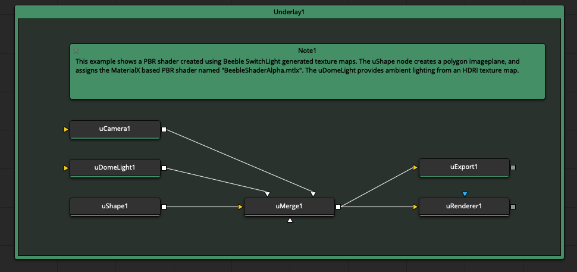
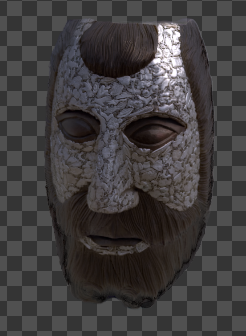
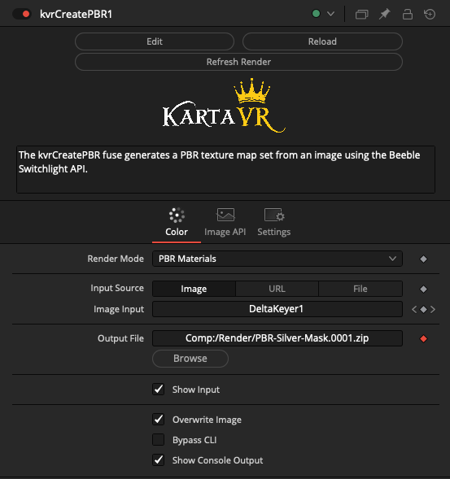
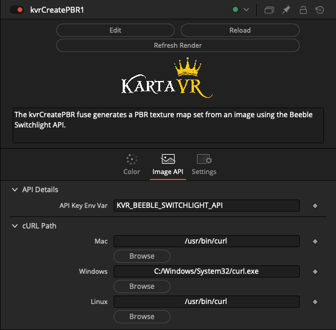

# Kartaverse MultiView Tools

Accelerate and automate your immersive workflows

## Overview

The MultiView nodes allow to you batch process volumetric camera array media inside of BMD Resolve/Fusion and SideFX Houdini TOPs. This unlocks the capacity to create PBR texture maps, and do more with your multi-view stereo content.

[Video](Videos/kvrCreatePBR-TurnTable.mp4 ':include :type=video controls width=75%')

## Software Requirements

To run Kartaverse MultiView based workflows on your Resolve/Fusion system you will need the following tools:

- [Beeble SwitchLight Account](https://www.switchlight.beeble.ai/) (With Active Credits)
- Resolve Studio / BMD Fusion Studio v18.5-20+
- [Reactor Package Manager](https://www.steakunderwater.com/wesuckless/viewtopic.php?f=32&t=3067) (Free)
- [Vonk Ultra Data Nodes](https://gitlab.com/AndrewHazelden/Vonk) (via Reactor)
- Kartaverse MultiView Nodes (via Reactor)

## Open Source Software License Term

- LGPL v3

## Example Comps

Several example Fusion comps are included to show the basic PBR texture creation process. This approach is driven using nodal workflow concepts that are powered by the Vonk Ultra data nodes.

### kvrCreatePBR.comp

Generate a PBR texture map set from greenscreen footage using the Beeble Switchlight API. The object is a silver mask that was photographed on an IKEA lazy-susan.

### MaterialX PBR v001.comp

This example shows a PBR shader created using Beeble SwitchLight generated texture maps. The uShape node creates a polygon imageplane, and assigns the MaterialX based PBR shader named "BeebleShaderAlpha.mtlx". The uDomeLight provides ambient lighting from an HDRI texture map.

This is the relighting result from the PBR maps:

## Fuse Reference Guide

For more information about the individual nodes check out the MultiView Fuse reference guide.

## Node Categories

The MultiView data nodes are separated into the following categories and sub-categories based on the function they perform:

PBR
- kvrCreatePBR

## Node Usage

### kvrCreatePBR

The "kvrCreatePBR" fuse generates a PBR texture map set from an image using the Beeble Switchlight API. This allows you to perform 2D and volumetric 3D interactive relighting on live-action captured media.

The Render Mode can be set to "PBR Materials", "Normal", "Albedo", "Relight Image", "Extract HDRI", or "Remove Background".

The Image Source can be set to "Image", "URL", or "File".

The Image Input control allows for the connection of image DataTypes to the node.

The Output File text field allows you to define the filename of the generated asset created by the SwitchLight API. The result is a zip file when the Render Mode is set to "PBR Materials", and an image file when any of the other render modes are used. You are able to connect a Vonk Ultra "Text" input datatype to this attribute to create dynamic filenames. The Output File text field suports the use of Fusion PathMaps like "Comp:/" or "Temp:/" which are expanded automatically into absolute filepaths that are passed to cURL.

The Overwrite checkbox allows you to choose if you want to allow the asset to be re-rendered if a file on disk exists with the name specified in the Output File control.

The Bypass CLI checkbox allows you to disable rendering if you need to debug a comp.

The Show Console Output checkbox allows you to see what the cURL based internet request is for a specific SwitchLight API request. The API token value is masked out when the "Show Console Output" checkbox control is used.

If you want to force the node to re-render once when you are on the same timeline frame you can press the "Refresh Render" button.

The Image API control page allows you to customize the environment variable token "API Key Env Var" value used to access the SwitchLight API key, along with the cURL executable filepath used on macOS/Windows/Linux systems.

## Known Issues

### Texture2D Node

If you want to connect the output from a "kvrCreatePBR" node to Fusion's 3D system, you have to pass the image data through a "Texture2D" node before connecting the image data to an image plane or mesh. If you don't use a Texture2D node as an intermediate step you will get an instant lockup in Fusion when you view the mesh with the texture map applied.

## Switchlight API Key Usage

The Beeble Switchlight API Key is used by the kvrCreatePBR node with the help of a custom environment variable:

	KVR_BEEBLE_SWITCHLIGHT_API

### Using MacOS Launch Agent PLIST Files

On a MacOS system the easiest and most reliable way to setup new environment variables is with the help of LaunchAgent .plist files. If you want to make it easy to visually edit a LaunchAgent plist document you can look at using a 3rd party utility like "LaunchControl" by Soma-Zone.
The atom package docs include a LaunchAgent example .plist files in the folder:

		Reactor:/Deploy/Docs/Kartaverse/MultiView/setenv.KVR_BEEBLE_SWITCHLIGHT_API.plist

You would need to edit these files in a programmer's text editor to customize them before you install them on your system.
These plist documents are designed to be installed on your MacOS system using root permissions to the folder:

	/Library/LaunchAgents/

When you go to install the plist files you will need to change the documents to be owned by "root", have the group name of "wheel", and have a Unix "octal" file permission setting of 644.

		sudo chown root /Library/LaunchAgents/setenv.KVR_BEEBLE_SWITCHLIGHT_API.plist
		sudo chgrp wheel /Library/LaunchAgents/setenv.KVR_BEEBLE_SWITCHLIGHT_API.plist
		sudo chmod 644 /Library/LaunchAgents/setenv.KVR_BEEBLE_SWITCHLIGHT_API.plist

You can take a look at the file permissions of the Launch Agent files on your system using the following terminal command:

		ls -la /Library/LaunchAgents/

You will then see a directory listing that looks something like this:

		drwxr-xr-x  24 root  wheel   816 Nov 17 12:28 .
		drwxr-xr-x+ 62 root  wheel  2108 Nov 17 11:59 ..
		-rw-r--r--@  1 root  wheel   499 Apr 21 20:34 setenv.KVR_BEEBLE_SWITCHLIGHT_API.plist
