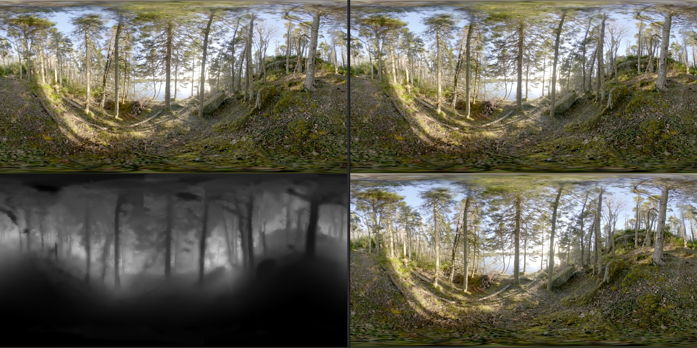
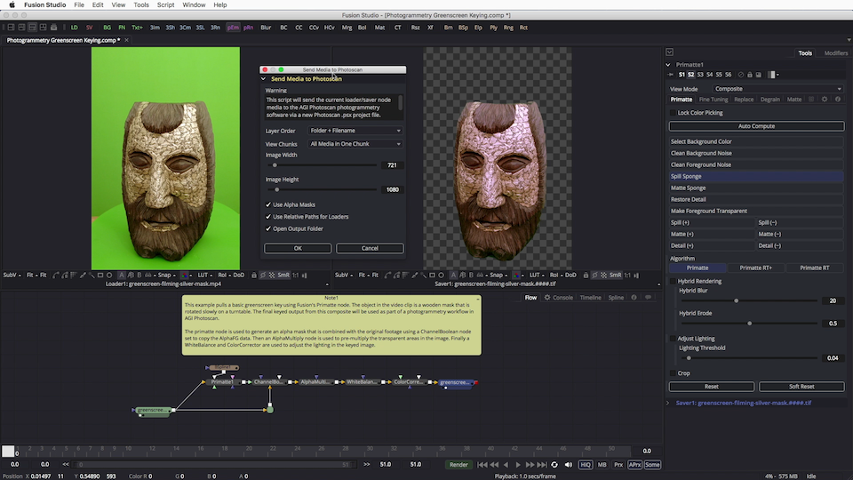
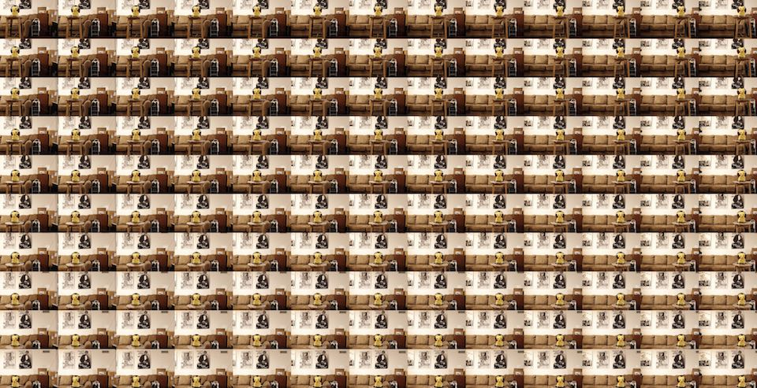

# What's new?

## New Features in KartaVR 5.1

- A pioSaver fuse was added. This node allows multi-channel EXR images to be saved to disk with greater control over the output formatting. Customizable EXR compression codec support was added.

- The LifeSaver fuse was updated to add customizable EXR compression codec support.

- The Light Editor script streamlines the process of editing light parameters in a Fusion 3D workspace based scene.

- Media Command is a scriptable interface for batch processing content that resides in your Resolve Media Pool. This streamlines the process of selecting footage, and running automation scripts on those specific items.

- The KartaLink Apple Script fuse allows you to run macOS based Apple Script code snippets from inside a Fusion Studio node-graph. This unlocks node-based automation techniques such as controlling external applications via Apple Events and OSAX (Open Scripting Architecture Extension) scripting.

- The KartaLink Keyboard Maestro fuse allows you to run macOS based Keyboard Maestro macros from inside Fusion's node graph. This unlocks node-based GUI automation techniques such as controlling external applications via simulating keyboard and mouse actions.

- The older Fusion "macros" in KartaVR were labelled "Legacy" to help separate them from the newer fuse based tools that work more efficiently in Resolve's Fusion page.

## New Features in KartaVR 5

- Kartaverse launched

- [Vonk Ultra](https://gitlab.com/AndrewHazelden/Vonk) is a collection of data nodes for Blackmagic Design Resolve/Fusion. Vonk can be thought of as node-based modifiers that live in the flow. These node-based operations provide a no-code alternative to using expressions or custom scripts. Data nodes are tools that allow you to interconnect nodes together by supporting more data types for the input and output connections such as numbers, text, spreadsheets, CSV, JSON, XML, YAML, metadata, arrays, matrices, and more.

	This effort is built on-top of the Spicy Acorn Vonk nodes by Kristof Indeherberge and Cédric Duriau.

- Added a new "Canon 180VR" example comp to Reactor.

## New Features in KartaVR 4.5

- The WarpStitchUltra fuse adds a hardware accelerated angular fisheye to equirectangular/VR180 warping node. It has parametric control over the view rotation, field of view, masking, and color correction. VR180 output can be enabled with a checkbox, along with ST Map warping template creation.

- The Reframe360Ultra fuse adds an equirectangular to "flat" rectilinear image projection conversion node.

## New Features in KartaVR 4

- Steak Underwater "Reactor" package manager suppport was added, along with new full-featured KartaVR freeware license that allows commercial use of the VR tools for $0.

- Added Looking Glass Display based [lightfield rendering](macros-guide-looking-glass) support, and [compositing examples](examples#looking-glass-renderer-3d).

- macOS based users of KartaVR can run the new "Video Snapshot" tool that allows Fusion to capture live action footage from HDMI/SDI/USB video sources to disk. This video I/O captured media is accessed inside of Fusion using a managed loader node that can be added to the foreground comp with a single click inside the "Video Snapshot" window.

  The video snapshot tool could be used for stop motion animation work. Or a VFX supervisor could use it to grab footage from a video camera to help with on-set production comp-viz work. Or an XR media producer could do a fast node based 360VR stitching test in Fusion to make sure the footage being captured on location is going to be able to be fine-stitched in post without any show-stopping issues.

- Added an [AcerWMRStereoRenderer3D](macros-guide-renderer3d#AcerWMRStereoRenderer3D) Renderer3D macro that creates stereoscopic 3D 2880x1440px output from the Fusion 3D system. That interactively rendered output can be displayed directly on an Acer Windows Mixed Reality HMD on macOS/Win/Linux via a floating image view.

- Added a [ViewerAcerWMR2StereoOU](macros-guide-viewer#ViewerAcerWMR2StereoOU) node for displaying panoramic images on an Acer Windows Mixed Reality HMD on macOS/Win/Linux via a floating image view.

- Added a DaVinci Resolve compatible set of example Fusion page compositing project files that can be accessed in the PathMap folder: `Reactor:/Deploy/Comps/KartaVR/KartaVR Example Comps.drp`

- Virtual Production tools with support for exporting of Fusion 3D workspace elements like Point Clouds, Cameras, and Meshes to XYZ ASCII (*.xyz*), PLY ASCII (*.ply*), Maya ASCII (*.ma*), and PIXAR OpenUSD ASCII (*.usda*) formats.

- The "KartaVR Drag Drop" tools add support for "Drag and Drop" file type handlers to Fusion/Resolve v16-18.5+.

	- The "KartaVR Comp DragDrop.fu" file allows you to import a Fusion .comp file by dragging it into the Nodes view from a desktop Explorer/Finder/Nautilus folder browsing window. This is a quick way to merge in external Fusion .comp documents into an existing open foreground composite and is very handy for Resolve users who work with Media Pool based Fusion comps, or Timeline based Fusion comps.

	- The "KartaVR PTGui DragDrop.fu" file allows the KartaVR "PTGui Project Importer" script to easily import PTGui Pro v10 .pts documents that are dragged into the Nodes view from a desktop Explorer/Finder/Nautilus folder browsing window.

	- The "KartaVR PointCloud DragDrop.fu" file allows .xyz point cloud documents to be imported as PointCloud3D nodes when the .xyz files are dragged into the Nodes view from a desktop Explorer/Finder/Nautilus folder browsing window.

## New Features in KartaVR 3.5

### Volumetric VR 6DOF VR Stereo Support

KartaVR now has a collection of panoramic 360&deg; depthmap data compatible "Z360" nodes that allow you to create 6DOF stereo VR output inside of Fusion. As part of this new 6DOF workflow, KartaVR also supports using Fusion Studio's "Disparity" node with the Z360 toolset to extract depth information from your live action camera rig footage.

- The [Z360VRDolly](macros-guide-z360#Z360VRDolly) node allows you to animate omni-directional stereo compatible XYZ rotation and translation effects inside of an equirectangular 360&deg;x180&deg; panoramic image projection. This means you can now create slider dolly like motions in post-production from your stereo imagery.

- The [Z360Stereo](macros-guide-z360#Z360Stereo) node makes it easy to convert over/under formatted color and depthmap data into a pair of new left and right stereo camera views.

- The [Z360Mesh3D](macros-guide-z360#Z360Mesh3D) node takes the color + depthmap image data and creates a new displaced environment sphere that allows you to explore a simulated real-time volumetric VR version of the scene in Fusion's 3D workspace. Since the Z360Mesh3D node creates real geometry in the scene that updates per frame you are able to easily move around with full XYZ rotation and translation controls. With this approach you can also place Fusion based Alembic/FBX/OBJ meshes inside the same 3D scene, or add photogrammetry generated elements, too.

- The [Z360DepthBlur](macros-guide-z360#Z360DepthBlur) node allows you to apply depth of field lens blurring effects to your panoramic imagery based upon the Z360 based depthmap data.

- You can now render omni-directional stereo output in KartaVR when the [Z360Renderer3D](macros-guide-z360#Z360Renderer3D) and [Z360Stereo](macros-guide-z360#Z360Stereo) nodes are used together.

### Tools for Photogrammetry Workflows

KartaVR has a new [Send Media to Photoscan](scripts#send-media-to-photoscan) script that helps people who are working with photogrammetry (image based modelling) workflows. This script instantly creates an AGI Photoscan project file out of your selected Fusion based loader/saver imagery. This makes for a really efficient pipeline that allows you to key your greenscreen shot photogrammetry footage using Primatte in Fusion and then process the footage in AGI Photoscan with geometry based alpha masking.

There is an accompanying [Send Media to Photoscan YouTube video tutorial](https://www.youtube.com/watch?v=7t0w1Y3tRb8) that shows the new toolset in action using studio shot footage.

A pair of nodes called [ImageGridCreator](macros-guide-photogrammetry#ImageGridCreator) and [ImageGridExtractor](macros-guide-photogrammetry#ImageGridExtractor) help create/extract image sequences from a tiled image grid layout. This is handy if you are working with photogrammetry or lightfield source imagery that might be coming from a combined "sprite atlas" style image grid layout.

**Dig into the Example Projects**
KartaVR now includes 72 Fusion example projects. Each one contains detailed descriptions of a panoramic compositing workflow. Explore the projects and learn new techniques that will take your VR project to the next level. There is also a fun roller coaster example that demonstrates how to render VR content directly in Fusion's 3D animation environment.

**Import PTGui Project Files**
You can now import a PTGui stitching project file into Fusion. This will make a new composite with all of the nodes required to stitch your footage in seconds.

**UV Pass Based High Speed Panoramic Conversions**
KartaVR is able to dramatically simplify the process of building a fast and high quality UV pass based panoramic 360&deg; video stitch. This UV Pass technique allows you to stitch and remap imagery between any image projection imaginable.
