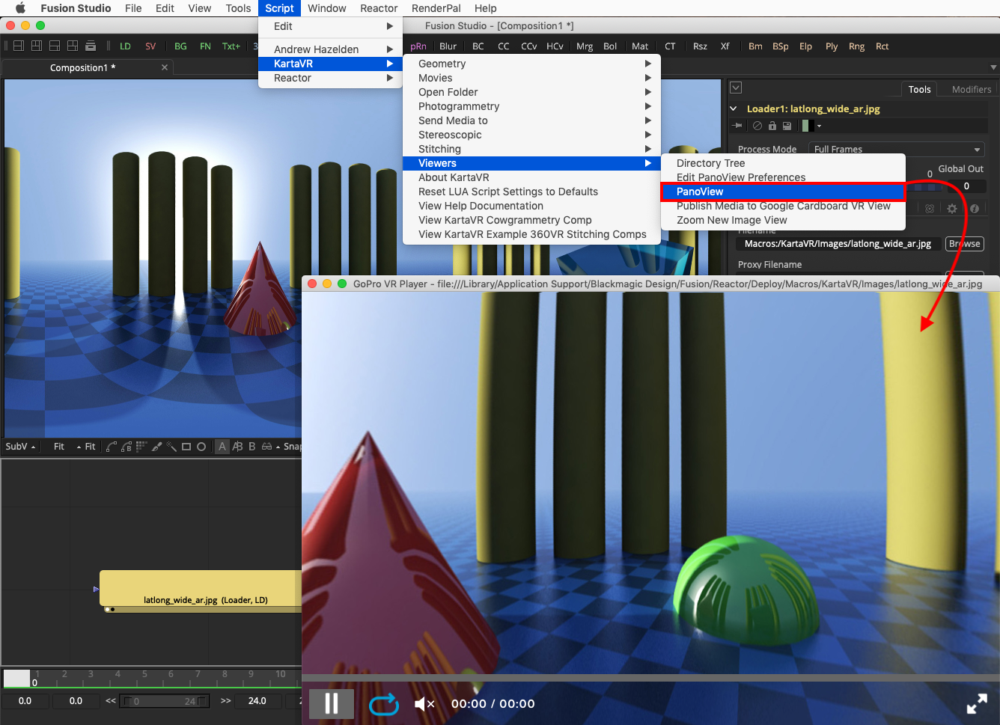
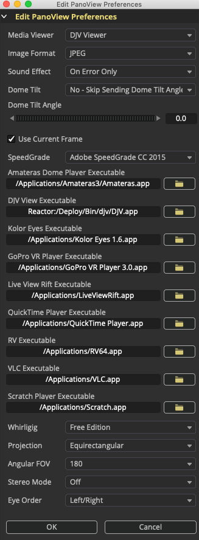

# PanoView for Fusion #

## Overview ##

The PanoView script is a module from the [KartaVR](http://www.andrewhazelden.com/blog/downloads/kartavr/) that will send the imagery from the currently selected Fusion node to an Oculus Rift HMD or an HTC VIVE/OSVR HMD using an external media viewer / playback tool.

This script can be used with Windows, Mac, or Linux versions of Blackmagic Design's Fusion compositing system.

Supported media viewing tools include:

- [Kolor Eyes](http://www.kolor.com/360-video/kolor-eyes-desktop-free-360-video-player) 
- [GoPro VR Player](http://www.kolor.com/gopro-vr-player/download/)
- [Whirligig](http://whirligig.xyz/)  
- [Amateras Dome Player](http://www.orihalcon.co.jp/amateras/domeplayer/en/)  
- [Adobe SpeedGrade](https://creative.adobe.com/products/speedgrade)  
- [DJV Viewer](http://djv.sourceforge.net/)  
- [Live View Rift](http://soft.viarum.com/liveviewrift/)  
- [QuickTime Player](https://support.apple.com/quicktime)  
- [RV Player](http://www.tweaksoftware.com/products/rv)  
- [Assimilate Scratch Player](http://www.assimilateinc.com/products/scratch-play)  
- [VLC](http://www.videolan.org/)  

## How to use the Script: ##

The PanoView script for Fusion supports sending any kind of node from the flow view to an external media view tool and the Oculus Rift & HTC VIVE HMD.

**Step 1.** Start Fusion and open a new comp.

**Step 2.** Select and activate a file saver or loader node in the flow view. Then run the **Script > KartaVR > Viewers > PanoView** menu item to view the media in Kolor Eyes.

There is a hotkey shortcut of pressing the TAB key on your keyboard for launching the PanoView script.

## Edit PanoView Preferences ##

The Edit PanoView Preferences script lets you customize the default settings for the PanoView image viewing script.

### How to use the Script ###

**Step 1.** Start Fusion and open a new comp.

**Step 2.** Then run the Script > KartaVR > Viewers > Edit PanoView Preferences menu item.

**Step 3.** In the Edit PanoView Preferences dialog window you need to select the viewing tool you want to use. You also have access to control the specific version of each viewer program, and can change other viewing parameters, too.

### Script GUI Controls ###

The "Media Viewer" control lets you choose which of the external media viewing programs will be launched by the PanoView script. You can choose one of the following options: "None", "Adobe SpeedGrade", "Amateras Dome Player", "DJV Viewer", "Kolor Eyes", "Live View Rift", "RV", "Scratch Player", "VLC", "Whirligig", "GoPro VR Player", or "Quicktime Player".

The "Image Format" control allows you to customize the snapshot image format used when a node other than a loader or saver is selected and a temporary image is saved to disk. This temporary image is saved using the left viewer window and then passed onto the specified media viewer tool. You can choose one of the following options: "JPEG", "TIFF", "TGA", "PNG", "BMP", or "EXR".

The "Sound Effect" control allows you to choose if you want to have an audio alert played when an error occurs or when the script task completes. You can choose one of the following audio playback options: "None", "On Error Only", "Steam Train Whistle Sound", "Trumpet Sound", or "Braam Sound".

The "Dome Tilt" control allows you to choose if you want to tip the forward tilting angle of a dome to simulate an immersive fulldome theater environment with sloped seating. The "Send Inverted Dome Tilt Angle" option allows you to mirror/flip the dome tilt angle by multiplying the current dome tilt angle value by -1 to counteract the dome tilt that is already present in the rendered images. You can choose one of the following options: "Yes - Send Dome Tilt Angle", "No - Skip Sending Dome Tilt Angle", or "Send Inverted Dome Tilt Angle".

The "Dome Tilt Angle" control is a numeric input field that lets you specify the exact forward tilting angle of a dome to simulate an immersive fulldome theater environment with sloped seating. The control range goes from -90 degrees to 90 degrees.

The "Use Current Frame" control allows you to choose how image sequences are loaded. If the checkbox is enabled then PanoView will load the image sequence frame from the current timeline playhead position. If the checkbox is disable the first frame from the image sequence will be loaded in PanoView instead.

The "SpeedGrade" control allows you to choose the specific version of Adobe SpeedGrade you want to use when the PanoView script is run. You can choose one of the following options:  "Adobe SpeedGrade CC 2015", "Adobe SpeedGrade CC 2014", "Adobe SpeedGrade CC", "Adobe SpeedGrade CS6", "Adobe SpeedGrade CS5", or "Adobe SpeedGrade CS4".

The "Amateras Player Executable" text field and file dialog button allow you to specify the location of the Amateras Player program on your hard disk. Note: On macOS you will have to paste the file path in manually as the Fusion file browser dialog won't let you select .app files.

The "DJV View Executable" text field and file dialog button allow you to specify the location of the DJV View program on your hard disk. Note: On macOS you will have to paste the file path in manually as the Fusion file browser dialog won't let you select .app files.

The "Kolor Eyes Executable" text field and file dialog button allow you to specify the location of the Kolor Eyes program on your hard disk. Note: On macOS you will have to paste the file path in manually as the Fusion file browser dialog won't let you select .app files.

The "GoPro VR Player Executable" text field and file dialog button allow you to specify the location of the GoPro VR Player program on your hard disk. Note: On macOS you will have to paste the file path in manually as the Fusion file browser dialog won't let you select .app files.

The "Live View Rift Executable" text field and file dialog button allow you to specify the location of the Live View Rift program on your hard disk. Note: On macOS you will have to paste the file path in manually as the Fusion file browser dialog won't let you select .app files.

The "RV Executable" text field and file dialog button allow you to specify the location of the RV program on your hard disk. Note: On macOS you will have to paste the file path in manually as the Fusion file browser dialog won't let you select .app files.

The "VLC Executable" text field and file dialog button allow you to specify the location of the VLC program on your hard disk. Note: On macOS you will have to paste the file path in manually as the Fusion file browser dialog won't let you select .app files.

The "Scratch Player Executable" text field and file dialog button allow you to specify the location of the Scratch Player program on your hard disk. Note: On macOS you will have to paste the file path in manually as the Fusion file browser dialog won't let you select .app files.

The "Whirligig" control allows you to choose if you are running the free version or the paid Steam Edition of Whirligig.

The "Projection" control allows you to specify the Whirligig image projection that is used with PanoView. You can choose one of the following options: "Equirectangular", "Angular Fisheye", "Cubic Horizontal Cross", "Cubic Vertical Cross", "Cubic Horizontal Tee", "Cubic Vertical Tee", "Facebook Cube Map 3x2", "Facebook Pyramid", "GardenGnome Cube Map 3x2", "Gear VR", "LatLong 360x90 degree", "Rectangular", "Ricoh Theta S", "LG360 Camera", or "Samsung Gear 360 Camera".

The "Angular FOV" control allows you to specify the angular fisheye based diagonal field of view value used with Whirligig. You can choose one of the following options: "140", "160", "180", "240", or "360".

The "Stereo Mode" control allows you to specify the format of stereo imagery that will be sent to Whirligig.  You can choose one of the following options: "Off", "Side by Side", or "Over Under".

The "Eye Order" control allows you to specify the arrangement of the left and right stereoscopic views in the media that will be sent to Whirligig. Most stereoscopic image projections have the left view on the left side of the frame and the right view on the right side of the frame. The most common exception to this rule is the Gear VR/Octane Render ORBX/Vray style of horizontal strip cubemap. You can choose one of the following options: "Left/Right", or "Right/Left".

The "OK" button will save the revised preferences.

The "Cancel" button will close the script GUI and stop the script.

### Panoview is Context Aware ###

The Panoview script is context aware and will run in a slightly different state based upon the type of node that is selected in the Fusion flow/nodes area.

If you have a 2D image processing node selected, a live "left" viewer window snapshot will be taken and passed by Panoview to the external media viewer tool. The snapshot image format is defined by the `Image Format` control in the Edit PanoView Preferences script dialogue.

If a Saver or LifeSaver node is selected, then a pre-existing (and pre-rendered) movie or image sequence clip on disk will be passed as a file reference by Panoview to the external media viewer tool. This allows you to playback long clips without needing to render the existing media.

If a Loader/MediaIn node is selected then the the source footage will be passed by Panoview to the external media viewer tool. This allows you to playback long clips without needing to render the existing media.

### Whirligig Notes ###

The `PanoView.lua` script has options for enabling different panoramic projections in Whirligig. The default projection type is LatLong, but you can enable rectangular, angular fisheye, GearVR Horizontal Strip Cube Map, Ricoh Theta, Facebook Cube Map 3x2, Vertical Cross Cube Map and Horizontal Cross Cube Map panoramic display modes in both mono 2D and stereo 3D.

If you are using Whirligig and nothing shows up in the viewer window on your monitor you can tap the F10 hotkey to toggle the display settings. This is useful if you are using the SteamVR version of Whirligig and don't have an HMD attached at the moment but still want to be able to view panoramic imagery on your monitor.

You can toggle the Whirligig anaglyph red/cyan stereo mode on/off and between different color formats using the F7 hotkey.

#### LAV Video Configuration ####

If you have issues viewing imagery in the Whirligig viewer and only see a black background in the Whirligig window, it it likely due to a video codec or hardware decoding setting.

One solution to this problem is to open up the "LAV Video Configuration" program that is accessible using your Windows start menu.

The LAV Video Configuration Properties window will appear. In this properties window you should change the Hardware Decoder to use the "DXVA2 (native)" option. Click "OK" to save the settings.

