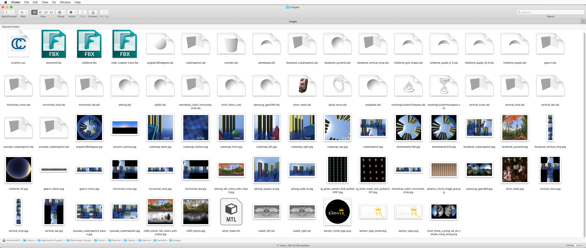
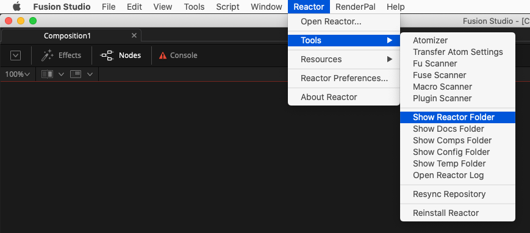

## Sample Imagery ##

Included with the KartaVR is a set of sample panoramic images, and polygon meshes that can be used to explore the panoramic conversion features.

The sample images are stored in the Reactor PathMap folder location of:

`Reactor:/Deploy/Macros/KartaVR/Images/`

Another Fusion "Bin" window centric copy of the sample fusion projects is stored in the Fusion PathMap folder:

`Reactor:/Deploy/Macros/KartaVR/Source Compositions/Demos/`

## Browsing the Reactor PathMap ##

If you want to access the KartaVR sample imagery quickly and easily, use the `Reactor > Tools > Show Reactor Folder` menu item. Then browse into the "Deploy" folder, and finally into the "Macros", and "KartaVR" sub-folders.

