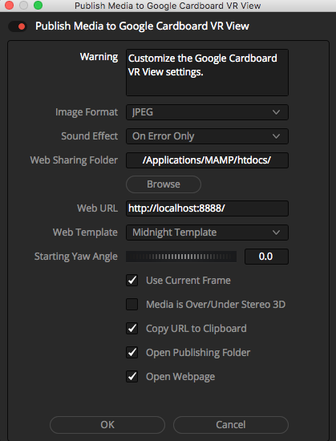
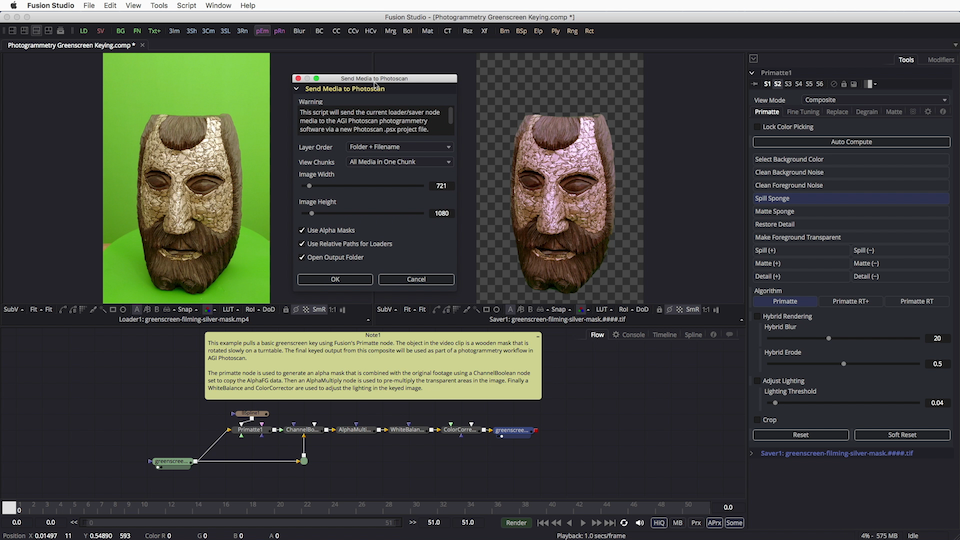

# KartaVR Scripts #

----

This document is a summary of the scripts included with the KartaVR toolset. Once the scripts have been installed on your system as part of the regular KartaVR installation process you can access them using Blackmagic Design Fusion's **Script** menu.

## PanoView ##

The PanoView script will send the imagery from the currently selected Fusion node to an Oculus Rift HMD using an external media viewer / playback tool.

The [Panoview script is described on its own separate documentation page here](pano-view).

## Edit PanoView Preferences ##

The Edit PanoView Preferences script lets you customize the default settings for the PanoView image viewing script.

The [Edit PanoView Preferences script is described on its own separate documentation page here](pano-view#edit-panoview-preferences).

## Edit Send Media to Preferences ##

The Edit Send Media to Preferences script lets you customize the settings for the "Send Frame to" and "Send Media to" collection of scripts.

### How to use the Script ###

**Step 1.** Start Fusion and open a new comp.

**Step 2.** Then run the **Script > KartaVR > Send Media to > Edit Send Media to Preferences** menu item.

**Step 3.** In the Edit Send Media to Preferences dialog window you need to define the executable file path location for each of the "Send Frame to" and "Send Media to" tools you want to use.

### Script GUI Controls ###

The "Image Format" control allows you to customize the viewer window's saved image format that is used when the "Send Frame to" scripts are run and a node other than a loader or saver is selected and a temporary image is saved to disk. This temporary image is saved using the left viewer window and then passed onto the specified media viewer tool. You can choose one of the following options: "JPEG", "TIFF", "TGA", "PNG", "BMP", or "EXR".

The "Sound Effect" control allows you to choose if you want to have an audio alert played when an error happens or when the script task completes. You can choose one of the following audio playback options: "None", "On Error Only", "Steam Train Whistle Sound", "Trumpet Sound", or "Braam Sound".

The "After Effects" control allows you to choose the specific version of Adobe After Effects you want to use when the "Send Frame to After Effects" or "Send Media to After Effects" scripts are run. You can choose one of the following options: "Adobe After Effects CC 2015.3", "Adobe After Effects CC 2015", "Adobe After Effects CC 2014", "Adobe After Effects CC", "Adobe After Effects CS6", "Adobe After Effects CS5", "Adobe After Effects CS4", "Adobe After Effects CS3"

The "Illustrator" control allows you to choose the specific version of Adobe Illustrator you want to use when the "Send Frame to Illustrator" or "Send Media to Illustrator" scripts are run. You can choose one of the following options: "Adobe Illustrator CC 2015.3", "Adobe Illustrator CC 2015", "Adobe Illustrator CC 2014", "Adobe Illustrator CC", "Adobe Illustrator CS6", "Adobe Illustrator CS5", "Adobe Illustrator CS4", "Adobe Illustrator CS3"

The "Photoshop" control allows you to choose the specific version of Adobe Photoshop you want to use when the "Send Frame to Photoshop" or "Send Media to Photoshop" scripts are run. You can choose one of the following options: "Adobe Photoshop CC 2015.5", "Adobe Photoshop CC 2015", "Adobe Photoshop CC 2014", "Adobe Photoshop CC", "Adobe Photoshop CS6", "Adobe Photoshop CS5", "Adobe Photoshop CS4", or "Adobe Photoshop CS3".

The "Mettle SkyBox" control allows you to apply a Mettle SkyBox Studio effect to your footage automatically when the media is sent to After Effects using the "Send Media to After Effects" script. You can choose one of the following options: "None", "Mettle SkyBox Converter", "Mettle SkyBox Project 2D", "Mettle SkyBox Rotate Sphere", "Mettle SkyBox Viewer".

The "Mettle Input" control allows you to choose a Mettle SkyBox Converter input image projection for your footage when the media is sent to After Effects using the "Send Media to After Effects" script. You can choose one of the following options: "2D Source", "Horizontal Cross Cube-map 4:3", "Sphere-map", "Equirectangular", "Angular Fisheye (Fulldome)", "Cube-map Facebook 3:2", "Cube-map Pano2VR 3:2", "Cube-map GearVR 6:1", "Equirectangular 16:9".

The "Mettle Output" control allows you to choose a Mettle SkyBox Converter output image projection for your footage when the media is sent to After Effects using the "Send Media to After Effects" script. You can choose one of the following options: "Horizontal Cross Cube-map 4:3", "Sphere-map", "Equirectangular", "Angular Fisheye (Fulldome)", "Cube-map Facebook 3:2", "Cube-map Pano2VR 3:2", "Cube-map GearVR 6:1", "Equirectangular 16:9".

The "Affinity Designer Executable" text field and file dialog button allow you to specify the location of the Affinity Designer program on your hard disk. Note: On macOS you will have to paste the file path in manually as the Fusion file browser dialog won't let you select .app files.

The "Affinity Photo Executable" text field and file dialog button allow you to specify the location of the Affinity Photo program on your hard disk. Note: On macOS you will have to paste the file path in manually as the Fusion file browser dialog won't let you select .app files.

The "Autopano Pro Executable" text field and file dialog button allow you to specify the location of the Autopano Pro or Autopano Giga programs on your hard disk. Note: On macOS you will have to paste the file path in manually as the Fusion file browser dialog won't let you select .app files.

The "Corel Photo Paint Executable" text field and file dialog button allow you to specify the location of the Corel Photo Paint program on your hard disk.

The "Hugin Executable" text field and file dialog button allow you to specify the location of the Hugin program on your hard disk. Note: On macOS you will have to paste the file path in manually as the Fusion file browser dialog won't let you select .app files.

The "Photomatix Pro Executable" text field and file dialog button allow you to specify the location of the Photomatix Pro program on your hard disk. Note: On macOS you will have to paste the file path in manually as the Fusion file browser dialog won't let you select .app files.

The "PTGui Pro Executable" text field and file dialog button allow you to specify the location of the PTGui or PTGui Pro programs on your hard disk. Note: On macOS you will have to paste the file path in manually as the Fusion file browser dialog won't let you select .app files.

The "TouchDesigner Executable" text field and file dialog button allow you to specify the location of the TouchDesigner program on your hard disk.

The "Layer Order" control allows you to choose the layer stacking order used when sending imagery to another program. The Layer Order menu options are "No Sorting", "Node X Position", "Node Y Position", "Node Name", "Filename", "Folder + Filename".

The "Use Current Frame" checkbox lets you decide if you want to use the automatically calculated frame number and filename from an image sequence. If you disable the "Use Current Frame" checkbox the first image filename referenced in the loader node's filename text field will be used.

The "OK" button will save the revised preferences.

The "Cancel" button will close the script GUI and stop the script.

## PTGui BatchBuilder Creator ##

The `PTGui BatchBuilder Creator` script converts your currently selected loader and saver node based image sequences into a format that works easily with PTGui's BatchBuilder mode that is used for panoramic sequence stitching. 

As an example an image sequence named in the format of: `name.####.ext` will be renamed and placed in a PTGui BatchBuilder sequence numbered folder with a hierarchy of: `####/name.ext`

### How to use the Script ###

**Step 1.** Start Fusion and open a new comp. Select loader or saver nodes in the flow view.

**Step 2.** Run the **Script > KartaVR > Stitching > PTGui BatchBuilder Creator** menu item.

**Step 3.** Select the output folder where you would like to output your PTGui BatchBuilder named imagery. You can also customize the amount of frame padding applied to the numbered folder names.

**Note:** The close X box on the dialog window does not work. You have to hit the "Cancel" button to close the window.

### Script GUI Controls ###

The "Sound Effect" control allows you to choose if you want to have an audio alert played when an error happens or when the script task completes. You can choose one of the following audio playback options: "None", "On Error Only", "Steam Train Whistle Sound", "Trumpet Sound", or "Braam Sound".

The "BatchBuilder Output Folder" text field and folder browser button allow you to select a folder from your hard disk. This is the folder that will the output location for the copied and renamed image sequences.

The "Frame Range" control allows you to specify how many frames from each image sequence will be processed into the BatchBuilder naming format. The menu options are "Clip Time Range", "Render Time Range", and "Global Time Range".

The "Output Name" control allows you to choose the naming style that is used for the BatchBuilder renamed files. The menu options are "`####/<image>.ext`", "`####/<image>.0000.ext`", and "`####/<image>.0001.ext`".

The "Frame Padding" control allows you to specify the number of leading zeros on the image sequence frame numbering.

The "Open Output Folder" checkbox will display the containing folder where the BatchBuilder files were saved in an Explorer/Finder/Nautilus folder browser view.

## PTGui BatchBuilder Extractor ##

The `PTGui BatchBuilder Extractor` script will convert your currently selected loader and saver node based media from inside numbered PTGui BatchBuilder folders into flat image sequences.

As an example a PTGui BatchBuilder "folderized" image sequence named in the format of: `####/name.ext` will be copied and placed into a standard image sequence:  `name.####.ext`

### How to use the Script ###

**Step 1.** Start Fusion and open a new comp. Select loader or saver nodes in the flow view.

**Step 2.** Run the **Script > KartaVR > Stitching > PTGui BatchBuilder Extractor** menu item.

**Step 3.** Select the output folder where you would like to save your renamed imagery. You can also customize the filename prefix and the amount of frame padding applied to the numbered folder names.

**Note:** The close X box on the dialog window does not work. You have to hit the "Cancel" button to close the window.

### Script GUI Controls ###

The "Sound Effect" control allows you to choose if you want to have an audio alert played when an error happens or when the script task completes. You can choose one of the following audio playback options: "None", "On Error Only", "Steam Train Whistle Sound", "Trumpet Sound", or "Braam Sound".

The "Image Sequence Output Folder" text field and folder browser button allow you to select a folder from your hard disk. This is the folder that will the output location for the copied and renamed image sequences.

The "Output Name" control allows you to choose the naming style that is used for the BatchBuilder renamed files. The menu options are "`<name>.#.ext`", "`<name>_#.ext`", "`<name> #.ext`", "`#.ext`", "`<name>/<name>.#.ext (In a Subfolder)`", "`<name>/<name>_#.ext (In a Subfolder)`", "`<name>/<name> #.ext (In a Subfolder)`", "`<name>/#.ext (In a Subfolder)`".

The "File Mode" control allows you to choose how the media is extracted from the BatchBuilder folders. If you choose the "Copy Images" option the original images will still be left in the BatchBuilder folders. If you choose the "Move Images" option then the original images will be removed from the BatchBuilder folder and placed in the "Image Sequence Output Folder". The "Move Images" option is useful if you want to clean out several PTGui BatchBuilder renderings to try the stitch over again.

The "Frame Range" control allows you to specify how many frames from each image sequence will be processed into the BatchBuilder naming format. The menu options are "Custom Frame Range", "Render Time Range", and "Global Time Range".

The "Frame Padding" control allows you to specify the number of leading zeros on the image sequence frame numbering.

The "Open Output Folder" checkbox will display the containing folder where the BatchBuilder files were saved in an Explorer/Finder/Nautilus folder browser view.

## PTGui Mask Importer ##

The PTGui Mask Importer script will read in a PTGui .pts file and save out a copy of the custom painted mask images that are found. This masking information is saved in the PTGui file naively using a "base64" textually encoded PNG image format. The PTGui mask image uses a green color for to represent the "include" region for a panoramic stitching workflow, and a red color for the "exclude" regions that are left out when footage is stitched.

Once the PTGui Mask Importer script is run on the PTGui project file you will have a series of new PNG images created that are named automatically with a filename template like `<prefix>_mask_#.0000.ext` and saved to the same folder as the original PTGui project file.

There is a KartaVR provided MatteControl node named [PTGuiMatteControl](macros-guide-mask#PTGuiMatteControl) that is used to process mask imagery that was generated by the "PTGui Mask Importer" script. The mask imagery is connected to the "image" input. This node will then isolate the exact green/red color include and exclude masking information and split it into two separate alpha mask outputs appropriately named "Exclude" and "Include". The PTGuiMatteControl macro node has an integrated MatteControl UI for refining the mask edge and applying a garbage mask.

### How to use the Script ###

**Step 1.** Start Fusion and open a new comp. Then run the **Script > KartaVR > Stitching > PTGui Mask Importer** menu item.

**Step 2.** In the PTGui Mask Importer dialog window you need to select a PTGui .pts file using the **PTGui Project File** text field. 

**Step 3.** After customizing the settings in the this dialog you can click the "OK" button to process the PTGui document. The resulting node based composite that is created is placed into your copy/paste clipboard buffer. 

**Step 4.** Select the **Edit > Paste** menu item, or use the Command + P (macOS) or Ctrl + P (Windows/Linux) hotkey to instantly add the masking image loader nodes to your active Fusion composite. 

**Note:** The close X box on the dialog window does not work. You have to hit the "Cancel" button to close the window.

### Windows Installation Requirements ###

The PTGui Mask Importer script uses the **base64** decoder library  to read the image masking data that is stored in a PTGui project file. On Windows there is no built-in base64 decoder library available so the open source **Cygwin** library is used by KartaVR to provide this feature. 

There is a note in the KartaVR [Windows Manual Install guide on Step 4.](install#win-env-variables) that explains how to add the KartaVR bundled Cygwin "bin" folder to your systems `%PATH%` environment variable.

MacOS and Linux systems come with a built-in version of the **base64** decoder library so no additional steps are required to use the tool.

### Script GUI Controls ###

The "PTGui Project File" text field and file browser button allow you to select a PTGui .pts file from your hard disk.

The "Node Layout" control allows you to choose how the flow is built and the way the node connections are constructed after this script is run. The nodes are copied automatically in your system's clipboard buffer where they can be pasted into a composite. The Node Layout menu options are "Skip Adding Nodes", "Build Nodes Left", "Build Nodes Right", "Build Nodes Upwards", and "Build Nodes Downwards".

The "Frame Ext." control allows you to choose the naming style of the saved mask images. You have the choice of "<prefix>_mask_#.ext", "<prefix>_mask_#.0000.ext", "<prefix>_mask_#.0001.ext". The final 0000 and 0001 frame number options are useful in programs like Fusion or TouchDesigner where you don't want the initial frame numbering of each camera view's mask images to be confused as a single image sequence that would be played back like a movie.

The "Frame Padding" control allows you to specify the number of leading zeros on the mask frame numbering.

The "Mask Numbering Starts on 1" checkbox allows you to choose if you want each mask image name to start counting from 0 or 1. This control will have more use in the future but can be ignored at the moment.

The "Open Output Folder" checkbox will display the containing folder where the PTgui mask images files were saved in an Explorer/Finder/Nautilus folder browser view.

## PTGui Project Importer ##

With the PTGui Project Importer script you can stitch 360° panoramic video and photos directly in Fusion based upon loading in an existing PTGui file. The script then translates the PTGui data into a node based panoramic stitching composite that is ready to use. This approach makes the process of building a new 360° VR composite easy and fast.

The PTGui Project Importer script is self standing and does not need PTGui to be installed on the computer in order to run. This is useful if you are on Linux and can't natively run PTGui on the Fusion workstation, or if you only have one copy of PTGui that was used to create the initial camera rig template .pts file but want to have multiple video stitching artists use Fusion to process the footage and build 360&deg; composites.

You can watch a YouTube preview video that shows how the PTGui Project Importer script works here:  
[https://www.youtube.com/watch?v=-hu1-M3yq74](https://www.youtube.com/watch?v=-hu1-M3yq74)

**Note:** Fusion does not read in or interpret EXIF image rotation metadata. You need to bake in and flatten the EXIF image rotation value into the image and remove that metadata setting in advance if you want PTGui and Fusion to use the exact same portrait/landscape style rotation setting when importing the imagery into a composite.

When you create the original PTGui .pts project file in PTGui, it is a good idea to enable the PTGui **Advanced** tab and then use the "Crop" tab to define custom cropping for the camera lens you are using. This will save you a lot of time and effort in Fusion helps to create a nice looking stitch with less manual interventions.

Right now the PTGui Project Importer script is designed primarily for use with importing PTGui projects that use panoramic camera rigs that have Circular Fisheye lenses. If you want to import a PTGui project file that uses perspective "rectilinear" lens style imagery you will likely want to uncheck the "Add Cropping Nodes" checkbox in the PTGui Project Importer dialog window.

### How to use the Script ###

**Step 1.** Start Fusion and open a new comp. Then run the **Script > KartaVR > Stitching > PTGui Project Importer** menu item.

**Step 2.** In the PTGui Project Importer dialog window you need to select a PTGui .pts file using the **PTGui Project File** text field. 

**Step 3.** The only other control you need to adjust is the "Edge Blending" control which is used to define the blending radius used with the vector masks during a panoramic stitch.

**Step 4.** After customizing the settings in the this dialog you can click the "OK" button to process the PTGui document. The resulting node based composite that is created is placed into your copy/paste clipboard buffer. 

**Step 5.** Select the **Edit > Paste** menu item, or use the Command + P (macOS) or Ctrl + P (Windows/Linux) hotkey to instantly add the panoramic stitching nodes to your active Fusion composite. 

**Step 6.** You may have to select the new Loader nodes and relink the footage to switch from working with the PTGui imported still frame camera view images, over to using image sequences or movie files.

**Note:** The close X box on the dialog window does not work. You have to hit the "Cancel" button to close the window.

### Script GUI Controls ###

The "PTGui Project File" text field and file browser button allow you to select a PTGui .pts file from your hard disk.

The "Yaw (Y Rotation)" control can be used to automatically apply a horizontal camera panning effect to each of the PTGui project imported camera views when the warping operation operation is performed by the "Fisheye2Equirectangular" or "Rectilinear2Equirectangular" nodes.

The "Pitch (Z Rotation)" and "Roll (X Rotation)" controls should be used sparingly as they can result in gimbal lock during the video stitching phase if you have a complex 360&deg; camera rig with views that are rotated spherically at random angles around a common origin point.

The "Edge Blending" control is used to configure the edge feathering applied when the "Add Vector Masks" option is enabled and circular fisheye or rectilinear image masks are created. The "Edge Blending" menu options are "No Blending", "Hard Blending", "Normal Blending", "Soft Blending". If you have seaming artifacts when stitching footage with the PTGui Project Importer, tool it is handy to re-run this script a few times and compare the results with the different Edge Blending modes enabled as this can be faster than manually adjusting the masking nodes by hand if you have a large number of cameras in your rig.

The "Split View" control is used to mask the left/right or top/bottom view layouts when stitching circular "ring" shaped multi-camera stereo 360&deg; camera rigs. The **Split View** options menu has entries for "Left", "Right", "Top", "Bottom", and "Full Frame" masking, or the "Skip Adding Split View Masking" option can be used to disable this control:

The "Node Layout" control allows you to choose how the flow is built and the way the node connections are constructed after this script is run. The nodes are copied automatically in your system's clipboard buffer where they can be pasted into a composite. The Node Layout menu options are "Skip Adding Nodes", "Build Nodes Left", "Build Nodes Right", "Build Nodes Upwards", and "Build Nodes Downwards".

The "Frame Padding" control allows you to specify the number of leading zeros on the image sequence frame numbering.

The "Add Saver Node" checkbox will read the PTGui Project's "Output File" setting (that is visible in PTGui's Create Panorama tab) and creates a new saver node in the Fusion composite with the same filename. This makes it easy to have a ready to render stitching composite.

The "Add Intermediate Saver Nodes" checkbox will add inline saver nodes to the composite that allow you to save a snapshot of the warping process from that point in the node flow. This saver node option is useful if you want to be able to do a single frame render and then load those images into the KartaVR "Generate Panoramic Blending Masks" script. The Generate Panoramic Blending Masks tool is handy as it is able to create a seamless blending mask that provides a sharp and crisp border edge. Using a crisp seaming edge (instead of a typical smooth blending method) can be useful in stereo stitching and disparity map / depthmap generation workflows.

The "Add Image Loader Nodes" checkbox will create new Fusion Loader nodes for each of the camera views in the PTGui project file. This control makes it easy to import the original imagery that was present in your PTGui .pts file and dramatically cuts down on the effort needed to link up the camera views with the rest of the nodes in a comp. After the PTGui Project Importer tool has been used to build the panoramic stitching composite, you can easily select the new loader nodes in your composite and manually relink the footage to use your original movie files or image sequences.

The "Add Cropping Nodes" checkbox will load in the PTGui view cropping settings and create a Fusion crop node that is connected to each of the loaded camera view images. The output from the crop node on a Circular Fisheye image is picture with a 1:1 aspect ratio. It is very important to use create the original PTGui project file with the Advanced mode > Cropping tab settings defined so the circular fisheye image is cropped out correctly from the background frame. This will save you a lot of time in Fusion every time.

The "Add Vector Masks" checkbox will add a masking shape to composite for each of the images imported from the PTGui project. If you are loading in Circular Fisheye imagery then a "FisheyeCroppedMask" node will be loaded and automatic cropping and feathering settings will be used to handle lenses that have part of the circular border cropped off by the image sensor. If you are loading in a Rectilinear image then a rectangle node will be added as the mask for each image.

The "Add Stitching Nodes" checkbox will add the required panoramic warping nodes to the Fusion composite. If you are loading in Circular Fisheye imagery from the PTGui project file you will have a series of "Fisheye2Equirectangular" nodes created when the "Add Stitching Nodes" checkbox is enabled. If you are working with regular perspective "rectilinear" camera lenses then a "Rectilinear2Equirectangular" node will be added to the comp when the "Add Stitching Nodes" checkbox is enabled. 

The "Add GridWarp Nodes" checkbox is a convenience feature that will add a grid warper to each of the imported camera views in the automatically created Fusion comp. This is handy if you want to reduce stitching parallax artifacts on a specific camera view. If you use the GridWarper approach in your stitching projects it is a good idea to occasionally set the Merge node for that camera view to the Apply Mode "Difference" setting so you can verify how close the alignment is for this image compared to the background imagery.

The "Add Camera3D Nodes" checkbox will import the PTGUi camera rig's yaw/pitch/roll data into Fusion 3D workspace's and build a set of camera3D nodes based upon each your your camera rig views. The Camera3D nodes are then grouped together with a Merge3D node. This option is useful to get a visual idea of the layout and placement of the individual cameras in a live action video rig. 

The "Mask Numbering Starts on 1" checkbox allows you to choose if you want each mask image name to start counting from 0 or 1. This control will have more use in the future but can be ignored at the moment.

The "Use Relative Paths for Loaders" checkbox will re-write the loader file paths to use a relative filepath location like "Comp:/Media/cameraA.0000.png" instead of using an absolute file path. In order for this control to be used you need to have the current Fusion composite document saved to disk so the filepath to the .comp document is known in advance and can be resolved when the script is run.

The "Open Output Folder" checkbox will display the containing folder where the PTGui files are located in an Explorer/Finder/Nautilus folder browser view.

### Camera3D Node Rig Views ###

When the "Add Camera3D Nodes" checkbox is enabled in the PTGui Project Importer tool a re-creation of the original panoramic camera rig geometry is created in Fusion's 3D workspace. You are able to pan the view and see how the individual cameras are oriented. This can give the Fusion compositing artist a visual idea of the overall image coverage from the rig and also clarify how much overlap you have in the Zenith/nadir zones by seeing the camera view vectors projected out from each camera.

This is a 3D view of a Ricoh Theta S camera with front and back lenses that have a 180° view rotation:

This is a 3D view of a Sony A7Sii + Peleng 8mm lens based custom three camera rig with 120° view rotations:

This is a 3D view of a Z Cam brand "S1" four camera rig with 90° view rotations:

This is a 3D view of a Freedom 360 brand 6 GoPro camera rig:

By default each of the Camera3D nodes that are created have the Show View Vector control enabled which creates a line that comes out from the center of the camera's nodal position into the scene.

The PTGUi Project Importer Lua script's "showCamera3DViewVector" variable can be edited if you want to disable the display of vector line for each of the new camera3D nodes that are added:

    > -- Should a vector line for the camera3D viewing angle be displayed?
    > showCamera3DViewVector = 1
    > -- showCamera3DViewVector = 0

## Render Selected ##

The `Render Selected` script will render the actively selected node in Fusion Standalone/Resolve's Fusion page Nodes view. This means you can output content in Resolve's Fusion Page directly to disk using nodes like the FBXExporter, Saver, LifeSaver, PutFrame, or custom EXRIO based Fuse.

You can access this script via a tools script in the right-click contextual menu `Script > KartaVR > Render Selected` menu. You can also use this script as a comp script using the `Script > KartaVR > Stitching > Render Selected` menu item.

## Combine Stereo Movies ##

The `Combine Stereo Movies` script lets you take separate left and right stereo videos and merge them into Over/Under or Side by Side stereo videos. At the same time you can also transcode the video into H.264, H.265, and QuickTime ProRes 422 video formats.

If you are using Fusion (free) this script is special in that it can allow you to burst above the standard Fusion frame size limitations by taking the existing left and right stereo videos which can be rendered from Fusion (free) at up to 3840x2160 px in size and then merge them together using the external ffmpeg video tool.

**Note:** The initial "Combine Stereo Movies" script works on macOS and Linux. A Windows OS compatibility update for this script is coming out shortly that will handle fully escaping the ffmpeg file path strings inside of the Fusion Lua scripting / Windows Command Prompt shell environment.

### How to use the Script ###

**Step 1.** Start Fusion and open a new comp.

**Step 2.** Run the **Script > KartaVR > Movies > Combine Stereo Movies** menu item.

**Step 3.** In the Combine Stereo Movies dialog window you need to select the left and right movie files and define the output movie name.

**Note:** The close X box on the dialog window does not work. You have to hit the "Cancel" button to close the window.

### Script GUI Controls ###

The "Left Movie" text field and file browser button allow you to select a left camera view movie from your hard disk.

The "Right Movie" text field and file browser button allow you to select a right camera view movie from your hard disk.

The "Stereo 3D Movie Output" text field and file browser button allow you to choose where you want to save the combined stereo movie that is created by the "Combine Stereo Movies" script.

The "Stereo Layout" control allows you to choose if you want to encode the left and right view video clips into an "Over/Under" or "Side by Side" format movie.

The "Movie Format" control allows you to choose the video codec that is used when the finished movie file is rendered to disk. The menu options are "MOV ProRes 422", "MOV H.264", "MP4 H.264", "MP4 H.265", "MKV H.264", "MKV H.265".

The "Audio Format" control allows you to choose the audio codec that is used when the finished movie file is rendered to disk. The menu options are "None", "AAC", "PCM", "Copy".

The "Sound Effect" control allows you to choose if you want to have an audio alert played when an error happens or when the script task completes. You can choose one of the following audio playback options: "None", "On Error Only", "Steam Train Whistle Sound", "Trumpet Sound", or "Braam Sound".

The "Enable Faststart" control enables the Quicktime fast start movie option. This control makes it faster to download and start playing the movie on the internet at the expense of a higher video encoding time.

The "Trim Duration to Shortest Clip" control will limit the duration of the movie so it will match the shortest duration found in either the left or right view input video clip.

The "Open Output Folder" checkbox will display the containing folder where the stereo movie is saved to in an Explorer/Finder/Nautilus folder browser view.

The "OK" button will start processing the video files.

The "Cancel" button will close the script GUI and stop the script.

## Convert Movies to Image Sequences ##

The `Convert Movies to Image Sequences` script lets you extract image sequences from a folder of movie files.

### How to use the Script ###

**Step 1.** Start Fusion and open a new comp.

**Step 2.** Run the **Script > KartaVR > Movies > Convert Movies to Image Sequences** menu item.

**Step 3.** In the Convert Movies to Image Sequences dialog window you need to select a Movie Folder using the "folder browser" button next to the text field. After customizing the settings like the image format, frame padding and frame rate, you can click the "OK" button to generate your image sequences.

**Note:** The close X box on the dialog window does not work. You have to hit the "Cancel" button to close the window.

### Script GUI Controls ###

The "Movie Folder" text field and folder browser button allow you to select a folder from your hard disk. This is the folder that will be scanned for movie files and then used for the output of the image sequences.

The "Image Name" control allows you to choose the file naming template system used when the image sequence is generated. The menu options are "`<name>.#.<ext>`", "`<name>_#.<ext>`", "`<name>#.<ext>`", "`<name>/<name>.#.<ext> (In a Subfolder)`", "`<name>/<name>_#.<ext> (In a Subfolder)`", and "`<name>/#.<ext> (In a Subfolder)`".

The "Image Format" control allows you to customize the image format used for the image sequences. The menu options are "None", "JPEG", "TIFF", "TGA", "PNG", and "BMP".

The "Compression" control allows you to choose if you want to save the UV Pass images with no compression, the RLE/Packbits compression format, or the LZW compression format. Generally speaking, the LZW option works the best at shrinking the file size of tiff images while still preserving the image detail. The menu options are "None", "RLE", and "LZW".

The "Frame Padding" control allows you to specify the number of leading zeros on the image sequence frame numbering.

The "Frame Rate" control is used to adjust the image sequence conversion settings.

The "Audio Format" control allows you to choose the audio file type that is written to disk. The menu options are "None", "AIFF", "MP3", and "WAVE".

The "Sound Effect" control allows you to choose if you want to have an audio alert played when an error happens or when the script task completes. You can choose one of the following audio playback options: "None", "On Error Only", "Steam Train Whistle Sound", "Trumpet Sound", or "Braam Sound".

The "OK" button will start processing the video file into an image sequence.

The "Cancel" button will close the script GUI and stop the script.

## Video Snapshot ##

The `KartaVR Video Snapshot` script allows you to capture imagery from an HDMI/SDI/USB video capture device using the MacOS (AV Foundation) and Windows (DirectShow) libraries. The script has a UI Manager GUI and uses FFMPEG from the command line to do the capture task.

## GUI Controls ##

### Video Input Device ###

On macOS, the "Video Input Device" list includes entries like "Capture screen 0", or possibly even "Capture screen 1" or "Capture screen 2" (if you have a multi-monitor setup). You can use these capture sources to perform a monitor based frame-grab which can then be loaded back into Fusion. This can be used as a simulated input device that will let you frame grab content shown on a 2nd display by another application.

### Media Type ###

The "Media Type" list allows you to choose the image/movie format that will be saved to disk. Options include: "`JPEG Image`", "`PNG Image`", "`TIFF Image`", "`TGA Image`", "`BMP Image`", "`JPEG2000 Image`", "`GIF Movie`", "`MP4 H.264 Movie`", "`MP4 H.265 Movie`", "`MOV H.264 Movie`", "`MOV ProRes 422 Movie`", and "`MOV ProRes 422 HQ Movie`".

### Resolution ###

The "Resolution" control allows you to set the captured image/movie's width and height.

**Note:** *Some video sources are very picky about this setting so you may not get a successful capture if you set the Resolution control to a value outside of the bounds of your video input device's capabilites. In this case you will see an FFmpeg error message in the "Capture Log" window listing the issue.*

### FPS ###

The "FPS" control defines the video capture frame rate that is used when a movie is saved, or when an image sequence is captured.

**Note:** *Some video sources are very picky about this setting so you may not get a successful capture if you set the FPS control to a value outside of the bounds of your video input device's capabilites. In this case you will see an FFmpeg error message in the "Capture Log" window listing the issue.*

### Format ###

The "Format" control allows you to customize the pixel format used in the video capture frame buffer. This is an advanced control you shouldn't need to adjust.

### PathMap ###

The "PathMap" ComboBox menu allows you to choose a location where your media will be saved. You could choose to save your video framegrabs into the current "`Comp:/`" PathMap location, or to other places like your operating system's temporary folder using the "`Temp:/`" PathMap.

### Image Prefix ###

The "Image Prefix:" text field allows you to customzie the starting part of the Screenshot filename. By default this setting is "Snapshot" and will result in the incrementing filename of "Snapshot_Take_1.0001.jpg" being written to disk.

**Note:* *You can add intermediate folder names at the start of the "Image Prefix" field, and each of those folders will be created on-the-fly like "`Project_77/Snapshot`".*

### Take ###

The "Take" number field control allows you to auto-increment the filename captured to disk.

### Cam Warmup Delay ###

The "Cam Warmup Delay" number field expects a value entered in seconds. It is used with self-powered cameras that need a few moments to adjust auto-exposure/auto white balance after they are turned on.

The default "Cam Warmup Delay" value is 0.5 seconds which means after you press the "Capture Image" button, the video source is powered up immediately and an image is recorded after only 0.5 seconds of initialization time.

If you are capturing footage from a self-powered USB webcam, you might need to set the "Cam Warmup Delay" to a value of 1 second or 2 seconds+ so a slight a recording delay happens before the image stream is snapshotted and saved. This delay allows the camera to adjust the auto-exposure so your stop-motion style of capture has a more consistent brightness between takes.

### Capture Duration ###

The "Capture Duration" number field expects a value entered in frames. The is the length of the recording.

### Capture Modes ###

The "Capture Mode" label is a heads up tip that summarizes how the footage will be captured based upon the combination of the "Media Type" and "Capture Duration" settings.

If the "Media Type" is set to an image format, and you set the "Capture Duration" field to a value of "1", the "Capture Mode: Stop-Motion Sequence" text will appear to the right of this field. The script will then capture video frame grabs in a stop-motion-esque way so each time you hit the "Capture Image" button a new frame is added to the end of the sequence. The "Take" control is used to represent the current sequence frame number like this: "`Snapshot.0001.tif`", "`Snapshot.0002.tif`", "`Snapshot.0003.tif`".

If the "Media Type" is set to an image format, and you set the "Capture Duration" field to a value of "2" or higher, the "Capture Mode: Multi-Frame Take" text will appear to the right of this field. The script will then capture a short burst of imagery and name it as an image sequence. The "Take" control is used to separate each of the image sequences uniquely like this: "`Snapshot_Take_0001.[0001-0030].tif`", "`Snapshot_Take_0002.[0001-0030].tif`", "`Snapshot_Take_0003.[0001-0030].tif`".

If the "Media Type" is set to a movie format, the "Capture Mode: Movie Take" text will appear to the right of this field.  The script will then capture a short burst of imagery and save it to an MP4 or MOV formatted video file. The frame length of the video recording is defined by the "Capture Duration" number field's value.

### Overwrite Mode ###

The "Overwrite Mode" button has a "checked" status that allows it to stay pressed/unpressed to toggle the setting.

If the Overwrite mode is unpressed and disabled, each new capture you do will be saved to a unique filename that will auto-increment based upon the "Take" setting.

If the Overwrite mode is pressed down and enabled, each new capture you do will overwrite the example same file on disk.

### Image Filename ###

The "Image Filename" textual label is non-editable and is used to provide a preview of the recorded image's folder location on disk along with the auto-generated filename.

### Capture Image ###

The "Capture Image" button saves a new image or movie framegrab to your chosen PathMap location using the current "Video Input Device" as your video recording source.

### Add Loader Node ###

The "Add Loader Node" button will create a new Fusion Loader node in your composite and set the clip to use the current filename of your captured image sequence. The new Loader node footage will be shown automatically on the left Fusion image viewer window. Also, the Loader clip and Fusion timeline frame range will be set to the number of screenshots saved in the current sequence.

### Update Selected Loader ###

The "Update Selected Loader" button allows you to refresh an existing Loader node in your composite with the revised capture settings based filename and clip frame ranges. This button is used by first selecting the Loader node in the Nodes view, and then pressing the "Update Selected Loader".

### Show Output Folder ###

The "Show Output Folder" button will open up the PathMap based folder where the screenshots are saved to using a new Windows Explorer/macOS Finder based folder browser window.

### Edit ###
The "Edit" button loads the "Video Snapshot.lua" script in the default script editor program that is defined in the Fusion Preferences "Global and Default Settings > Script > Editor Path" section.

### Help (?) ###
If you click the "?" button at the top right of the Video Snapshow window, a new HTML based help documentation window will be displayed.

### Capture Log ###

The "Capture Log" region is updated when the "Capture Image" button is pressed. This read-only text field shows the captured results log from each time FFmpeg is run. If you press the "Capture Image" button, and no image/movie clip is saved to disk, you can troubleshoot the issue by scrolling down in the Capture Log to see diagnostic information that indicates if an invalid combination of the "Video Input Device", "Resolution", "FPS", and "Format" controls are selected.

## Send Geometry to MeshLab ##

The `Send Geometry to MeshLab` script is used to allow Fusion FBXMesh3D and AlembicMesh3D node based polygon meshes to be loaded and edited in the open source [MeshLab](http://www.meshlab.net/) program.

The "MeshLab Path" control allows you to specify the location of the MeshLab executable.

The "Sound Effect" control allows you to choose if you want to have an audio alert played when an error happens or when the script task completes. You can choose one of the following audio playback options: "None", "On Error Only", "Steam Train Whistle Sound", "Trumpet Sound", or "Braam Sound".

The "OK" button will start MeshLab.

The "Cancel" button will close the script GUI and stop the script.

### How to use the Script ###

**Step 1.** Make sure MeshLab has been closed and is not running.

**Step 2.** Select an FBXMesh3D or AlembicMesh3D node in your Fusion comp.

**Step 3.** Run the **Script > KartaVR > Geometry > Send Geometry to MeshLab** menu item.

**Step 4.** In the Send Geometry to MeshLab dialog window you need to make sure the MeshLab Path is valid and then click the OK button.

A new .mlp MeshLab Project file will be created in the Temp:/KartaVR/ folder and then it will be loaded in a new MeshLab editing session.

## Send Geometry to Instant Meshes ##

The `Send Geometry to Instant Meshes` script is used to allow Fusion FBXMesh3D and AlembicMesh3D node based polygon meshes to be loaded and edited in the [Instant Meshes](https://github.com/wjakob/instant-meshes) program. Instant Meshes is a cross-platform open-source automatic mesh retopology program. It's an Interactive field-aligned mesh generator that runs either from a GUI session or CLI (command-line)

## Send Geometry to Cloud Compare ##

The `Send Geometry to Cloud Compare` script is used to allow Fusion FBXMesh3D and AlembicMesh3D node based polygon meshes to be loaded and edited in the [Cloud Compare](http://www.cloudcompare.org/) program. CloudCompare is an open source 3D point cloud and mesh processing program. CloudCompare has a CLI interface that can be used to batch process 3D assets

## Send Geometry to Cloud Compare Viewer ##

The `Send Geometry to Cloud Compare Viewer` script is used to allow Fusion FBXMesh3D and AlembicMesh3D node based polygon meshes to be viewed in the [ccViewer](http://www.cloudcompare.org/) program. CloudCompare Viewer is an open source 3D point cloud and mesh viewing program.

## Send Geometry to AC3D ##

The `Send Geometry to AC3D` script is used to allow Fusion FBXMesh3D and AlembicMesh3D node based polygon meshes to be loaded and edited in the [AC3D](http://www.inivis.com/) program. AC3D is a super lightweight program that is primarily used to load OBJ meshes and perform simple editing and UV layout tasks.

AC3D can be handy to have on a Fusion based workstation if you occasionally have a polygon mesh coming from a tool like AGI Photoscan that you want to quickly edit but can't justify the cost/effort of using a full 3D animation/modeling/rendering program like Maya or 3DS Max for the task.

The "AC3D Path" control allows you to specify the location of the AC3D executable.

The "Sound Effect" control allows you to choose if you want to have an audio alert played when an error happens or when the script task completes. You can choose one of the following audio playback options: "None", "On Error Only", "Steam Train Whistle Sound", "Trumpet Sound", or "Braam Sound".

The "OK" button will start AC3D.

The "Cancel" button will close the script GUI and stop the script.

### How to use the Script ###

**Step 1.** Make sure AC3D has been closed and is not running.

**Step 2.** Select an FBXMesh3D or AlembicMesh3D node in your Fusion comp.

**Step 3.** Run the **Script > KartaVR > Geometry > Send Geometry to AC3D** menu item.

**Step 4.** In the Send Geometry to AC3D dialog window you need to make sure the AC3D Path is valid and then click the OK button.

AC3D will be launched and the mesh file will be opened up in a new editing session.

## Convert PFM Depth Images ##

The `Convert PFM Depth Images` script converts a folder full of greyscale depthmap .pfm Portable Float Map images into image formats like exr/tiff/jpg/tga/png/psd/dpx that can actually be used in Fusion. If possible, the converted images will be saved into a 16-bit per channel format. 

This script is useful if you have a next generation 6DOF camera rig, or a custom OpenCV based computational imagery workflow that outputs .pfm imagery. You can use PFM converted depthmap imagery as part of a Z360 and stereo 3D stitching workflow in KartaVR.

This tool can work volumetric depth data from cameras like the open-source [Facebook Surround 360](https://code.fb.com/video-engineering/introducing-facebook-surround-360-an-open-high-quality-3d-360-video-capture-system/) camera rig. Potentially, if the Facebook x6, x24, or RED Manifold cameras used PFM depth data as-well, then this same tool could be of use in those kinds of 6DOF stitching workflows, too.

The "PFM Folder" control allows you to specify the location of the portable float map format source images.

The "Image Name" control allows you to choose the file naming template system used when the image sequence is generated. The menu options are "`<name>.<ext>`",, "`<name>.#.<ext>`", "`<name>_#.<ext>`", "`<name>#.<ext>`".

The "Image Format" control allows you to customize the output image format. The menu options are "None", "EXR", "TIFF", "JPEG", "TGA", "PNG", "PSD", "DPX".

The "Compression" control allows you to choose if you want to save the images with no compression, the RLE/Packbits compression format, or the LZW compression format. Generally speaking, the LZW option works the best at shrinking the file size of tiff images while still preserving the image detail. The menu options are "None", "RLE", and "LZW".

The "Sound Effect" control allows you to choose if you want to have an audio alert played when an error happens or when the script task completes. You can choose one of the following audio playback options: "None", "On Error Only", "Steam Train Whistle Sound", "Trumpet Sound", or "Braam Sound".

The "Frame Padding" control allows you to specify the number of leading zeros on the image sequence frame numbering.

The "Start on Frame 1" control allows you to adjust the frame numbering of the final image sequence digits on the end of the image name to start on either frame 0000 or frame 00001. These digits are added so Fusion will treat each image as a separate image and not try and group them into an animated image sequence when loaded into a comp. If the checkbox is enabled the starting frame number will be "0001". If the checkbox is disabled the starting frame number will be "0000".

The "Open Output Folder" checkbox will display the containing folder where the converted images were saved to in an Explorer/Finder/Nautilus folder browser view.

The "Process Sub-Folders" checkbox lets you convert imagery by recursively scanning each of the sub folders in the PFM Folder location for .pfm format images. (This control is not yet active.)

The "OK" button will start processing the imagery.

The "Cancel" button will close the script GUI and stop the script.

### How to use the Script ###

**Step 1.** Start Fusion and open a new comp.

**Step 2.** Run the **Script > KartaVR > Stereoscopic > Convert PFM Depth Images** menu item.

**Step 3.** In the Convert PFM Depth Images dialog window you need to define the output formats and settings for the imagery.

### pfmtopsd Command Line Tool ###

If you want to work directly from the command prompt when batch converting .pfm images/image sequences you can use the underlying KartaVR `pfmtopsd` program that powers the `Convert PFM Depth Images` lua script.

The `pfmtopsd` program converts a portable float map image into a greyscale Photoshop .psd image. It is based upon original proof of concept code by [Paul Bourke](http://www.paulbourke.net/).

**Step 1.** Open a new Terminal (macOS/Linux), or Command Prompt (Windows) session.

**Step 2.** Run the `pfmtopsd` tool in the terminal view once to see the text output that indicates the syntax to use:

Windows Program:

    Reactor:/Bin/KartaVR/tools/pfmtopsd.exe
    
macOS Program:

    Reactor:/Bin/KartaVR/mac_tools/pfmtopsd
    
Linux Program:

    Reactor:/Bin/KartaVR/linux_tools/pfmtopsd

**Step 3.** Run the `pfmtopsd` tool again in the terminal and this time specify your source .pfm image and destination photoshop .psd image filenames. **Note:** The `>` character in the examples below is used to redirect the "stdio" standard output from the pfmtopsd program to a file on disk which is how the final image is saved to disk. 

Windows Command:

    "pfmtopsd.exe" "C:\Media\depth.0000.pfm" > "C:\Media\depth.0000.psd"

macOS Command:

    "pfmtopsd" "/Media/depth.0000.pfm" > "/Media/depth.0000.psd"

Linux Command:

    "pfmtopsd" "/Media/depth.0000.pfm" > "/Media/depth.0000.psd"

**Bonus** You can use the `pfmtopsd` tool with the Imagemagick graphics library to automatically convert your greyscale .pfm format depthmaps to any of the common image formats that Imagemagick supports. This more advanced example assumes you have added the `pfmtopsd` tool's folder and the Imagemagick `convert` tool's bin folder manually to your system's PATH environment variable.

Convert a PFM image to a JPEG image:

    pfmtopsd "$HOME/Desktop/pfm/depth.0000.pfm" | convert psd:- jpg:"$HOME/Desktop/pfm/image.0000.jpg"

Convert a PFM image to a PNG image:

    pfmtopsd "$HOME/Desktop/pfm/depth.0000.pfm" | convert psd:- png:"$HOME/Desktop/pfm/image.0000.png"
    
Convert a PFM image to a TIFF image:

    pfmtopsd "$HOME/Desktop/pfm/depth.0000.pfm" | convert psd:- tif:"$HOME/Desktop/pfm/image.0000.tif"

Convert a PFM image to an EXR image:

    pfmtopsd "$HOME/Desktop/pfm/depth.0000.pfm" | convert psd:- exr:"$HOME/Desktop/pfm/image.0000.exr"

Convert a PFM image to a TGA image:

    pfmtopsd "$HOME/Desktop/pfm/depth.0000.pfm" | convert psd:- tga:"$HOME/Desktop/pfm/image.0000.tga"

## Generate Panoramic Blending Masks ##

The `Generate Panoramic Blending Masks` script sends your currently selected loader and saver node based images to the [enblend](http://enblend.sourceforge.net/enblend.doc/enblend_4.2.xhtml/enblend) tool. A set of seamless blending mask images are then generated which allows you to stitch together your multi-camera panoramic rig footage without the need for drawing manual B-Spline masks for each of the camera views.

The Generate Panoramic Blending Masks script needs to be run with two or more loader / saver node images selected in order to create a blending mask. After the script finishes running the resulting mask loader nodes are copied automatically into your system's text clipboard where you can then paste them into your active composite with the Control+V (Windows) or Command+V (Mac) hotkeys.

The "Mask Output Folder" control allows you to specify where you want to save the generated alpha blending mask images.

The "Mask Filename Prefix" text field allows you to write in the initial part of the filename that will be added to the start of each mask image. This is useful if you have existing mask images in the "Mask Output Folder" and you want to avoid overwriting them. The default value for the "Mask Filename Prefix" is "blend-" but you are free to set this to anything you want, or even to clear the text filed out completely.

The "Sound Effect" control allows you to choose if you want to have an audio alert played when an error happens or when the script task completes. You can choose one of the following audio playback options: "None", "On Error Only", "Steam Train Whistle Sound", "Trumpet Sound", or "Braam Sound".

The "Image Format" control allows you to customize the image format used for the image sequences. The menu options are "TIFF", "TGA", "BMP", "PNG", and "JPEG".

The "Compression" control allows you to choose if you want to save the images with no compression, the RLE/Packbits compression format, or the LZW compression format. Generally speaking, the LZW option works the best at shrinking the file size of tiff images while still preserving the image detail. The menu options are "None", "Deflate", "LZW", and "RLE".

The "Edge Wrap" control allows you to choose if the enblend generated alpha masks will wrap around the horizontal or vertical panoramic frame borders. 

The "Seam Blend" control allows you to choose what system enblend will use when creating the alpha blending masks. 

On most images you are blending you will want to have Seam Blend control set to use the "Graph-Cut (GC)" option along with having the "Create Fine Mask" checkbox enabled. This will create a very nice clean seam mask. 

If you are processing a very large number of panoramic source images at high resolution and are in a low memory situation you can change the Seam Blend control over to using the "Nearest Feature Transform (NFT)" option.

The "Layer Order" control allows you to choose the layer stacking order used when enblend generates the mask images from your imagery. The Layer Order menu options are "No Sorting", "Node X Position", "Node Y Position", "Node Name", "Filename", "Folder + Filename".

The "Node Layout" control allows you to choose how the mask loader node connections are constructed after this tool is run. The resulting mask image loader node and channel boolean nodes are copied automatically in your system's clipboard buffer where they can be pasted into a composite. The Node Layout menu options are "Skip Adding Nodes", "Build Nodes Left", "Build Nodes Right", "Build Nodes Upwards", and "Build Nodes Downwards".

The "Frame Ext." control allows you to choose the naming style of the saved mask images. You have the choice of "mask#.ext", "Mask#.0000.ext", or "mask#.0001.ext". The final 0000 and 0001 frame number options are useful in programs like Fusion or TouchDesigner where you don't want the initial frame numbering of each camera view's mask images to be confused as a single image sequence that would be played back like a movie.

The "Open Output Folder" checkbox will display the containing folder where the alpha masks were saved to in an Explorer/Finder/Nautilus folder browser view.

The "Mask Numbering Starts on 1" checkbox allows you to choose if you want each mask image to start counting from 0 or 1. Having this checkbox enabled will give you an initial mask image name like "mask1.ext" and having the checkbox disabled will give you an initial mask image name like "mask0.ext".

The "Create Fine Mask" checkbox will tell enblend to take the extra time to make a smoother and crisper mask border edge on the white to black transition zone for the blending image.

The "GPU Accelerate" checkbox will turn on the enblend option to use your GPU to speed up the rendering task. If the GPU control is not available in your copy of enblend a note will be written in the enblend log file "enblendMaskingOutputLog.txt" that is written to the KartaVR %TEMP% directory.

The "Use Current Frame" checkbox lets you decide if you want to use the automatically calculated frame number and filename from an image sequence. If you disable the "Use Current Frame" checkbox the first image filename referenced in the loader node's filename text field will be used when generating the blending masks.

The blending images are saved to an 8-bit greyscale image format that doesn't have an alpha channel. 

To use these blending masks in your Fusion composite you would typically connect each of the generated mask images to a **ChannelBoolean** node. The ChannelBoolean node's **To Alpha** input will then be set to use **Lightness BG**. Then the ChannelBoolean node would be connected to the purple EffectMask input on a **Merge** node.

### How to use the Script ###

**Step 1.** Start Fusion and open a comp.

**Step 2.** Select the loader or saver nodes in the Fusion flow area for the footage you want to blend together.

**Step 3.** Run the **Script > KartaVR > Stitching > Generate Panoramic Blending Masks**  menu item.

## Generate UV Pass in PTGui ##

The `Generate UV Pass in PTGui` script will use Imagemagick and PTGui Pro 10 to create a collection of UV Pass maps that can be used in Fusion or other programs like After Effects, Nuke, or TouchDesigner to quickly and efficiently warp and stitch multi-camera rig panoramic 360 degree imagery.

**Note: This script is designed to work with .pts files created by PTGui Pro v10 that is based around the PTStitcher syntax. Newer versions of PTGui Pro (v11 and v12) changed the .pts file format to use a JSON data structure which is not compatible with this script.**

A nice feature of the script is that it is able to re-interpolate the position of the PTGui control points when a UV Pass map is generated so you can easily oversample your uv pass output. Also the script will automatically update the resolution and aspect ratio so the control points will stay locked to the original features in the source images which allows the PTGui Optimizer to function correctly.

**Note:** You need to have a copy of PTGui Pro installed on your system in order to use this script! The regular version of PTGui will not work as only the Pro version is able to generate a 16 bit per channel image output which is essential for a UV pass remapping workflow.

**Note:** For the current version of the Generate UV Pass in PTGui script it is helpful to create the initial PTGui .pts stitcher document using a low dynamic range image format like a jpg, tiff, or png still image that was "frame grabbed" from the panoramic camera rig video clips.

Floating point .exr images can have strange settings added to the PTGui based .pts files. This can confuse the Generate UV Pass in PTGui script and will cause the script to have a hard time overriding those settings when generating the UV Pass images.

### How to use the Script ###

**Step 1.** Start Fusion and open a new comp.

**Step 2.** Run the **Script > KartaVR > Stitching > Generate UV Pass in PTGui**  menu item.

**Step 3.** In the Generate UV Pass in PTGui dialog window you need to select a PTGui .pts file using the "PTGui Project File" text field. 

**Step 4.** After customizing the settings like the image width and height controls you can click the "OK" button to generate your UV Pass maps. The images are rendered to the same folder as your original PTGui .pts file.

### Script GUI Controls ###

The "PTGui Project File" text field and file browser button allow you to select a PTGui .pts file from your hard disk. This is the file that will be used to generate the UV pass maps in PTGui Pro.

The "Projection" menu item allows you to switch the panoramic format that will be output by PTGui when the UV Pass maps are generated. This will automatically override the default panoramic image projection that is defined in the .pts file. The menu options are "Circular Fisheye", Cylindrical", "Equirectangular", "Rectilinear", and "Stereographic".

The "Horizontal FOV" control allows you to set the field of view value for the panoramic output. The Horizontal FOV value combined with the "Pano Width" setting are the primary controls for adjusting the field of view of the generated panorama. The vertical FOV value (and the generated panorama's aspect ratio) is controlled by adjusting the "Pano Height" setting in relation to the current "Pano Width" value. To get a 2:1 aspect ratio 360x180 degree LatLong output for example, you could have the Horizontal FOV set to 360, and the Pano Width set to 3840, and the Pano Height set to 1920.

The "Pano Width" control is used to define the horizontal width of the final PTGui rendered panoramic output.

The "Pano Height" control is used to define the vertical height of the final PTGui rendered panoramic output. This control also adjusts the aspect ratio of the rendered field of view for the panorama.

The "Pano Format" control allows you to customize the image format used by PTGui Pro to render out the 16 bit per channel integer format UV Pass map image. The menu options are "TIFF", "Photoshop PSD", and "Photoshop PSB".

The "UV Pass Width" control allows you to specify the horizontal resolution of the base UV map rectangular gradient image that is fed into PTGui in place of the original multi-camera panoramic rig images.

The "UV Pass Height" control allows you to specify the vertical resolution of the base UV map rectangular gradient image that is fed into PTGui in place of the original multi-camera panoramic rig images.

Note: The UV Pass template image should ideally have the "UV Pass Width" and "UV Pass Height" settings adjusted to preserve the same aspect ratio as your original photos, but can be scaled larger by a factor of 2x, 3x, 4x, etc... if you need to preserve the maximum detail possible during the UV remapping stage.

The "Image Format" control allows you to customize the image format used by UV map rectangular gradient image when the 16 bit per channel integer format image is generated. The menu options are "TIFF" and "PNG".

The "Compression" control allows you to choose if you want to save the UV Pass images with no compression, the RLE/Packbits compression format, or the LZW compression format. Generally speaking, the LZW option works the best at shrinking the file size while still preserving the image detail. The menu options are "None", "RLE", and "LZW". Note: The PSD image format only supports the None and RLE compression modes.

The "Include Masks" checkbox control allows you to enable or disable the custom PTGui masking that is applied to the imagery. Removing the masking data by disabling "Include Masks" checkbox the makes it possible to resize the input imagery connected to a PTGui file to create a higher resolution UV pass warping map.

The "Oversample the UV Pass Map" checkbox control allows you to quickly adjust the rendered image resolution on the UV Pass rectangular gradient image. When the checkbox is enabled the UV Pass rectangular gradient image will be rendered at 2x the specified "UV Pass Width" and "UV Pass Height" resolutions.

The "Start on Frame 1" control allows you to adjust the frame numbering of the final image sequence digits on the end of the UV pass image name to start on either frame 0000 or frame 00001. These digits are added so Fusion will treat each UV pass image as a separate image and not try and group them into an animated image sequence when loaded into a comp. If the checkbox is enabled the starting frame number will be "0001". If the checkbox is disabled the starting frame number will be "0000". **Note:** It seems like Fusion on Windows won't release the file lock the first time time script is run so you may get an error message in the console about failing to rename the images. Running the script a 2nd time with the exact same settings will fix this problem 90% of the time.

The "Start View Numbering on 1" control allows you to adjust the camera view numbering of the PTGui rendered UV Pass map. If the checkbox is enabled the starting camera view's number will be "1". If the checkbox is disabled the starting view number will be "0".

The "Batch Render in PTGui" checkbox control lets you decide how the .pts file is processed after it is edited and updated by the "Generate UV Pass in PTGui" script.

If the checkbox is enabled then the .pts script will be rendered automatically in PTGui using a batch rendering command and the generated images will be automatically renamed.

If the checkbox is disabled the project file will be loaded visually in the PTGui program where you can further adjust the settings before you manually launch a panoramic uv pass rendering.

The "OK" button will start processing the PTGui Project File that was specified in the script GUI and generate a new copy of the .pts file named `<project name>_uvpass.pts`. This file is saved to the same folder as the original .pts file.

The "Cancel" button will close the script GUI and stop the script.

## Open 360 Video Metadata Tool ##

The `Open 360 Video Metadata Tool` LUA script will launch the YouTube 360 / Facebook 360 spatial media metadata embedding program. This makes it a quick process to add the required tags to your panoramic 360 &deg; movie files so you can view them correctly on streaming video sites.

### How to use the Script ###

**Step 1.** Start Fusion and open a new comp.

**Step 2.** Run the **Script > KartaVR > Send Media to > Open 360 Video Metadata Tool** menu item to launch the YouTube 360 metadata program.

### Downloading the Metadata Tool ###

To learn more about YouTube 360 degree video metadata and uploading the content to YouTube, check out this YouTube support page:  
[https://support.google.com/youtube/answer/6178631](https://support.google.com/youtube/answer/6178631)

or go to the Google Spatial Media GitHub site:  
[https://github.com/google/spatial-media](https://github.com/google/spatial-media)

### Installing the Metadata Tool ###

On macOS the metadata tool has to be copied to:

`/Applications/Spatial Media Metadata Injector.app`

On Windows the metadata tool has to be copied to:

`C:\Program Files\Spatial Media Metadata Injector.exe`

## Open Containing Folder ##

The `Open Containing Folder` LUA script will open a file browser window to show the folder that holds the selected Loader, Saver, FBXMesh3D, or  media file.

### How to use the Script ###

**Step 1.** Start Fusion and open a new comp. Select and activate a node in the flow view.

**Step 2.** Run the **Script > KartaVR > Open Folder > Open Containing Folder** menu item.

If a Loader, Saver, FBXMesh3D, or AlembicMesh3D node is selected in the flow, the existing media file will be displayed in a file browser window.

## Open KartaVR Temp Folder ##

The `Open KartaVR Temp Folder` LUA script will open a file browser window to show the `%TEMP%/KartaVR/` folder. This temporary folder holds the live viewport snapshot image frames that are created each time the `Send Frame to ...` scripts are run.

This temporary folder is also the location where the dynamic `after_effects_comper.jsx` Adobe ExtendScript JSX file is created when the `Send Media to After Effects` tool is run and a new After Effects composite is built.

**Step 1.** Start Fusion and open a new comp.

**Step 2.** Run the **Script > KartaVR > Open KartaVR Temp Folder** menu item to see a new file browser window appear with the contents of the `%TEMP%/KartaVR/` folder.

## Open VR View Publishing Folder ##

The `Open VR View Publishing Folder` LUA script will open a file browser window to show the Web Sharing folder that has been specified in the [Publish Media to Google Cardboard VR View](google-cardboard-vr-view) script GUI. This folder holds the VR View exported webpages and temporary media files.

It is a good idea to empty out the contents of the VR View Publishing Folder as the number of temporary files stored in this folder and the "media" subdirectory can get large over time.

**Step 1.** Start Fusion and open a new comp.

**Step 2.** Run the **Script > KartaVR > Open VR View Publishing Folder** menu item to see a new file browser window appear with the contents of the Web Sharing folder.

## Publish Media to Google Cardboard VR View ##

The Publish Media to Google Cardboard VR View script lets you customize the settings and generate a Google Cardboard VR View webpage.

The [Publish Media to Google Cardboard VR View script is described on its own separate documentation page here](google-cardboard-vr-view).

## Send Media to Photoscan ##

This script will send the selected loader/saver node media to the AGI Photoscan photogrammetry software via a new Photoscan .psx project file.

With this script you can select as many loader and saver node clips as you want in the Fusion flow area and all of those images will be added to the same "chunk" in the new AGI Photoscan project.

When a loader node with an image sequence is selected, the full frame range of the footage that is configured in the loader node will be sent to AGI Photoscan as individual images. If a saver node is selected then an image sequence will be sent to AGI Photoscan using the renderable start to end frame range values.

AGI Photoscan only knows how to open up JPEG, TIFF, PNG, BMP, EXR, TGA, PGM, PBM, and DNG images. If you have several video clips that you would like to use in Photoscan then you should run that footage through the KartaVR [Convert Movies to Image Sequences](scripts#convert-movies-to-image-sequences) script first and it will process a folder full of movie files and output ready to use image sequences.

You can watch a YouTube video tutorial on how the `Send Media to Photoscan` script works here:

[https://www.youtube.com/watch?v=7t0w1Y3tRb8](https://www.youtube.com/watch?v=7t0w1Y3tRb8)

### How to use the Script ###

**Step 1.** Start Fusion and open a new comp.

**Step 2.** Select loader/saver node media in the Fusion flow view.

**Step 3.** Run the **Script > KartaVR > Photogrammetry > Send Media to Photoscan** menu item.

### Tips ###

If you are working in a new Fusion composite you need to save it to disk once so the comp file has a name. The new Photoscan .psx document is given the same filename prefix as the Fusion composite.

If you want to send saver node based media to Photoscan you need to view it once in Fusion so the width and height have been calculated. This information is used by the Send Media to Photoscan script to configure the .psx project's image dimensions.

## Reset LUA Script Settings to Defaults ##

The `Reset LUA Script Settings to Defaults` LUA script clears all of the custom settings for the scripts included with the KartaVR. This will reset every LUA script dialog setting back to their original defaults.

### How to use the Script ###

**Step 1.** Start Fusion and open a new comp. Then run the **Script > KartaVR > Reset LUA Script Settings to Defaults** menu item.

**Step 2.** Click the "Okay" button in the dialog to clear the KartaVR script preferences.

## Send Frame to Affinity Designer ##

The `Send Frame to Affinity Designer` LUA script will send the currently selected file loader or saver node file to Affinity Designer. The script can take a live left viewer window snapshot of any of the nodes in a Fusion comp and send that image to Affinity Designer.

### How to use the Script ###

**Step 1.** Start Fusion and open a new comp.

**Step 2.** Select and activate a node in the flow view.

**Step 3.** Run the **Script > KartaVR > Send Media to > Send Frame to Affinity Designer** menu item to load the image into Affinity Designer.

**Note:** If you get an Affinity Designer warning message about the document being already open in another program when you run this script, the solution is to click on the left viewer window in Fusion and press the tilde `~` key to empty the image from the viewer window. Now when you run the script again the document won't be in use elsewhere.

## Send Frame to Affinity Photo ##

The `Send Frame to Affinity Photo` LUA script will send the currently selected file loader or saver node file to Affinity Photo. The script can take a live left viewer window snapshot of any of the nodes in a Fusion comp and send that image to Affinity Photo.

### How to use the Script ###

**Step 1.** Start Fusion and open a new comp.

**Step 2.** Select and activate a node in the flow view.

**Step 3.** Run the **Script > KartaVR > Send Media to > Send Frame to Affinity Photo** menu item to load the image into Affinity Photo.

**Note:** If you get an Affinity Photo warning message about the document being already open in another program when you run this script, the solution is to click on the left viewer window in Fusion and press the tilde `~` key to empty the image from the viewer window. Now when you run the script again the document won't be in use elsewhere.

## Send Frame to After Effects ##

The `Send Frame to After Effects` LUA script will send the currently selected file loader or saver node file to After Effects. The script can take a live left viewer window snapshot of any of the nodes in a Fusion comp and send that image to After Effects.

This is useful for taking a Fusion composited image into After Effects to build a new comp with After Effects based filters and effects added to the mix.

**Note:** You can change the version of After Effects that is used by running the [Edit Send Media to Preferences](scripts#edit-send-media-to-preferences) script and adjusting the settings.

## Send Frame to Autopano Pro ##

The `Send Frame to Autopano Pro` LUA script will send the currently selected file loader or saver node file to Autopano Pro. The script can take a live left viewer window snapshot of any of the nodes in a Fusion comp and send that image to Autopano Pro.

**Note:** Autopano Pro writes the version number in the application filename like "Autopano Pro 4.2.app". This means you will need to update the executable name in this script when you install a new version of Autopano Pro.

**Note:** This tool can also work with Autopano Giga, Autopano Video, and Autopano Video Pro by running the [Edit Send Media to Preferences](scripts#edit-send-media-to-preferences) script and adjusting the settings.

### How to use the Script ###

**Step 1.** Start Fusion and open a new comp.

**Step 2.** Select and activate a node in the flow view.

**Step 3.** Run the **Script > KartaVR > Send Media to > Send Frame to Autopano Pro** menu item to load the media in Autopano Pro.

If a loader or saver node is selected in the flow, the existing media file will be opened up in the viewer tool. Otherwise, if any other node is active in the flow, a snapshot of the current viewer image will be saved to the temporary image directory and sent to the viewer tool.

## Send Frame to Corel Photo Paint ##

The `Send Frame to Corel Photo Paint` LUA script will send the currently selected file loader or saver node file to Corel Photo Paint. The script can take a live left viewer window snapshot of any of the nodes in a Fusion comp and send that image to Corel Photo Paint.

This is useful for taking a Fusion composited image into Corel Photo Paint for final tweaks, or to quickly paint alpha masks and other effects in Corel Photo Paint.

**Note:** You can change the version of Corel Photo Paint that is used by running the [Edit Send Media to Preferences](scripts#edit-send-media-to-preferences) script and adjusting the settings.

### How to use the Script ###

**Step 1.** Start Fusion and open a new comp.

**Step 2.** Select and activate a node in the flow view.

**Step 3.** Run the **Script > KartaVR > Send Media to > Send Frame to Corel Photo Paint** menu item to load the media in Corel Photo Paint.

If a loader or saver node is selected in the flow, the existing media file will be opened up in the viewer tool. Otherwise, if any other node is active in the flow, a snapshot of the current viewer image will be saved to the temporary image directory and sent to the viewer tool.

## Send Frame to Hugin ##

The `Send Frame to Hugin` LUA script will send your currently selected file loader or saver node file to the Hugin stitching program. The script can take a live left viewer window snapshot of any of the nodes in a Fusion comp and send that image to Hugin.

### How to use the Script ###

**Step 1.** Start Fusion and open a new comp.

**Step 2.** Select and activate a node in the flow view.

**Step 3.** Run the **Script > KartaVR > Send Media to > Send Frame to Hugin** menu item to load the media in Hugin.

If a loader or saver node is selected in the flow, the existing media file will be opened up in the viewer tool. Otherwise, if any other node is active in the flow, a snapshot of the current viewer image will be saved to the temporary image directory and sent to the viewer tool.

**Note:** On macOS, after Hugin opens up and asks you for the field of view settings for each of the images, a "Save changes to the panorama before closing?" dialog will appear. You should click the "Cancel" button and then Hugin will finish importing your imagery into the current Hugin project.

## Send Frame to Illustrator ##

The `Send Frame to Illustrator` LUA script will send the currently selected file loader or saver node file to Illustrator. The script can take a live left viewer window snapshot of any of the nodes in a Fusion comp and send that image to Illustrator.

This is useful for taking a Fusion composited image into Illustrator to build a new comp with Illustrator based filters and effects added to the mix.

**Note:** You can change the version of Adobe Illustrator that is used by running the [Edit Send Media to Preferences](scripts#edit-send-media-to-preferences) script and adjusting the settings.

## Send Frame to Photoshop ##

The `Send Frame to Photoshop` LUA script will send the currently selected file loader or saver node file to Adobe Photoshop. The script can take a live left viewer window snapshot of any of the nodes in a Fusion comp and send that image to Photoshop.

### How to use the Script ###

**Step 1.** Start Fusion and open a new comp.

**Step 2.** Select and activate a node in the flow view.

**Step 3.** Run the **Script > KartaVR > Send Media to > Send Frame to Photoshop** menu item to load the media in Photoshop.

If a loader or saver node is selected in the flow, the existing media file will be opened up in the viewer tool. Otherwise, if any other node is active in the flow, a snapshot of the current viewer image will be saved to the temporary image directory and sent to the viewer tool.

**Note:** You can change the version of Adobe Photoshop that is used by running the [Edit Send Media to Preferences](scripts#edit-send-media-to-preferences) script and adjusting the settings.

## Send Frame to Photomatix Pro ##

The `Send Frame to Photomatix Pro` LUA script will send the currently selected file loader or saver node file to Photomatix Pro 5. The script can take a live left viewer window snapshot of any of the nodes in a Fusion comp and send that image to Photomatix Pro.

### How to use the Script ###

**Step 1.** Start Fusion and open a new comp.

**Step 2.** Select and activate a node in the flow view.

**Step 3.** Run the **Script > KartaVR > Send Media to > Send Frame to Photomatix Pro** menu item to load the media in Photomatix Pro 5.

If a loader or saver node is selected in the flow, the existing media file will be opened up in the viewer tool. Otherwise, if any other node is active in the flow, a snapshot of the current viewer image will be saved to the temporary image directory and sent to the viewer tool.

**Note:** You can change the version of Photomatix Pro that is used by running the [Edit Send Media to Preferences](scripts#edit-send-media-to-preferences) script and adjusting the settings.

## Send Frame to PTGui ##

The `Send Frame to PTGui` LUA script will send the currently selected file loader or saver node file to the PTGui stitching program. The script can take a live left viewer window snapshot of any of the nodes in a Fusion comp and send that image to PTGui.

### How to use the Script ###

**Step 1.** Start Fusion and open a new comp.

**Step 2.** Select and activate a node in the flow view.

**Step 3.** Run the **Script > KartaVR > Send Media to > Send Frame to PTGui** menu item to load the media in PTGui.

If a loader or saver node is selected in the flow, the existing media file will be opened up in the viewer tool. Otherwise, if any other node is active in the flow, a snapshot of the current viewer image will be saved to the temporary image directory and sent to the viewer tool.

## Send Media to Affinity Designer ##

The `Send Media to Affinity Designer` LUA script will send all of the currently selected file loader or saver node files to Affinity Designer. This is useful for taking still images or movie files from inside of your current Fusion project and using them to build a new composite in Affinity Designer.

### How to use the Script ###

**Step 1.**  Start Fusion and open a new comp.

**Step 2.** Select loader and saver nodes in the flow view.

**Step 3.** Run the **Script > KartaVR > Send Media to > Send Media to Affinity Designer** menu item to load the media in Affinity Designer.

**Note:** If you get an Affinity Designer warning message about the document being already open in another program when you run this script, the solution is to click on the left viewer window in Fusion and press the tilde `~` key to empty the image from the viewer window. Now when you run the script again the document won't be in use elsewhere.

## Send Media to Affinity Photo ##

The `Send Media to Affinity Photo` LUA script will send all of the currently selected file loader or saver node files to Affinity Photo. This is useful for taking still images or movie files from inside of your current Fusion project and using them to build a new composite in Affinity Photo.

### How to use the Script ###

**Step 1.**  Start Fusion and open a new comp.

**Step 2.** Select loader and saver nodes in the flow view.

**Step 3.** Run the **Script > KartaVR > Send Media to > Send Media to Affinity Photo** menu item to load the media in Affinity Photo.

**Note:** If you get an Affinity Photo warning message about the document being already open in another program when you run this script, the solution is to click on the left viewer window in Fusion and press the tilde `~` key to empty the image from the viewer window. Now when you run the script again the document won't be in use elsewhere.

## Send Media to After Effects ##

The `Send Media to After Effects` LUA script will send all of the currently selected file loader or saver node files to After Effects. This is useful for taking still images or movie files from inside of your current Fusion  project and using them to build a new composite in After Effects.

If you use After Effects and the [Mettle SkyBox Studio v2](http://www.mettle.com/product/skybox-studio-v2/) plugin, you will be pleased to know that the Fusion based `Send Media to After Effects` script is capable of applying the SkyBox plugin effect to your footage as soon as the media is loaded into an After Effects pre-comp. This option is controlled in the [Edit Send Media to Preferences](scripts#edit-send-media-to-preferences) dialog. It is also possible to apply a "Dome Tilt" rotation setting to the After Effects + SkyBox Converter based footage by opening up the [Edit PanoView Preferences](pano-view#edit-panoview-preferences) dialog and enabling the "Dome Tilt" and "Dome Tilt Angle" controls.

**Note:** You can change the version of Adobe After Effects that is used by running the [Edit Send Media to Preferences](scripts#edit-send-media-to-preferences) script and adjusting the settings.

### How to use the Script ###

**Step 1.** Start Fusion and open a new comp.

**Step 2.** Select loader and saver nodes in the flow view.

**Step 3.** Run the **Script > KartaVR > Send Media to > Send Media to After Effects** menu item to load the media in After Effects.

## Send Media to Autopano Pro ##

The `Send Media to Autopano Pro` LUA script will send all of the currently selected file loader or saver node files to Autopano Pro.

This is useful for taking images from a panoramic 360&deg; camera rig that are loaded in your active Fusion composite and passing the frames right into Autopano for stitching or lens correction adjustments.

**Note:** You can change the version of Autopano that is used by running the [Edit Send Media to Preferences](scripts#edit-send-media-to-preferences) script and adjusting the settings.  

**Note:** Autopano Pro writes the version number in the application filename like "Autopano Pro 4.2.app". This means you will need to update the executable name when you install a new version of Autopano Pro.

### How to use the Script ###

**Step 1.**  Start Fusion and open a new comp.

**Step 2.** Select loader and saver nodes in the flow view.

**Step 3.** Run the **Script > KartaVR > Send Media to > Send Media to Autopano Pro** menu item to load the media in Autopano Pro.

## Send Media to Corel Photo Paint ##

The `Send Media to Corel Photo Paint` LUA script will send all of the currently selected file loader or saver node files to the Corel Photo Paint stitching program.

This is useful for taking a Fusion composited image into Corel Photo Paint for final tweaks, or to quickly paint alpha masks and other effects in Corel Photo Paint.

### How to use the Script ###

**Step 1.**  Start Fusion and open a new comp.

**Step 2.** Select loader and saver nodes in the flow view.

**Step 3.** Run the **Script > KartaVR > Send Media to > Send Media to Corel Photo Paint** menu item to load the media in Corel Photo Paint.

The existing loader and saver based media files will be opened up in the viewer tool.

## Send Media to Hugin ##

The `Send Media to Hugin` LUA script will send all of the currently selected file loader or saver node files to the Hugin stitching program.

This is useful for taking images from a panoramic 360&deg; camera rig that are loaded in your active Fusion composite and passing the frames right into Hugin for stitching or lens correction adjustments.

### How to use the Script ###

**Step 1.**  Start Fusion and open a new comp.

**Step 2.** Select loader and saver nodes in the flow view.

**Step 3.** Run the **Script > KartaVR > Send Media to > Send Media to Hugin** menu item to load the media in Hugin.

The existing loader and saver based media files will be opened up in the viewer tool.

**Note:** On macOS, after Hugin opens up and asks you for the field of view settings for each of the images, a "Save changes to the panorama before closing?" dialog will appear. You should click the "Cancel" button and then Hugin will finish importing your imagery into the current Hugin project.

## Send Media to Illustrator ##

The `Send Media to Illustrator` LUA script will send all of the currently selected file loader or saver node files to Adobe Illustrator.

This is useful for taking a Fusion composited image into Illustrator  to build new graphic designs.

**Note:** You can change the version of Adobe Illustrator that is used by running the [Edit Send Media to Preferences](scripts#edit-send-media-to-preferences) script and adjusting the settings.   

### How to use the Script ###

**Step 1.**  Start Fusion and open a new comp.

**Step 2.** Select loader and saver nodes in the flow view.

**Step 3.** Run the **Script > KartaVR > Send Media to > Send Media to Illustrator** menu item to load the media in Illustrator.

## Send Media to Photoshop ##

The `Send Media to Photoshop` LUA script will send all of the currently selected file loader or saver node files to Adobe Photoshop.

This is useful for taking a Fusion composited image into Photoshop for final tweaks, or to quickly paint alpha masks and other effects in Photoshop.

### How to use the Script ###

**Step 1.**  Start Fusion and open a new comp.

**Step 2.** Select loader and saver nodes in the flow view.

**Step 3.** Run the **Script > KartaVR > Send Media to > Send Media to Photoshop** menu item to load the media into separate document tabs in Photoshop.

## Send Media to Photomatix Pro ##

The `Send Media to Photomatix Pro` LUA script will send all of the currently selected file loader or saver node files to Photomatix Pro 5.

This is useful for taking a Fusion composited image into Photomatix Pro for HDR tonemapping or image stacking.

### How to use the Script ###

**Step 1.**  Start Fusion and open a new comp.

**Step 2.** Select loader and saver nodes in the flow view.

**Step 3.** Run the **Script > KartaVR > Send Media to > Send Media to Photomatix Pro** menu item to load the media into Photomatix Pro.

## Send Media to PTGui ##

The `Send Media to PTGui` LUA script will send all of the currently selected loader node files to the PTGui Stitching program.

This is useful for taking images from a panoramic 360&deg; camera rig that are loaded in your active Fusion composite and passing the frames right into PTGui for stitching or lens correction adjustments.

### How to use the Script ###

**Step 1.** Start Fusion and open a new comp.

**Step 2.** Select loader and saver nodes in the flow view.

**Step 3.** Run the **Script > KartaVR > Send Media to > Send Media to PTGui** menu item to load the media in PTGui.

The existing loader and saver media files will be opened up in a new PTGui project.

## Send Media to TouchDesigner ##

The `Send Media to TouchDesigner` LUA script will send all of the currently selected loader and saver node files to a new project in the TouchDesigner program.

TouchDesigner is a node based realtime content creation environment that is popular with VJs, projection mapping, multimedia art installations, and for creating live to dome presentations.

**Note:** You can change the version of TouchDesigner that is used by running the [Edit Send Media to Preferences](scripts#edit-send-media-to-preferences) script and adjusting the settings.  

### How to use the Script ###

**Step 1.** Start Fusion and open a new comp.

**Step 2.** Select loader and saver nodes in the flow view.

**Step 3.** Run the **Script > KartaVR > Send Media to > Send Media to TouchDesigner** menu item to load the media in TouchDesigner.

The existing loader and saver media files will be opened up in TouchDesigner.

## Zoom New Image View ##

The `Zoom New Image View` LUA script will zoom a floating image view window to fit to the size of the current monitor. At this point in time the script only works on macOS as the method it uses is not available on Windows or Linux. 

This script was added to make it easier to be able to work with the KartaVR based Oculus DK1 and DK2 HMD output macros. You would typically load the Oculus head mounted display formatted output from your Fusion composite into a new floating window, and then drag that viewer window onto the HMD's monitor and then resize the image view to be fullscreen. This is done by disabling the "Direct to Rift" option in the Oculus Rift drivers. Rendered images coming from nodes in Fusion will show up on the Rift's screen using the 3 hotkey.

### How to use the Script ###

**Step 1.** Start Fusion and open a new comp.

**Step 2.** Select the **Windows > New Image View** menu item to create a new floating viewer window. You can drag this small viewer window onto an external monitor.

**Step 3.** Select a node in the flow view and either click on the third circle on the node icon, or press the **3** hotkey to view the node's output in the new image view window.

If you are using the viewer window to display Oculus Rift centric content from Fusion, it helps to turn off the viewer window's **Show Controls** (Command + K hotkey) and **Show Checker Underlay** options.

**Step 4.** Run the **Script > KartaVR > Viewers > Zoom New Image View** menu item. This will zoom the view larger so it fills the monitor. Running the script a second time will un-zoom the viewer window back to its original size. You can also run the "Zoom New Image View" script using the Shift + 3 hotkey, too.

**Step 5.** After the view has been zoomed it can be helpful to click in the view. Pressing the **Fit** Command + F hotkey will make sure the image in the viewer window fills the entire HMD screen.

### Installation on macOS ###

On macOS the Zoom New Image View script needs to be enabled in the Accessibility preference panel. 

This is done by opening up the **System Preferences**. Click on the **Security & Privacy** panel. 

Then click on the **Privacy** tab. In the Privacy panel view select the **Accessibility** option.

Unlock the control panel by clicking the "lock" icon and logging in with an administrator account. 

Press the "+" plus sign button to add the `Fusion-Zoom-New-Image-View.app` Applescript to the Accessibility panel list.  

A file browsing window will open and you need to navigate and select the following KartaVR Applescript program:

`Reactor:/Deploy/Bin/KartaVR/mac_tools/applescript/Fusion-Zoom-New-Image-View.app`

You are also able to drag and drop the `Fusion-Zoom-New-Image-View.app` item from the Finder folder view into the Accessibility panel and it will be added to the list.

The final step is to enable the checkbox next to the `Fusion-Zoom-New-Image-View` item in the Accessibility panel.

