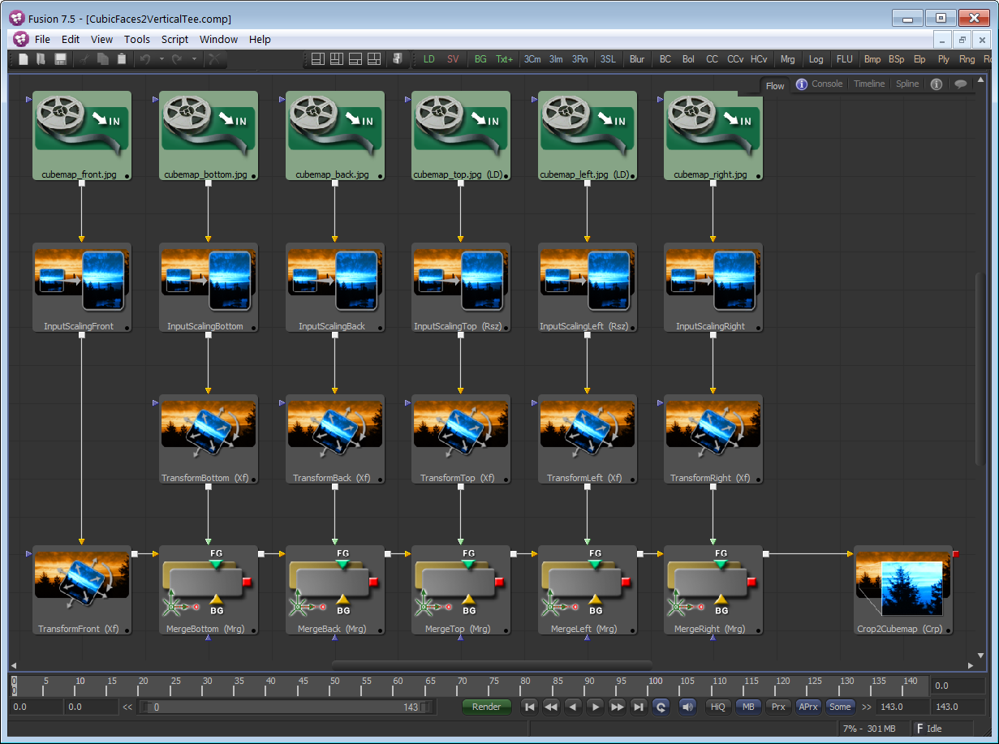

## Source Compositions ##

All KartaVR macro nodes are delivered as GroupOperators so you can expand the node icon in the Fusion flow area and adjust any setting inside of the macro.

Fusion Macros are saved as ".setting" files and they can be opened and viewed in a plain text editor like Notepad++ or BBEdit. This is handy if you want to change the default input scaling resolution. The only issue with editing a .setting file is that it can be hard to re-flow how the compositing node tree is connected since it is difficult to visualize the input and output connections.

If you want to visually edit/rework how the macros function, each of the original source Fusion ".comp" files that were used to create the KartaVR are accessible at the following Fusion Pathmap based filepath:

`Reactor:/Deploy/Macros/KartaVR/Macros/KartaVR/Source Compositions/`

### Macro Screenshot ###

