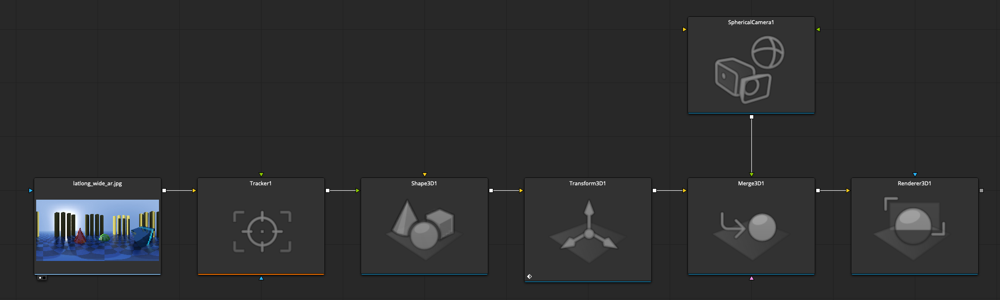
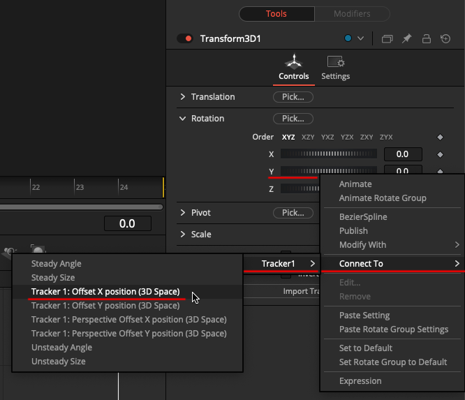
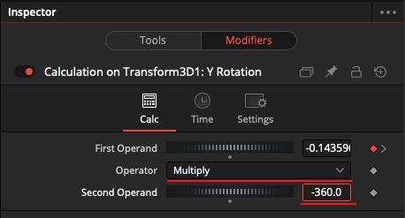
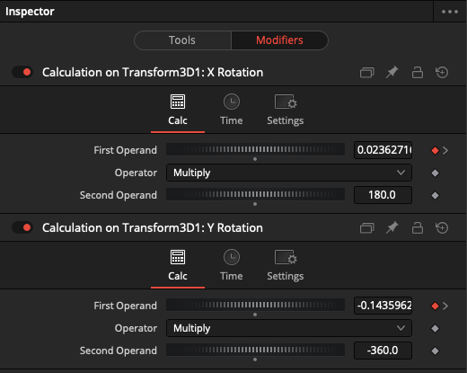
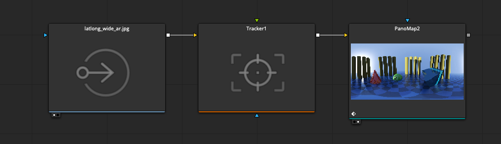
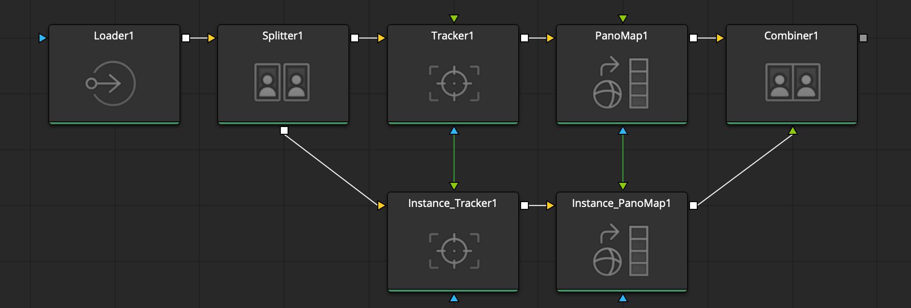
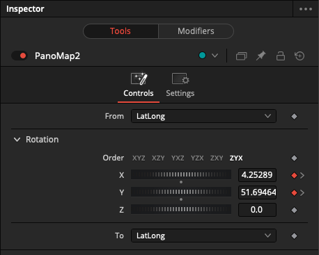
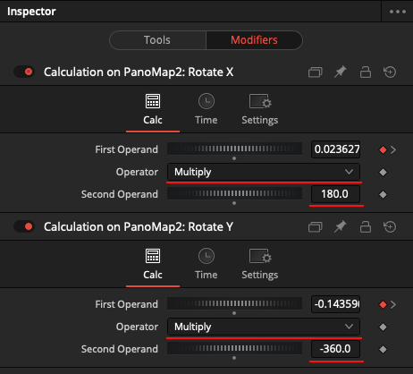
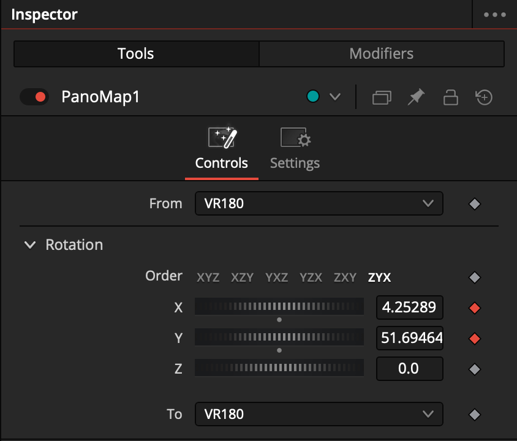
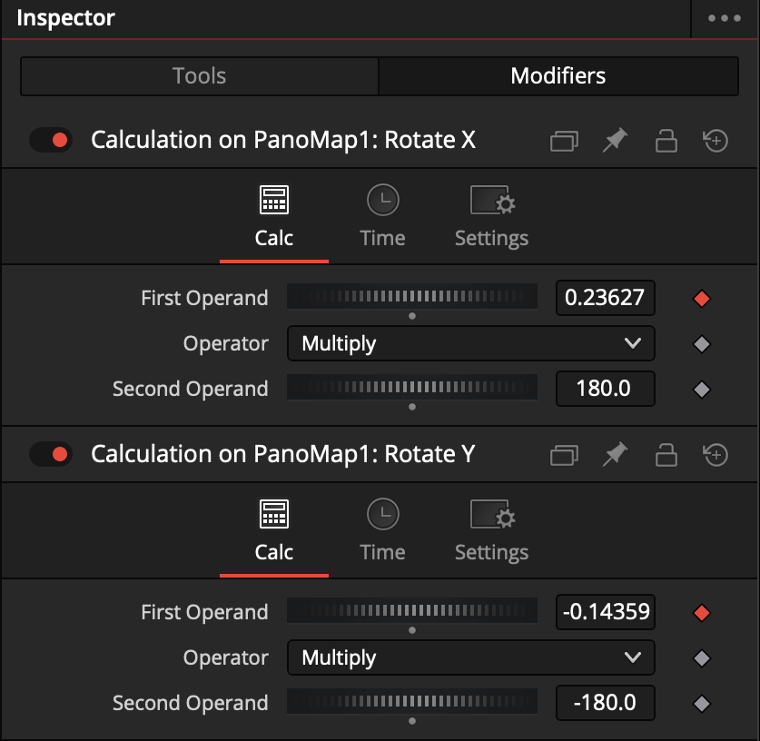

# Stabilizing Immersive Videos

## 360VR Point Tracking Example

### Applying 2D Tracking to LatLong 360VR based 3D Transforms in the Fusion 3D Scenegraph

This post explains how to link a Tracker node to a Transform3D node. This allows you to track a 2D element in 360VR monoscopic footage with a stock Fusion Tracker node.

Step 1. Add a Tracker node to the comp, connect the Tracker node to your Loader/MediaIn based footage, and perform a 1-point track of an object in the frame. Refine the point tracking output using traditional Fusion tracking techniques, which can be found in other tutorials.

Step 2. Add your 3D element to the scene using either an FBX Mesh, ABC Mesh, or Fusion's geometry tools like a Shape3D node.

Step 3. Add a Transform3D node. Connect the geometry to the Transform3D node. Then select the Transform3D node.



Example node connections:

```
Loader/MediaIn -> Tracker -> Shape3D -> Transform3D -> Merge3D -> Renderer3D
SphericalCamera -> Merge3D
```


Step 4. **Y-Axis Rotation Linking:**

On the Y Rotation channel right-click and select the Connect To > Tracker1 > Offset X Position (3D Space). 



Then on the Y Rotation channel, right-click again and select "Insert > Calculation: First Operand -> Calculation". 



This will add a "Calculation on Transform3D" modifier to the node.

Click on the "Modifiers" tab on the Transform3D node to see the new modifier.  The First Operand is linked to the tracker's X offset animation curve. Set the "Operator" to "Multiply". Then set the "Second Operand" to "-360".



Step 5. **X-Axis Rotation Linking:**
On the X Rotation channel right-click and select the Connect To > Tracker1 > Offset Y Position (3D Space). 

Then on the X Rotation channel, right-click again and select "Insert > Calculation: First Operand -> Calculation". 

This will add a "Calculation on Transform3D" modifier to the node.

Click on the "Modifiers" tab on the Transform3D node to see the new modifier. The First Operand is linked to the tracker's Y offset animation curve. Set the "Operator" to "Multiply". Then set the "Second Operand" to "180".


* * *

## Applying 2D Tracking to the PanoMap Node

It is also possible to apply this same type of approach to a PanoMap node's rotation controls. The PanoMap node's Rotation X and Rotation Y channels are what you would bind to the Tracker node in a similar fashion as a Transform3D node's rotation controls.



Example node connections:

```
Loader/MediaIn -> Tracker -> PanoMap
```

Note: If your immersive video footage is a stereo 3D video clip you will need to separate the left and right stereo 3D views first using the built-in Spliter node. Process the left and right eye views using instanced copies of the nodes. Then use the built-in Combiner node to merge the left and right eye views again. 



Example node connections:

```
Loader/MediaIn -> Splitter -> Tracker -> PanoMap -> Combiner
Loader/MediaIn -> Splitter -> (Instanced) Tracker -> (Instanced) PanoMap -> Combiner
```

### PanoMap Stabilized VR360 Video




If your immersive video footage is a VR360 video clip with an equirectangular 360x180° image projection, the same modifier approach can be used. We need to adapt the screen space 0-1 normalized coordinate system into a 360VR centric 360x180° coordinate system value range.

We need to add a pair of Calculation modifiers to the PanoMap node's "Rotate X" and "Rotate Y" channels.

Set the Rotate X "Calculation" modifier to use a "Multiply" Operator. The Second Operator should be set to "180"

Set the Rotate Y "Calculation" modifier to use a "Multiply" Operator. The Second Operator should be set to "-360"



### PanoMap Stabilized VR180 Video



The PanoMap node has a VR180 option

Then use a pair of Calculation modifiers on the Rotate X and Rotate Y channels of the PanoMap node.

Set the Rotate X "Calculation" modifier to use a "Multiply" Operator. The Second Operator should be set to "180"

Set the Rotate Y "Calculation" modifier to use a "Multiply" Operator. The Second Operator should be set to "-180"



* * *
