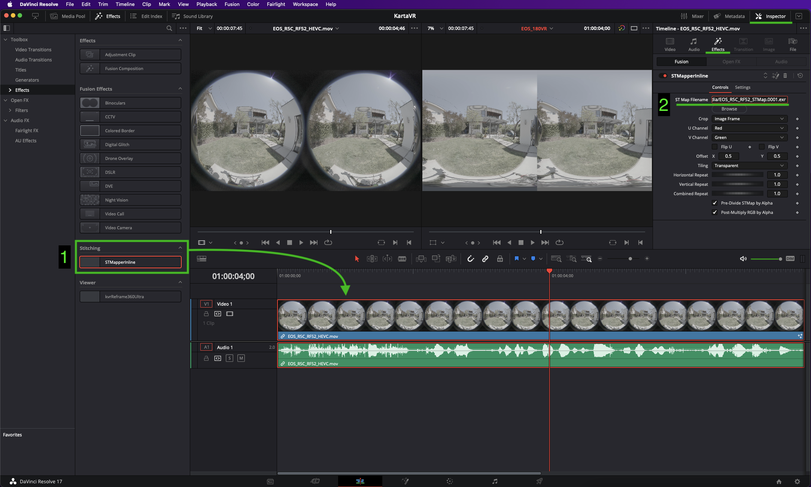

# STMapperInline

## Overview

"STMapperInline" is an Effects Template for the Resolve Edit page. Now you can do ST Map/UV Pass warping live on the Resolve Edit page.

This effects template is useful if you want to use ST Map warping workflows to process footage from a Canon Dual Fisheye stereo lens in Resolve into 180VR stereo content. Check out the tutorial by Hugh Hou on the Kartaverse tutorials page for more details.

## Open Source Software License

- LGPL 3.0

## General Usage

**Step 1.** Install Reactor and add the STMapper fuse package to your Resolve based system. Install the "STMapperInline" macro as an Effects library item using the instructions in the "Installation" section below. Restart Resolve.

**Step 2.** Open a Resolve video editing timeline in the Edit page.

**Step 3.** Display the Effects Library tab, and switch to the "Toolbox > Effects > " section. Drag the "STMapperInline" entry onto a video clip in the timeline.

**Step 4.** Click on the video clip in the timeline and switch to the Inspector's Effects tab. Enter the filepath for an ST Map image in the Filename field. You may have to change the STmapperInline setting for "Crop" to "STMap Frame" if the default value of "Image Frame" doesn't give you the output you desire.

**Step 5.** The viewer window in the Edit page should update in real-time to show your live ST Map warped result.

**Step 6. Bonus:** If you are using the kvrReframe360Ultra fuse in the Fusion page, there is a 1-click "Output ST Map" checkbox that can quickly generate an ST Map template image which you can save to disk and recycle for later.

## Resolve VR180 Warping via STmapperInline

This approach works in the Resolve Studio Edit page. It uses a pre-made STmap template image to warp Canon R5C + RF 5.2mm dual fisheye imagery into a 180VR Side-by-Side layout. This example requires you to have installed the STMapper fuse and the STMapperInline "Effects Template" macro which are available in the Reactor Package Manager. 

For more information about [ST Maps check out the article](https://docs.google.com/document/d/1lQ-wc9ucLJqj-HL7iKMNWA71klV5O1fk2-JicRB6gDY/edit?usp=sharing)

### Steps: 

1. Create a new Resolve Studio project.

2. Edit the project settings. 

Set the Master Settings to use a "`Timeline format > Timeline Resolution`" of 8192x4096 px processing.

Set the Timeline Format > Playback frame rate to 59.04 frames per second.

Set the Image Scaling to use a "`Input Scaling > Mismatched resolution files > Stretch frame to all corners`".

Set the Output Scaling to "`Mismatched resolution files > Stretch frame to all corners`".

3. Add the movie file to the Resolve Media Pool. Create a new timeline based upon the clip. 

In the "Create New Timeline" dialog uncheck "`[x] Use Project Settings`".

Switch to the Format tab and enable Timeline Resolution 8192 x 4096 processing. Timeline Frame Rate 59.94 fps.
 

Set the Mismatched Resolution to "Stretch frame to all corners".

4. In the Edit page, open the "Effects" tab at the top left of the user interface. Expand the "`Toolbox > Effects > Stitching`" section. Select the "`STmapperInline`" item and drag it onto the video clip in the Edit page timeline.

5. Expand the Edit page "Inspector" tab. Switch to the Effects section in the Inspector window. Select the STMapperInline item. 

Click the "Browse" button and navigate on your hard disk to where this example project file is stored to select the STMap warping template image named: "`STMap Canon R5C RF 5.2mm/Resolve Project/Media/EOS_R5C_RF52_STMap.0001.exr`".

After a moment the Edit page preview window should show the results of the STMap warping the dual fisheye imagery into a side-by-side 180VR cropped 180x180° LatLong view layout.

6. You can now edit the footage.

7. The footage is then rendered via the Delivery page. If you are on a macOS system a good output format might be to use:
		Render Settings > Custom
	
		[x] Export Video
	
		Format: QuickTime
		Codec: Apple ProRes
		Type: Apple ProRes 422 HQ
	
		Resolution: Custom
		8192 x 4096 px
	
		Frame Rate: 59.94 fps

## STMapperInline Background Info

This macro works as a GroupOperator element that packages up an STMapper fuse, and an inline embedded Loader node into one object.

The Loader node exposes a Filename slot in the Inspector window you can use to select an ST Map image on disk.

## Installation

Templates for your Edit Page Effects Library are included:

	Templates/Edit/Effects/KartaVR/Warp/STMapperInline.setting
	Templates/Fusion/KartaVR/Warp/STMapperInline.setting

### Windows

On a Windows system, if Reactor is configured with the standard `Reactor:/` PathMap, you will find STMapperInline at the following installation location:

	C:\ProgramData\Blackmagic Design\DaVinci Resolve\Fusion\Reactor\Deploy\Templates\Edit\Effects\KartaVR\Warp\STMapperInline.setting

	C:\ProgramData\Blackmagic Design\DaVinci Resolve\Fusion\Reactor\Deploy\Templates\Fusion\KartaVR\Warp\STMapperInline.setting

### macOS

On a macOS system, if Reactor is configured with the standard `Reactor:/` PathMap, you will find STMapperInline at the following installation location:

	/Library/Application Support/Blackmagic Design/DaVinci Resolve/Fusion/Reactor/Deploy/Templates/Edit/Effects/KartaVR\Warp\STMapperInline.setting

	/Library/Application Support/Blackmagic Design/DaVinci Resolve/Fusion/Reactor/Deploy/Templates/Fusion/KartaVR/Warp/STMapperInline.setting

### Linux

On a Linux system, if Reactor is configured with the standard `Reactor:/` PathMap, you will find STMapperInline at the following installation location:

	/var/BlackmagicDesign/DaVinci Resolve/Fusion/Reactor/Deploy/Templates/Edit/Effects/KartaVR/Warp/STMapperInline.setting

	/var/BlackmagicDesign/DaVinci Resolve/Fusion/Reactor/Deploy/Templates/Fusion/KartaVR/Warp/STMapperInline.setting

