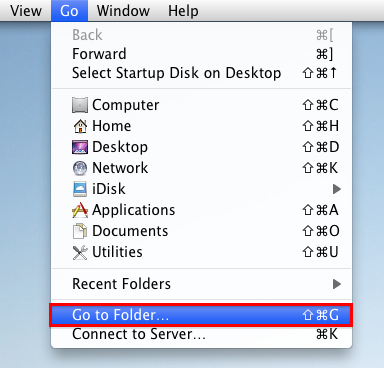

# Fusion Syntax Highlighting #

- [Fusion Comp Syntax Highlighters](#syntax-highlighter)
  - [Installing the Notepad++ Fusion Syntax Highlighter](#npp-syntax-highlighter)
  - [Installing the TextWrangler and BBEdit Codeless Language Modules](#textwrangler-syntax-highlighter)
  - [Installing the Gedit Fusion Syntax Highlighter](#gedit-syntax-highlighter)

## Fusion Comp Syntax Highlighters ##

There is a bonus set of [Notepad++](http://www.notepad-plus-plus.org/), [Gedit](https://wiki.gnome.org/Apps/Gedit), [TextWrangler](http://www.barebones.com/products/textwrangler/), and [BBEdit](http://www.barebones.com/products/bbedit/) compatible syntax highlighter modules included with the KartaVR. This makes it easier to view and edit Fusion Composite `.comp` files, Fusion Macros `.setting` files, and Fusion preference/hotkey `.fu` files using a plain text editor.

### Installing the Notepad++ Fusion Syntax Highlighter ###

The Notepad++ User Defined Language file is located in the folder:

`KartaVR\syntax highlighters\Notepad++\`

This module can be loaded in Notepad++ by going to the Menu **Language > Define your language...**

The User Defined Language window will open. Click on the **Import** button at the top left of the dialog.

In the import dialog select the file named **Notepad++ Fusion Comp.xml** and click the open button.

Back in the User Defined Language window, click the close X button to hide the window.

To active the language file you need to restart Notepad++ once. Now, when you open a Fusion comp or macro file in Notepad++ the code will be syntax highlighted automatically.

The next time you go to the Notepad++ **Language** menu you should see an entry named **Fusion Comp**.

Note: The Fusion Syntax Highlighter has been designed to work with the Notepad++ obsidian theme.

If you use the Notepad++ Compare module you can load the new Obsidian theme compatible color palette file "Compare.ini" from the `KartaVR\syntax highlighters\Notepad++\` folder by copying "Compare.ini" to your Notepad++ preferences folder:

`C:\Users\<User Account>\AppData\Roaming\Notepad++\`

### Installing the TextWrangler and BBEdit Codeless Language Modules ###

The TextWrangler and BBEdit Codeless Language Module file is located in the folder:

`KartaVR\syntax highlighters\Textwrangler and BBEdit\`

Step 1. Copy the "Blackmagic Design Fusion.plist" file from the install folder to your Language Modules folder.

If you are using TextWrangler the module belongs in this folder:

`~/Library/Application Support/TextWrangler/Language Modules/`

If you are using BBEdit the module belongs in this folder:

`~/Library/Application Support/BBEdit/Language Modules/`

On macOS you can open the hidden **~/Library** folder by switching to the Finder. From the "Go" Menu select, "Go to Folder..." or press the hotkey **Shift-Command-G**.

Paste in the Languages Module folder path and hit "go".

If you are running Mountain Lion or higher and the BBEdit / TextWrangler "Language Modules" folder doesn't exist you can create the folders manually. A quick way to create the folders is to use the terminal:

TextWrangler Folder Creation Command:
> mkdir -p ~/"Library/Application Support/TextWrangler/Language Modules/"

BBEdit Folder Creation Command:
> mkdir -p ~/"Library/Application Support/BBEdit/Language Modules/"

Once you are in the Language Modules folder you can copy the **Blackmagic Design Fusion.plist** file in place.

**Step 3.**  We need to restart TextWrangler for the new language module to be listed in the TextWrangler language popup menu.

If you open an Fusion .comp file at this point you will see formatted text. If you are working on a scene file without the .comp or .setting extension you can select the language manually.

Open the **Language** popup menu at the bottom left of the text editor window and select **Fusion Comp**. This will turn on syntax highlighting.

Here is an example Fusion composite (.comp) file with syntax highlighting enabled:

### Installing the Gedit Fusion Syntax Highlighter ###

The Gedit language file is located in the folder:

`KartaVR\syntax highlighters\gedit\`

**Step 1.**  [Download gedit](https://wiki.gnome.org/Apps/Gedit) and install it on your system. If you are on Linux you already have a copy of gedit on you system. After you start gedit you will see a blank text editing window.

**Step 2.**  Copy the **fusion.lang** file to your gedit language-specs folder.

On Windows you need to copy the fusion.lang file to the **language-specs** folder located at:

`C:\Program Files (x86)\gedit\share\gtksourceview-2.0\language-specs\fusion.lang`

or  

`C:\Program Files\gedit\share\gtksourceview-2.0\language-specs\fusion.lang`  

On Linux you need to copy the fusion.lang file to the language-specs folder located at:

`/usr/local/share/gtksourceview-2.0/language-specs/fusion.lang`  

or  

`/usr/share/gtksourceview-2.0/language-specs/fusion.lang`  

**Step 3.**  We need to restart gedit for the new language module to be listed in the gedit **Highlighter Mode** menu. Let's check if the script was installed correctly by opening the menu **View > Highlighter Mode > Scripts > Fusion**.

If you open an Fusion .comp or .setting file at this point you will see formatted text. If you are working on an Fusion file without the extension you can select the language manually.

Let's manually enable the Fusion compatible syntax highlighting module. Open the **Language** menu on the bottom right of the window and select **Fusion**. This will turn on syntax highlighting .

#### Color Schemes ####
If you are new to gedit you will probably want to pick a color scheme to customize your work environment. You can switch the current color scheme by opening the **Edit** menu, and selecting **Preferences**. In the gedit Preferences window, click on the **Font & Colors** tab.

Clicking on the color scheme's name with switch between the different syntax highlighting color styles.

#### Color Scheme Gallery ####

Gedit comes with 5 colors schemes by default:  

- Classic
- Cobalt
- kate
- Oblivion
- Tango
