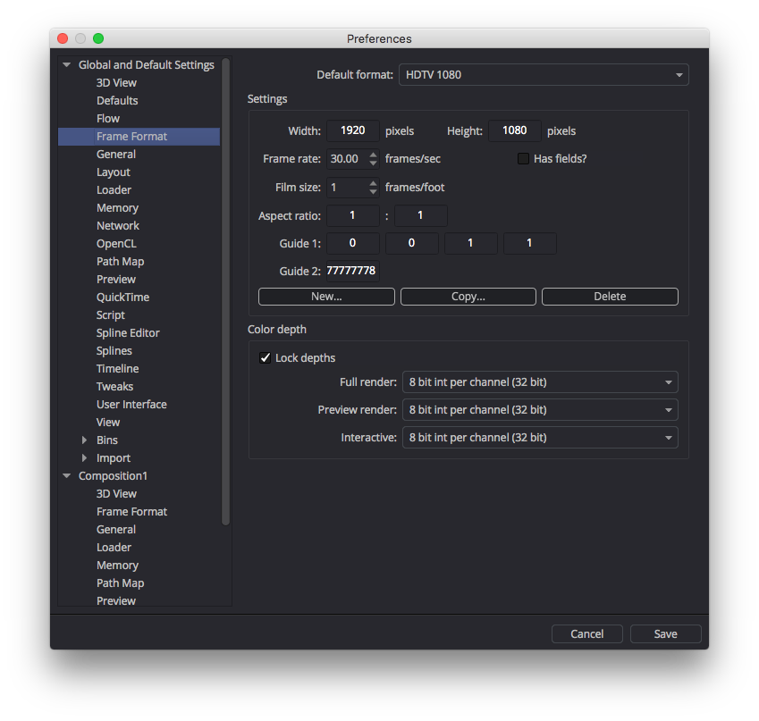
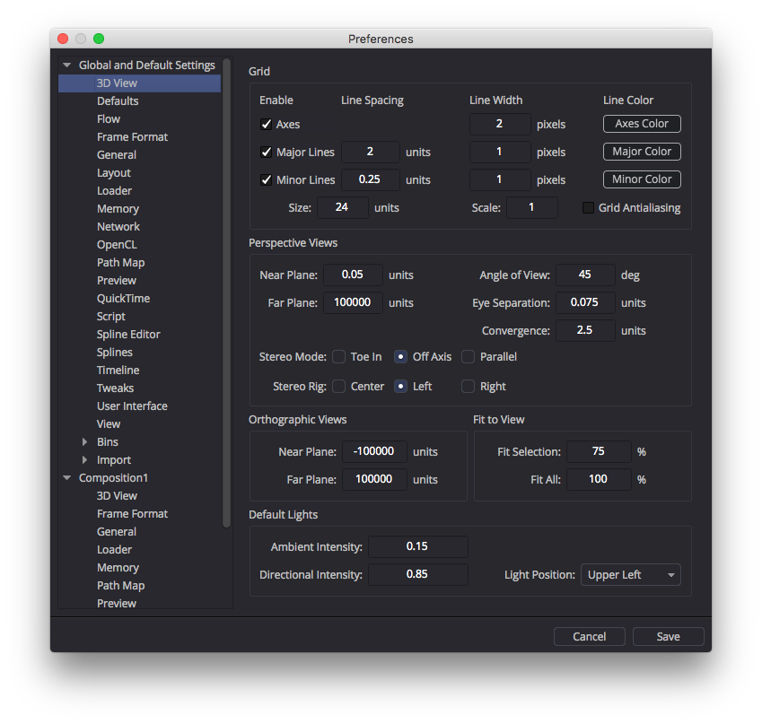
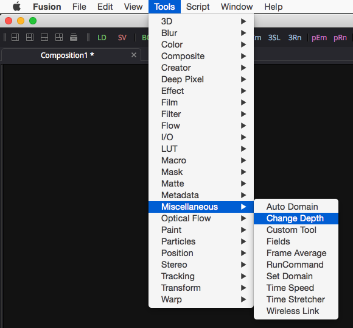
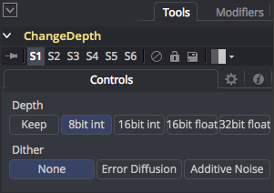
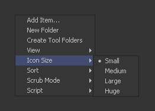
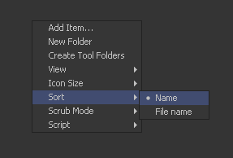
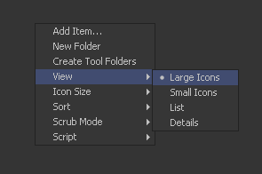
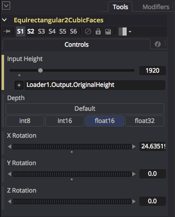

# Tips & Tricks

This section covers tips & tricks for getting the most out of Fusion and the KartaVR.

## Fusion Comp Defaults

It is a good idea to edit the Fusion comp's default settings for the frame size and default bit depth. These settings are used automatically by many of the KartaVR automatically.

If you open the Fusion preferences and switch to the **Frame Format** section you can pull down a default format preset or manually specify the **Width**, **Height**, and **Frame Rate**.

These settings are then used for many nodes including the Background node.

### Color Depth

The Color Depth setting in the **Frame Format** section allows you to choose if you want to keep a comp as an 8 bit per channel output or have all the nodes work in a high dynamic range.

For example, any Fusion node (including those nodes that are embedded in Macros) that has its bit depth option set to use the "default" option pulls its 8 bit int/16 bit int/16 bit float/32 bit float current state from the Fusion Frame format preferences.

In the preferences window you can have one preference setting defined in the **Globals and Default Settings** section, and then override those options per Fusion comp by scrolling down on the left side of the preferences window, and then select one of the currently open composites in the list and adjust its specific controls.

This is useful for making comp specific decisions for attributes like the Path Map which allows you to define a custom relative path based folder mapping.

### 3D View

If you are using the 3D nodes in Fusion or any of the KartaVR that tie into the Fusion 3D system, the **3D View** section in the Preferences window can be really useful and handy.

This section allows you to customize attributes like the **Near Plane** and **Far Plane** which are used for camera view clipping.

You can also adjust the default camera field of view using the **Angle of View** control.

If you want to change the 3D viewport grid settings, too, they are accessible at the top of the 3D View preferences section.

### 8 Bit Per Channel Viewing Tools

Several of the "PanoView" viewer tools, and the "Send Media To" programs only support an 8 bit per channel integer image color depth. If you try to send a 16 or 32 bit per channel float image to the programs the imagery cannot be viewed until you use a Change Depth node to switch the media to a compatible format.

This is done by going to the **Tools > Miscellaneous > Change Depth** menu item to add the node to your comp.

Then in the "Change Depth" node you need to set the output to either `8bit int` or `16bit int`. Now your HDRI sourced imagery can be loaded into Affinity Photo without any issues.

## Changing the Bin Window Views

To customize the views in the Bins window, right click in the folder view and navigate your way through the contextual menu options.

The `Icon Size` option is useful if you want to shrink the size of the bin icons so you can get more screen space.

----------

The `Sort` option is useful if the Bin items aren't arranged alphabetically.

----------

You can use the `View` option to change how the Bin items are listed. My favorite view types are `large Icons`, `Small Icons`, and `List`.

## Supporting Tools for VR Production

If you want to get the most out of panoramic immersive compositing in Fusion the following supporting tools are really handy to have installed on the average workstation.

### Programmer's Text Editor

If you need to edit Fusion data files there are custom Fusion .comp, hotkeys .fu, and Macros .setting [Fusion Comp Syntax Highlighters](#syntax-highlighter) included with the KartaVR. They work nicely with the following text editors:

- [Notepad++](http://www.notepad-plus-plus.org/) (Windows)
- [TextWrangler](http://www.barebones.com/products/textwrangler/) (Mac)
- [BBEdit](http://www.barebones.com/products/bbedit/) (Mac)
- [Gedit](https://wiki.gnome.org/Apps/Gedit) (Windows/Mac/Linux)

### Essential Media Viewers

- [GoPro VR Player (formerly Kolor Eyes)](http://www.kolor.com/gopro-vr-player/download/)
- [Whirligig](http://whirligig.xyz/)
- [Amateras Dome Player](http://www.orihalcon.co.jp/amaterasplayer/en/)
- [DJV Viewer](http://djv.sourceforge.net/)
- [VLC](http://www.videolan.org/)
- [Mettle SkyBox Player](http://www.mettle.com) (For Adobe Premiere)

**Note:** Kolor Eyes was recently turned into the GoPro VR Player application.
### Spatial Media Metadata Embedding

  - [YouTube 360 Video Metadata Tool](https://support.google.com/youtube/answer/6178631)

### Fusion Fuses

  - Stefan Ihringer's [Cube to LatLong Fuse](http://www.comp-fu.com/2011/04/cube-map-to-equirectangular-latlong-map/)
  - Stefan Ihringer's [sRGB ViewLUT module](http://www.comp-fu.com/2012/02/linear-gamma-workflow-in-fusion/)

### Panoramic Stitching Tools

  - [PTGui Pro](http://www.ptgui.com) (This tool is used in the **[Generate UV Pass in PTGui](scripts#generate-uv-pass-in-ptgui)** script.)
  - [Hugin](http://hugin.sourceforge.net) (Open Source)

## Using Expressions to set the Image Resolution

Often you are working with a lot of nodes in KartaVR that need to have the image resolution set automatically based upon your input footage. This is the perfect place to use Fusion's expression language to automate the settings instead of having to manually update these values.

Right clicking on any of the node attributes in Fusion will display a popup menu. You can then select the "Add Expression" option. Another technique is to type "=" into the number field and a new expression text field will be added automatically.

If you have an image loader node in your scene called "Loader1" you can read it's current image width and height resolution settings using these variables:

`Loader1.Output.OriginalWidth`
`Loader1.Output.OriginalHeight`

If you have a merge node in your scene called "Merge1" you can read the background input connection's current image width and height resolution settings using these variables:

`Merge.Background.OriginalHeight`
`Merge.Background.OriginalWidth`

If you wanted to set a node to use 50% of the image size of your loader node you would enter the expressions:

`Loader1.Output.OriginalWidth * 0.5`
`Loader1.Output.OriginalHeight * 0.5`

You can read the size of a specific image connection on a CustomTool node using:

`ImageGridCustomTool.Image1.Width`
`ImageGridCustomTool.Image1.Height`

`ImageGridCustomTool.Image2.Width`
`ImageGridCustomTool.Image2.Height`

`ImageGridCustomTool.Image2.Width`
`ImageGridCustomTool.Image2.Height`

### Real World Expression Examples

The process of learning about expressions can often be abstract. Here is a real world application of using the image size from a loader node to drive a composite.

When I use an Equirectangular2CubicFace node in my composite I will often add an expression to the **Input Height** control and set it to:

`Loader1.Output.OriginalHeight`

This will mean that my Equirectangular2CubicFace node output will automatically scale its rendered resolution to match the source imagery I connect to the node.

## Enable HiQ Mode from Lua

If you are writing a new Lua script and need to have the HiQ mode turned on by default you can add the following example snippet to your code:

`comp:SetAttrs{COMPB_HiQ = true}`

## Breaking the 32K Resolution Barrier

Fusion has an environment variable you can define if you'd like to use CPU based rendering of your composite and break the 32K x 32K image resolution barrier.

The environment variable is:

		FUSION_Embiggen = True

If you would like to know more about `FUSION_Embiggen`  environment variable, then check out the Steakunderwater forum post:

[The S-Files Episode 3: creating very large images in Fusion.](https://www.steakunderwater.com/wesuckless/viewtopic.php?p=19700#p19700)

You will also see an entry on that post about a `LimitToHalfMaxTextureSize` UserControls based hidden parameter that will increase the texture resolution in Fusion's 3D workspace.
