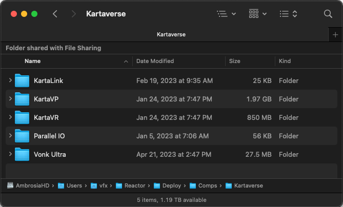
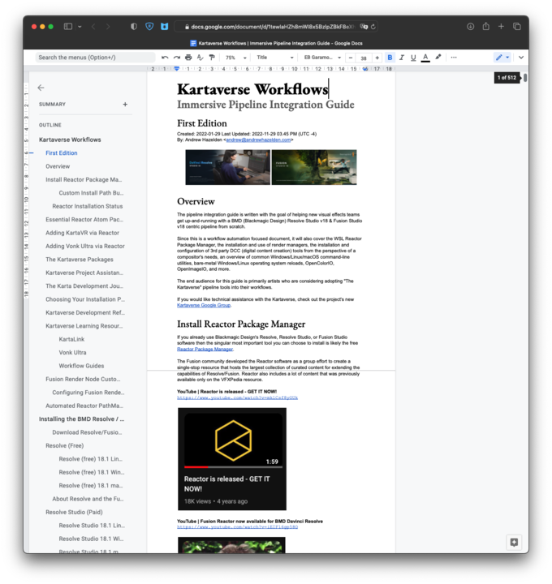

# <a name="tutorials"></a>Kartaverse Tutorials

## Example Project Files

Reactor stores the example Kartaverse project files in the PathMap based folder located at:  
```Reactor:/Deploy/Comps/Kartaverse/```

In DaVinci Resolve you can access the base Reactor folder using the "Workspaces > Scripts > Comp > Reactor > Tools > Show Comps Folder" menu item. In Fusion Studio this location can be accessed using the "Reactor > Tools > Show Comps Folder" menu item.

When the Reactor folder is opened in an Explorer (Windows), Finder (macOS), or Nautilus (Linux) folder browsing window, you can then navigate into the "Kartaverse" sub-folder:



## Workflow Guides

A "[Kartaverse Workflows | Immersive Pipeline Integration Guide](https://docs.google.com/document/d/1tewIaHZh8mWI8x5BzlpZBkF8eXhK2b_XhTWiU_93HBA)" learning resource is available. The free guide has over 512 pages of content that covers the primary steps required to get a working content creation pipeline established from scratch for artists working at a freelancer, or small boutique studio scale of operation. Additional, expanded chapters cover broader Resolve/Fusion page usage concepts that will help you take your composting and 360VR content creation skills to the next level.



## YouTube Videos

Hugh Hou has published several Resolve/Fusion centric VR tutorials on his YouTube channel.

### KartaLink Spatial Metadata GUI

Learn how to encode next-gen MV-HEVC spatial video for playback on Apple Vision Pro and Meta Quest HMDs. This video covers the Spatial Metadata GUI as a standalone tool, and as a media command/trigger script that works inside of BMD Resolve (Free)/Resolve Studio: [No Code! Free Spatial Video Metadata Injector for Apple Vision Pro | Standalone & DaVinci Resolve](https://www.youtube.com/watch?v=PJWsscXmJiE)

### kvrViewer and kvrCropStereo

This video covers an improved workflow for reframing VR video on the Resolve Edit page: [Everyone's WRONG! The Right Way to Reframe 8K 360 Video in DaVinci Resolve Masterclass](https://www.youtube.com/watch?v=61xusfAvVXU)

This video covers the usage of the kvrViewer and kvrCropStereo nodes. The presentation covers how to edit Canon R7 and Canon R5C VR180 footage using DaVinci Resolve 19: [No Subscription! Edit Canon R7 & R5C VR180 in DaVinci Resolve - Free EOS VR Utility Alternative](https://www.youtube.com/watch?v=kwVlVEXg3og)


### Reframe360Ultra

This video covers the usage of Reframe360Ultra for reframing videos:
[How to ReFrame ANY 360 Video in DaVinci Resolve FREE in Real Time (Insta360, GoPro MAX, Qoocam 8K)](https://www.youtube.com/watch?v=CWw2DaXC7OU)

### WarpStitchUltra

This video shows how to process Canon R5C camera + Canon RF 5.2mm dual fisheye lens media in Resolve:
[Edit Canon R5C & R5 VR180 w/ DaVinci Resolve 18 FREE - 3D 8K 60fps RAW LT Clog3 Workflow](https://www.youtube.com/watch?v=2GW7nb47rB4)

The tutorial covers the usage of "ST Maps" and the WarpStitch node. Included with the project files are Fusion and Resolve example comps, along with a TouchDesigner based real-time warping project file that can be used to do live 180VR video streaming, and supports real-time stitched previews from the Canon R5/R5C camera.

Make sure to [download the supporting project files](https://drive.google.com/file/d/1H-owMeadqekZ42BgmqeaPHr9Ry2cHFP8/view).
