# BMD Ursa Cine Immersive 180VR Workflow

## Overview

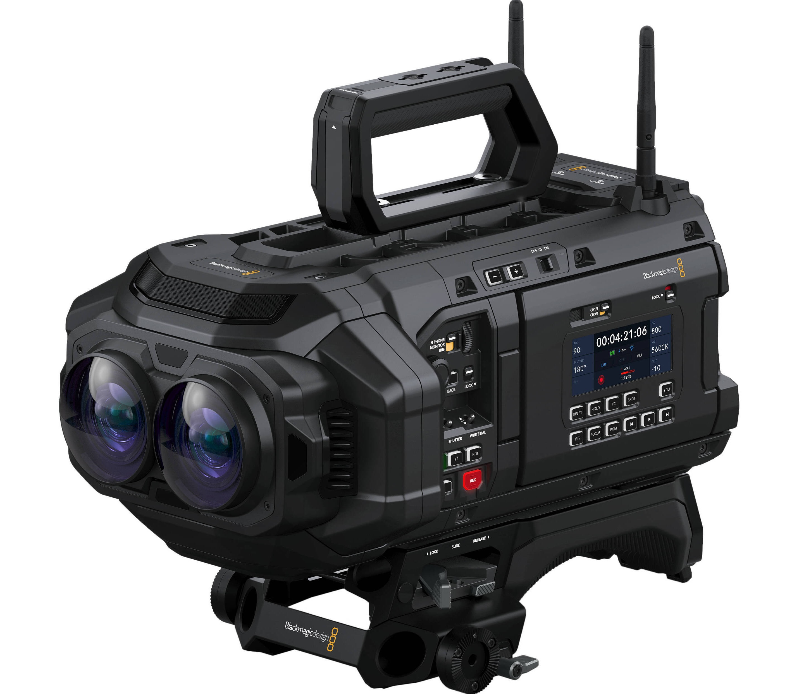

If you are a BMD Resolve Studio user, you have likely been following the development and release of the BMD/Apple Immersive Video efforts with great interest. The dual fisheye lens equipped BMD Ursa Cine Immersive camera records 8K per-eye resolution media at 90 FPS.

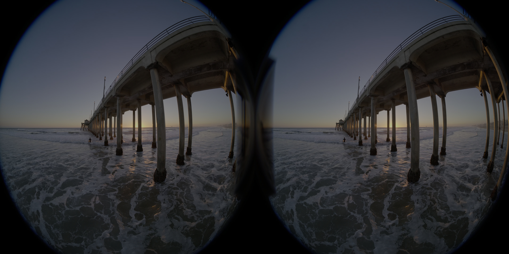

The following Kartaverse node graph allows you to process "unstitched" left/right eye BMD Ursa Cine Immersive MV-HEVC encoded footage into a traditional VR180 SBS output format that works in a vendor neutral fashion on any brand of HMD (Meta Quest, AndroidXR, Pico, etc).

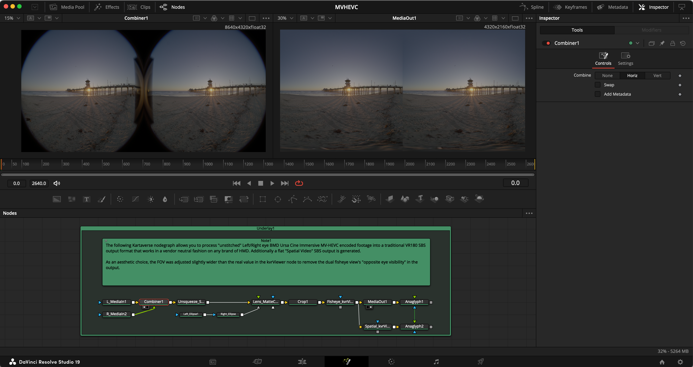

Additionally a flat "Spatial Video" SBS output is generated from the dual fisheye footage. This gives a 3DTV side-by-side stereo 3D output.

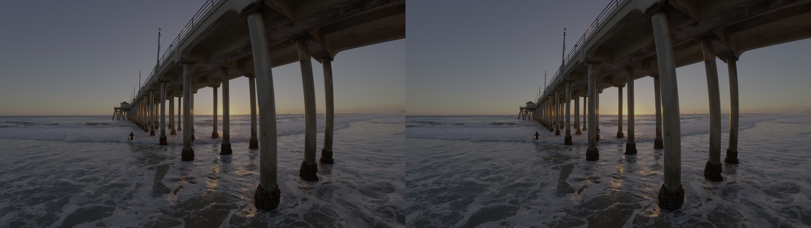

As an aesthetic choice, the FOV was adjusted slightly wider than the real value in the kvrViewer node to remove the dual fisheye view's "opposite eye visibility" in the output. You could perform lens vignette masking if you prefer.

## Footage

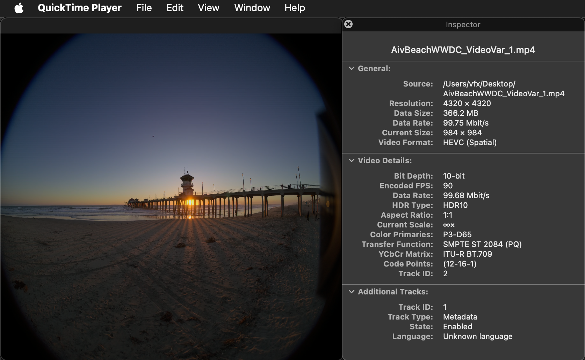

The Apple WWDC 2025 sample media "AivBeachWWDC_VideoVar_1.mp4" was provided by Andrew Gisch from the Immersive Company. It was filmed on a BMD URSA Cine Immersive camera.

The sample video can be downloaded as left/right eye view MV-HEVC encoded footage from the following URL:  
[Google Drive AivBeachWWDC_VideoVar_1.mp4](https://drive.google.com/file/d/1f3p7efQV0p-fJirUqFr09B_GwhSFvJ5Q/view)

## Fusion Node Graph Settings

Import the footage from your Resolve media pool into a Fusion page composite.

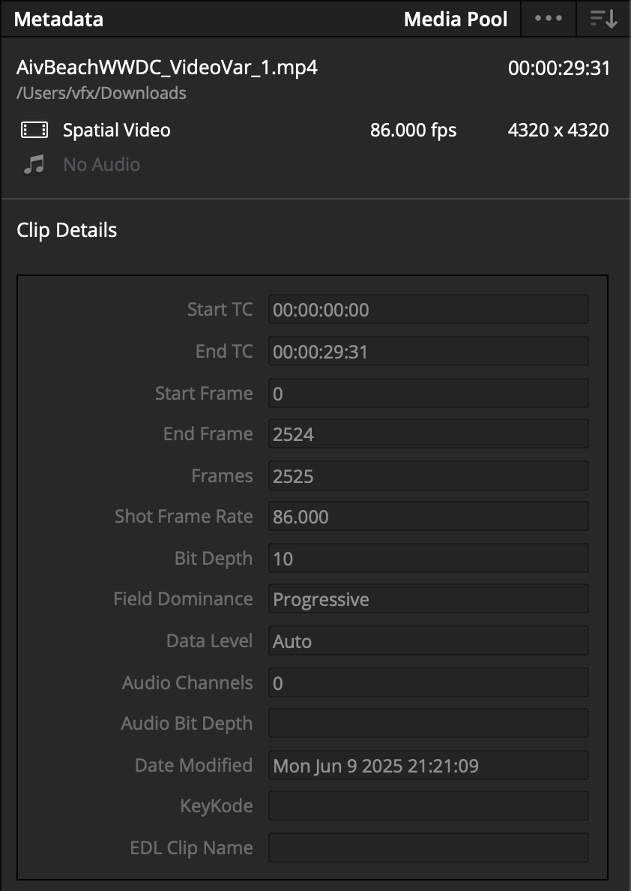

In the Fusion page the following node connections were used:

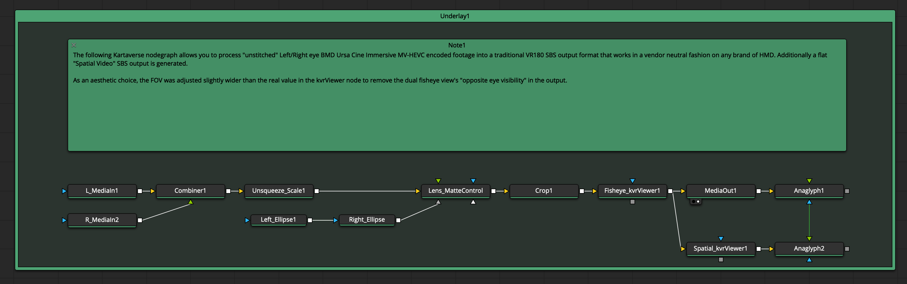

### MediaIn1 Node
 - Stereo Eye: Left

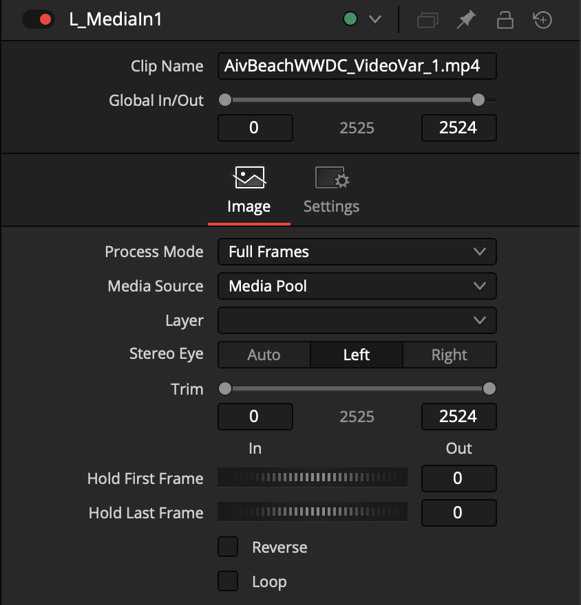

### MediaIn2 Node
 - Stereo Eye: Right

### Combiner Node
 - Horiz
 - Use GPU = Off

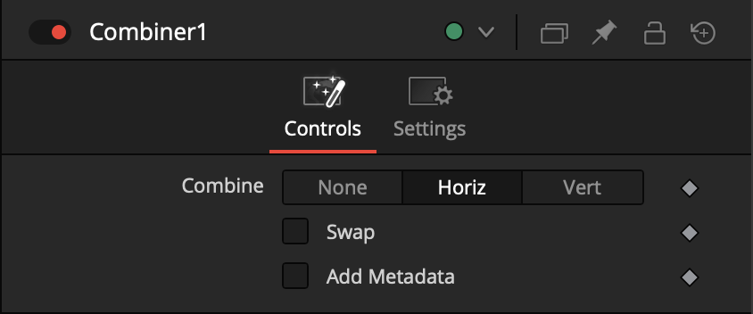

### Scale Node
 - [ ] Lock X/Y
 - X Size = 1.145
 - Y Size = 1.0
 - Use GPU = Off

We are using the scale node to apply a 14.5% horizontal unsqueezing of the circular fisheye media. This will restore the fisheye footage to have a 1:1 aspect ratio for each view.

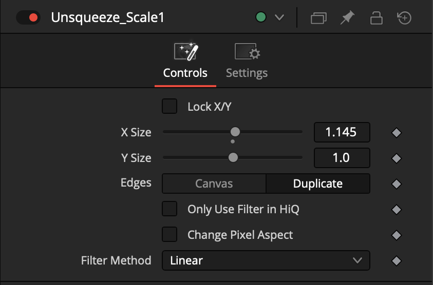

### Ellipse Nodes

A pair of ellipse shapes are added to mask the left and right eye views. The mask is handy as it helps to verify the circular fisheye views have been scaled back to a 1:1 aspect ratio.

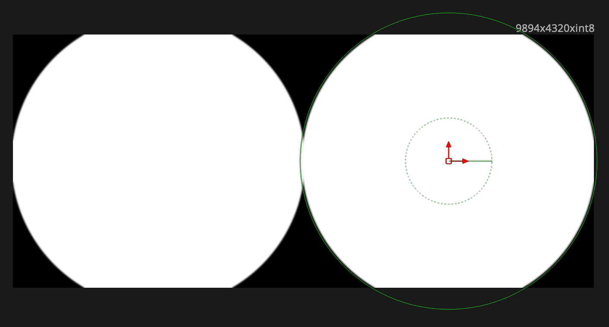

Left_Ellipse

- Image:
    - Width = 9894 px
    - Height = 4320 px
- Controls:
    - Center X = 0.25
    - Center Y = 0.5
    - Width = 0.511
    - Height = 0.511

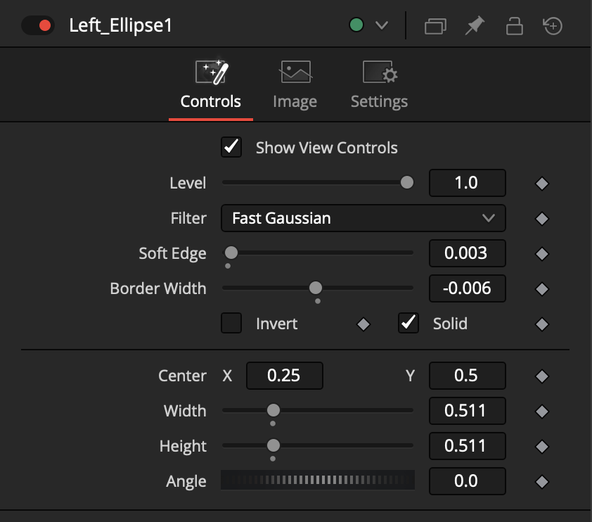

Right_Ellipse
- Image:
    - Width = 9894 px
    - Height = 4320 px
- Controls:
    - Center X = 0.75
    - Center Y = 0.5
    - Width = 0.511
    - Height = 0.511

The Right_Ellipse shape is an instanced copy of the Left_Ellipse. The Center X/Y control was de-instanced.

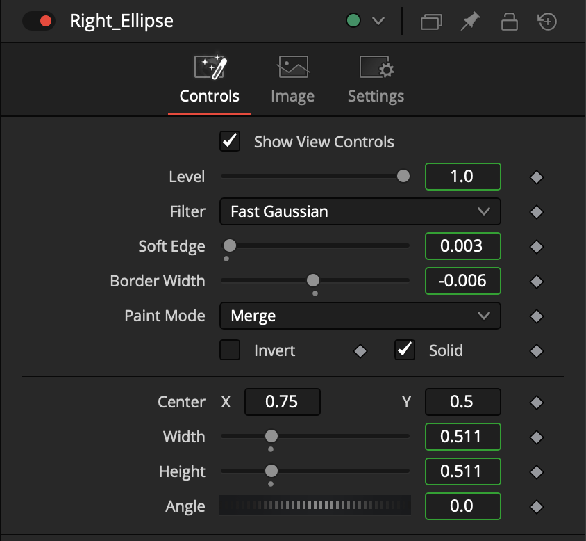

### MatteControl Node
- Garbage Matte: [x] Invert

Connect a pair of ellipse nodes to the MatteControl node's GarbageMatte input connection.

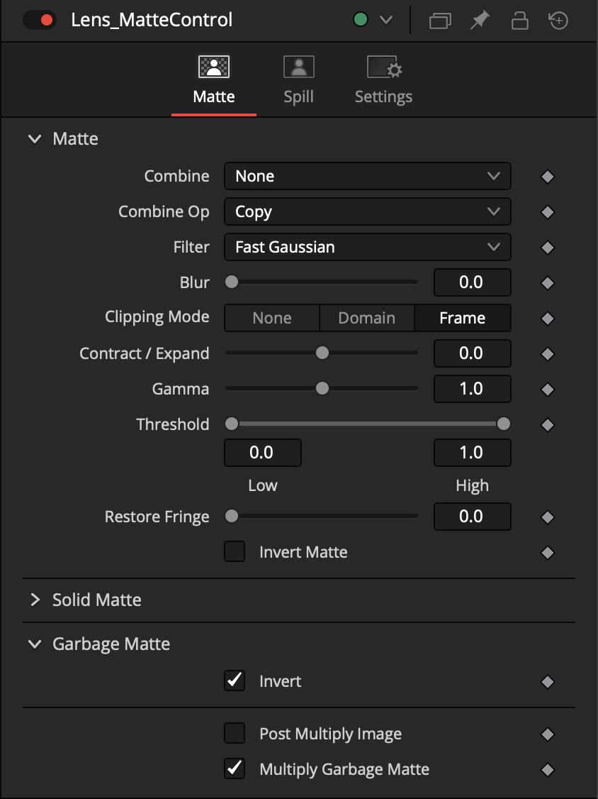

### Crop Node
 - [x] Keep Centered
 - X Size = 9894
 - Y Size = 4947
 - X Offset = 0
 - Y Offset = -313
 - Use GPU = Off

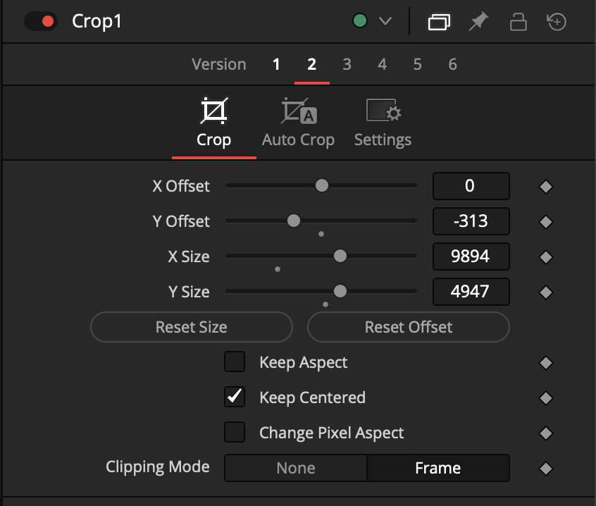

### kvrViewer Node
 - Projection
    - Image Projection: Fisheye
    - Diagonal Field of View: 210
 - Stereo
    - Mode = Horiz
 - Image
    - [ ] Auto Resolution
    - Width 4320
    - Height 4320

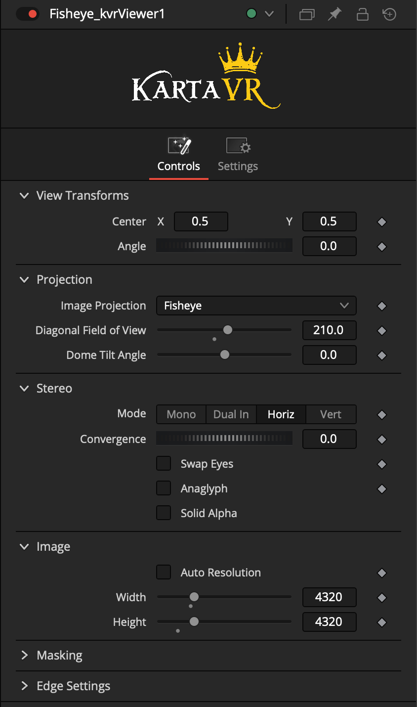

### kvrViewer Node

We can use another kvrViewer node to generate a "flat" spatial SBS output. This provides another viewing style for the content.

 - Projection
    - Image Projection: 180VR
 - Stereo
    - Mode = Horiz
 - Image
    - [ ] Auto Resolution
    - Width 3840
    - Height 2160

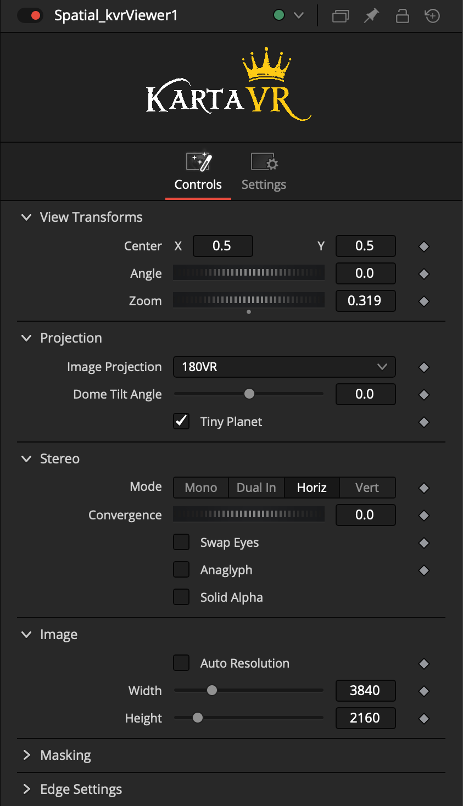

### MediaOut Node

If you want to maintain the stereo3D metadata in the timeline you have the option of using a Splitter node, just before the left/right eye view MediaOut nodes.

### Anagylph Node

To preview the stereo 3D content, add an Anaglyph node after the MediaOut node.

 - Color Type = Red/Cyan
 - Method = Monochrome
 - Stack = Horiz

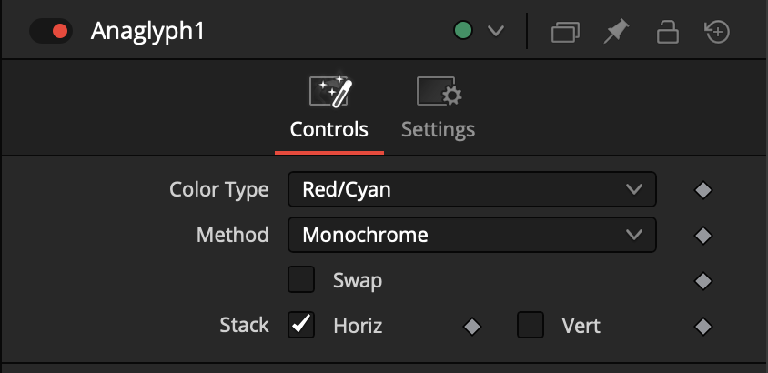

## Closing Notes

An editable "parametric workflow" was shown to help you become comfortable with the image processing steps required.

Taking things further, it is possible to generate a custom STMap warping template for your specific BMD URSA Cine Immersive Camera. This extra step will help to dramatically accelerate the rendering process and reduce your render times. This is a topic for another guide.

